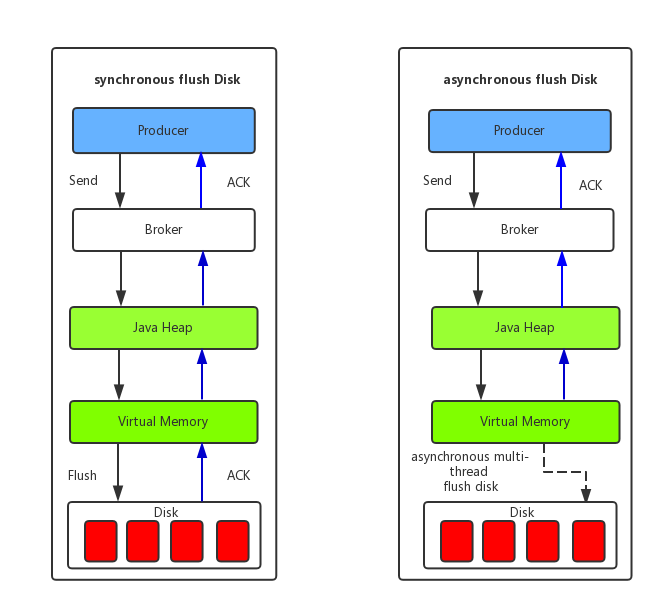

# 1、生产者

RocketMQ支持三种发送方式：

- 同步发送：适用于可靠性要求比较高的场景，如支付消息、短信通知等
- 异步发送：适用于对响应时间敏感的业务场景，即发送端不能容忍长时间地等待Broker的响应
- 单向发送：适用于不特别关心发送结果的场景，例如日志发送

一个应用尽可能用一个Topic，而消息子类型则可以用tags来标识。tags可以由应用自由设置，只有生产者在发送消息设置了tags，消费方在订阅消息时才可以利用tags通过broker做消息过滤：message.setTags("TagA")。

每个消息在业务层面的唯一标识码要设置到keys字段，方便将来定位消息丢失问题。服务器会为每个消息创建索引（哈希索引），应用可以通过topic、key来查询这条消息内容，以及消息被谁消费。由于是哈希索引，请务必保证key尽可能唯一，这样可以避免潜在的哈希冲突。

## 1.1 同步发送

```java
public class SyncProducer {
    public static void main (String[] args) throws Exception {
        // 实例化消息生产者Producer
        DefaultMQProducer producer = new DefaultMQProducer("please_rename_unique_group_name");
        // 设置NameServer的地址
        producer.setNamesrvAddr("localhost:9876");
        // 启动Producer实例
        producer.start();
        for (int i = 0; i < 100; i++) {
            // 创建消息，并指定Topic，Tag和消息体
            Message msg = new Message("TopicTest", "TagA",
                    ("Hello RocketMQ " + i).getBytes(RemotingHelper.DEFAULT_CHARSET));
            // 发送消息到一个Broker
            SendResult sendResult = producer.send(msg);
            // 通过sendResult返回消息是否成功送达
            System.out.printf("%s%n", sendResult);
        }
        // 如果不再发送消息，关闭Producer实例。
        producer.shutdown();
    }
}
```

发送成功会有多个状态，在sendResult里定义。以下对每个状态进行说明：

- **SEND_OK**

消息发送成功。要注意的是消息发送成功也不意味着它是可靠的。要确保不会丢失任何消息，还应启用同步Master服务器或同步刷盘，即SYNC_MASTER或SYNC_FLUSH。

- **FLUSH_DISK_TIMEOUT**

消息发送成功但是服务器刷盘超时。此时消息已经进入服务器队列（内存），只有服务器宕机，消息才会丢失。消息存储配置参数中可以设置刷盘方式和同步刷盘时间长度，如果Broker服务器设置了刷盘方式为同步刷盘，即FlushDiskType=SYNC_FLUSH（默认为异步刷盘方式），当Broker服务器未在同步刷盘时间内（默认为5s）完成刷盘，则将返回该状态——刷盘超时。

- **FLUSH_SLAVE_TIMEOUT**

消息发送成功，但是服务器同步到Slave时超时。此时消息已经进入服务器队列，只有服务器宕机，消息才会丢失。如果Broker服务器的角色是同步Master，即SYNC_MASTER（默认是异步Master即ASYNC_MASTER），并且从Broker服务器未在同步刷盘时间（默认为5秒）内完成与主服务器的同步，则将返回该状态——数据同步到Slave服务器超时。

- **SLAVE_NOT_AVAILABLE**

消息发送成功，但是此时Slave不可用。如果Broker服务器的角色是同步Master，即SYNC_MASTER（默认是异步Master服务器即ASYNC_MASTER），但没有配置slave Broker服务器，则将返回该状态——无Slave服务器可用。


Producer的send方法本身支持内部**重试**，重试逻辑如下：

- 至多重试2次（同步发送为2次，异步发送为0次）。
- 如果发送失败，则轮转到下一个Broker。这个方法的总耗时时间不超过sendMsgTimeout设置的值，默认10s。
- 如果本身向broker发送消息产生超时异常，就不会再重试。

以上策略也是在一定程度上保证了消息可以发送成功。如果业务对消息可靠性要求比较高，建议应用增加相应的重试逻辑：比如调用send同步方法发送失败时，则尝试将消息存储到db，然后由后台线程定时重试，确保消息一定到达Broker。

上述db重试方式为什么没有集成到MQ客户端内部做，而是要求应用自己去完成，主要基于以下几点考虑：

- 首先，MQ的客户端设计为无状态模式，方便任意的水平扩展，且对机器资源的消耗仅仅是cpu、内存、网络。
- 其次，如果MQ客户端内部集成一个KV存储模块，那么数据只有同步落盘才能较可靠，而同步落盘本身性能开销较大，所以通常会采用异步落盘，又由于应用关闭过程不受MQ运维人员控制，可能经常会发生 kill -9 这样暴力方式关闭，造成数据没有及时落盘而丢失。
- 再次，Producer所在机器的可靠性较低，一般为虚拟机，不适合存储重要数据。综上，建议重试过程交由应用来控制。


RocketMQ也支持消息的批量发送，**默认的消息大小上限为4MB**。

## 1.2 异步发送

```java
public class AsyncProducer {
    public static void main (String[] args) throws Exception {
        // 实例化消息生产者Producer
        DefaultMQProducer producer = new DefaultMQProducer("please_rename_unique_group_name");
        // 设置NameServer的地址
        producer.setNamesrvAddr("localhost:9876");
        // 启动Producer实例
        producer.start();
        producer.setRetryTimesWhenSendAsyncFailed(0);

        int messageCount = 100;

        for (int i = 0; i < messageCount; i++) {
            final int index = i;
            // 创建消息，并指定Topic，Tag和消息体
            Message msg = new Message("TopicTest", "TagA", "OrderID188",
                    "Hello world".getBytes(RemotingHelper.DEFAULT_CHARSET));

            // SendCallback接收异步返回结果的回调
            producer.send(msg, new SendCallback() {
                @Override
                public void onSuccess (SendResult sendResult) {
                    System.out.printf("%-10d OK %s %n", index, sendResult.getMsgId());
                }

                @Override
                public void onException (Throwable e) {
                    System.out.printf("%-10d Exception %s %n", index, e);
                    e.printStackTrace();
                }
            });
        }
        producer.shutdown();
    }
}
```

## 1.3 单向发送

```java
public class OnewayProducer {
    public static void main (String[] args) throws Exception {
        // 实例化消息生产者Producer
        DefaultMQProducer producer = new DefaultMQProducer("please_rename_unique_group_name");
        // 设置NameServer的地址
        producer.setNamesrvAddr("localhost:9876");
        // 启动Producer实例
        producer.start();
        for (int i = 0; i < 100; i++) {
            // 创建消息，并指定Topic，Tag和消息体
            Message msg = new Message("TopicTest", "TagA",
                    ("Hello RocketMQ " + i).getBytes(RemotingHelper.DEFAULT_CHARSET));
            // 发送单向消息，没有任何返回结果
            producer.sendOneway(msg);

        }
 
        producer.shutdown();
    }
}
```

通常消息的发送是这样一个过程：

- 客户端发送请求到服务器
- 服务器处理请求
- 服务器向客户端返回应答

所以，一次消息发送的耗时时间是上述三个步骤的总和，而某些场景要求耗时非常短，但是对可靠性要求并不高，例如日志收集类应用，此类应用可以采用oneway形式调用，oneway形式只发送请求不等待应答，而发送请求在客户端实现层面仅仅是一个操作系统系统调用的开销，即将数据写入客户端的socket缓冲区，此过程耗时通常在微秒级。

## 1.4 发送延迟消息

发送延迟消息：

```java
public class ScheduledMessageProducer {
   public static void main(String[] args) throws Exception {
      // 实例化一个生产者来产生延时消息
      DefaultMQProducer producer = new DefaultMQProducer("ExampleProducerGroup");
      // 启动生产者
      producer.start();
      int totalMessagesToSend = 100;
      for (int i = 0; i < totalMessagesToSend; i++) {
          Message message = new Message("TestTopic", ("Hello scheduled message " + i).getBytes());
          // 设置延时等级3,这个消息将在10s之后发送(现在只支持固定的几个时间,详看delayTimeLevel)
          message.setDelayTimeLevel(3);
          // 发送消息
          producer.send(message);
      }
       // 关闭生产者
      producer.shutdown();
  }
}
```

现在RocketMq并不支持任意时间的延时，需要设置几个固定的延时等级，从1s到2h分别对应着等级1到18，详见org.apache.rocketmq.store.config.MessageStoreConfig：

```java
private String messageDelayLevel = "1s 5s 10s 30s 1m 2m 3m 4m 5m 6m 7m 8m 9m 10m 20m 30m 1h 2h";
```

# 2、消费者

```java
public class Consumer {

    public static void main (String[] args) throws InterruptedException, MQClientException {

        // 实例化消费者
        DefaultMQPushConsumer consumer = new DefaultMQPushConsumer("please_rename_unique_group_name");

        // 设置NameServer的地址
        consumer.setNamesrvAddr("localhost:9876");

        // 订阅一个或者多个Topic，以及Tag来过滤需要消费的消息
        consumer.subscribe("TopicTest", "*");
        // 注册回调实现类来处理从broker拉取回来的消息
        consumer.registerMessageListener(new MessageListenerConcurrently() {
            @Override
            public ConsumeConcurrentlyStatus consumeMessage (List<MessageExt> msgs,
                    ConsumeConcurrentlyContext context) {
                System.out.printf("%s Receive New Messages: %s %n", Thread.currentThread().getName(), msgs);
                // 标记该消息已经被成功消费
                return ConsumeConcurrentlyStatus.CONSUME_SUCCESS;
            }
        });
        // 启动消费者实例
        consumer.start();
        System.out.printf("Consumer Started.%n");
    }
}
```

**RocketMQ无法避免消息重复**，所以如果业务对消费重复非常敏感，务必要在业务层面进行去重处理。可以借助关系数据库进行去重。首先需要确定消息的唯一键，可以是msgId，也可以是消息内容中的唯一标识字段，例如订单Id等。在消费之前判断唯一键是否在关系数据库中存在。如果不存在则插入，并消费，否则跳过。（实际过程要考虑原子性问题，判断是否存在可以尝试插入，如果报主键冲突，则插入失败，直接跳过）。msgId一定是全局唯一标识符，但是实际使用中，可能会存在相同的消息有两个不同msgId的情况（消费者主动重发、因客户端重投机制导致的重复等），这种情况就需要使业务字段进行重复消费。

如果消费速度慢，可以通过以下方式考虑：

- 提高消费并行度
  绝大部分消息消费行为都属于 IO 密集型，即可能是操作数据库，或者调用 RPC，这类消费行为的消费速度在于后端数据库或者外系统的吞吐量，通过增加消费并行度，可以提高总的消费吞吐量，但是**并行度增加到一定程度，反而会下降**。所以，应用必须要设置合理的并行度。 如下有几种修改消费并行度的方法：
  - 同一个 ConsumerGroup 下，通过增加 Consumer 实例数量来提高并行度（需要注意的是超过订阅队列数的 Consumer 实例无效）。可以通过加机器，或者在已有机器启动多个进程的方式。
  - 提高单个 Consumer 的消费并行线程，通过修改参数 `consumeThreadMin`、`consumeThreadMax`实现。
- 批量方式消费
  某些业务流程如果支持批量方式消费，则可以很大程度上提高消费吞吐量，例如订单扣款类应用，一次处理一个订单耗时 1 s，一次处理 10 个订单可能也只耗时 2 s，这样即可大幅度提高消费的吞吐量，通过设置 consumer的 `consumeMessageBatchMaxSize` 返个参数，默认是 1，即一次只消费一条消息，例如设置为 N，那么每次消费的消息数小于等于 N。

# 3、Broker配置

## 3.1 Broker 角色

 Broker 角色分为 **ASYNC_MASTER**（异步主机）、**SYNC_MASTER**（同步主机）以及**SLAVE**（从机）。如果对消息的可靠性要求比较严格，可以采用 SYNC_MASTER加SLAVE的部署方式。如果对消息可靠性要求不高，可以采用ASYNC_MASTER加SLAVE的部署方式。如果只是测试方便，则可以选择仅ASYNC_MASTER或仅SYNC_MASTER的部署方式。

## 3.2 刷盘方式

页缓存（PageCache)是OS对文件的缓存，用于加速对文件的读写。一般来说，程序对文件进行顺序读写的速度几乎接近于内存的读写速度，主要原因就是由于OS使用PageCache机制对读写访问操作进行了性能优化，将一部分的内存用作PageCache。对于数据的写入，OS会先写入至Cache内，随后通过异步的方式由pdflush内核线程将Cache内的数据刷盘至物理磁盘上。对于数据的读取，如果一次读取文件时出现未命中PageCache的情况，OS从物理磁盘上访问读取文件的同时，会顺序对其他相邻块的数据文件进行预读取。

在RocketMQ中，ConsumeQueue逻辑消费队列存储的数据较少，并且是顺序读取，在page cache机制的预读取作用下，Consume Queue文件的读性能几乎接近读内存，即使在有消息堆积情况下也不会影响性能。而对于CommitLog消息存储的日志数据文件来说，读取消息内容时候会产生较多的随机访问读取，严重影响性能。

另外，RocketMQ主要通过MappedByteBuffer对文件进行读写操作。其中，利用了NIO中的FileChannel模型将磁盘上的物理文件直接映射到用户态的内存地址中（这种Mmap的方式减少了传统IO将磁盘文件数据在操作系统内核地址空间的缓冲区和用户应用程序地址空间的缓冲区之间来回进行拷贝的性能开销），将对文件的操作转化为直接对内存地址进行操作，从而极大地提高了文件的读写效率（正因为需要使用内存映射机制，故RocketMQ的文件存储都使用定长结构来存储，方便一次将整个文件映射至内存）。



- 同步刷盘( **SYNC_FLUSH**)：如上图所示，只有在消息真正持久化至磁盘后RocketMQ的Broker端才会真正返回给Producer端一个成功的ACK响应。同步刷盘对MQ消息可靠性来说是一种不错的保障，但是性能上会有较大影响，一般适用于金融业务应用该模式较多。

- 异步刷盘(**ASYNC_FLUSH**)：能够充分利用OS的PageCache的优势，只要消息写入PageCache即可将成功的ACK返回给Producer端。消息刷盘采用后台异步线程提交的方式进行，降低了读写延迟，提高了MQ的性能和吞吐量。

## 3.3 参数

| 参数名                  | 默认值                    | 说明                                                         |
| ----------------------- | ------------------------- | ------------------------------------------------------------ |
| listenPort              | 10911                     | 接受客户端连接的监听端口                                     |
| namesrvAddr             | null                      | nameServer 地址                                              |
| brokerIP1               | 网卡的 InetAddress        | 当前 broker 监听的 IP                                        |
| brokerIP2               | 跟 brokerIP1 一样         | 存在主从 broker 时，如果在 broker 主节点上配置了 brokerIP2 属性，broker 从节点会连接主节点配置的 brokerIP2 进行同步 |
| brokerName              | null                      | broker 的名称                                                |
| brokerClusterName       | DefaultCluster            | 本 broker 所属的 Cluser 名称                                 |
| brokerId                | 0                         | broker id, 0 表示 master, 其他的正整数表示 slave             |
| storePathCommitLog      | $HOME/store/commitlog/    | 存储 commit log 的路径                                       |
| storePathConsumerQueue  | $HOME/store/consumequeue/ | 存储 consume queue 的路径                                    |
| mappedFileSizeCommitLog | 1024 * 1024 * 1024(1G)    | commit log 的映射文件大小                                    |
| deleteWhen              | 04                        | 在每天的什么时间删除已经超过文件保留时间的 commit log        |
| fileReservedTime        | 72                        | 以小时计算的文件保留时间                                     |
| brokerRole              | ASYNC_MASTER              | SYNC_MASTER/ASYNC_MASTER/SLAVE                               |
| flushDiskType           | ASYNC_FLUSH               | SYNC_FLUSH/ASYNC_FLUSH SYNC_FLUSH 模式下的 broker 保证在收到确认生产者之前将消息刷盘。ASYNC_FLUSH 模式下的 broker 则利用刷盘一组消息的模式，可以取得更好的性能。 |

# 4、客户端配置

DefaultMQProducer、TransactionMQProducer、DefaultMQPushConsumer、DefaultMQPullConsumer都继承于ClientConfig类，ClientConfig为客户端的公共配置类。

## 4.1 客户端的公共配置

| 参数名                        | 默认值  | 说明                                                         |
| ----------------------------- | ------- | ------------------------------------------------------------ |
| namesrvAddr                   |         | Name Server地址列表，多个NameServer地址用分号隔开            |
| clientIP                      | 本机IP  | 客户端本机IP地址，某些机器会发生无法识别客户端IP地址情况，需要应用在代码中强制指定 |
| instanceName                  | DEFAULT | 客户端实例名称，客户端创建的多个Producer、Consumer实际是共用一个内部实例（这个实例包含网络连接、线程资源等） |
| clientCallbackExecutorThreads | 4       | 通信层异步回调线程数                                         |
| pollNameServerInteval         | 30000   | 轮询Name Server间隔时间，单位毫秒                            |
| heartbeatBrokerInterval       | 30000   | 向Broker发送心跳间隔时间，单位毫秒                           |
| persistConsumerOffsetInterval | 5000    | 持久化Consumer消费进度间隔时间，单位毫秒                     |

## 4.2 Producer配置

| 参数名                           | 默认值           | 说明                                                         |
| -------------------------------- | ---------------- | ------------------------------------------------------------ |
| producerGroup                    | DEFAULT_PRODUCER | Producer组名，多个Producer如果属于一个应用，发送同样的消息，则应该将它们归为同一组 |
| createTopicKey                   | TBW102           | 在发送消息时，自动创建服务器不存在的topic，需要指定Key，该Key可用于配置发送消息所在topic的默认路由。 |
| defaultTopicQueueNums            | 4                | 在发送消息，自动创建服务器不存在的topic时，默认创建的队列数  |
| sendMsgTimeout                   | 10000            | 发送消息超时时间，单位毫秒                                   |
| compressMsgBodyOverHowmuch       | 4096             | 消息Body超过多大开始压缩（Consumer收到消息会自动解压缩），单位字节 |
| retryAnotherBrokerWhenNotStoreOK | FALSE            | 如果发送消息返回sendResult，但是sendStatus!=SEND_OK，是否重试发送 |
| retryTimesWhenSendFailed         | 2                | 如果消息发送失败，最大重试次数，该参数只对同步发送模式起作用 |
| maxMessageSize                   | 4MB              | 客户端限制的消息大小，超过报错，同时服务端也会限制，所以需要跟服务端配合使用。 |
| transactionCheckListener         |                  | 事务消息回查监听器，如果发送事务消息，必须设置               |
| checkThreadPoolMinSize           | 1                | Broker回查Producer事务状态时，线程池最小线程数               |
| checkThreadPoolMaxSize           | 1                | Broker回查Producer事务状态时，线程池最大线程数               |
| checkRequestHoldMax              | 2000             | Broker回查Producer事务状态时，Producer本地缓冲请求队列大小   |
| RPCHook                          | null             | 该参数是在Producer创建时传入的，包含消息发送前的预处理和消息响应后的处理两个接口，用户可以在第一个接口中做一些安全控制或者其他操作。 |

## 4.3 PushConsumer配置

| 参数名                       | 默认值                        | 说明                                                         |
| ---------------------------- | ----------------------------- | ------------------------------------------------------------ |
| consumerGroup                | DEFAULT_CONSUMER              | Consumer组名，多个Consumer如果属于一个应用，订阅同样的消息，且消费逻辑一致，则应该将它们归为同一组 |
| messageModel                 | CLUSTERING                    | 消费模型支持集群消费和广播消费两种                           |
| consumeFromWhere             | CONSUME_FROM_LAST_OFFSET      | Consumer启动后，默认从上次消费的位置开始消费，这包含两种情况：一种是上次消费的位置未过期，则消费从上次中止的位置进行；一种是上次消费位置已经过期，则从当前队列第一条消息开始消费 |
| consumeTimestamp             | 半个小时前                    | 只有当consumeFromWhere值为CONSUME_FROM_TIMESTAMP时才起作用。 |
| allocateMessageQueueStrategy | AllocateMessageQueueAveragely | Rebalance算法实现策略                                        |
| subscription                 |                               | 订阅关系                                                     |
| messageListener              |                               | 消息监听器                                                   |
| offsetStore                  |                               | 消费进度存储                                                 |
| consumeThreadMin             | 10                            | 消费线程池最小线程数                                         |
| consumeThreadMax             | 20                            | 消费线程池最大线程数                                         |
| consumeConcurrentlyMaxSpan   | 2000                          | 单队列并行消费允许的最大跨度                                 |
| pullThresholdForQueue        | 1000                          | 拉消息本地队列缓存消息最大数                                 |
| pullInterval                 | 0                             | 拉消息间隔，由于是长轮询，所以为0，但是如果应用为了流控，也可以设置大于0的值，单位毫秒 |
| consumeMessageBatchMaxSize   | 1                             | 批量消费，一次消费多少条消息                                 |
| pullBatchSize                | 32                            | 批量拉消息，一次最多拉多少条                                 |

## 4.4 PullConsumer配置

| 参数名                           | 默认值                        | 说明                                                         |
| -------------------------------- | ----------------------------- | ------------------------------------------------------------ |
| consumerGroup                    | DEFAULT_CONSUMER              | Consumer组名，多个Consumer如果属于一个应用，订阅同样的消息，且消费逻辑一致，则应该将它们归为同一组 |
| brokerSuspendMaxTimeMillis       | 20000                         | 长轮询，Consumer拉消息请求在Broker挂起最长时间，单位毫秒     |
| consumerTimeoutMillisWhenSuspend | 30000                         | 长轮询，Consumer拉消息请求在Broker挂起超过指定时间，客户端认为超时，单位毫秒 |
| consumerPullTimeoutMillis        | 10000                         | 非长轮询，拉消息超时时间，单位毫秒                           |
| messageModel                     | BROADCASTING                  | 消息支持两种模式：集群消费和广播消费                         |
| messageQueueListener             |                               | 监听队列变化                                                 |
| offsetStore                      |                               | 消费进度存储                                                 |
| registerTopics                   |                               | 注册的topic集合                                              |
| allocateMessageQueueStrategy     | AllocateMessageQueueAveragely | Rebalance算法实现策略                                        |

## 4.5 Message数据结构

| 字段名         | 默认值 | 说明                                                         |
| -------------- | ------ | ------------------------------------------------------------ |
| Topic          | null   | 必填，消息所属topic的名称                                    |
| Body           | null   | 必填，消息体                                                 |
| Tags           | null   | 选填，消息标签，方便服务器过滤使用。目前只支持每个消息设置一个tag |
| Keys           | null   | 选填，代表这条消息的业务关键词，服务器会根据keys创建哈希索引，设置后，可以在Console系统根据Topic、Keys来查询消息，由于是哈希索引，请尽可能保证key唯一，例如订单号，商品Id等。 |
| Flag           | 0      | 选填，完全由应用来设置，RocketMQ不做干预                     |
| DelayTimeLevel | 0      | 选填，消息延时级别，0表示不延时，大于0会延时特定的时间才会被消费 |
| WaitStoreMsgOK | TRUE   | 选填，表示消息是否在服务器落盘后才返回应答。                 |


