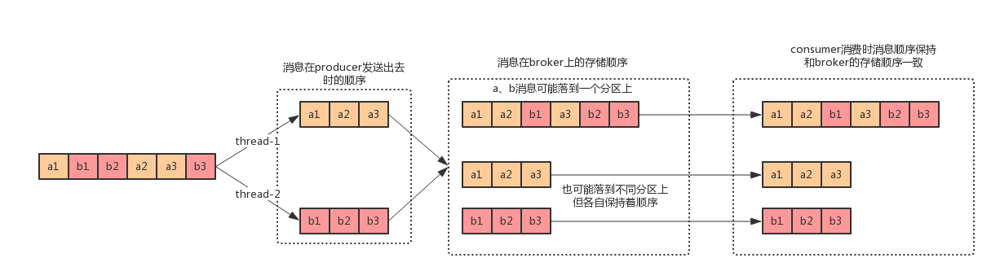
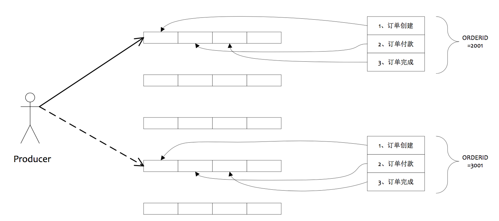
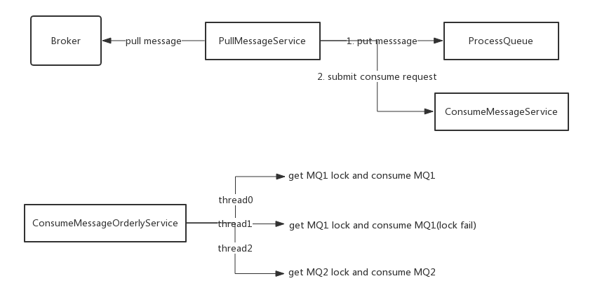

# 1、什么是顺序消息

**顺序消息**（FIFO 消息）是 MQ 提供的一种严格按照顺序进行发布和消费的消息类型。顺序消息由两个部分组成：顺序发布和顺序消费。

顺序消息包含两种类型：

- **分区顺序**：一个Partition内所有的消息按照先进先出的顺序进行发布和消费
- **全局顺序**：一个Topic内所有的消息按照先进先出的顺序进行发布和消费

那么多线程中发送消息算不算顺序发布？

如上一部分介绍的，多线程中若没有因果关系则没有顺序。那么用户在多线程中去发消息就意味着用户不关心那些在不同线程中被发送的消息的顺序。即多线程发送的消息，不同线程间的消息不是顺序发布的，同一线程的消息是顺序发布的。这是需要用户自己去保障的。

而对于顺序消费，则需要保证哪些来自同一个发送线程的消息在消费时是按照相同的顺序被处理的（为什么不说他们应该在一个线程中被消费呢？）。

全局顺序其实是分区顺序的一个特例，即使Topic只有一个分区（以下不在讨论全局顺序，因为全局顺序将面临性能的问题，而且绝大多数场景都不需要全局顺序）。

# 2、如何保证顺序

在MQ的模型中，顺序需要由3个阶段去保障：

- 消息被发送时保持顺序
- 消息被存储时保持和发送的顺序一致
- 消息被消费时保持和存储的顺序一致

发送时保持顺序意味着对于有顺序要求的消息，用户应该在同一个线程中采用同步的方式发送。存储保持和发送的顺序一致则要求在同一线程中被发送出来的消息A和B，存储时在空间上A一定在B之前。而消费保持和存储一致则要求消息A、B到达Consumer之后必须按照先A后B的顺序被处理。

一言以蔽之，就是需要保证：**生产者 - MQServer - 消费者 是一对一对一的关系**。

如下图所示：



对于两个订单的消息的原始数据：a1、b1、b2、a2、a3、b3（绝对时间下发生的顺序）：

- 在发送时，a订单的消息需要保持a1、a2、a3的顺序，b订单的消息也相同，但是a、b订单之间的消息没有顺序关系，这意味着a、b订单的消息可以在不同的线程中被发送出去

- 在存储时，需要分别保证a、b订单的消息的顺序，但是a、b订单之间的消息的顺序可以不保证

- - a1、b1、b2、a2、a3、b3是可以接受的
  - a1、a2、b1、b2、a3、b3也是可以接受的
  - a1、a3、b1、b2、a2、b3是不能接受的

- 消费时保证顺序的简单方式就是“什么都不做”，不对收到的消息的顺序进行调整，即只要**一个分区的消息只由一个线程处理**即可；当然，如果a、b在一个分区中，在收到消息后也可以将他们拆分到不同线程中处理，不过要权衡一下收益

# 3、Producer端

Producer端确保消息顺序唯一要做的事情就是**将同一组的消息路由到同一个分区**，在RocketMQ中，通过`MessageQueueSelector`来实现分区的选择。

```java
public interface MessageQueueSelector {
    MessageQueue select(List<MessageQueue> mqs, Message msg, Object var3);
}
```

- List<MessageQueue> mqs：消息要发送的Topic下所有的分区
- Message msg：消息对象
- 额外的参数：用户可以传递自己的参数

比如如下实现就可以保证相同的订单的消息被路由到相同的分区：

```java
long orderId = ((Order) object).getOrderId;
return mqs.get(orderId % mqs.size());
```



# 4、Consumer端

RocketMQ消费端有两种类型：`MQPullConsumer`和`MQPushConsumer`。

MQPullConsumer由用户控制线程，主动从服务端获取消息，每次获取到的是一个MessageQueue中的消息。PullResult中的List msgFoundList自然和存储顺序一致，用户需要再拿到这批消息后自己保证消费的顺序。

对于PushConsumer，由用户注册MessageListener来消费消息，在客户端中需要保证调用MessageListener时消息的顺序性。RocketMQ中的实现如下：



- PullMessageService单线程的从Broker获取消息
- PullMessageService将消息添加到ProcessQueue中（ProcessMessage是一个消息的缓存），之后提交一个消费任务到ConsumeMessageOrderService
- ConsumeMessageOrderService多线程执行，每个线程在消费消息时需要拿到MessageQueue的锁
- 拿到锁之后从ProcessQueue中获取消息

保证消费顺序的核心思想是：

- 获取到消息后添加到ProcessQueue中，**单线程执行**，所以ProcessQueue中的消息是顺序的
- 提交的消费任务时提交的是“对某个MQ进行一次消费”，这次消费请求是从ProcessQueue中获取消息消费，所以也是顺序的（无论哪个线程获取到锁，都是按照ProcessQueue中消息的顺序进行消费）

# 5、副作用

顺序消息需要Producer和Consumer都保证顺序。Producer需要保证消息被路由到正确的分区，消息需要保证每个分区的数据只有一个线程消息，那么就会有一些缺陷：

- 发送顺序消息无法利用集群的Failover特性，因为不能更换MessageQueue进行重试
- 因为发送的路由策略导致的热点问题，可能某一些MessageQueue的数据量特别大
- 消费的并行读依赖于分区数量
- 消费失败时无法跳过

不能更换MessageQueue重试就需要MessageQueue有自己的副本，通过Raft、Paxos之类的算法保证有可用的副本，或者通过其他高可用的存储设备来存储MessageQueue。

热点问题好像没有什么好的解决办法，只能通过拆分MessageQueue和优化路由方法来尽量均衡的将消息分配到不同的MessageQueue。

消费并行度理论上不会有太大问题，因为MessageQueue的数量可以调整。

消费失败的无法跳过是不可避免的，因为跳过可能导致后续的数据处理都是错误的。不过可以提供一些策略，由用户根据错误类型来决定是否跳过，并且提供重试队列之类的功能，在跳过之后用户可以在“其他”地方重新消费到这条消息。

# 6、代码实例

在默认的情况下消息发送会采取Round Robin轮询方式把消息发送到不同的queue(分区队列)；而消费消息的时候从多个queue上拉取消息，这种情况发送和消费是不能保证顺序。但是如果控制发送的顺序消息只依次发送到同一个queue中，消费的时候只从这个queue上依次拉取，则就保证了顺序。当发送和消费参与的queue只有一个，则是全局有序；如果多个queue参与，则为分区有序，即相对每个queue，消息都是有序的。

下面用订单进行分区有序的示例。一个订单的顺序流程是：创建、付款、推送、完成。订单号相同的消息会被先后发送到同一个队列中，消费时，同一个OrderId获取到的肯定是同一个队列。

```java
public class Producer {

    public static void main (String[] args) throws Exception {
        DefaultMQProducer producer = new DefaultMQProducer("please_rename_unique_group_name");

        producer.setNamesrvAddr("127.0.0.1:9876");

        producer.start();

        String[] tags = new String[]{"TagA", "TagC", "TagD"};

        // 订单列表
        List<OrderStep> orderList = new Producer().buildOrders();

        Date date = new Date();
        SimpleDateFormat sdf = new SimpleDateFormat("yyyy-MM-dd HH:mm:ss");
        String dateStr = sdf.format(date);
        for (int i = 0; i < 10; i++) {
            // 加个时间前缀
            String body = dateStr + " Hello RocketMQ " + orderList.get(i);
            Message msg = new Message("TopicTest", tags[i % tags.length], "KEY" + i, body.getBytes());

            SendResult sendResult = producer.send(msg, new MessageQueueSelector() {
                @Override
                public MessageQueue select (List<MessageQueue> mqs, Message msg, Object arg) {
                    Long id = (Long) arg;  //根据订单id选择发送queue
                    long index = id % mqs.size();
                    return mqs.get((int) index);
                }
            }, orderList.get(i).getOrderId());//订单id

            System.out.println(String.format("SendResult status:%s, queueId:%d, body:%s", sendResult.getSendStatus(),
                    sendResult.getMessageQueue().getQueueId(), body));
        }

        producer.shutdown();
    }

    /**
     * 订单的步骤
     */
    private static class OrderStep {
        private long orderId;
        private String desc;

        public long getOrderId () {
            return orderId;
        }

        public void setOrderId (long orderId) {
            this.orderId = orderId;
        }

        public String getDesc () {
            return desc;
        }

        public void setDesc (String desc) {
            this.desc = desc;
        }

        @Override
        public String toString () {
            return "OrderStep{" + "orderId=" + orderId + ", desc='" + desc + '\'' + '}';
        }
    }

    /**
     * 生成模拟订单数据
     */
    private List<OrderStep> buildOrders () {
        List<OrderStep> orderList = new ArrayList<OrderStep>();

        OrderStep orderDemo = new OrderStep();
        orderDemo.setOrderId(15103111039L);
        orderDemo.setDesc("创建");
        orderList.add(orderDemo);

        orderDemo = new OrderStep();
        orderDemo.setOrderId(15103111065L);
        orderDemo.setDesc("创建");
        orderList.add(orderDemo);

        orderDemo = new OrderStep();
        orderDemo.setOrderId(15103111039L);
        orderDemo.setDesc("付款");
        orderList.add(orderDemo);

        orderDemo = new OrderStep();
        orderDemo.setOrderId(15103117235L);
        orderDemo.setDesc("创建");
        orderList.add(orderDemo);

        orderDemo = new OrderStep();
        orderDemo.setOrderId(15103111065L);
        orderDemo.setDesc("付款");
        orderList.add(orderDemo);

        orderDemo = new OrderStep();
        orderDemo.setOrderId(15103117235L);
        orderDemo.setDesc("付款");
        orderList.add(orderDemo);

        orderDemo = new OrderStep();
        orderDemo.setOrderId(15103111065L);
        orderDemo.setDesc("完成");
        orderList.add(orderDemo);

        orderDemo = new OrderStep();
        orderDemo.setOrderId(15103111039L);
        orderDemo.setDesc("推送");
        orderList.add(orderDemo);

        orderDemo = new OrderStep();
        orderDemo.setOrderId(15103117235L);
        orderDemo.setDesc("完成");
        orderList.add(orderDemo);

        orderDemo = new OrderStep();
        orderDemo.setOrderId(15103111039L);
        orderDemo.setDesc("完成");
        orderList.add(orderDemo);

        return orderList;
    }
}
```

日志如下：

> SeSendResult status:SEND_OK, queueId:3, body:2020-08-12 11:14:37 Hello RocketMQ OrderStep{orderId=15103111039, desc='创建'}
> SendResult status:SEND_OK, queueId:1, body:2020-08-12 11:14:37 Hello RocketMQ OrderStep{orderId=15103111065, desc='创建'}
> SendResult status:SEND_OK, queueId:3, body:2020-08-12 11:14:37 Hello RocketMQ OrderStep{orderId=15103111039, desc='付款'}
> SendResult status:SEND_OK, queueId:3, body:2020-08-12 11:14:37 Hello RocketMQ OrderStep{orderId=15103117235, desc='创建'}
> SendResult status:SEND_OK, queueId:1, body:2020-08-12 11:14:37 Hello RocketMQ OrderStep{orderId=15103111065, desc='付款'}
> SendResult status:SEND_OK, queueId:3, body:2020-08-12 11:14:37 Hello RocketMQ OrderStep{orderId=15103117235, desc='付款'}
> SendResult status:SEND_OK, queueId:1, body:2020-08-12 11:14:37 Hello RocketMQ OrderStep{orderId=15103111065, desc='完成'}
> SendResult status:SEND_OK, queueId:3, body:2020-08-12 11:14:37 Hello RocketMQ OrderStep{orderId=15103111039, desc='推送'}
> SendResult status:SEND_OK, queueId:3, body:2020-08-12 11:14:37 Hello RocketMQ OrderStep{orderId=15103117235, desc='完成'}
> SendResult status:SEND_OK, queueId:3, body:2020-08-12 11:14:37 Hello RocketMQ OrderStep{orderId=15103111039, desc='完成'}

消费者代码：

```java
public class ConsumerInOrder {

    public static void main (String[] args) throws Exception {
        DefaultMQPushConsumer consumer = new DefaultMQPushConsumer("please_rename_unique_group_name_3");
        consumer.setNamesrvAddr("127.0.0.1:9876");
        /**
         * 设置Consumer第一次启动是从队列头部开始消费还是队列尾部开始消费<br>
         * 如果非第一次启动，那么按照上次消费的位置继续消费
         */
        consumer.setConsumeFromWhere(ConsumeFromWhere.CONSUME_FROM_FIRST_OFFSET);

        consumer.subscribe("TopicTest", "TagA || TagC || TagD");

        consumer.registerMessageListener(new MessageListenerOrderly() {

            Random random = new Random();

            @Override
            public ConsumeOrderlyStatus consumeMessage (List<MessageExt> msgs, ConsumeOrderlyContext context) {
                context.setAutoCommit(true);
                for (MessageExt msg : msgs) {
                    // 可以看到每个queue有唯一的consume线程来消费, 订单对每个queue(分区)有序
                    System.out.println("consumeThread=" + Thread.currentThread().getName() + "queueId=" + msg.getQueueId() + ", content:" + new String(msg.getBody()));
                }

                try {
                    //模拟业务逻辑处理中...
                    TimeUnit.SECONDS.sleep(random.nextInt(10));
                } catch (Exception e) {
                    e.printStackTrace();
                }
                return ConsumeOrderlyStatus.SUCCESS;
            }
        });

        consumer.start();

        System.out.println("Consumer Started.");
    }
}
```

日志如下：

> consumeThread=ConsumeMessageThread_1queueId=3, content:2020-08-12 11:14:37 Hello RocketMQ OrderStep{orderId=15103111039, desc='创建'}
> consumeThread=ConsumeMessageThread_2queueId=1, content:2020-08-12 11:14:37 Hello RocketMQ OrderStep{orderId=15103111065, desc='创建'}
> consumeThread=ConsumeMessageThread_1queueId=3, content:2020-08-12 11:14:37 Hello RocketMQ OrderStep{orderId=15103111039, desc='付款'}
> consumeThread=ConsumeMessageThread_2queueId=1, content:2020-08-12 11:14:37 Hello RocketMQ OrderStep{orderId=15103111065, desc='付款'}
> consumeThread=ConsumeMessageThread_1queueId=3, content:2020-08-12 11:14:37 Hello RocketMQ OrderStep{orderId=15103117235, desc='创建'}
> consumeThread=ConsumeMessageThread_2queueId=1, content:2020-08-12 11:14:37 Hello RocketMQ OrderStep{orderId=15103111065, desc='完成'}
> consumeThread=ConsumeMessageThread_1queueId=3, content:2020-08-12 11:14:37 Hello RocketMQ OrderStep{orderId=15103117235, desc='付款'}
> consumeThread=ConsumeMessageThread_1queueId=3, content:2020-08-12 11:14:37 Hello RocketMQ OrderStep{orderId=15103111039, desc='推送'}
> consumeThread=ConsumeMessageThread_1queueId=3, content:2020-08-12 11:14:37 Hello RocketMQ OrderStep{orderId=15103117235, desc='完成'}
> consumeThread=ConsumeMessageThread_1queueId=3, content:2020-08-12 11:14:37 Hello RocketMQ OrderStep{orderId=15103111039, desc='完成'}

# 