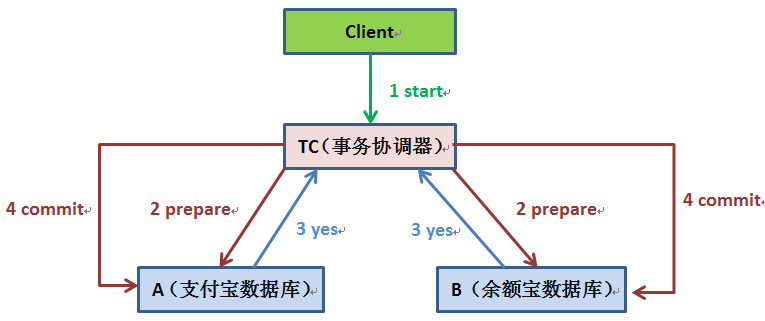
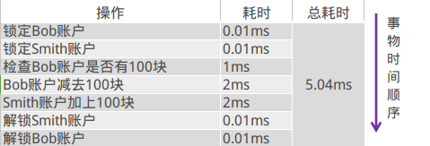
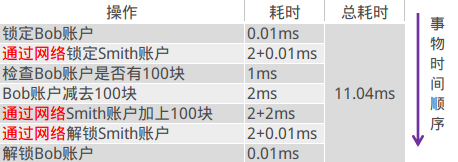
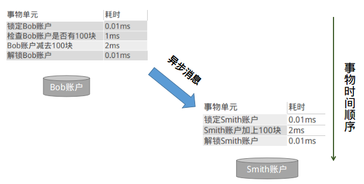
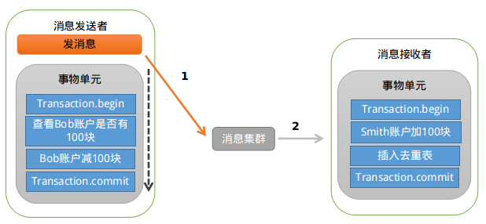
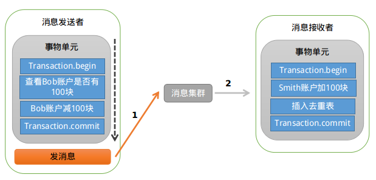
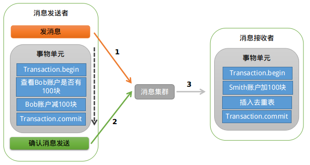
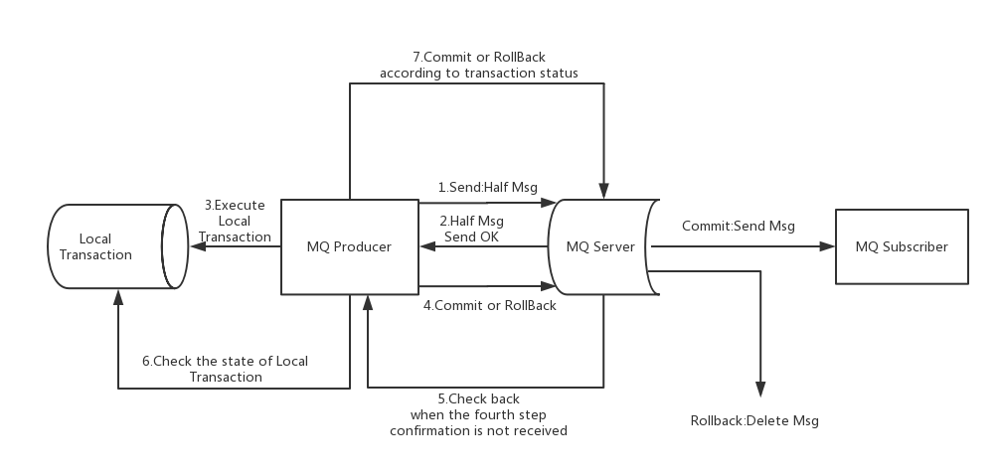
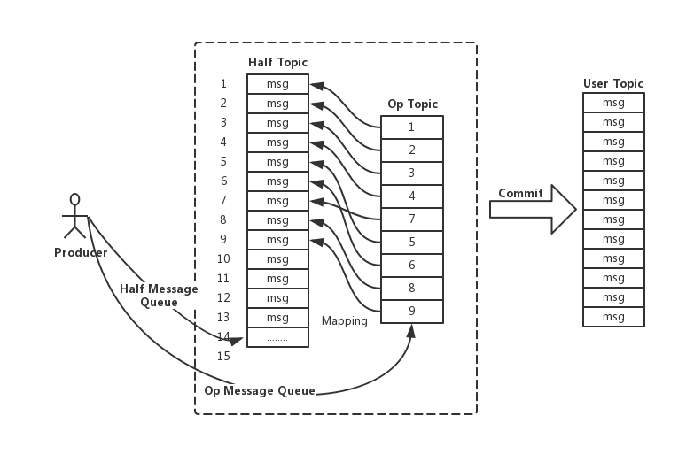

# 1、从本地事务到分布式事务

我们经常支付宝转账余额宝，这是日常生活的一件普通小事，但是我们思考支付宝扣除转账的钱之后，如果系统挂掉怎么办，这时余额宝账户并没有增加相应的金额，数据就会出现不一致状况了。

上述场景在各个类型的系统中都能找到相似影子，比如在电商系统中，当有用户下单后，除了在订单表插入一条记录外，对应商品表的这个商品数量必须减1吧，怎么保证？在搜索广告系统中，当用户点击某广告后，除了在点击事件表中增加一条记录外，还得去商家账户表中找到这个商家并扣除广告费吧，怎么保证？

本质上问题可以抽象为：当一个表数据更新后，怎么保证另一个表的数据也必须要更新成功。

还是以支付宝转账余额宝为例（比如转账10000块钱），假设有：

-  支付宝账户表：A（id，userId，amount）
-  余额宝账户表：B（id，userId，amount）

用户的userId=1，从支付宝转账1万块钱到余额宝的动作分为两步：

- 支付宝表扣除1万：update A set amount=amount-10000 where userId=1;
- 余额宝表增加1万：update B set amount=amount+10000 where userId=1;

如何确保支付宝余额宝收支平衡呢？

如果是单机系统(数据库实例也在同一个系统上)的话，我们可以用**本地事务**轻松解决：

```bash
Begin transaction 
  update A set amount=amount-10000 where userId=1;
 update B set amount=amount+10000 where userId=1;
End transaction 
commit;
```

如果系统规模较小，数据表都在一个数据库实例上，上述本地事务方式可以很好地运行，但是如果系统规模较大，比如支付宝账户表和余额宝账户表显然不会在同一个数据库实例上，他们往往分布在不同的物理节点上，这时本地事务已经失去用武之地。

下面我们来看看比较主流的两种方案：

## 1.1 两阶段提交协议

**两阶段提交协议**（Two-phase Commit，2PC）经常被用来实现分布式事务。一般分为协调器TC和若干事务执行者两种角色，这里的事务执行者就是具体的数据库，协调器可以和事务执行器在一台机器上。



我们根据上面的图来看看主要流程：

- 我们的应用程序（client）发起一个开始请求到TC（transaction）；
- TC先将**prepare消息**写到本地日志，之后向所有的Si发起prepare消息。以支付宝转账到余额宝为例，TC给A的prepare消息是通知支付宝数据库相应账目扣款1万，TC给B的prepare消息是通知余额宝数据库相应账目增加1w。为什么在执行任务前需要先写本地日志，主要是为了故障后恢复用，本地日志起到现实生活中凭证的效果，如果没有本地日志（凭证），出问题容易死无对证；
-  Si收到prepare消息后，执行具体本机事务，但不会进行commit，如果成功返回yes，不成功返回no。同理，返回前都应把要返回的消息写到日志里，当作凭证。
- TC收集所有执行器返回的消息，如果所有执行器都返回yes，那么给所有执行器发生送commit消息，执行器收到commit后执行本地事务的commit操作；如果有任一个执行器返回no，那么给所有执行器发送abort消息，执行器收到abort消息后执行事务abort操作。

TC或Si把发送或接收到的消息先写到日志里，主要是为了故障后恢复用。如某一Si从故障中恢复后，先检查本机的日志，如果已收到commit，则提交，如果abort则回滚。如果是yes，则再向TC询问一下，确定下一步。如果什么都没有，则很可能在prepare阶段Si就崩溃了，因此需要回滚。

现如今实现基于两阶段提交的分布式事务也没那么困难了，如果使用java，那么可以使用开源软件atomikos来快速实现。

不过但凡使用过的上述两阶段提交的同学都可以发现性能实在是太差，根本不适合高并发的系统。为什么？

- 两阶段提交涉及多次节点间的网络通信，通信时间太长
- 事务时间相对于变长了，锁定的资源的时间也变长了，造成资源等待时间也增加好多

正是由于分布式事务存在很严重的性能问题，大部分高并发服务都在避免使用，往往通过其他途径来解决数据一致性问题。

## 1.2 使用消息队列来避免分布式事务

如果仔细观察生活的话，生活的很多场景已经给了我们提示。

比如在北京很有名的姚记炒肝点了炒肝并付了钱后，他们并不会直接把你点的炒肝给你，而是给你一张小票，然后让你拿着小票到出货区排队去取。为什么他们要将付钱和取货两个动作分开呢？原因很多，其中一个很重要的原因是为了使他们接待能力增强（并发量更高）。

还是回到我们的问题，只要这张小票在，你最终是能拿到炒肝的。同理转账服务也是如此，当支付宝账户扣除1万后，我们只要生成一个凭证（消息）即可，这个凭证（消息）上写着“让余额宝账户增加1万”，只要这个凭证（消息）能可靠保存，我们最终是可以拿着这个凭证（消息）让余额宝账户增加1万的，即我们能依靠这个凭证（消息）完成最终一致性。

那么我们如何可靠保存凭证（消息）有两种方法：

### 1.2.1 业务与消息耦合的方式

支付宝在完成扣款的同时，同时记录消息数据，这个消息数据与业务数据保存在同一数据库实例里（消息记录表表名为message）。

```csharp
Begin transaction 
       update A set amount=amount-10000 where userId=1; 
       insert into message(userId, amount,status) values(1, 10000, 1); 
End transaction 
commit;
```

上述事务能保证只要支付宝账户里被扣了钱，消息一定能保存下来。

当上述事务提交成功后，我们通过实时消息服务将此消息通知余额宝，余额宝处理成功后发送回复成功消息，支付宝收到回复后删除该条消息数据。

### 1.2.2 业务与消息解耦方式

上述保存消息的方式使得消息数据和业务数据紧耦合在一起，从架构上看不够优雅，而且容易诱发其他问题。为了解耦，可以采用以下方式。

- 支付宝在扣款事务提交之前，向实时消息服务请求发送消息，实时消息服务只记录消息数据，而不真正发送，只有消息发送成功后才会提交事务；
- 当支付宝扣款事务被提交成功后，向实时消息服务确认发送。只有在得到确认发送指令后，实时消息服务才真正发送该消息；
- 当支付宝扣款事务提交失败回滚后，向实时消息服务取消发送。在得到取消发送指令后，该消息将不会被发送；
- 对于那些未确认的消息或者取消的消息，需要有一个消息状态确认系统定时去支付宝系统查询这个消息的状态并进行更新。为什么需要这一步骤，举个例子：假设在第2步支付宝扣款事务被成功提交后，系统挂了，此时消息状态并未被更新为“确认发送”，从而导致消息不能被发送。

优点是消息数据独立存储，降低业务系统与消息系统间的耦合；缺点是一次消息发送需要两次请求，业务处理服务需要实现消息状态回查接口。

还有一个很严重的问题就是消息重复投递，以我们支付宝转账到余额宝为例，如果相同的消息被重复投递两次，那么我们余额宝账户将会增加2万而不是1万了。

为什么相同的消息会被重复投递？比如余额宝处理完消息msg后，发送了处理成功的消息给支付宝，正常情况下支付宝应该要删除消息msg，但如果支付宝这时候悲剧的挂了，重启后一看消息msg还在，就会继续发送消息msg。

解决方法很简单，在余额宝这边增加消息应用状态表，通俗来说就是个账本，用于记录消息的消费情况，每次来一个消息，在真正执行之前，先去消息应用状态表中查询一遍，如果找到说明是重复消息，丢弃即可，如果没找到才执行，同时插入到消息应用状态表（同一事务）。

```csharp
for each msg in queue 

Begin transaction 

  select count(*) as cnt from message_apply where msg_id=msg.msg_id; 

  if cnt==0 then 

    update B set amount=amount+10000 where userId=1; 

    insert into message_apply(msg_id) values(msg.msg_id); 

End transaction 

commit;
```


## 1.3 进一步分析

为了方便大家理解，我们再来举一个银行转账的示例：

比如，Bob向Smith转账100块。

在单机环境下，执行事务的情况，大概是下面这个样子：



当用户增长到一定程度，Bob和Smith的账户及余额信息已经不在同一台服务器上了，那么上面的流程就变成了这样：



这时候你会发现，同样是一个转账的业务，在集群环境下，耗时居然成倍的增长，这显然是不能够接受的。那如何来规避这个问题？

> **大事务 = 小事务 + 异步**

将大事务拆分成多个小事务异步执行。这样基本上能够将跨机事务的执行效率优化到与单机一致。转账的事务就可以分解成如下两个小事务：



图中执行本地事务（Bob账户扣款）和发送异步消息应该保证同时成功或者同时失败，也就是扣款成功了，发送消息一定要成功，如果扣款失败了，就不能再发送消息。那问题是：我们是先扣款还是先发送消息呢？

首先看下先发送消息的情况，大致的示意图如下：



存在的问题是：如果消息发送成功，但是扣款失败，消费端就会消费此消息，进而向Smith账户加钱。

先发消息不行，那就先扣款吧，大致的示意图如下：



存在的问题跟上面类似：如果扣款成功，发送消息失败，就会出现Bob扣钱了，但是Smith账户未加钱。

可能大家会有很多的方法来解决这个问题，比如：直接将发消息放到Bob扣款的事务中去，如果发送失败，抛出异常，事务回滚。这样的处理方式也符合“恰好”不需要解决的原则。

RocketMQ支持事务消息，下面来看看RocketMQ是怎样来实现的?



RocketMQ第一阶段发送Prepared消息时，会拿到消息的地址，第二阶段执行本地事物，第三阶段通过第一阶段拿到的地址去访问消息，并修改消息的状态。

细心的你可能又发现问题了，如果确认消息发送失败了怎么办？RocketMQ会定期扫描消息集群中的事物消息，如果发现了Prepared消息，它会向消息发送端(生产者)确认，Bob的钱到底是减了还是没减呢？如果减了是回滚还是继续发送确认消息呢？

RocketMQ会根据发送端设置的策略来决定是回滚还是继续发送确认消息。这样就保证了消息发送与本地事务同时成功或同时失败

# 2、实现细节

RocketMQ采用了2PC的思想来实现了提交事务消息，同时增加一个补偿逻辑来处理二阶段超时或者失败的消息。



上图说明了事务消息的大致方案，其中分为两个流程：正常事务消息的发送及提交、事务消息的补偿流程。

- 事务消息发送及提交
  - (1) 发送消息（half消息）。
  - (2) 服务端响应消息写入结果。
  - (3) 根据发送结果执行本地事务（如果写入失败，此时half消息对业务不可见，本地逻辑不执行）。
  - (4) 根据本地事务状态执行Commit或者Rollback（Commit操作生成消息索引，消息对消费者可见）
- 补偿流程
  - (1) 对没有Commit/Rollback的事务消息（pending状态的消息），从服务端发起一次“回查”
  - (2) Producer收到回查消息，检查回查消息对应的本地事务的状态
  - (3) 根据本地事务状态，重新Commit或者Rollback

其中，补偿阶段用于解决消息Commit或者Rollback发生超时或者失败的情况。

在RocketMQ事务消息的主要流程中，一阶段的消息是如何做到对用户不可见呢？RocketMQ事务消息的做法是：如果消息是half消息，将备份原消息的主题与消息消费队列，然后改变主题为RMQ_SYS_TRANS_HALF_TOPIC。由于消费组未订阅该主题，故消费端无法消费half类型的消息，然后RocketMQ会开启一个定时任务，从Topic为RMQ_SYS_TRANS_HALF_TOPIC中拉取消息进行消费，根据生产者组获取一个服务提供者发送回查事务状态请求，根据事务状态来决定是提交或回滚消息。

在完成一阶段写入一条对用户不可见的消息后，二阶段如果是Commit操作，则需要让消息对用户可见；如果是Rollback则需要撤销一阶段的消息。先说Rollback的情况。对于Rollback，本身一阶段的消息对用户是不可见的，其实不需要真正撤销消息（实际上RocketMQ也无法去真正的删除一条消息，因为是顺序写文件的）。但是区别于这条消息没有确定状态（Pending状态，事务悬而未决），需要一个操作来标识这条消息的最终状态。RocketMQ事务消息方案中引入了**Op消息**的概念，用Op消息标识事务消息已经确定的状态（Commit或者Rollback）。如果一条事务消息没有对应的Op消息，说明这个事务的状态还无法确定（可能是二阶段失败了）。引入Op消息后，事务消息无论是Commit或者Rollback都会记录一个Op操作。Commit相对于Rollback只是在写入Op消息前创建Half消息的索引。



如果在RocketMQ事务消息的二阶段过程中失败了，例如在做Commit操作时，出现网络问题导致Commit失败，那么需要通过一定的策略使这条消息最终被Commit。RocketMQ采用了一种补偿机制，称为“回查”。Broker端对未确定状态的消息发起回查，将消息发送到对应的Producer端（同一个Group的Producer），由Producer根据消息来检查本地事务的状态，进而执行Commit或者Rollback。Broker端通过对比Half消息和Op消息进行事务消息的回查并且推进CheckPoint（记录那些事务消息的状态是确定的）。

值得注意的是，rocketmq并不会无休止的的信息事务状态回查，默认回查15次，如果15次回查还是无法得知事务状态，rocketmq默认回滚该消息。

# 3、代码实例

使用 `TransactionMQProducer`类创建生产者，并指定唯一的 `ProducerGroup`，就可以设置自定义线程池来处理这些检查请求。

```java
public class TransactionProducer {
   public static void main(String[] args) throws MQClientException, InterruptedException {
       TransactionListener transactionListener = new TransactionListenerImpl();
       TransactionMQProducer producer = new TransactionMQProducer("please_rename_unique_group_name");
       ExecutorService executorService = new ThreadPoolExecutor(2, 5, 100, TimeUnit.SECONDS, new ArrayBlockingQueue<Runnable>(2000), new ThreadFactory() {
           @Override
           public Thread newThread(Runnable r) {
               Thread thread = new Thread(r);
               thread.setName("client-transaction-msg-check-thread");
               return thread;
           }
       });
       producer.setExecutorService(executorService);
       producer.setTransactionListener(transactionListener);
       producer.start();
       String[] tags = new String[] {"TagA", "TagB", "TagC", "TagD", "TagE"};
       for (int i = 0; i < 10; i++) {
           try {
               Message msg =
                   new Message("TopicTest1234", tags[i % tags.length], "KEY" + i,
                       ("Hello RocketMQ " + i).getBytes(RemotingHelper.DEFAULT_CHARSET));
               SendResult sendResult = producer.sendMessageInTransaction(msg, null);
               System.out.printf("%s%n", sendResult);
               Thread.sleep(10);
           } catch (MQClientException | UnsupportedEncodingException e) {
               e.printStackTrace();
           }
       }
       for (int i = 0; i < 100000; i++) {
           Thread.sleep(1000);
       }
       producer.shutdown();
   }
}
```

当发送half消息成功时，我们使用 `executeLocalTransaction` 方法来执行本地事务。`checkLocalTransaction` 方法用于检查本地事务状态，并回应消息队列的检查请求。

```java
public class TransactionListenerImpl implements TransactionListener {
  private AtomicInteger transactionIndex = new AtomicInteger(0);
  private ConcurrentHashMap<String, Integer> localTrans = new ConcurrentHashMap<>();
  @Override
  public LocalTransactionState executeLocalTransaction(Message msg, Object arg) {
      int value = transactionIndex.getAndIncrement();
      int status = value % 3;
      localTrans.put(msg.getTransactionId(), status);
      return LocalTransactionState.UNKNOW;
  }
  @Override
  public LocalTransactionState checkLocalTransaction(MessageExt msg) {
      Integer status = localTrans.get(msg.getTransactionId());
      if (null != status) {
          switch (status) {
              case 0:
                  return LocalTransactionState.UNKNOW;
              case 1:
                  return LocalTransactionState.COMMIT_MESSAGE;
              case 2:
                  return LocalTransactionState.ROLLBACK_MESSAGE;
          }
      }
      return LocalTransactionState.COMMIT_MESSAGE;
  }
}
```

事务消息共有三种状态，提交状态、回滚状态、中间状态：

- TransactionStatus.CommitTransaction: 提交事务，它允许消费者消费此消息。
- TransactionStatus.RollbackTransaction: 回滚事务，它代表该消息将被删除，不允许被消费。
- TransactionStatus.Unknown: 中间状态，它代表需要检查消息队列来确定状态。