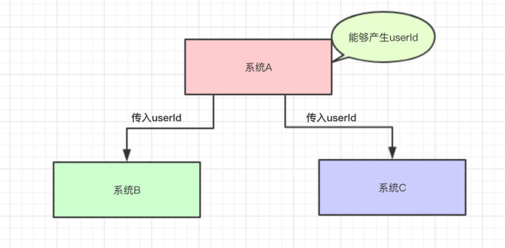
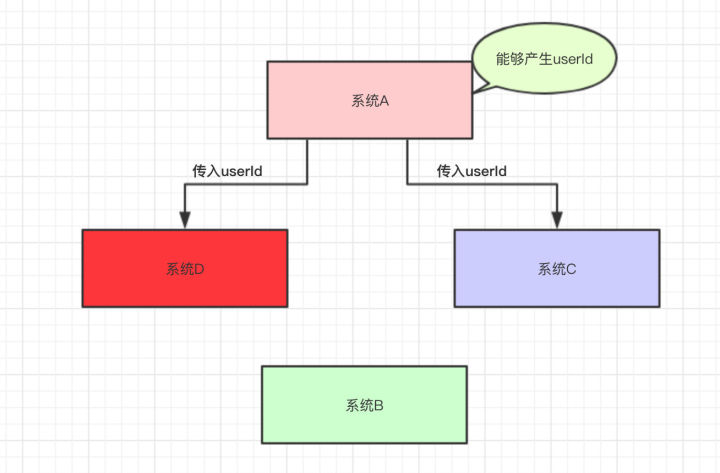
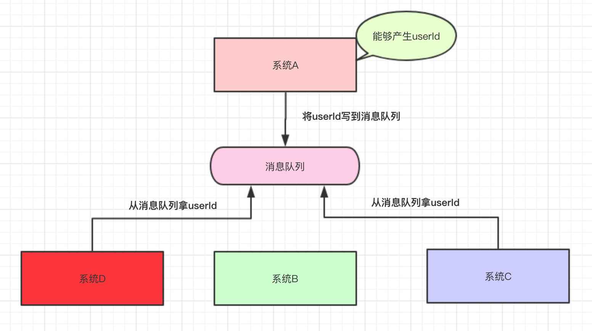
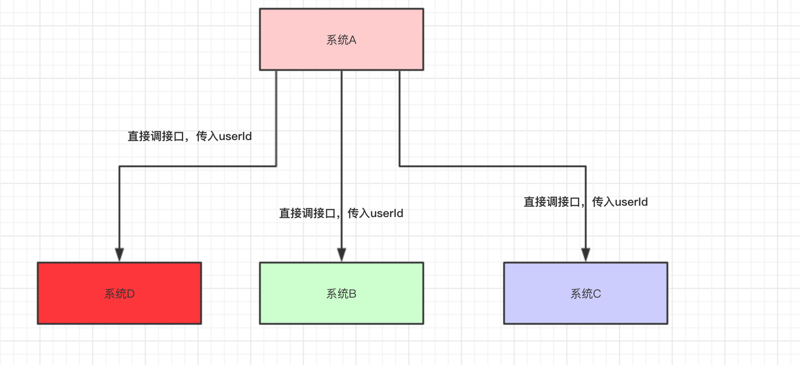
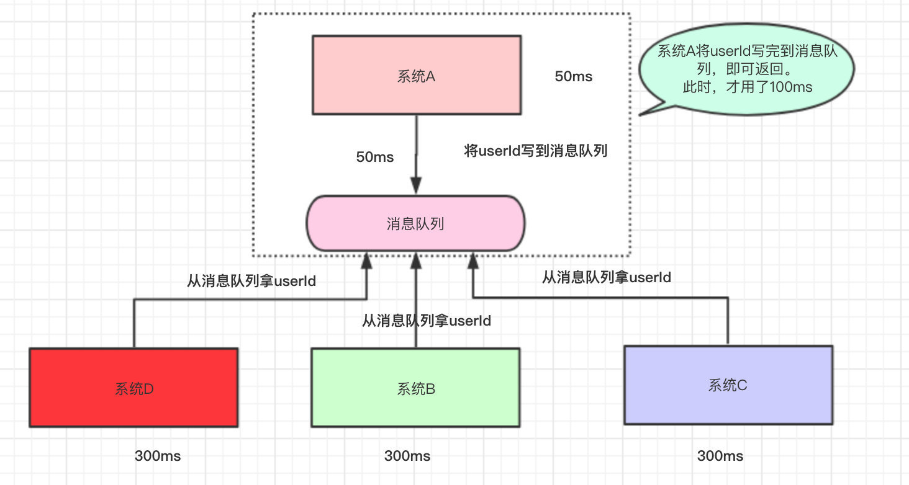
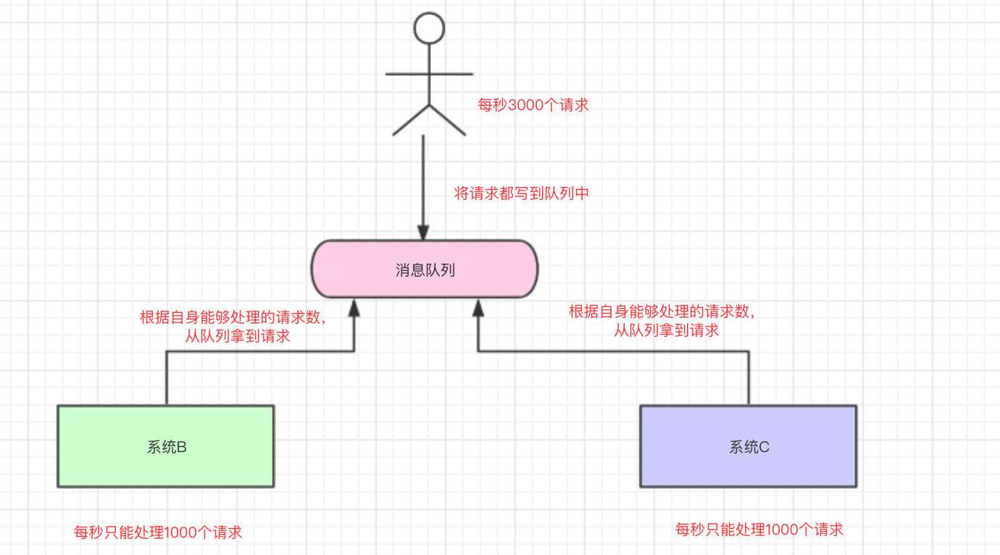
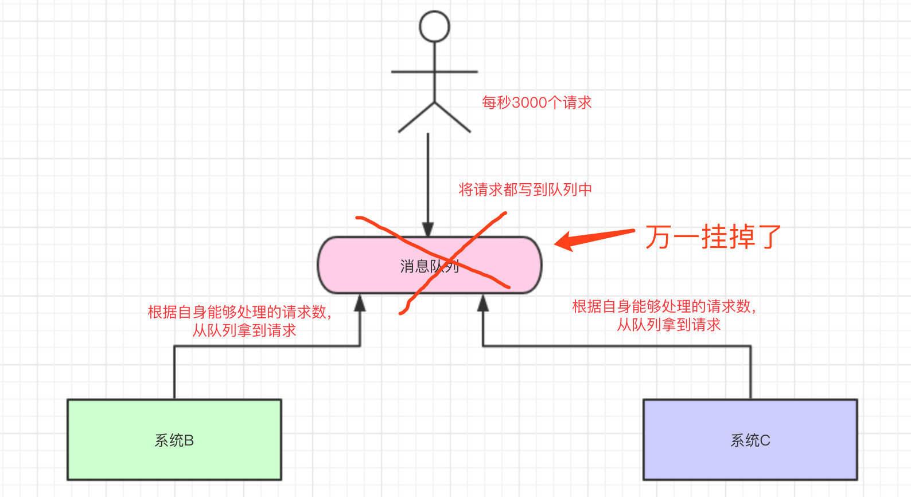
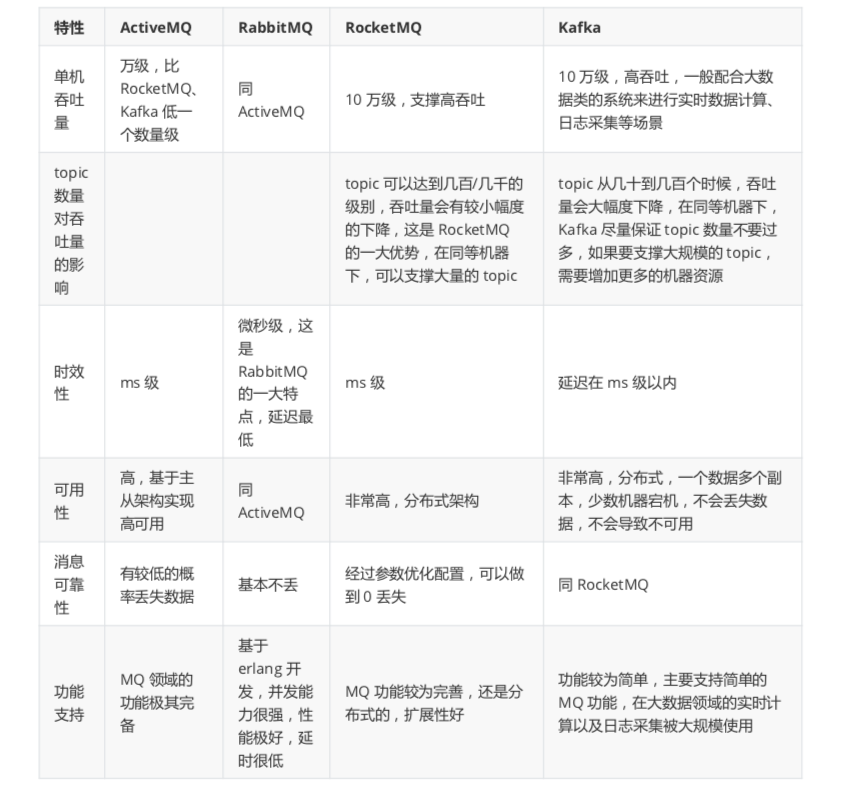

# 1、为什么使用消息队列

如果有人问你这个问题，期望的一个回答是说，你们公司有个什么业务场景，这个业务场景有个什么技术挑战，如果不用 MQ 可能会很麻烦，但是现在用了 MQ 之后带给了你很多的好处。

消息队列的使用场景有很多，但是归根结底都可以用六字真言来概括：**解耦**、**异步**、**削峰**。

## 1.1 解耦

假设现在有一个系统A，可以产生userId，系统B和系统C都需要这个userId去做相关的操作。



写成伪代码可能是这样的：

```java
public class SystemA {

    // 系统B和系统C的依赖
    SystemB systemB = new SystemB();
    SystemC systemC = new SystemC();

    // 系统A独有的数据userId
    private String userId = "winner";

    public void doSomething() {

        // 系统B和系统C都需要拿着系统A的userId去操作其他的事
        systemB.SystemBNeed2do(userId);
        systemC.SystemCNeed2do(userId);

    }
}
```

系统上线后，平稳运行了一段时间，一切貌似很完美。

某一天，系统B的负责人告诉系统A的负责人，现在系统B的`SystemBNeed2do(String userId)`这个接口不再使用了，让系统A别去调它了。

于是，系统A的负责人说”好的，那我就不调用你了"，于是就把调用系统B接口的代码给删掉了：

```java
public void doSomething() {

  // 系统A不再调用系统B的接口了
  //systemB.SystemBNeed2do(userId);
  systemC.SystemCNeed2do(userId);

}
```

又过了几天，系统D的负责人接了个需求，也需要用到系统A的userId，于是就跑去跟系统A的负责人说：“老哥，我要用到你的userId，你调一下我的接口吧”。

于是系统A说："没问题的，这就搞"。



然后，系统A的代码如下：

```java
public class SystemA {

    // 已经不再需要系统B的依赖了
    // SystemB systemB = new SystemB();

    // 系统C和系统D的依赖
    SystemC systemC = new SystemC();
    SystemD systemD = new SystemD();

    // 系统A独有的数据
    private String userId = "Java3y";

    public void doSomething() {


        // 已经不再需要系统B的依赖了
        //systemB.SystemBNeed2do(userId);

        // 系统C和系统D都需要拿着系统A的userId去操作其他的事
        systemC.SystemCNeed2do(userId);
        systemD.SystemDNeed2do(userId);

    }
}
```

时间飞逝：

- 又过了几天，系统E的负责人过来了，告诉系统A，需要userId。
- 又过了几天，系统B的负责人过来了，告诉系统A，还是重新掉那个接口吧。
- 又过了几天，系统F的负责人过来了，告诉系统A，需要userId。
- …...

于是系统A的负责人，每天都被这给骚扰着，改来改去，改来改去.......

还有另外一个问题，调用系统C的时候，如果系统C挂了，系统A还得想办法处理。如果调用系统D时，由于网络延迟，请求超时了，那系统A是反馈失败还是重试？

最后，系统A的负责人，觉得隔一段时间就改来改去，没意思，于是就跑路了……跑路了……了

然后，公司招来一个大佬，大佬经过几天熟悉，上来就说：“将系统A的userId写到消息队列中，这样系统A就不用经常改动了”。为什么呢？下面我们来一起看看：



系统A将userId写到消息队列中，系统C和系统D从消息队列中拿数据。这样有什么好处？

- 系统A只负责把数据写到队列中，谁想要或不想要这个数据(消息)，系统A一点都不关心。
- 即便现在系统D不想要userId这个数据了，系统B又突然想要userId这个数据了，都跟系统A无关，系统A一点代码都不用改。
- 系统D拿userId不再经过系统A，而是从消息队列里边拿。系统D即便挂了或者请求超时，都跟系统A无关，只跟消息队列有关。

这样一来，系统A与系统B、C、D都解耦了。

## 1.2 异步

我们再来看看下面这种情况：系统A还是直接调用系统B、C、D



代码如下：

```java
public class SystemA {

    SystemB systemB = new SystemB();
    SystemC systemC = new SystemC();
    SystemD systemD = new SystemD();

    // 系统A独有的数据
    private String userId ;

    public void doOrder() {

        // 下订单
        userId = this.order();
        // 如果下单成功，则安排其他系统做一些事  
        systemB.SystemBNeed2do(userId);
        systemC.SystemCNeed2do(userId);
        systemD.SystemDNeed2do(userId);

    }
}
```

假设系统A运算出userId具体的值需要50ms，调用系统B的接口需要300ms，调用系统C的接口需要300ms，调用系统D的接口需要300ms。那么这次请求就需要：50+300+300+300=950ms。

并且我们得知，系统A做的是主要的业务，而系统B、C、D是非主要的业务。比如系统A处理的是订单下单，而系统B是订单下单成功了，那发送一条短信告诉具体的用户此订单已成功，而系统C和系统D也是处理一些小事而已。

那么此时，为了提高用户体验和吞吐量，其实可以异步地调用系统B、C、D的接口。所以，我们可以弄成是这样的：



系统A执行完了以后，将userId写到消息队列中，然后就直接返回了(至于其他的操作，则异步处理)。

- 本来整个请求需要用950ms(同步)
- 现在将调用其他系统接口异步化，只需要100ms(异步)

## 1.3 削峰

我们再来一个场景，现在我们每个月要搞一次大促，大促期间的并发可能会很高的，比如每秒3000个请求。假设我们现在有两台机器处理请求，并且每台机器只能每次处理1000个请求。

那多出来的1000个请求，可能就把我们整个系统给搞崩了...所以，有一种办法，我们可以写到消息队列中：



系统B和系统C根据自己的能够处理的请求数去消息队列中拿数据，这样即便有每秒有8000个请求，那只是把请求放在消息队列中，去拿消息队列的消息由系统自己去控制，这样就不会把整个系统给搞崩。

# 2、副作用

上文列举了消息队列的三个用武之地，表面来看，很多难题只要引入了消息队列就能够化腐朽为神奇。但是，事分两面，下面就要说说消息队列的副作用。

## 2.1 高可用问题

系统引入的外部依赖越多，越容易挂掉。本来你就是 A 系统调用 BCD 三个系统的接口就好了，人家 ABCD 四个系统好好的，没啥问题，你偏加个 MQ 进来，万一 MQ 挂了，导致整套系统崩溃的，你不就完了？



为了保证消息队列的高可用性，一般都会采用**集群/分布式**的部署方式。

RabbitMQ 的镜像集群模式可以保证每个queue存在于多个实例上，每次写消息到queue的时候，都会自动把消息同步到多个实例。

而kafka本来就是天然的分布式消息队列，由多个broker构成集群，一个topic可以划分为多个partition，每个partition可以存在于不同的broker上，每个partition就放一部分数据。也就是说一个topic的数据，是分散放在多个机器上的，每个机器就放一部分数据。

## 2.2 一致性问题

A 系统处理完了直接返回成功了，调用方就以为请求就成功了。但是问题是，假如 BCD 三个系统那里，BD 两个系统写库成功了，结果 C 系统写库失败了怎么办？会导致数据的一致性被破坏。

## 2.3 复杂性问题

消息队列实际是一种非常复杂的架构，引入它有很多好处，但是也得针对它带来的坏处做各种额外的技术方案和架构来规避掉，比如下面的“夺命三板斧”：

- 如何保证消息不被重复消费？
- 如何保证消息不丢失？
- 如何保证消息的顺序投递？

# 3、常见中间件对比



- ActiveMQ 的社区算是比较成熟，但是较目前来说，ActiveMQ 的性能比较差，而且版本迭代很慢，不推荐使用。
- RabbitMQ 在吞吐量方面虽然稍逊于 Kafka 和 RocketMQ ，但是由于它基于 erlang 开发，所以并发能力很强，性能极其好，延时很低，达到微秒级。但是也因为 RabbitMQ 基于 erlang 开发，所以国内很少有公司有实力做erlang源码级别的研究和定制。如果业务场景对并发量要求不是太高（十万级、百万级），那这四种消息队列中，RabbitMQ 一定是你的首选。如
- RocketMQ 阿里出品，Java 系开源项目，源代码我们可以直接阅读，然后可以定制自己公司的MQ，并且 RocketMQ 有阿里巴巴的实际业务场景的实战考验。RocketMQ 社区活跃度相对较为一般，不过也还可以，文档相对来说简单一些，然后接口这块不是按照标准 JMS 规范走的有些系统要迁移需要修改大量代码。
- kafka 的特点其实很明显，就是仅仅提供较少的核心功能，但是提供超高的吞吐量，ms 级的延迟，极高的可用性以及可靠性，而且分布式可以任意扩展。同时 kafka 最好是支撑较少的 topic 数量即可，保证其超高吞吐量。kafka 唯一的一点劣势是有可能消息重复消费，那么对数据准确性会造成极其轻微的影响，在大数据领域中以及日志采集中，这点轻微影响可以忽略这个特性天然适合大数据实时计算以及日志收集。