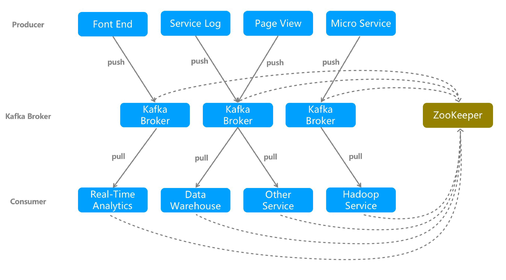
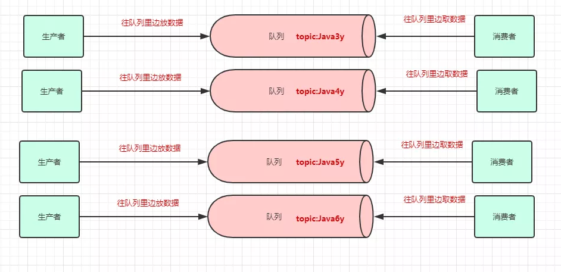
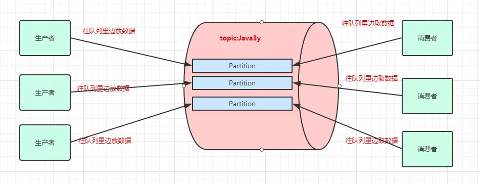
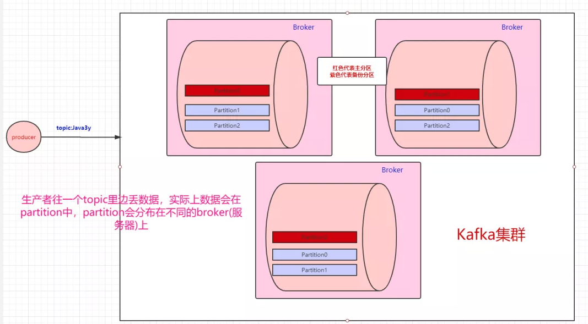
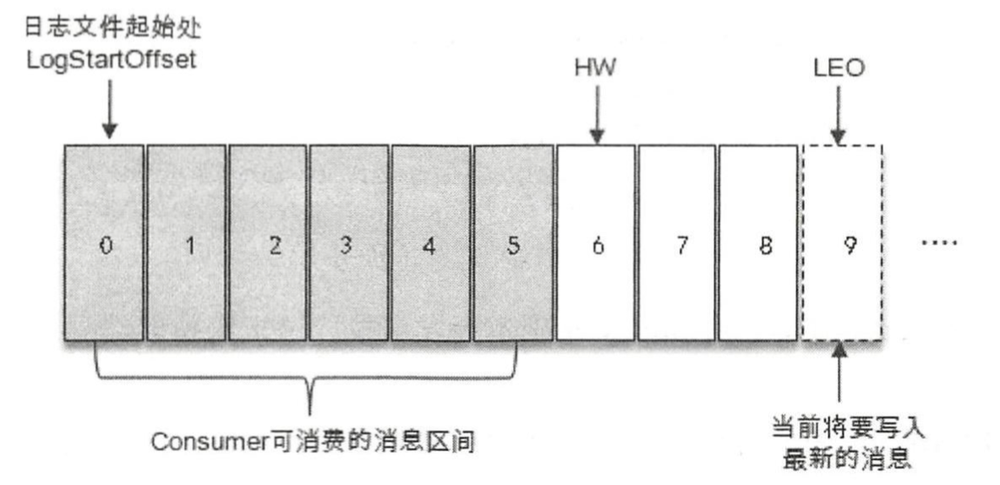
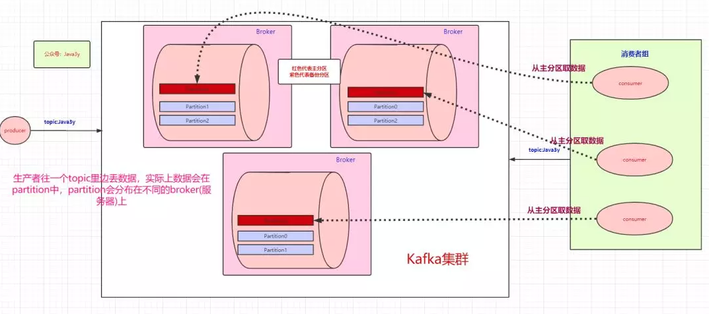
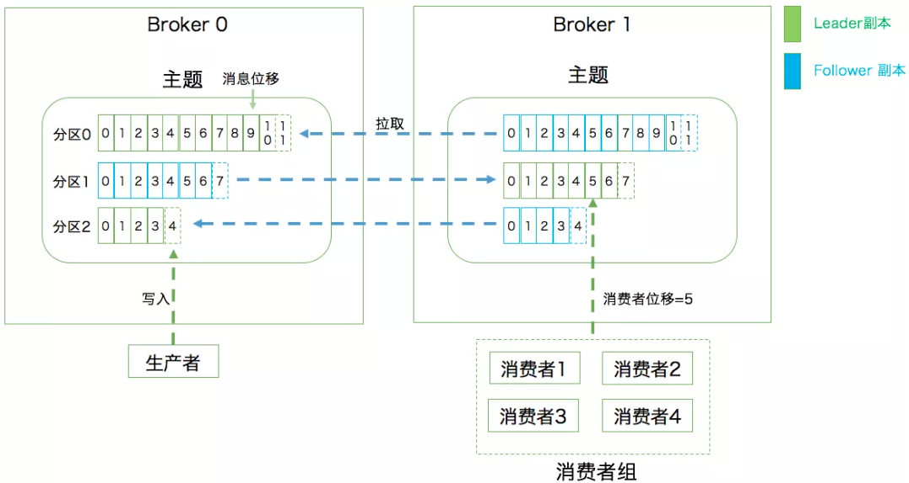

# 1、Kafka是什么

Kafka 最早是由 LinkedIn 公司采用Scala语言开发的一个多分区、多副本且基于ZooKeeper协调的分布式消息系统，现已成为 Apache 的顶级项目。

Apache Kafka与传统消息系统相比，有以下特点：

- 同时为发布和订阅提供高吞吐量
  Kafka 的设计目标是以时间复杂度为 O(1) 的方式提供消息持久化能力，即使对TB 级以上数据也能保证常数时间的访问性能。即使在非常廉价的商用机器上也能做到单机支持每秒 100K 条消息的传输。
- 消息持久化
  将消息持久化到磁盘，因此可用于批量消费，例如 ETL 以及实时应用程序。通过将数据持久化到硬盘以及 replication 防止数据丢失。
- 分布式
  支持 Server 间的消息分区及分布式消费，同时保证每个 partition 内的消息顺序传输。这样易于向外扩展，所有的producer、broker 和 consumer 都会有多个，均为分布式的。无需停机即可扩展机器。
- 消费消息采用 pull 模式
  消息被处理的状态是在 consumer 端维护，而不是由 server 端维护，broker 无状态，consumer 自己保存 offset。

# 2、体系架构

- **Producer**
  通过push模式向Kafka Broker发送消息。发送的消息可以是网站的页面访问、服务器日志，也可以是CPU和内存相关的系统资源信息。
- **Broker**
  用于存储消息的服务器，可以简单地看做一个独立的Kafka实例。Kafka Broker支持水平扩展。Kafka Broker节点的数量越多，Kafka集群的吞吐率越高。
- **Consumer**
  通过pull模式从Broker订阅并消费消息。每个 Consumer 属于一个特定的 Consumer Group（可为每个 Consumer 指定Group Name，若不指定 Group Name 则属于默认的 Group）。
- **Zookeeper**
  管理集群的配置、选举leader分区，并且在Consumer Group发生变化时，进行负载均衡。

# 3、Topic与Partition

一个消息中间件，队列不单单只有一个，我们往往会有多个队列，而我们生产者和消费者就得知道：把数据丢给哪个队列，从哪个队列消息。我们需要给队列取名字，叫做**topic**：

为了提高一个topic的吞吐量，Kafka会把topic进行**分区**(partition)。所以，生产者实际上是往topic的一个partition发送数据，而消费者实际上页是从一个topic的partition拉取数据：

Kafka可以保证**单个partition的写入是有顺序的**。如果要保证全局有序，那只能写入一个partition中。如果要消费也有序，消费者也只能有一个。

凡是分布式就无法避免网络抖动/机器宕机等问题的发生，很有可能消费者A读取了数据，还没来得及消费，就挂掉了。Zookeeper发现消费者A挂了，让消费者B去消费原本消费者A的分区，等消费者A重连的时候，发现已经重复消费同一条数据了。如果业务上不允许重复消费的问题，最好消费者那端做业务上的校验。

一个broker就是一个kafka服务器，多个broker构成一个kafka集群。一个topic会分为多个partition，partition会分布在不同的broker中。

也就是说，**Kafka是天然分布式的**。

# 4、多副本机制

既然是分布式，肯定会有单点问题：如果其中一台broker挂了，怎么办？

Kafka 为分区引入了**多副本** (Replica) 机制， 通过增加副本数量可以提升容灾能力。比如，现在我们有三个partition，分别存在三台broker上。每个partition都会备份，这些备份散落在不同的broker上：

红色块的partition代表的是**主分区**，紫色的partition块代表的是**备份分区**。生产者往topic丢数据，是与主分区交互，消费者消费topic的数据，也是与主分区交互。

**备份分区仅仅用作于备份，不做读写**。如果某个Broker挂了，那就会选举出其他Broker的partition来作为主分区，这就实现了高可用。

分区中的所有副本统称为 **AR** ( Assigned Replicas) 。 所有与 leader 副本保持 一定程度同步的副本(包括 leader 副本在内〕组成 **ISR** （In-Sync Replicas ) , ISR 集合是 AR 集合中 的一个子 集 。 消息会先发送到 leader 副本，然后 follower 副本才能从 leader 副本中拉取消息进行同步， 同步期间内 follower 副本相对于 leader 副本而言会有一定范围的滞后，这个范围可以通过参数进行配置 。 与 leader 副本同步滞后过多的副本(不包 括 leader 副本)组成 **OSR** ( Out-of-Sync Replicas)，由 此可见: `AR=ISR+OSR`。 在正常情况下， 所有的 follower副本都应该与 leader副本保持一定程度的同步，即 AR=ISR, OSR 集合为空。

由此可见， Kafka 的复制机制既不是完全的同步复制，也不是单纯的异步复制。事实上， 同步复制要求所有能工作的 folower 副本都复制完，这条消息才会被确认为已成功提交，这种复制方式极大地影响了性能。而在异步复制方式下， follower 副本异步地从 leader 副本中 复制数 据，数据只要被 leader 副本写入就被认为已经成功提交。在这种情况下，如果 follower 副本都 还没有复制完而落后于 leader 副本，突然 leader 副本着机，则会造成数据丢失。 Kafka 使用的这 种 ISR 的方式则有效地权衡了数据可靠性和性能之间的关系。 

ISR 与 **HW** 和 **LEO** 也有紧密的关系 。 HW 是 High Watermark 的缩写，俗称**高水位**，它标识了一个特定的消息偏移量(offset)，消费者只能拉取到这个 offset之前的消息。

如下图 所示，它代表一个日志文件，这个日志文件中有 9 条消息，第一条消息的 offset 为 0，最后一条消息的 offset为 8, offset为 9 的消息用虚线框表示，代表下 一条待写入 的消息 。日志文件的 HW 为 6，表示消费者只能拉取到 offset 在 0 至 5 之间的消息， 而 offset 为 6 的消息对消 费者而言是不可见 的 。 

LEO 是 Log End Offset 的缩写，它标识当前日志文件中下一条待写入消息 的 offset，上图 中offset为9的位置即为当前日志文件的LEO, LEO的大小相当于当前日志分区中最后一条消 息的 offset值加 l。分区 ISR集合中的每个副本都会维护自身的 LEO，而ISR集合中最小的 LEO 即为分区的 HW ，对消费者而言只能消费 HW 之前的消息。

为了保证消息的持久化，Kafka会将partition的数据写在磁盘(消息日志)，不过Kafka**只允许追加写入**(顺序访问)，避免缓慢的随机 I/O 操作。当然，Kafka也不是partition一有数据就立马将数据写到磁盘上，它会先缓存一部分，等到足够多数据量或等待一定的时间再批量写入。

# 5、消费者组

生产者可以有多个，消费者也可以有多个。像上面图的情况，是一个消费者消费三个分区的数据。多个消费者可以组成一个**消费者组**。

- 如果消费者组中的某个消费者挂了，那么其中一个消费者可能就要消费两个partition了

- 如果只有三个partition，而消费者组有4个消费者，那么一个消费者会空闲

- 消费者组之间从逻辑上它们是独立的，如果多加入一个消费者组，无论是新增的消费者组还是原本的消费者组，都能消费topic的全部数据。

那么问题来了，如果一个消费者组中的某个消费者挂了，存活的消费者是需要知道挂掉的消费者消费到哪了？

这里要引出**offset**了，offset是消息在分区中的唯一标识，说白了就是表示消费者的消费进度。 Kafka通过offset来保证消息在分区内的顺序性，不过 offset并不跨越分区，也就是说， **Kafka保证的是分区有序而不是主题有序**。 

在以前版本的Kafka，这个offset是由Zookeeper来管理的，后来Kafka开发者认为Zookeeper不合适大量的删改操作，于是把offset在broker以内部`topic(_consumer_offsets)`的方式来保存起来。

每次消费者消费的时候，都会提交这个offset，Kafka可以让你选择是自动提交还是手动提交。

