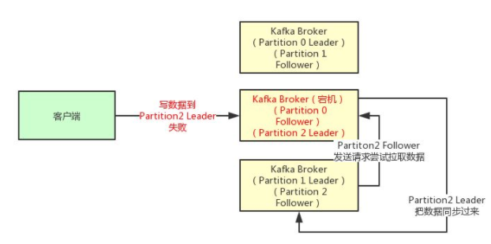
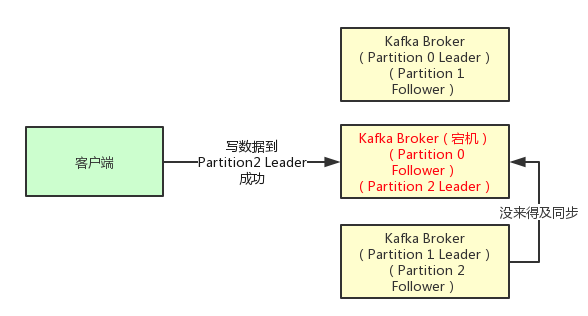
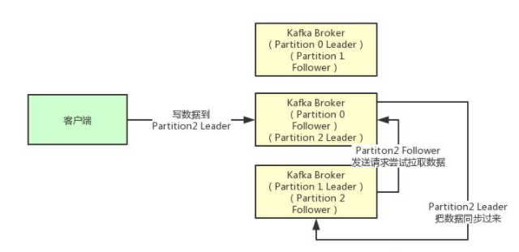
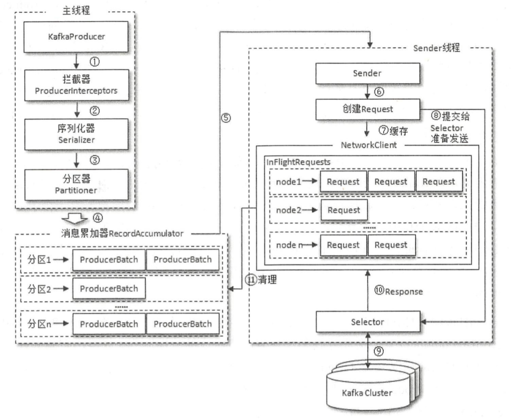
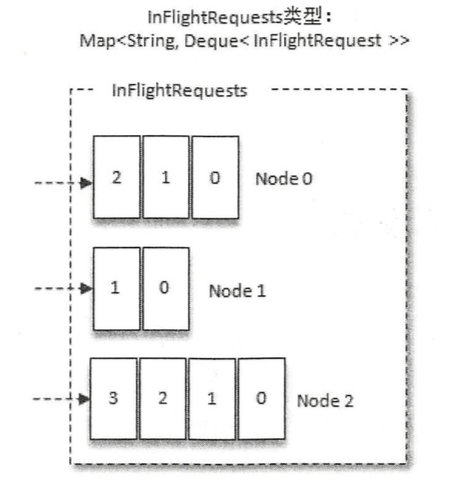

# 1、发送模式

**KafkaProducer 是线程安全的**，可以在多个线程中共享单个 KafkaProducer 实例，也可以将 KafkaProducer 实例进行池化来供其他线程调用。 

发送消息主要有三种模式 : 

## 1.1 发后即忘( fire-and-forget)

```java
	public static final String brokerList = "localhost:9092";
	public static final String topic = "first-topic";

	public static Properties initConfig() {
		Properties props = new Properties();
		props.put("bootstrap.servers", brokerList);
		props.put("key.serializer", "org.apache.kafka.common.serialization.StringSerializer");
		props.put("value.serializer", "org.apache.kafka.common.serialization.StringSerializer");
		props.put("client.id", "producer.client.id.demo");

		return props;
	}

	public static void main(String[] args) {
		Properties props = initConfig();
		KafkaProducer<String, String> producer = new KafkaProducer<>(props);
		ProducerRecord<String, String> record = new ProducerRecord<>(topic, "hello, world !");
		try {
			producer.send(record);
		} catch (Exception e) {
			e.printStackTrace();
		}
	}
```

这种发送方式只管往 Kafka 中发送消息而并不关心消息是否正确到达。在大多数情况下，这种发送方式没有什么问题 ， 不过在某些时候( 比如发生不可重试异常时）会造成消息的丢失。这种发送方式的性能最高，可靠性也最差。 

## 1.2 同步发送

KafkaProducer 的 send()方法井非是 void 类型 ， 而是 `Future<RecordMetadata>`类型 ， send() 方法有 2 个重载方法，具体定义如下 : 

```java
public Future<RecordMetadata> send(ProducerRecord<K, V> record);

public Future<RecordMetadata> send(ProducerRecord<K, V> record, Callback callback);
```

要实现同步的发送方式，可以利用返回的 Future对象实现: 

```java
Future<RecordMetadata> future = producer.send(record);
RecordMetadata metadata = future.get();
System.out.println(metadata.topic() + " - " + metadata.partition() + ": " + metadata.offset());
```

这样可以获取一个 RecordMetadata 对象，在 RecordMetadata 对象里包含了消息的 一 些元数据信息，比如当前消息的主题、分区号、分区中的偏移量( offset）、时间戳等。

同步发送的方式可 靠性高，要么消息被发送成功，要么发生异常。如果发生异常 ，则可以捕获并进行相应的处理，而不会像“发后即忘”的方式直接造成消息的丢失。不过同步发送的方式的性能会差很多，需要阻塞等待一条消息发送完之后才能发送下一条。 

## 1.3 异步发送

异步发送一般是在 send()方法里指定一个回调函数，Kafka在返回响应时调用该函数来实现异步的发送确认。有读者或许会有疑问， send()方法的返回值类型就是 Future，而 Future本身就可以用作异步的逻辑处理 。这样做不是不行，只不过 Future 里的 get()方法在何时调用，以及怎么调用都是需要面对的问题，消息不停地发送，那么诸多消息对应的 Future对象的处理难免会引起代码处理逻辑的混乱。使用 Callback的方式非常简洁明了， Kafka 有 响应时就会回调 ， 要么发送成功，要么抛出异常。异步发送方式的示例如下 : 

```java
producer.send(record, new Callback() {

  @Override
  public void onCompletion(RecordMetadata metadata, Exception exception) {
    if (exception != null) {
      exception.printStackTrace();
    } else {
      System.out.println(metadata.topic() + " - " + metadata.partition() + ": " + metadata.offset());
    }
  }

});
```

`onCompletion()`方法的两个参数是互斥的，消息发送成功时， metadata 不为 null 而 exception为 null；消息发送异常时， metadata为 null而 exception不为 null。 

对于同一个分区而言，如果消息 record1 于 record2 之前先发送， 那么 KafkaProducer就可以保证对应的 callback1 在 callback2 之前调用，也就是说，**回调函数的调用也可以保证分区有序**。 


# 2、确认模式

生产者发送消息到broker之后，如果想知道消息到底有没有投递成功，就需要broker给一个确认（acknowledge），确认的模式由acks参数控制。

如果要想理解这个acks参数的含义，首先就得搞明白kafka的高可用架构原理。

每一个Topic都可以设置它包含了几个Partition，每个Partition负责存储这个Topic一部分的数据。然后Kafka的Broker集群中，每台机器上都存储了一些Partition，也就是存放了Topic的一部分数据，这样就实现了Topic的数据分布式存储在一个Broker集群上。

但是有一个问题，万一一个Kafka Broker宕机了，此时上面存储的数据不就丢失了吗？分布式系统的数据丢失是头等问题，一旦任何一台机器宕机就会导致数据的丢失。如果去分析任何一个分布式系统的原理，比如说zookeeper、kafka、redis cluster、elasticsearch、hdfs，等等，其实内部都有自己的一套多副本冗余机制，这是现在任何一个优秀的分布式系统都要具备的功能。

在kafka集群中，每个Partition都有多个副本，其中一个副本叫做leader，其他的副本叫做follower。比如Partition0有一个副本是Leader，另外一个副本是Follower，Leader和Follower两个副本是分布在不同机器上的。这样的多副本冗余机制，可以保证任何一台机器挂掉，都不会导致数据彻底丢失，因为起码还是有副本在别的机器上的。

其实任何一个Partition，只有Leader是对外提供读写服务的。然后Leader副本接收到数据之后，Follower副本会不停的给他发送请求尝试去拉取最新的数据，拉取到自己本地后，写入磁盘中。

铺垫了那么多的东西，最后终于可以聊一下acks参数的含义了。

- acks=0

生产者发送消 息之后不需要等待任何服务端的响应 。在其他配置环境相同的情况下， acks 设置为 0 可以达 到最大的吞吐量。 



如果在消息从发送到写入 Kafka 的过程中出现某些异常，导致 Kafka 并没有收到这条消息，那么生产者也无从得知，消息也就丢失了。

- acks = 1

**默认值即为 1**。生产者发送消息之后，只要分区的 leader副本成功写入消息，那么它就会收到来自服务端的成功响应 。 如果消息无法写入 leader 副本，比如在 leader 副本崩溃、重新选举新的 leader 副本的过程中，那么生产者就会收到一个错误的响应，为了避免消息丢失，生产者可以选择重发消息 。



如果消息写入 leader 副本并返回成功响应给生产者，且在被其他 follower 副本拉取之前 leader 副本崩溃，那么此时消息还是会丢失，因为新选举的 leader 副本中并没有这条对应的消息。 acks 设置为 1，是消息可 靠性和吞吐量之 间的折中方案。 

- acks = -1 或 acks =all

生产者在消息发送之后，需要等待 ISR 中的所有副本都成功写入消息之后才能够收到来自服务端的成功响应。在其他配置环境相同的情况下， acks 设置为 -1 (all) 可以达到最强的可靠性。



但这并不意味着消息就一定可靠，因 为 ISR 中可能只有 leader 副本，这样就退化成了 acks=1 的情况。要获得更高的消息可靠性需要配合 `min.insync.replicas` 等参数的联动。  

# 3、内部实现



整个生产者客户端由两个线程协调运行，这两个线程分别为**主线程**和 **Sender线程** (发送线 程)。在主线程中由 KafkaProducer创建消息，然后通过可能的拦截器、序列化器和分区器的作用之后缓存到消息累加器( RecordAccumulator)中。 Sender 线程负责从 RecordAccumulator中获取消息并将其发送到 Kafka中。 

## 3.1 序列化器

生产者需要用序列化器(Serializer)把对象转换成字节数组才能通过网络发送给 Kafka。而 在对侧，消费者需要用反序列化器(Deserializer)把从 Kafka 中收到的字节数组转换成相应的对象。除了用于 String类型的序列化器， 还有 ByteArray、 ByteBuffer、 Bytes、 Double、 Integer、 Long这几种类 型，它们都实现了`org.apache.kafka.common.serialization.Serializer`接口。

如果 Kafka 客户端提供的几种序列化器都无法满足应用需求，则可以选择使用如 Avro、JSON、 Thrift、 ProtoBuf和 Protostuff等通用的序列化工具来实现 ， 或者使用自定义类型的序列化器来实现 。 

## 3.2 分区器

消息在通过 send()方法发往 broker 的过程 中， 有可能需要经过拦截器( Interceptor)、序列化器(Serializer)和分区器(Partitioner)的一系列作用之后才能被真正地发往 broker。拦截器 一般不是必需的，而序列化器是必需的。消息经过序列 化之后就需要确 定它发往的分区，如果消息 ProducerRecord 中指定了 partition 字段， 那么就不需要分区器的作用 ，因 为 partition 代表的就是所要发往的分区号。

如 果 消 息 ProducerRecord 中没有指定 partition 字段，那么就需要依赖分区器，根据 key 这个字段来计算 partition 的值。分区器的作用就是为消息分配分区。 

Kafka 中提供的默认分区器是 `org.apache.kafka.clients.producer.intemals.DefaultPartitioner`， 它 实现了 `org.apache.kafka.clients.producer.Partitioner`接口。 

如果 key 不为 null，那 么默认的分区器会对 key 进行哈希(采用 MurmurHash2 算法 ，具备高运算性能及低碰撞率)，最终根据得到 的哈希值来计算分区号， 拥 有相同 key 的消息会被写入同一个分区 。 如果 key 为 null，那么消息将会以轮询的方式发往主 题内的各个可用分区。 

在不改变主题分区数量的情况下 ， key 与分区之间的映射可以保持不变。不过，一旦主题中增加了分区，那么就难以保证 key 与分区之间的映射关系了。 

除了使用 Kafka 提供的默认分区器进行分区分配，还可以使用自定义的分区器，只需同DefaultPartitioner一样实现 Partitioner接口即可。 

## 3.3 拦截器

Kafka一共有两种拦截器 : 生产者拦截器和消费者拦截器。

生产者拦截器既可以用来在消息发送前做一些准备工作， 比如按照某个规则过滤不符合要求的消息、修改消息的内容等， 也可以用来在发送回调逻辑前做一些定制化的需求，比如统计类工作。 

生产者拦截器的使用也很方便，主要是自定义实现 `org.apache.kafka.clients.producer.Producerlnterceptor`接口。  

KafkaProducer在将消息序列化和计算分区之前会调用生产者拦截器的 `onSend()`方法来对消息进行相应的定制化操作。一般来说最好不要修改消息 ProducerRecord 的 topic、 key 和 partition 等信息，如果要修改，则需确保对其有准确的判断，否则会与预想的效果出现偏差。比如修改 key 不仅会影响分区的计算，同样会影响 broker 端日志压缩的功能 。 

**KafkaProducer 会在消息被应答之前或消息发送失败时调用生产者拦截器的 `onAcknowledgement()`方法，优先于用户设定的 Callback 之前执行**。这个方法运行在 Producer 的 I/O 线程中，所以这个方法中实现的代码逻辑越简单越好， 否则会影响消息的发送速度。

## 3.4 消息累加器


RecordAccumulator 主要用来缓存消息以便 Sender 线程可以批量发送，进而减少网络传输的资源消耗以提升性能 。 RecordAccumulator 缓存的大小可以通过生产者客户端参数 `buffer.memory` 配置，默认值为32M。 如果生产者发送消息的速度超过发送到服务器的速度，则会导致生产者空间不足，这个时候 KafkaProducer的 send()方法调用要么被阻塞，要么抛出异常，这个取决于参数 `max.block.ms` 的配置，此参数的默认值为 60 秒 。

在 RecordAccumulator 的内部为每个分区都维护了一个双端队列，队列中的内容是 ProducerBatch，一个ProducerBatch 中可以包含一至多个 ProducerRecord。 通俗地说， ProducerRecord 是生产者中创建的消息，而 ProducerBatch 是指一个消息批次，ProducerRecord 会被包含在 ProducerBatch 中，这样可以使字节的使用更加紧凑。与此同时，将较小的 ProducerRecord 拼凑成一个较大 的 ProducerBatch，也 可以减少网络请求的次数以提升整体的吞吐量。如果生产者客户端需要向很多分区发送消息， 则可以 将 `buffer.memory` 参数适当调大以增加整体的吞吐量 。 

## 3.5 InFlightRequests

请求在从 Sender 线程发往 Kafka 之前还会保存到 InFlightRequests 中， 它的主要作用是缓存了已经发出去但还没有收到响应的请求。与此同时， InFlightRequests 还提供了许多管理类的方法，并且还可以通过配置参数`max.in.flight.requests.per.connection`限制每个连接(也就是客户端与 Node 之间的连接)最多缓存的请求数，该参数默认值为 5，即每个连接最多只能缓存 5 个未响应的请求，超过该数值之后就不能再向这个连接发送更多的请求了，除非有缓存的请求收到了响应。

通过比较 RecordAccumulator 中队列长度与这个参数的大小，可以判断对应的 Node 中是否己经堆积了很多未响应的消息，如果真是如此，那么说明这个 Node 节点负载较大或网络连接有问题，再继续向其发送请求会增大请求超时的可能。 

通过InFlightRequests 还可以获得 **leastLoadedNode**，即所有 Node 中负载最小的那一个。这里的负载最小是通过每个 Node 在 InFlightRequests 中还未确认的请求决定的，未确认的请求越多则认为负载越大。 



图中展示了 三个节点 Node0、Node1 和 Node2，很明显 Node1 的负载最 小 。也就是说，Nodel 为当前的 leastLoadedNode。 选择 leastLoadedNode 发送请求可以使它能够尽快发出，避免因网络拥塞等异常而影响整体的进 度。 leastLoadedNode 的概念可以用于多个应用场合，比如元数据请求、消费者组播协议的交互等。

# 4、参数解析


- bootstrap.servers

**必填参数**，用来指定生产者客户端连接 Kafka 集群所需的 broker地址清单，具体的内容格式为 `hostl:portl,host2:port2`，可以设置一个或多个地址，中间以逗号隔开 。 注意这里并非需要所有的 broker 地 址，因为生产者会从给定的 broker 里查找到其他 broker 的信息 。不过建议至少要设置 两个以上的 broker 地址信息，当其中任意 一个岩机时，生产者仍然可以连接到 Kafka 集群上。 

- key.serializer 和 value.serializer:

**必填参数**，用来指定 key 和 value 序列化操作的序列化器。

- acks 

指定分区中必须要有多少个副本收到这条消息，之后生产者才会认为这条消息是成功写入的。 acks 是生产者客户端中一个非常重要的参数 ，它涉及消息的可靠性和吞吐量之间的权衡。

-  client.id

这个参数用来设定 KafkaProducer 对应的客户端 id。 如果客户端不设置， 则 KafkaProducer 会自动生成一个形如“producer-I”、“producer-2” 的字符串。

- max.request.size 

这个参数用来限制生产者客户端能发送的消息的最大值，默认值为 1048576B，即 1M。 这个参数还涉及一些其他参数 的联动，比如 broker 端的 `message.max.bytes` 参数，如果配置错误可能会引起一些不必要的异常。比如将broker端的`message.max.bytes`参数配置为 10，而`max.request.size` 参数配置为 20，那么当我们发送一条大小为 15B 的消息时，生产者客户端就会报异常。

- retries 和 retry.backoff.ms 

retries 参数用来配置生产者重试的次数，默认值为 0，即在发生异常的时候不进行任何重试动作。消息在从生产者发出到成功写入服务器之前可能发生一些临时性的异常， 比如网络抖动、 leader副本的选举等，这种异常往往是可以自行恢复的，生产者可以通过配置 retries 大于 0 的值，以此通过内部重试来恢复而不是一昧地将异常抛给生产者的应用程序。 如果重试 达到设定的次数 ，那么生产者就会放弃重试并返回异常。不过并不是所有的异常都是可以通过 重试来解决的，比如消息太大，超过 `max.request.size` 参数配置的值时，这种方式就不可行了 。 

重试还和另一个参数 `retry.backoff.ms` 有关，这个参数的默认值为 100， 它用来设定两次重试之间的时间间隔，避免无效的频繁重试。 

Kafka 可以保证同一个分区中的消息是有序的。如果生产者按照一定的顺序发送消息，那么这些消息也会顺序地写入分区，进而消费者也可以按照同样的顺序消费它们。对于某些应用 来说，顺序性非常重要，比如 MySQL 的 binlog传输，如果出现错误就会造成非常严重的后果。 如 果将 acks 参数配置为非零值，并且 `max.in.flight.requests.per.connection` 参数配置为大于 1 的值，那么就会出现错序的现象: 如果第一批次消息写入失败， 而第二批次消息 写入成功，那么生产者会重试发送第一批次的消息， 此时如果第一批次的消息写入成功，那么这两个批次的消息就出现了错序 。 一般而言，在需要保证消息顺序的场合建议把参数 `max.in.flight.requests.per.connection` 配置为 1，而不是把 acks 配置为 0， 不过这样也会影响整体的吞吐。 

- compression.type

这个参数用来指定消息的压缩方式，默认值为“ none”，即默认情况下，消息不会被压缩。该参数还可以配置为“ gzip” “snappy” 和“ lz4” 。 对消息进行压缩可以极大地减少网络传输 量、降低网络 I/O，从而提高整体的性能。消息压缩是一种使用时间换空间的优化方式，如果对时延有一定的要求，则不推荐对消息进行压缩 。 

- connections.max.idle.ms

这个参数用来指定在多久之后关闭限制的连接，默认值是 540000 (ms) ，即 9 分钟。 

- receive.buffer.bytes 

这个参数用来设置 Socket 接收消息缓冲区的大小，默认值为 32K。如果设置为-1，则使用操作系统的默认值。如果 Producer与 Kafka处于不同的机房， 则可以适地调大这个参数值 。 

- send.buffer.bytes

这个参数用来设置Socket发送消息缓冲区的大小，默认值为128K。与 receive . buffer .bytes 参数一样，如果设置为 -1，则使用操作系统的默认值。

-  request.timeout.ms 

这个参数用来配置 Producer等待请求响应的最长时间，默认值为 30000 (ms)。请求超时之后可以选择进行重试 。注意这个参数需要 比 broker 端参数 `replica.lag.time.max.ms` 的 值要大 ，这样可以减少因客户端重试而引起的消息重复的概率。 