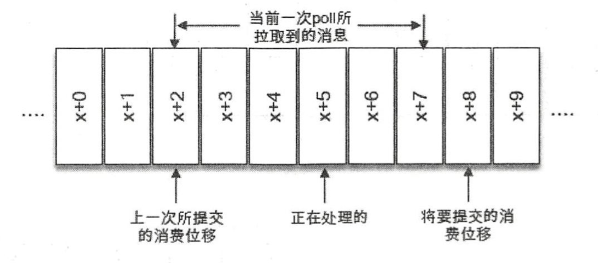
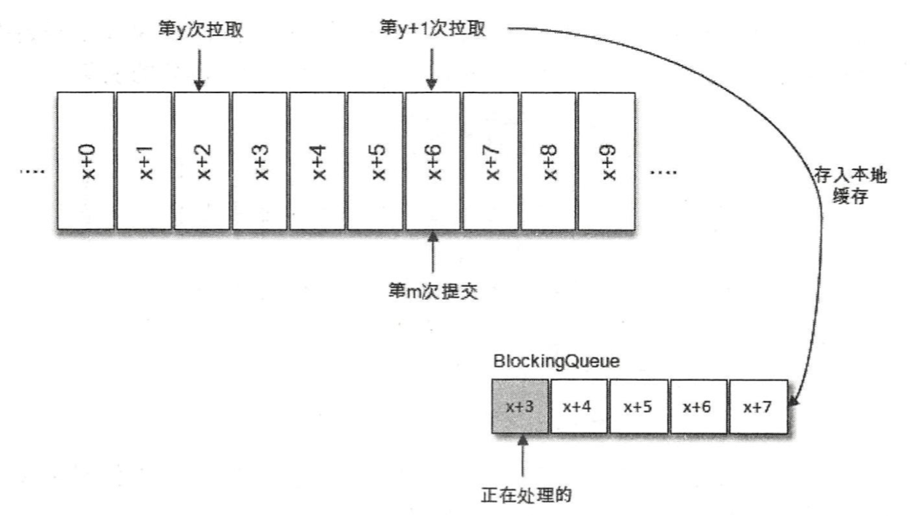
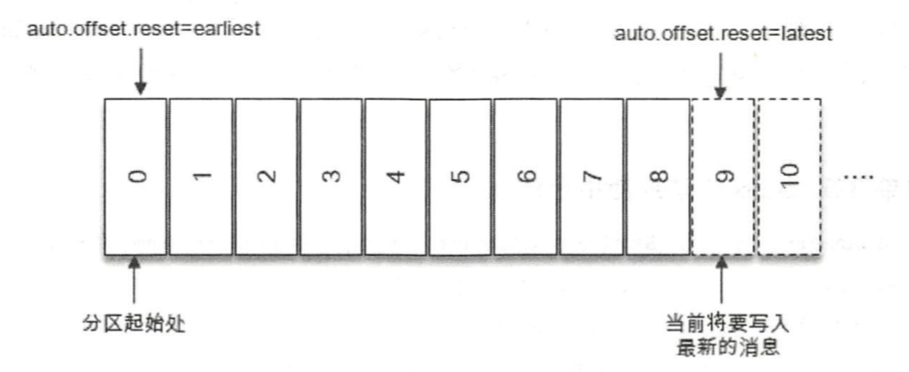

# 1、消费者组

消费者(Consumer)负责订阅 Kafka 中的主题( Topic)，并且从订阅的主题上拉取消息。 与其他一些消息中间件不同的是：在 Kafka 的消费理念中还有一层**消费组**( Consumer Group) 的概念，每个消费者都有 一个对应的消费组。当消息发布到主题后，只会被投递给订阅它的每个消费组中的一个消费者，不同消费组之间互不影响。

按照 Kafka默认的规则，每一个消费者会被分配到1个分区， 每个消费者只能消费所分配到的分区中的消息。换言之 ，**每一个分区只能被一个消费组中的一个消费者所消费** 。 消费者与消费组这种模型可以让整体的消费能力具备横向伸缩性，我们可以增加（或减少）消费者的个数来提高 （或降低）整体的消费能力 。 对于分区数固定的情况，一昧地增加消费者并不会让消费能 一直得到提升，如果消费者过多，出现了消费者的个数大于分区个数的情况， 就会有消费者分配不到任何分区。

对于消息中间件而 言，一般有两种消息投递模式:

- 点对点（P2P，Point-to-Point)模式
- 发布/订阅（ Pub/Sub）模式 

点对点模式是基于队列的，消息生产者发送消息到队列，消息消费者从队列中接收消息。发布订阅模式定义了如何向一个内容节点发布和订阅消息，这个内容节点称为主题( Topic)，主题可以认为是消息传递的中介，消息发布者将消息发布到某个 主题，而消息订阅者从主题中订阅消息。主题使得消息的订阅者和发布者互相保持独立，不需要进行接触即可保证消息的传递，发布/订阅模式在消息的一对多广播时采用。 Kafka 同时支持两种消息投递模式，而这正是得益于消费者与消费组模型的契合：

- 如果所有的消费者都隶属于同一个消费组，那么所有的消息都会被均衡地投递给每一个消费者，即每条消息只会被一个 消费者处 理，这就相当于点对点模式的应用 。 
- 如果所有的消费者都隶属于不同的消费组，那么所有的消息都会被广播给所有的消费 者，即每条消息会被所有的消费者处理，这就相当于发布/订阅模式的应用。 

消费组是一个逻辑上的概念，它将旗下的消费者归为一类 ，每一个消费者只隶属于 一个消 费组。每一个消费组都会有一个固定的名称，消费者在进行消费前需要指定其所属消费组的名称，这个可以通过消费者客户端参数 `group.id`来配置。 

消费者并非逻辑上的概念，它是实际的应用实例，它可以是一个钱程，也可以是一个进程。 同一个消费组内的消费者既可以部署在同 一 台机器上，也可以部署在不同的机器上。 

# 2、位移提交

对于 Kafka中的分区而言，它的每条消息都有唯一的 offset，用来表示消息在分区中对应的位置。 对于消费者而言，它也有一个 offset的概念，消费者使用 offset 来表示消费到分区中某个消息所在的位置。 

在每次调用 poll()方法时，它返回的是还没有被消费过的消息集，要做到这一点，就需要记录上一次消费时的消费位移 。 并且这个消费位移必须做持久化保存，而不是单单保存在内存中，否则消费者重启之后就无法知晓之前的消费位移。再考虑一种情况，当有新的消费者加入时，那么必然会有**再均衡**的动作 ， 对于同一分区而言，它可能在再均衡动作之后分配给新的消费者 ， 如果不持久化保存消费位移，那么这个新的消费者也无法知晓之前的消费位移 。 

消费位移存储在 Kafka 内 部的主题 `_consumer_offsets` 中。这里把将消费位移存储起来(持久化)的动作称为“**提交**”，消费者在消费完消息之后需要执行消费位移的提交。 

对于位移提交的具体时机的把握很有讲究，有可能会造成重复消费和消息丢失的现象 。 



上图中，当前一次 poll()操作所拉取的消息集为[x+2,x+7], x+2代表上一次提交的消费位移，说明己经完成了 x+1 之前(包括 x+1 在内)的所有消息的消费，x+S 表示当前正在处理的位置。 如果拉取到消息之后就进行了位移提 交 ，即提交了 x+8，那么当前消费 x+5 的时候遇到了异常， 在故障恢复之后，我们重新拉取的消息是从 x+8 开始的。也就是说， x+5 至 x+7 之间的消息并未能被消费，如此便发生了消息丢失的现象。 

再考虑另外一种情形，位移提交的动作是在消费完所有拉取到的消息之后才执行的，那么当消费 x+5 的时候遇到了异常，在故障恢复之后，我们重新拉取的消息是从 x+2 开始的。也就是说， x+2 至 x+4 之间的消息又重新消费了 一遍，故而又发生了重复消费的现象 。 

在 Kafka 中默认的消费位移的提交方式是自动提交，这个由消费者客户端参数 `enable.auto.commit` 配置，默认值为 true。当然这个默认的自动提交不是每消费一条消息就提交一次，而是定期提交，这个定期的周期时间由客户端参数 `auto.commit.interval.ms` 配置，默认值为 5 秒。

自动提交消费位移的方式非常简便，它免去了复杂的位移提交逻辑，让编码更简洁，但随之而来的是重复消费和消息丢失的问题。

自动提交是延时提交，重复消费可以理解，那么消息丢失又是在什么情形下会发生的呢? 



上图中，拉取线程 A 不断地拉取消息并存入本地缓存，比如在 BlockingQueue 中，另一个处理线程 B 从缓存中读取消息并进行相应的逻辑处 理。假设目前进行到了第 y+1 次拉取，以及第 m 次位移提交的时候，也就是 x+6 之前的位移已经确认提交了，处理线程 B 却还正在消费 x+3 的消息 。 此时如果处理线程 B 发生了异常，待其恢复之后会从第 m 此位移提交处，也就是 x+6 的位置开始拉取消息，那么 x+3 至 x+6 之间的消 息就没有得到相应的处理，这样便发生消息丢失的现象 。 

自动位移提交的方式在正常情况下不会发生消息丢失或重复消费的现象，但是在编程的世界里异常无可避免，与此同时，自动位移提交也无法做到精确的位移管理。故此，在 Kafka 中还提供了手动位移提交的方式。

手动提交可以细分为**同步提交**和**异步提交**，对应于 KafkaConsumer 中的 `commitSync()`和 `commitAsync()`两种类型的方法。

```java
final int minBatchSize = 200;
List<ConsumerRecord> buffer = new ArrayList<>();
while (isRunning.get()) {
  ConsumerRecords<String, String> records = consumer.poll(1000);
  for (ConsumerRecord<String, String> record : records) {
    buffer.add(record);
    if (buffer.size() >= minBatchSize) {
      // do some logical processing with buffer .
      consumer.commitSync();
      buffer.clear();
    }
  }
}
```

上面的示例中将拉取到的消息存入缓存 buffer，等到积累到足够多的时候再做相应的批量处理，之后再做批量提交。

commitSync()方法会根据 poll()方法拉取的最新位移来进行提交，只要没有发生不可恢复的错误，它就会阻塞消费者线程直至位移提交完成。 

如果在业务逻辑处理完之后，并且在同步位移提交前，程序出现了崩渍，那么待恢复之后又只能从上一次位移提交的地方拉取消息，由此在两次位移提交的窗口中出现了重复消费的现象。 如果想寻求更细粒度的、更精准的提交，那么就需要使用 commitSync() 的另一个含参方法：

```java
final int minBatchSize = 200;
List<ConsumerRecord> buffer = new ArrayList<>();
while (isRunning.get()) {
  ConsumerRecords<String, String> records = consumer.poll(1000);
  for (ConsumerRecord<String, String> record : records) {
    buffer.add(record);
    if (buffer.size() >= minBatchSize) {
      // do some logical processing with buffer .
      long offset = record.offset();
      TopicPartition partition = new TopicPartition(record.topic(), record.partition());
      consumer.commitSync(Collections.singletonMap(partition, new OffsetAndMetadata(offset + 1)));
    }
  }
}
```

在实际应用中，很少会有这种每消费一条消息就提交一次消费位移的场景。 commitSync()方法本身是同步执行的，会耗费一定的性能，而一次一提交的方式会严重拖累性能 。更多时候是按照分区的粒度划分提交位移的界限：

```java
while (isRunning.get()) {
  ConsumerRecords<String, String> records = consumer.poll(1000);
  for (TopicPartition partition : records.partitions()) {
    List<ConsumerRecord<String, String>> partitionRecords = records.records(partition);
    for (ConsumerRecord<String, String> record : partitionRecords) {
      // do some logical processing .
      long lastConsumedOffset = partitionRecords.get(partitionRecords.size() - 1).offset();
      consumer.commitSync(
        Collections.singletonMap(partition, new OffsetAndMetadata(lastConsumedOffset + 1)));
    }
  }
}
```

与 commitSync()方法相反，commitAsync()在执行的时候消费者线程不会被阻塞，可能在提交消费位移的结果还未返回之前就开始了新一次的拉取操作 。异步提交可以使消费者的性能得到一定的增强。 

```java
while (isRunning.get()) {
  ConsumerRecords<String, String> records = consumer.poll(1000);
  for (ConsumerRecord<String, String> record : records) {
    // do some logical processing.
  }

  consumer.commitAsync(new OffsetCommitCallback() {

    @Override
    public void onComplete(Map<TopicPartition, OffsetAndMetadata> offsets, Exception exception) {
      if (exception == null) {
        System.out.println(offsets);
      } else {
        log.error("fail to commit offsets");
      }
    }
  });
}
```

commitAsync()提交的时候同样会有失败的情况发生，那么我们应该怎么处理呢？最简单的方式是重试，问题的关键也在这里。 如果某一次异步提交的消费位移为 x，但是提交失败了，然后下一次又异步提交了消费位移为 x+y，这次成功了。如果这里引入了重试机制， 前一次的异步提交的消费位移在重试的时候提交成功了，那么此时的消费位移又变为了 x。如 果此时发生异常(或者再均衡) ， 那么恢复之后的消费者(或者新的消费者)就会从 x 处开始 消费消息，这样就发生了重复消费的问题。

为此我们可以设置一个递增的序号来维护异步提交的顺序，每次位移提交之后就增加序号相对应的值。在遇到位移提交失败需要重试的时候，可以检查所提交的位移和序号的值的大小， 如果前者小于后者，则说明有更大的位移已经提交了，不需要再进行本次重试；如果两者相同， 则说明可以进行重试提交。除非程序编码错误 ，否则不会出现前者大于后者的情况 。 


试想一下，当一个新的消费组建立的时候，它根本没有可以查找的消费位移，或者消费组内的一个新消费者订阅了一个新的主题，它也没有可以查找的消费位移。这时候该从哪里开始消费呢？



实际上kafka会根据消费者客户端参数`auto.offset.reset` 来决定，默认值为“ latest”，表示从分区末尾开始消费消息。按照默认的配置，消费者会从 9 开始进行消费，更加确切地说是从 9 开始拉取消息 。如果将 `auto.offset.reset` 参数配置为“ earliest”，那么消费者会从起始处，也就是 0 开始消费。 

除了查找不到消费位移，位移越界也会触发 `auto.offset.reset` 参数的执行。

# 3、消息回溯

有些时候，我们 需要一种更细粒度的掌控，可以让我们从特定的位移处开始拉取消息，而 KafkaConsumer 中的 `seek()`方法正好提供了这个功能，让我们得以回溯消费。  

```java
KafkaConsumer<String, String> consumer = new KafkaConsumer<>(props);
consumer.subscribe(Arrays.asList(topic));
Set<TopicPartition> assignment = new HashSet<>();

while (assignment.size() == 0) {// 如采不为 0，则说明已经成功分配到了分区
  consumer.poll(Duration.ofMillis(100));
  assignment = consumer.assignment(); //获取消费者分配到的分区信息
}

for (TopicPartition tp : assignment) {
  consumer.seek(tp, 10); //从每个分区offset为10的地方开始消费
}

while (true) {
  ConsumerRecords<String, String> records = consumer.poll(Duration.ofMillis(1000));
  // consume the record .
}
```

如果消费组内的消费者在启动的时候能够找到消费位移，除非发生位移越界，否 则 `auto.offset.reset` 参数并不会奏效， 此时如果想指定从开头或末尾开始消费，就需要 seek() 方法的帮助了。

```java
Set<TopicPartition> assignment = new HashSet<>();

while (assignment.size() == 0) {
  consumer.poll(Duration.ofMillis(100));
  assignment = consumer.assignment();
}

Map<TopicPartition, Long> offsets = consumer.endOffsets(assignment);
for (TopicPartition tp : assignment) {
  consumer.seek(tp, offsets.get(tp)); // 从每个分区的末尾开始消费
}

//		Map<TopicPartition, Long> offsets = consumer.beginningOffsets(assignment);
//		for (TopicPartition tp : assignment) {
//			consumer.seek(tp, offsets.get(tp)); // 从每个分区的起点开始消费
//		}
```

需要注意的是， 一个分区的起始位置起初是 0，但并不代表每时每刻都为 0， 因为日志清理的动作会清理旧的数据，所以分区的起始位置会自然而然地增加。

配合这两个方法我们就可以从分区的开头或末尾开始消费。其实 KafkaConsumer 中直接提供了 `seekToBeginning()` 方法和 `seekToEnd()`方法来实现这两个功能，这两个方法 的具体定义如下: 

```java
public void seekToBeginning(Collection<TopicPartition> partitions);

public void seekToEnd(Collection<TopicPartition> partitions);
```

有时候我们并不知道特定的消费位置，却知道一个相关的时间点，比如我们想要消费昨天 8 点之后的消息，这个需求更符合正常的思维逻辑。此时我们无法直接使用 seek()方法来追溯到相应的位置。 KafkaConsumer同样考虑到了这种情况，它提供了一个 `offsetsForTimes()`方法，通 过 timestamp 来查询与此对应的分区位置。 

```java
public Map<TopicPartition, OffsetAndTimestamp> offsetsForTimes(Map<TopicPartition, Long> timestampsToSearch);

public Map<TopicPartition, OffsetAndTimestamp> offsetsForTimes(Map<TopicPartitioη, Long> t工mestampsToSearch,
                                                               Duration timeout);
```

Kafka 中的消费位移是存储在一个内部主题 中的， 而 seek()方法可 以突破这 一限制：消费位移可以保存在任意的存储介质中，例如数据库、文件系统等。以数据 库为例，我们将消费位移保存在其中的一个表中，在下次消费的时候可以读取存储在数据表中的消费位移并通过 seek()方法指向这个具体的位置：

```java
consumer.subscribe(Arrays.asList(topic)); // 省略 poll ( )方法及 assignment 的逻辑
for (TopicPartition tp : assignment) {
  long offset = getOffsetFromDB(tp); // 从 DB 中读取消费位移 consumer.seek(tp, offset) ;
}
while (true) {
  ConsumerRecords<String, String> records = consumer.poll(Duration.ofMillis(1000));
  for (TopicPartition partition : records.partitions()) {
    List<ConsumerRecord<String, String>> partitionRecords = records.records(partition);
    for (ConsumerRecord<String, String> record : partitionRecords) {
      // process the record .
      long lastConsumedOffset = partitionRecords.get(partitionRecords.size() - 1).offset();
      // 将消费位移存储在 DB 中
      storeOffsetToDB(partition, lastConsumedOffset + 1);
    }
  }
}
```

seek()方法为我们提供从特定位置读取消息的能力，我们可以通过这个方法来向前跳过若 干消息，也可以通过这个方法来 向后回溯若干消息，这样为消息的消费提供了很大的灵活性。 seek()方法也为我们提供了将消费位移保存在外部存储介质中的能力，还可以配合再均衡监听器 来提供更加精准的消费能力。 

# 4、再均衡

再均衡是指分区的所属权从一个消费者转移到另一消费者的行为，它为消费组具备高可用性和伸缩性提供保障，使我们可以既方便又安全地删除消费组内的消费者或往消费组内添加消费者。

不过**在再均衡发生期间，消费组内的消费者是无法读取消息的**。 也就是说，在再均衡发 生期间的这一小段时间内，消费组会变得不可用 。

另外，当 一个分区被重新分配给另一个消费者时，消费者当前的状态也会丢失。比如消费者消费完某个分区中的一部分消息时还没有来得及提交消费位移就发生了再均衡操作 ， 之后这个分区又被分配给了消费组内的另一个消费者， 原来被消费完的那部分消息又被重新消费一遍，也就是发生了重复消费。 

kafka提供了再均衡监听器接口，用来设定发生再 均衡动作前后的一些准备或收尾的动作。  

```java
Map<TopicPartition, OffsetAndMetadata> currentOffsets = new HashMap<>();
consumer.subscribe(Arrays.asList(topic), new ConsumerRebalanceListener() {
  @Override
  public void onPartitionsRevoked(Collection<TopicPartition> partitions) {
    //这个方法会在再均衡开始之前和消费者停止读取消息之后被调用
    consumer.commitSync(currentOffsets);
    currentOffsets.clear();
  }

  @Override
  public void onPartitionsAssigned(Collection<TopicPartition> partitions) {
    //这个方法会在重新分配分区之后和消费者开始读取消费之前被调用
    // do nothing.
  }
});

try {
  while (isRunning.get()) {
    ConsumerRecords<String, String> records = consumer.poll(Duration.ofMillis(100));
    for (ConsumerRecord<String, String> record : records) {
      // process the record .
      currentOffsets.put(new TopicPartition(record.topic(), record.partition()),
                         new OffsetAndMetadata(record.offset() + 1));
      consumer.commitAsync(currentOffsets, null);
    }
  }
} finally {
  consumer.close();
}
```

上面的代码将消费位移暂存到一个局部变量 currentOffsets 中，这样在正常消费的时候 可以通过 commitAsync()方法来异步提交消费位移，在发生再均衡动作之前可以通过再均衡监听 器的 onPartitionsRevoked()回调执行 commitSync()方法同步提交消费位移，以尽量避免一些不 要的重复消费。 

# 5、消费者拦截器

kafka中不仅对生产者配备了拦截器，消费者也有相应的拦截器的概念。消费者拦截器主要在消费到消息或在提交消费位移时进行一些定制化的操作。 

下面使用消费者拦截器来实现一个简单的消息 TTL（Time to Live，即过期时）的功能：

```java
public class ConsumerinterceptorTTL implements ConsumerInterceptor<String, String> {

	private static final long EXPIRE_INTERVAL = 10 * 1000;

	@Override
	public void configure(Map<String, ?> arg0) {

	}

	@Override
	public void close() {

	}

	@Override
	public void onCommit(Map<TopicPartition, OffsetAndMetadata> offsets) {
		//该方法会在会在提交完消费位移之后调用，可以使用这个方法来记录跟踪所提交的位移信息
		offsets.forEach((tp, offset) -> System.out.println(tp + ": " + offset.offset()));

	}

	@Override
	public ConsumerRecords<String, String> onConsume(ConsumerRecords<String, String> records) {
		//该方法会在 poll()方法返回之前调用，可以对消息进行相应的定制化操作，比如修改返回的消息内容、按照某种规则过滤消息(可能会减少 poll()方法返回的消息的个数
		//如果 onConsume()方法中抛出异常，那么会被捕获并记录到日志中，但是异常不会再向上传递。
		long now = System.currentTimeMillis();
		Map<TopicPartition, List<ConsumerRecord<String, String>>> newRecords = new HashMap<>();
		for (TopicPartition tp : records.partitions()) {
			List<ConsumerRecord<String, String>> tpRecords = records.records(tp);
			List<ConsumerRecord<String, String>> newTpRecords = new ArrayList<>();
			for (ConsumerRecord<String, String> record : tpRecords) {
				if (now - record.timestamp() < EXPIRE_INTERVAL) {
					newTpRecords.add(record);
					if (!newTpRecords.isEmpty()) {
						newRecords.put(tp, newTpRecords);
					}

				}
			}
		}

		return new ConsumerRecords<>(newRecords);
	}

}
```

不过使用这种功能时需要注意的是 : 在使用带参数的位移提交时，有可能提交了错误的位移信息，因为可能含有最大偏移量的消息会被消费者拦截器过滤 。 

# 6、线程安全

**KatkaProducer 是线程安全的，然而 KafkaConsumer 却是非线程安全的** 。 

KafkaConsumer 中定义了一个 acquire()方法 ，用来检测当前是否只有一个线程在操作：

```java
	private final AtomicLong currentThread = new Atom工cLong(NO_CURRENT_THREAD); // KafkaConsumer 中的成员变量

	private void acquire() {
		long threadid = Thread.currentThread().getid();
		if (threadid != currentThread.get() && !currentThread.compareAndSet(NO_CURRENT_THREAD, threadid))
			throw new ConcurrentModificationException("KafkaConsumer is not safe for multi- threaded access ");
		refcount.incrementAndGet();
	}
```

acquire()方法和我们通常所说的锁(synchronized、 Lock等) 不同，它不会造成阻塞等待， 我们可以将其看作一个轻量级锁，它仅通过线程操作计数标记的方式来检测线程是否发生了并发操作，以此保证只有一个线程在操作。 acquire()方法和 release()方法成对出现，表示相应的加锁和解锁操作。 release()方法也很简单， 具体定义如下 : 

```java
	private void release() {
		if (refcount.decrementAndGet() == 0)
			currentThread.set(NO_CURRENT_THREAD);
	}
```

# 7、分区分配策略

Kafka 提供了消费者客户端参数 `partition.assignment.strategy` 来设 置消费者与订阅主题之间的分区分配策略。默认情况下，此参数的值为 `org.apache.kafka.clients.consumer.RangeAssignor`，即采用 RangeAssignor分配策略。除此之外， Kafka还提供了另 外两种分配策略: RoundRobinAssignor 和 StickyAssignor。  

RangeAssignor 分配策略的原理是按照消费者总数和分区总数进行整除运算来获得一个跨度，然后将分区按照跨度进行平均分配， 以保证分区尽可能均匀地分配 给所 有的消费者 。 对于每一个主题 ， RangeAssignor 策略会将消费组内所有订阅这个主题的消费者按照名称的字典序排序 ， 然后为每个消费者划分固定的分区范围，如果不够平均分配，那么字典序靠前的消费者会被多分配一个分区。 

假设 n=分区数/消费者数量， m=分区数%消费者数量，那么前 m 个消费者每个分配 n+l 个 分区，后面的(消费者数量-m)个消费者每个分配 n个分区。 

假设消费组内有 2个消费者 C0和 C1，都订阅了主题 t0和 t1，并且每个主题都有4个分区， 那么订阅的所有分区可以标识为 : t0p0、 t0p1、 t0p2、 t0p3、 t1p0、 t1p1、 t1p2、 t1p3。最终的分配结果为 : 

- 消费者 C0：t0p0、 t0p1、 t1p1、 t1p1 
- 消货者 C1：t0p2、 t0p3、 t1p2、 t1p3 

这样分配得很均匀，那么这个分配策略能够一直保持这种良好的特性吗？我们不妨再来看另一种情况。假设上面例子中 2个主题都只有 3个分区，那么订阅的所有分区可以标识为: t0p0、 t0p1、 t0p2、 t1p0、 t1p1、 t1p2。最终的分配结果为 : 

- 消费者 C0：t0p0、 t0p1、t1p0、 t1p1 
- 消费者 C1：t0p2、 t1p2 

可以明显地看到这样的分配并不均匀，如果将类似的情形扩大， 则有可能出现部分消费者过载的情况。

对此我们再来看另一种 RoundRobinAssignor策略的分配效果如何。 

RoundRobinAssignor 分配策略的原理是将消费组内所有消费者及消费者订阅的所有主题的分区按照字典序 排序，然后通过轮询方式逐个将分区依次分配给每个消费者。 

如果同一个消费组内所有的消费者的订阅信息都是相同的，那么 RoundRobinAssignor分配策略的分区分配会是均匀的。举个例子，假设消费组中有 2 个消费者 C0 和 C1，都订阅了主题 t0 和 t1，并且每个主题都有 3 个分区 ， 那么订阅的所有分区可以标识为: t0p0、 t0p1、 t0p2、 t1p0、 t1p1、 t1p2。最终的分配结果为 : 

- 消费者 C0：t0p0、 t0p2、t1p1 
- 消费者 C1：t0p1、t1p0、 t1p2 

如果同一个消费组内的消费者订阅的信息是不相同的，那么在执行分区分配的时候就不是完全的轮询分配，有可能导致分区分配得不均匀。如果某个消费者没有订阅消费组内的某个主 题，那么在分配分区的时候此消费者将分配不到这个主题的任何分区。 

举个例子，假设消费组内有 3个消费者，它们共订阅了 3个主题，这 3个主题分别有 l、 2、 3个分区，即整个消费组订阅了 t0p0、 t1p0、 t1p1、 t2p0、 t2p1、 t2p2这6个分区。 具体而言，消费者C0订阅的是主题t0，消费者C1订阅的是主题t0和t1。消费者 C2 订阅的是主题 t0、 t1 和 t2， 那么最终的分配结果为 : 

- 消费者C0：t0p0
- 消费者C1：t1p0
- 消费者C2：t1p1、t2p0、t2p1、t2p2

可以看到 RoundRobinAssignor策略也不是十分完美，这样分配其实并不是最优解，因为完全可以将分区 t1p1 分配给消费者 C1。 


再来看一下 StickyAssignor分配策略，它主要有两个目的：

- 分区的分配要尽可能均匀
- 分区的分配尽可能与上次分配的保持相同 

假设消费组内有3个消费者，它们都订阅了4个主题，并且每个主题有 2 个分区 。 也就是说，整个消费组订阅了 t0p0、 t0p1、 t1p0、 t1p1、 t2p0、 t2p1、 t3p0、 t3p1这8个分区。 最终的分配结果如下: 

- 消费者 C0：t0p0、t1p1、t3p0
- 消费者 C1：t0p1、t2p0、t3p1
- 消费者 C2：t1p0、t2p1

这样初看上去似乎与采用 RoundRobinAssignor分配策略所分配的结果相同，但事实是否真的如此呢？再假设此时消费者 Cl 脱离了消费组，那么消费组就会执行再均衡操作，进而消费分区会重新分配。如果采用 RoundRobinAssignor分配策略，那么此时的分配结果如下: 

- 消费者 C0：t0p0、 t1p0、 t2p0、t3p0 
- 消费者 C2：t0p1、 t1p1、 t2p1、t3p1

RoundRobinAssignor分配策略会按照消费者 C0和 C2进行重新轮询分配。 如果此时使用的是 StickyAssignor 分配策略，那么分配结果为: 

- 消费者 C0：t0p0、 t1p1、t3p0、t2p0 
- 消费者 C2：t1p0、 t2p1、t0p1、t3p1 

可以看到分配结果中保留了上一次分配中对消费者 C0和 C2 的所有分配结果，并将原来消 费者 C1 的负担分配给了剩余的两个消费者 C0 和 C2， 最终 C0 和 C2 的分配还保持了均衡 。 

如果发生分区重分配，那么对于同一个分区而言，有可能之前的消费者和新指派的消费者不是同一个，之前消费者进行到 一半的处理还要在新指派的消费者中再次复现一遍，这显然很浪费系统资源。 StickyAssignor 分配策略如同其名称中的“ sticky” 一样，让分配策略具备一定 的“粘性”，尽可能地让前后两次分配相同，进而减少系统资源的损耗及其他异常情况的发生 。 

# 8、参数解析

- fetch.min.bytes 

该参数用来配置 Consumer 在一次拉取请求中能从 Kafka 中拉取的最小数据量。Kafka在收到 Consumer 的拉取请求时，如果返回给 Consumer 的数 据量小于这个参数所配置的值，那么它就需要进行等待，直到数据量满足这个参数的配置大小。 可以适当调大这个参数的值以提高一定的吞吐量，不过也会造成额外的延迟，对于延迟敏感的应用可能就不可取了。 

- fetch.max.bytes 

用来配置 Consumer在一次拉取请求中从 Kafka 中拉取的最大数据量，默认值为 50MB。该参数设定的不是绝对的最大值 ，如果在第一个非空分区中拉取的第一条消息大于该值， 那么该消息将仍然返回，以确保消费者继续工作。 

- fetch.max.wait.ms 

这个参数和 `fetch.min.bytes` 参数有关，如果 Kafka 仅仅参考 `fetch.min.bytes` 参数的要求，那么有可能会一直阻塞等待而无法发送响应给 Consumer， 显然这是不合理的 。 `fetch.max.wait.ms` 参数用于指定 Kafka 的等待时间，默认值为 500 (ms)。 这个参数的设定和 Consumer 与 Kafka 之 间的延迟也有关系， 如果业务应用对延迟敏感，那么可以适 当调小这个参数 。 

- max.partition.fetch.bytes

这个参数用来配置从每个分区里返回给 Consumer的最大数据量 ，默认值为1M。。 

- max.poll.records

这个参数用来配置 Consumer 在 一 次拉取请求中拉取的最大消息数，默认值为 500 (条)。如果消息的大小都比较小，则可以适当调大这个参数值来提升一定的消费速度。 

- connections.max.idle.ms 

这个参数用来指定在多久之后关闭限制的连接，默认 9 分钟。 

- exclude.internal.topics 

Kafka 中有两个内部的主题：`_consumer_offsets` 和 `_transaction_state`， `exclude.internal.topics` 用来指定 Kafka 中的内部主题是否可以向消费者公开，默认值为 true。如果设置为 true，那么只 能使用 subscribe(Collection)的方式而不能使用 subscribe(Pattern)的方式来订阅内部主题，设置为 false 则没有这个限制。 

- receive.buffer.bytes 

这个参数用来设置 Socket 接收消息缓冲区的大小，默认为64M。如果设置为 -1，则使用操作系统的默认值。如果Consumer与Kafka处于不同的机房， 则可以适当调大这个参数值。 

- send.buffer.bytes

 这个参数用来设置 Socket发送消息缓冲区，默认值为 128M 。如果设置为 -1，则使用操作系统的默认值。

-  request.timeout.ms 

这个参数用来配置 Consumer 等待请求响应的最长时间，默认值为 30000 (ms)。

- isolation.level 

这个参数用来配置消费者的事务隔离级别。字符串类型，有效值为“read uncommitted和 “ read committed"，表示消费者所消费到的位置，如果设置为“ read committed”，那么消费者就会忽略事务未提交的消息，默认情况下为 “read_uncommitted”，即可以消费到 HW (High Watermark)处的位置。


