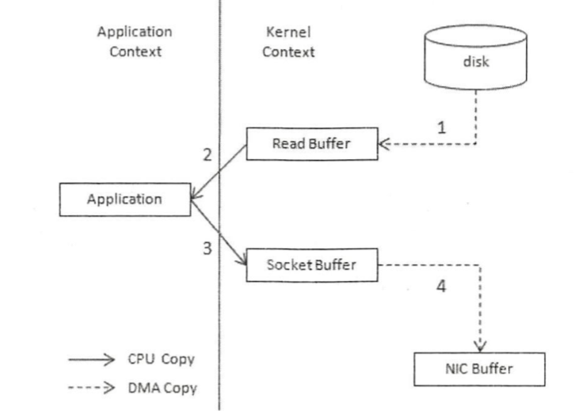
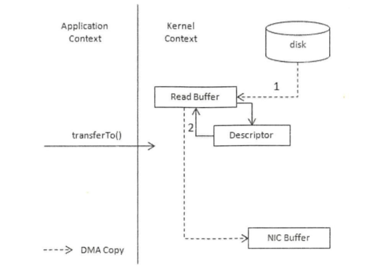
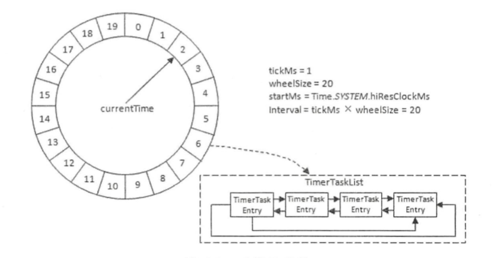
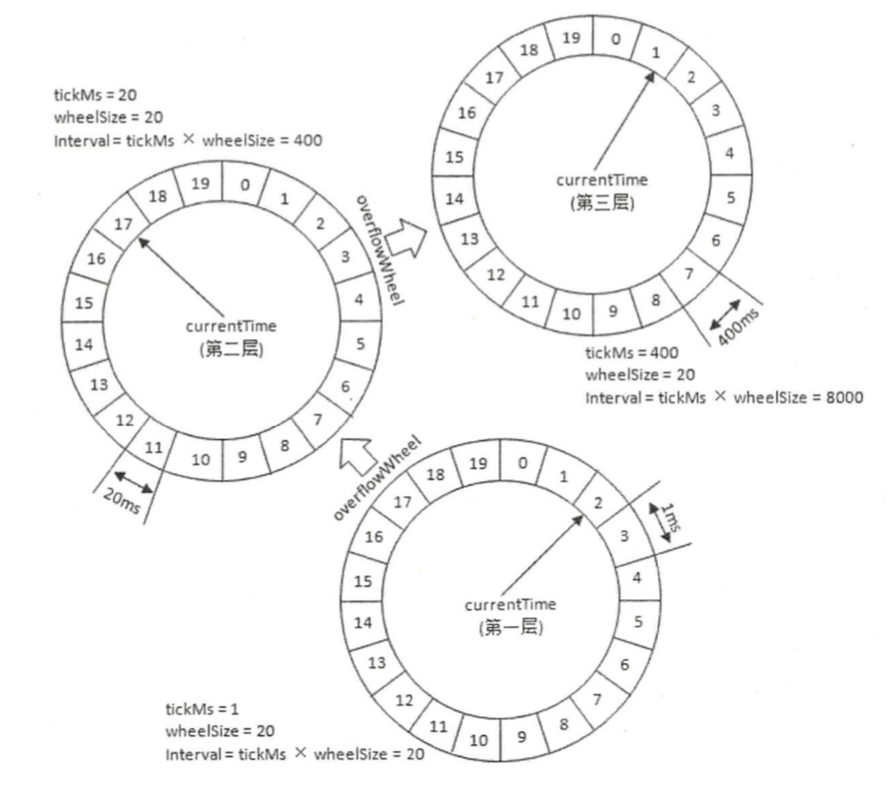

# 1、安装与配置

## 1.1 安装

kafka依赖于ZooKeeper，如果以单机模式调试kafka，需要确保本机已经安装了ZooKeeper，并处于启动状态。

Kafka安装很简单，不再赘述。

`$KAFKA_HOME/bin`目录下有很多预设的脚本，借此可以测试、管理Kafka：

```shell
connect-distributed.sh              kafka-producer-perf-test.sh
connect-mirror-maker.sh             kafka-reassign-partitions.sh
connect-standalone.sh               kafka-replica-verification.sh
kafka-acls.sh                       kafka-run-class.sh
kafka-broker-api-versions.sh        kafka-server-start.sh
kafka-configs.sh                    kafka-server-stop.sh
kafka-console-consumer.sh           kafka-streams-application-reset.sh
kafka-console-producer.sh           kafka-topics.sh
kafka-consumer-groups.sh            kafka-verifiable-consumer.sh
kafka-consumer-perf-test.sh         kafka-verifiable-producer.sh
kafka-delegation-tokens.sh          trogdor.sh
kafka-delete-records.sh							kafka-dump-log.sh                   
zookeeper-security-migration.sh			zookeeper-server-start.sh
kafka-leader-election.sh            zookeeper-server-stop.sh
kafka-log-dirs.sh                   kafka-preferred-replica-election.sh
kafka-mirror-maker.sh               zookeeper-shell.sh
```

比如，`kafka-server-start.sh`用于启动Kafka，`kafka-server-stop.sh`用于停止Kafka等，大多可以通过脚本的名字猜到其作用。

启动 Kafka服务的方式比较简单，在`$KAFKA_HOME/bin`目录执行下面的命令即可: 

`./bin/kafka-server-start.sh ../config/server.properties `

第二个参数指定的是broker 的配置文件，主要关注下面几个参数 : 

```properties
# broker的编号，如果集群中有多个 broker，则每个 broker 的编号需要设置的不同 
broker.id=0

# broker 对外提供的服务入口地址
listeners=PLAINTEXT://localhost:9092 

# Kafka 所需的 ZooKeeper 集群地址
zookeeper.connect=localhost:2181/kafka 
```

如果是单机模式，那么修改完上述配置参数之后就可以启动服务。通过 jps 命令查看 Kafka服务进程是否已经启动  : 

```shell
$ jps -l
91825 kafka.Kafka  ## 这个是Kafka的进程
7190 org.apache.zookeeper.server.quorum.QuorumPeerMain ## 这个是ZooKeeper
```

然后通过`kafka-topics.sh` 脚本创建一个分区数为3，副本为1的主题：

```shell
./kafka-topics.sh --zookeeper localhost:2181/kafka --create --topic first-topic --replication-factor 1 --partitions 3

Created topic "first-topic".
```

其中`--zookeeper`指定了 Kafka所连接的 ZooKeeper服务地址，`--topic`指定了所要创 建主题的名称， `--replication-factor` 指定了副本因子， `--partitions` 指定了分区个 数`--create` 是创建主题的动作指令。

还可以通过`--describe`展示主题的更多具体信息， 示例如下:

```shell
./kafka-topics.sh --zookeeper localhost:2181/kafka --describe -topic first-topic

Topic: first-topic	PartitionCount: 3	ReplicationFactor: 1	Configs:
	Topic: first-topic	Partition: 0	Leader: 0	Replicas: 0	Isr: 0
	Topic: first-topic	Partition: 1	Leader: 0	Replicas: 0	Isr: 0
	Topic: first-topic	Partition: 2	Leader: 0	Replicas: 0	Isr: 0
```

借助脚本 `kafka-console-producer.sh` 和 `kafka-console­ consumer.sh` 可以通过控制台收发消息。首先我们打开一个 shell终端，通过 `kafka-console-consumer.sh` 脚本来订阅 主题 first-topic:

```shell
./kafka-console-consumer.sh --bootstrap-server localhost:9092 --topic first-topic
```

其中`--bootstrap-server` 指定了连接的 Kafka集群地址，`--topic`指定了消费者订阅 的主题 。 

再打开一个 shell终端，然后使用 `kafka-console-producer.sh`脚本发送一条消息至主题 first-topic:

```shell
./kafka-console-producer.sh --broker-list localhost:9092 --topic first-topic
>hello world !
>
```

其中 `--broker-list` 指定了连接的 Kafka集群地址， `--topic` 指定了发送消息时的主题。 示例中的第二行是通过人工键入的方式输入的，按下回车键后会跳到第三行，即“>”字符处。 此时原先执行 `kafka-console-consumer.sh`脚本的 shell终端中出现了刚刚输入的消息:

```shell
./kafka-console-consumer.sh --bootstrap-server localhost:9092 --topic first-topic
hello world !
```

## 1.2 配置参数

- zookeeper.connect

该参数指 明 broker 要连接的 ZooKeeper集群的服务地址(包含端口号)，**没有默认值，且此参数为必填项**。如果 ZooKeeper集群中有多个节点，则可以用逗号将每个节点隔开，类似于` localhost1:2181,localhost2:2181,localhost3:2181` 这种格式。最佳的实践方式是再加一个chroot路径，类似于 `localhost1:2181,localhost2:2181,localhost3:2181/kafka` ，这样既可以明确指明该 chroot路径下的节点是为 Kafka 所用的， 也可以 实现多个 Kafka 集群复用一套 ZooKeeper 集群，可以节省更多的硬件资源。如果不指定 chroot，那么默认使用 ZooKeeper 的根路径。 

- listeners

该参数指明 broker监听客户端连接的地址列表，即为客户端要连接 broker 的入口地址列表， 配置格式为 `protocoll : //hostnamel:portl,protocol2://hostname2:port2`，其 中 protocol 代表协议类型， Kafka 当前支持的协议类型有 **PLAINTEXT**、 **SSL**、 **SASL_SSL** 等， 如果未开启安全认证，则使用简单的 PLAINTEXT 即可。 hostname 代表主机名， port代表服务端口，此参数的默认值为 null。比如此参数配置为 `PLAINTEXT://198.162.0.2:9092`，如果有多个地址，则中间以逗号隔开。与此参数关联的还有 `advertised.listeners`， 作用和 listeners 类似，默认值也为 null。不过 `advertised.listeners` 主要用于 IaaS (Infrastructure as a Service)环境，比如公有云上的机器通常配备有多块网卡 ，即包含私网网卡和公网网卡，对于 这种情况而言，可以设置 advertised.listeners 参数绑定公网 IP 供外部客户端使用，而 配置 listeners 参数来绑定私网 IP 地址供 broker 间通信使用 。 

- broker.id 

broker 在启动之前必须设定的参数之一，在 Kafka 集群 中 ，每个 broker 都有唯一的 id 值用来区分彼此。 broker 在启动时会在 ZooKeeper 中的 /brokers/ids 路径下创建一个以当前 brokerId为名称的虚节点， broker 的健康状态检查就依赖于此虚节点。当 broker 下线时，该虚节点会自动删除，其他 broker 节点或客户端通过判断 /brokers/ids 路径下是否有此 broker 的 brokerld 节点来确定该 broker 的健康状态。  

- log.dir & log.dirs 

Kafka 把所有的消息都保存在磁盘上，而这两个参数用来配置 Kafka 日志文件存放的根目录。一般情况下， `log.dir` 用来配置单个根目录，而 `log.dirs` 用来配置多个根目录(以逗号分隔〉，`log.dirs` 的优先级比 `log.dir` 高。 

- message.max.bytes

该参数用来指定 broker所能接收消息的最大值，默认值为 1000012 (B)，约等于 976.6KB。 如果 Producer 发送的消息大于这个参数所设置的值，那么( Producer ）就会报异常。如果需要修改这个参数，那么还要考虑 `max.request.size`
(客户端参数)、 `max.message.bytes` (topic端参数)等参数的影响。为了避免修改此参数 而引起级联的影响，建议在修改此参数之前考虑分拆消息的可行性。

# 2、日志

Kafka 将消息存储在磁盘中，为了控制磁盘占用空间的不断增加就需要对消息做一定的清理操作。 Kafka 中每一个分区副本都对应一个 Log，而 Log 又可以分为多个日志分段，这样也便于日志的清理操作。 

Kafka 提供了两种日志清理策略：

- 日志删除( Log Retention)：按照一定的保留策略直接删除不符合条件的日志分段
- 日志压缩( Log Compaction)：针对每个消息的 key 进行整合，对于有相同 key 的不同 value 值，只保留最后一个版本

我们可以通过 broker 端参数 `log.cleanup.policy` 来设置日志清理策略， 此参数的默认 值为“ delete”，即采用日志删除的清理策略 。 如果要采用日志压缩的清理策略，就需要设置为“compact”，并且还需要将 `log.cleaner.enable` (默认值 为 true)设定为 true。 通过将 `log.cleanup.policy` 参数设置为 “delete,compact”，还可以同时支持日志删除和日志压缩两种策略 。 日志清理的粒度可以控制到主题级别，比如与 `log.cleanup.policy` 对应的主题级别的参数为`cleanup.policy`。 

## 2.1 日志删除

在 Kafka 的日志、管理器中会有一个专门的日志删除任务来周期性地检测和删除不符合保留条件的 日志分段文件，这个周期可以通过 broker端参数 `log.retention.check.interval.ms`来配置，默认值为 5 分钟。当前日志分段的保留策略有 3 种 : 

- 基于时间的保留策略 

日志删除任务会检查当前日志文件中是否有保留时间超过设定的阈值来寻找可删除的日志分段文件集合。查找过期的日志分段文件，并不是简单地根据日志分段的最近修改时间 lastModifiedTime 来计算的， 而是根据日志分段中最大的时间戳 largestTimeStamp 来计算的。因为日志分段的 lastModifiedTime可以被有意或无意地修改，比如执行了 touch操作，或者分区副本进行了重新 分配， lastModifiedTime 并不能真实地反映出日志分段在磁盘的保留时间 。 

- 基于 志大小的保留策略

日志删除任务会检查当前日志的大小是否超过设定的阈值来寻找可删除的日志分段的文件集合。基于日志大小的保留策略与基于时间的保留策略类似，首先计算日志文件的总大小 size和 retentionSize 的差值 di筐，即计算需要删除的日志总大小，然后从日志文件中的第一个日志分段 开始进行查找可删除的日志分段的文件集合 deletableSegments 。

- 基于日志起始偏移量的保留策略

基于日志起始偏移量的保留策略的判断依据是某日志分段的下一个日志分段的起始偏移量 baseOffset 是否小于等于 logStartOffset，若是，则可以删除此日志分段。

## 2.2 日志压缩 

日志压缩执行前后，日志分段中的每条消息的偏移量和写入时的偏移量保持一致。 Log Compaction会生成新的日志分段文件，日志分段中每条消息的物理位置会重新按照新文件来组织。 Log Compaction 执行过后的偏移 量不再是连续的，不过这并不影响日志的查询 。 

Kafka 中的 Log Compaction 可以类比于 Redis 中的 RDB 的持久化模式 。 试想一下，如果一 个系统使用 Kafka 来保存状态，那么每次有状态变更都会将其写入 Kafka。 在某一时刻此系统 异常崩溃，进而在恢复时通过读取 Kafka 中的消息来恢复其应有的状态，那么此系统关心的是它原本的最新状态而不是历史时刻中的每 一个状态 。 如果 Kafka 的日志保存策略是日志删除 ，那么系统势必要一股脑地读取 Kafka 中的所有数据来进行恢复，如果日志保 存策略是 Log Compaction，那么可以减少数据的加载 量 进而加快系统的恢复速度。 Log Compaction 在某些应用场景下可以简化技术找，提高系统整体的质量 。 

## 2.3 页缓存

Kafka 在设计时采用了文件追加的方式来写入消息，即只能在日志文件的尾部追加新的消息，井且也不允许修改己写入的消息，这种方式属于典型的顺序写盘的操作，所以就算 Kafka 使用磁盘作为存储介质，它所能承载的吞吐量也不容小觑。 

页缓存是操作系统实现的一种主要的磁盘缓存，以此用来减少对磁盘 I/O 的操作。具体来说，就是把磁盘中的数据缓存到内存能上的差异，现代操作系统越来越“激进地”将内存作为磁盘缓存，甚至会非常乐意将所有可用的内存用作磁盘缓存，这样当内存回收时也几乎没有性能损失，所有对于磁盘的读写 也 将经由统一的缓存 。 

当一个进程准备读取磁盘上的文件内容时，操作系统会先查看待读取的数据所在的页是否在页缓存中，如果存在(命中〉 则直接返回数据，从而避免了对物 理磁盘的 I/O 操作；如果没有命中，则操作系统会向磁盘发起读取请求并将读取的数据页存入页缓存，之后再将数据返回给进程 。 同样，如果一个进程需要将数据写入磁盘 ，那么操作系统也会检测数据对应的页是否在页缓存中，如果不存在， 则会先在页缓存中添加相应的页 ，最后 将数据写入对应的页 。被修改过后的页也就变成了脏页，操作系统会在合适的时间把脏页中的数据写入磁盘，以保持数据的 一致性 。 

一个进程而言，它会在进程内部缓存处理所需的数据，然而这些数据有可能还缓存在操作系统的页缓存中，因此同一份数据有可能被缓存了两次。井且 ， 除非使用 Direct I/O 的方式， 否则页缓存很难被禁止 。 此外，用过 Java 的人一般都知道两点事实：对象的内存开销非常大， 通常会是真实数据大小的几倍甚至更多 ，空间使用率低下: Java 的垃圾回收会随着堆内数据的增多而变得越来越慢 。基于这些因素，使用文件系统并依赖于页缓存的做法明显要优于维护一个进程内缓存或其他结构，至少我们可以省去了一份进程内部的缓存消耗，同时还可以通过结构紧凑的字节码来替代使用对象的方式以节省更多的空间 。 

Kafka 中大量使用了页缓存 ，这是 Kafka 实现高吞吐的重要因素之 一。 虽然消息都是先被写入页缓存，然后由操作系统负责具体的刷盘任务的，但在 Kafka 中同样提供了同 步刷盘及间断性强制刷盘( fsync)的功能，这些功能可以通过 `log.flush.interval.messages`、` log.flush .interval .ms` 等参数来控制。同步刷盘可以提高消息的可靠性，防止由于机器 掉电等异常造成处于页缓存而没有及时写入磁盘的消息丢失。不过刷盘任务就应交由操作系统去调配，消息的可靠性应该由多副本机制来保障，而不是由同步刷盘这种严重影响性能的行为来保障 。 

## 2.4 零拷贝

除了消息顺序追加、页缓存等技术， Kafka 还使用**零拷贝** (Zero-Copy)技术来进一步提升 性能 。 所谓的零拷贝是指将数据直接从磁盘文件复制到网卡设备中，而不需要经由应用程序之手 。零拷贝大大提高了应用程序的性能，减少了内核和用户模式之间的上下文切换 。 对 Linux 操作系统而言，零拷贝技术依赖于底层的 `sendfile()`方法实现 。 对应于 Java 语言， `FileChannal.transferTo()`方法的底层实现就是 `sendfile()`方法。 

考虑这样一种常用的情 形：你需要将静态内容(类似图片、文件)展示给用户 。 这个情形就意味着需要先将静态内容从磁盘中复制出来放到一个内存 buf中，然后将这个 buf通过套接字( Socket)传输给用户，进 而用户获得静态内容 。 这看起来再正常不过了，但实际上这是很低效的流程 ，我们把上面的这种情形抽象成下面的过程 : 



- 调用 read()时，文件 A 中的内容被复制到了 内核模式下的 ReadBuffer中 
- CPU 控制将内核模式数据复制到用户模式下
- 调用 write()时，将用户模式下的 内容复制到内核模式下的 Socket Buffer 中 
- 将内核模式下的 SocketBuffer的数据复制到网卡设备中传迭

从上面的过程可以看出，数据平白无故地从内核模式到用户模式“走了一圈”，浪费了 2 次复制过程：第一次是从内核模式复制到用户模式；第二次是从用户模式再复制回内核模式， 即上面 4 次过程中的第 2 步和第 3 步。而且在上面的过程中，内核和用户模式的上下文的切换也是 4 次。 

如果采用了零拷贝技术，那么应用程序可以直接请求内核把磁盘中的数据传输给 Socket：



零拷贝技术通过 **DMA** (Direct Memory Access)技术将文件内容复制到内核模式下的 Read Buffer 中 。不过没有数据被复制到 Socket Buffer，相反只有包含数据的位置和长度的信息的文件描述符被加到 Socket Buffer 中 。 DMA 引擎直接将数据从内核模式中传递到网卡设备。这里数据只经历了 2 次复制就从磁盘中传送出去了，并且上下文切换也变成了 2 次。 零拷贝是针对内核模式而言的，数据在内核模式下实现了零拷 贝 。 

# 3、时间轮算法

Kafka中存在大量的延时操作，比如延时生产、延时拉取和延时删除等。 Kafka并没有使用 JDK 自带的 Timer 或 DelayQueue 来实现延时的功能，而是基于**时间轮**的概念自定义实现了一个用于延时功能的定时器。 JDK 中 Timer 和 DelayQueue 的底层都是依靠堆这种数据结构来实现的，插入和删除操作的平均时间复杂度为 O(nlogn)，不能满足 Kafka 的高性能要求，而基于时间轮可以将插入和删除操作的时间复杂度都降为 O(1)。 时间轮的应用并非 Kafka独有，其应用场景还有很多，在 Netty、 Akka, Quartz、 ZooKeeper 等组件中都存在时间轮的踪影。 



 Kafka 中的时间轮是一个存储定时任务的环形队列 ， 底层采用数组实现，数组中的每个元素可以存放一个定时任务列表( TimerTaskList)。 TimerTaskList 是一个环形的双向链表，链表中的每一项表示的都是定时任务项( TimerTaskEntry)，其中封装了真正的定时任务 (TimerTask) 。 

时间轮由多个时间格组成， 每个时间格代表当前时间轮的基本时间跨度( tickMs) 。时间轮的时间格个数是固定的，可用 wheelSize 来表示，那么整个时间轮的总体时间跨度( interval) 可以通过公式 `tickMs × wheelSize` 计算得出。 时间轮还有一个表盘指针(currentTime)，用来表示时间轮当前所处的时间， currentTime 是 tickMs 的整数倍 。 currentTime 可以将整个时间轮划分为到期部分和未到期部分， currentTime 当前指向的时间格也属于到期部分，表示刚好到期，需要处理此时间格所对应的 TimerTaskList 中的所有任务。 

若时间轮的 tickMs 也为1ms 且 wheelSize 等于 20，那么可以计算得出总体时间跨度 interval 为 20ms。 初始情况下表盘指针 currentTime 指向时间格 0，此时有一个定时为 2ms 的任务插进 来会存放到时间格为 2 的 TimerTaskList 中 。 随着时间的不断推移 ， 指针 currentTime 不断向前推进，过了 2ms 之后，当到达时间格 2 时，就需要将时间格 2 对应的 TimeTaskList 中的任务进行相应的到期操作。此时若又有一个定时为 8ms 的任务插进来，则会存放到时间格 10 中， currentTime再过 8ms后会指向时间格 10。 如果同时有一个定时为 19ms 的任务插进来怎么办？新来的 TimerTaskEntry 会复用原来的 TimerTaskList，所以它会插入原本己经到期的时间格 1。 总之，整个时间轮的总体跨度是不变的，随着指针 currentTim巳的不断推进，当前时间轮所能处理的时间段也在不断后移，总体时间范围在 currentTime 和 currentTime+interval 之间 。 

如果此时有一个定时为 350ms 的任务该如何处理？直接扩充 wheelSize 的大小? Kafka 中不乏几万甚至几十万毫秒的定时任务，这个 wheelSize 的扩充没有底线，就算将所有的定时任务的到期时间都设定一个上限，比如 100 万毫秒，那么这个 wheelSize为 100 万毫秒的时间轮不仅占用很大的内存空间，而且也会拉低效率 。 Kafka 为此引入了**层级时间轮**的概念，当任务的到期时间超过了当前时间轮所表示的时间范围时，就会尝试添加到上层时间轮中 。 

例如，第一层的时间轮 tickMs=1ms、wheelSize=20、interval=20ms。 第二层的时间轮的 tickMs为第一层时间轮的 interval，即 20ms。 每一层时间轮的 whee!Size是固定的，都是 20， 那么第二层的时间轮的总体时间跨度 interval 为 400ms。 以此类推，这个 400ms 也是第三层的 tickMs 的大小， 第三层的时间轮的总体时间跨度为 8000ms。 

对于之前所说的 350ms 的定时任务，显然第一层时间轮不能满足条件，所以就升级到第二层时 间轮中， 最终被插入第二层时间轮中时间格 17 所对应的 TimerTaskList。如果此时又有一个定时为 450ms 的任务，那么显然第二层时间轮也无法满足条件，所以又升级到第三层时间轮中， 最终被插入第三层时间轮中时间格 1 的 TimerTaskList。 注意到在到期时间为[400ms,800ms]区间内的多个任务(比如 446ms、 455ms 和 473ms 的定时任务)都会被放入第三层时间轮的时间格 1，时间格 1 对应的 TimerTaskList 的超时时间为 400ms。 随着时间的流逝，当此 TimerTaskList 到期之时，原本定时为 450ms 的任务还剩下 50ms 的时间，还不能执行这个任务的到期操作 。 这里就有一个**时间轮降级**的操作 ， 会将这个剩余时间为 50ms 的定时任务重新提交到层级时间轮中，此时第一层时间轮的总体时间跨度不够 ，而第二层足够，所以该任务被放到第二层时间轮到期时间为[40ms,60ms)的时间格中。 再经历40ms之后，此时这个任务又被“察觉”，不过 还剩余 10ms，还是不能立即执行到期操作 。 所以还要再有一次时间轮的降级，此任务被添加到第一层时间轮到期时间为[10ms,11ms)的时间格中，之后再经历 10ms后，此任务真正到期，最终执行相应的到期操作 。 



设计源于生活。我 们常见的钟表就是一种具有三层结构的时间轮，第一层时间轮 tickMs=1ms、 wheelSize=60、 interval=1min，此为秒钟；第二层 tickMs=1min、 wheelSize=60、 interval=1hour，此为分钟；第三层 tickMs=1hour、 wheelSize=12、 interval=12hours，此为时钟。 

还有一个关键问题，在 Kafka 中到底是怎么推进时间的呢? 类似采用 JDK 中的 scheduleAtFixedRate来每秒推进时间轮?显然这样并不合理， TimingWheel 也失去了意义 。 

Kafka 中的定时器借了 JDK 中的 DelayQueue来协助推进时间轮。具体做法是对于每个使用到的 TimerTaskList 都加入 DelayQueue，DelayQueue 会根据 TimerTaskList 对应的超时时间来排序， 最短过期的 TimerTaskList 会被排在 DelayQueue 的队头 。 Kafka 中会一个线程来获取 DelayQueue 中到期的任务列表，然后就可以根据 TimerTaskList 的 expiration 来推进时间轮的时间，也可以就获取的 TimerTaskList 执行相应的操作，对里面的 TimerTaskEntry该执行过期操作的就执行过期操作， 该降级时间轮的就降级时间轮 。 

读到这里或许会感到困惑，开头明确指明的 DelayQueue 不适合 Kafka 这种高性能要求的定时任务，为何这里还要引入 DelayQueue 呢？注意对定时任务项 TimerTaskEntry 的插入和删除操作而言，TimingWheel时间复杂度为 O(1)，性能高出 DelayQueue很多，如果直接将TimerTaskEntry 插入 DelayQueue， 那么性能显然难以支撑。 就算我们根据一定的规则将若干 TimerTaskEntry 划分到 TimerTaskList这个组中，然后将 TimerTaskList插入 DelayQueue，如果在 TimerTaskList 中 又要多添加一个 TimerTaskEntry时该如何处理呢？对 DelayQueue而言，这类操作显然变得力不从心 。 

分析到这里可以发现：

- TimingWheel 专门用来执行插入和删除 TimerTaskEntry 的操作
- DelayQueue 专门负责时间推进的任务

试想 一 下， DelayQueue 中的第一个超时任务列表的 expiration 为 200ms， 第二个超时任务为 840ms， 这里获取 DelayQueue 的队头只需要 O(1)的时间复杂度(获取之后 DelayQueue 内部才会再次切换出新的队头)。如果采用每秒定时推进，那么获取第一个超时的任务列表时执行的 200 次推进中有 199 次属于“空推进”，而获取第二个超时任务时又需要执行 639 次“空推进” ， 这样会无故空耗机器的性能资源，这里采 用 DelayQueue 来辅 助以少量空间换 时间 ，从而做到了 “精准推进” 。 Kafka 中的定时器真可谓“知人善用” ， 用 TimingWheel做最擅长的任务添加和删除操作，而用 DelayQueue做最擅长的时间推进工作，两者相辅相成 。 


