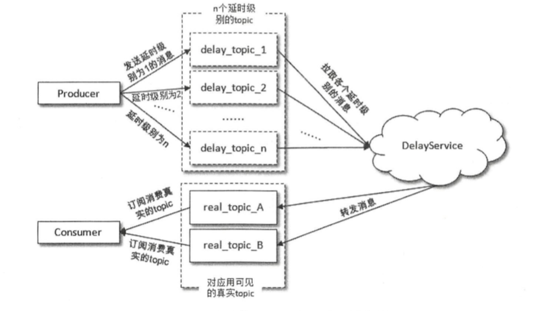
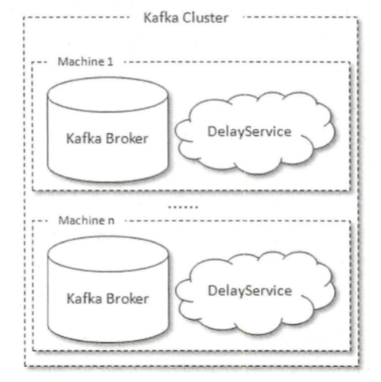
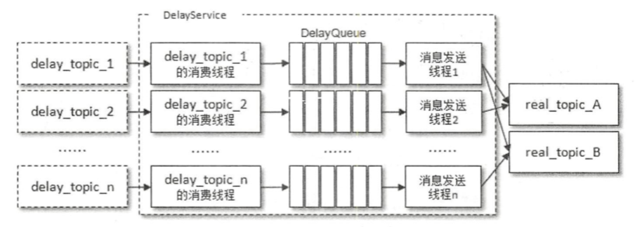
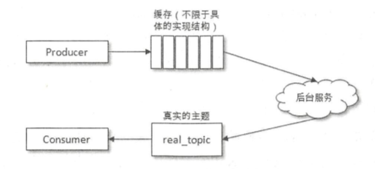
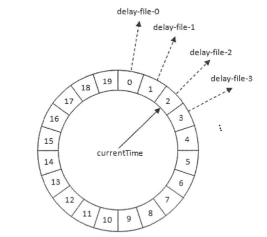
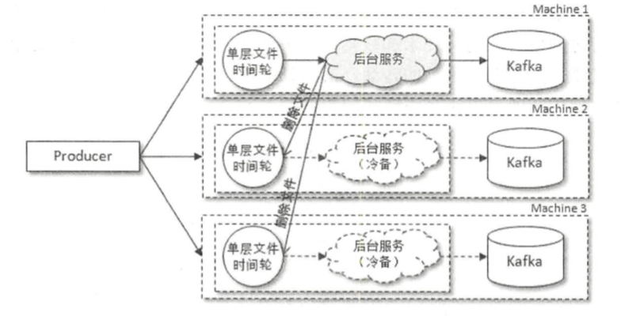
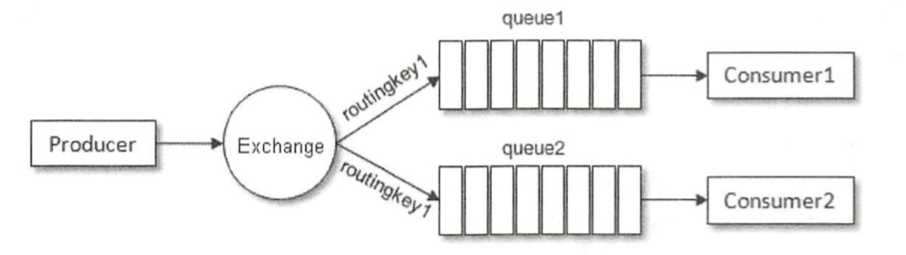
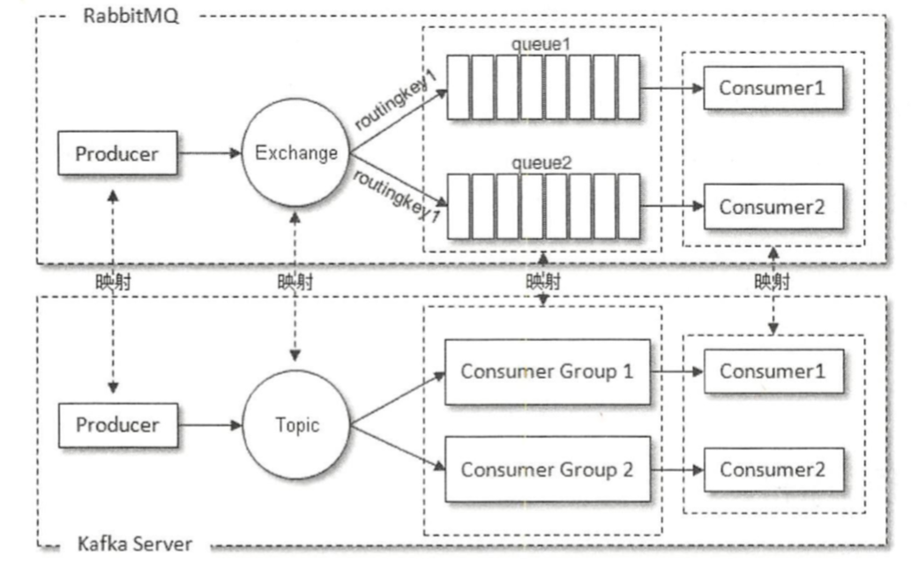
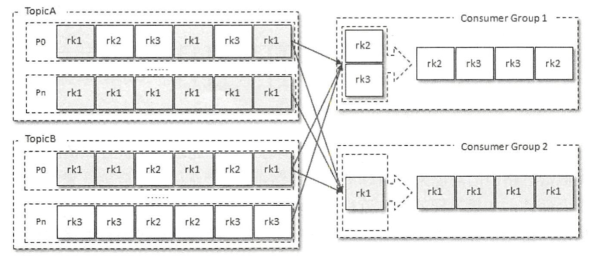
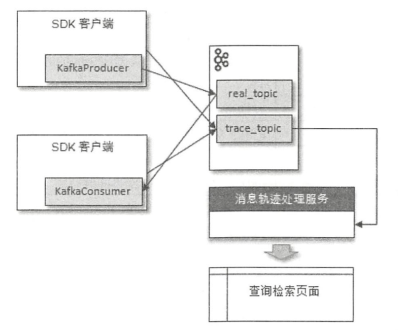

# 1、幂等与事务

所谓的幂等，简单地说就是对接口的多次调用所产生的结果和调用一次是一致的 。生产者在进行重试的时候有可能会重复写入消息，而使用 Kafka 的幕等性功能之后可以避免这种情况。 

开启幕等性功能的方式很简单，只需要显式地将生产者客户端参数 `enable.idempotence` 设置为 true 即可(这个参数的默认值为 false) 。

为了实现生产者的幕等性，Kafka为此引入了 producerid(PID)和序列号(sequence number)这两个概念。每个新的生产者实例在初始化的时候都会被分配一个 PID，这个 PID 对用户而言是完全透明的 。对于每个 PID，消息发送到的每一个分区都有对应的序列号，这些序列号从 0 开始单调递增。生产者每发送一 条消息就会将<PID， 分区>对应的序列号的值加 1。

broker 端会在内存中为每一对<PID，分区>维护一个序列号。对于收到的每一条消息，只有 当它的序列号的值(SN_new)比broker端中维护的对应的序列号的值(SN_old)大 1(即 SN_new =SN_old+1)时， broker才会接收它。 如果SN_new<SN_old+1， 那么说明消息被重复写入， broker 可以直接将其丢弃 。 如果 SN_new> SN_old + 1，那么说明中间有数据尚未写入， 出现了乱序，暗示可能有消息丢失，对应的生产者会抛出异常。

引入序列号来实现幕等也只是针对每一对<PID， 分区>而言的，也就是说， Kafka 的幂等只能保证单个生产者会话中单分区的幂等 。 


幂等性并不能跨多个分区运作，而事务可以弥补这个缺陷。事务可以保证对多个分区写入操作的原子性。操作的原子性是指多个操作要么全部成功，要么全部失败，不存在部分成功、 部分失败的可能。 

对流式应用而 言 ， 一个典型的应用模式为“ consume­-transform-produce” 。在这种模式下消费和生产并存：应用程序从某个主题中消费消息 ， 然后经过一系列转换后写入另一个主题 ，消费者可能在提交消费位移的过程中出现问题而导致重复消 费， 也有可能生产者重复生产消息 。 Kafka 中的事务可以使应用程序将消费消息、生产消息 、 提交消费位移当作原子操作来处理，同时成功或失败，即使该生产或消费会跨多个分区 。 

为了实现事务，应用程序必须提供唯一的 transactionalId，这个 transactionalld 通过客户端 参数 `transactional.id` 来显式设置。事务要求生产者开启幕等特性，因 此通过将 `transactional.id` 参数设置为非空从而开启事务特性的同时需要将 `enable.idempotence` 设置为 true。

transactionalld 与 PID 一一对应，两者之间所不同的是 transactionalld 由用户显式设置， 而 PID是由 Kafka内部分配的。另外，为了保证新的生产者启动后具有相同 transactionalld的旧生 产者能够立即失效 ，每个生产者通过 transactionalld 获取 PID 的 同时，还会获取一个单调递增的 producer epoch 。

从生产者的角度分析，通过事务 Kafka 可以保证跨生产者会话的消息幕等发送，以及跨生产者会话的事务恢复。前者表示具有相同 transactionalld 的新生产者实例被创建且工作的时候，旧的且拥有相同 transactionalld 的生产者实例将不再工作。后者指当某个生产者实例宕机后， 新的生产者实例可以保证任何未完成的旧事务要么被提交，要么被中止， 如此可以使新的生产者实例从一个正常的状态开始工作。 

一个典型的事务消息发送的操作如下：

```java
Properties properties = new Properties();
properties.put(ProducerConfig.KEY_SERIALIZER_CLASS_CONFIG, StringSerializer.class.getName());
properties.put(ProducerConfig.VALUE_SERIALIZER_CLASS_CONFIG, StringSerializer.class.getName());
properties.put(ProducerConfig.BOOTSTRAP_SERVERS_CONFIG, brokerList);
properties.put(ProducerConfiq.TRANSACTIONAL_ID_CONFIG, transactionid);
KafkaProducer<String, String> producer = new KafkaProducer<>(properties);
producer.initTransactions();
producer.beginTransaction();

try {
  // 处理业务逻辑并创建 ProducerRecord
  ProducerRecord<String, String> recordl = new ProducerRecord<>(topic, "msgl");
  producer.send(recordl);
  ProducerRecord<String, String> record2 = new ProducerRecord<>(topic, "msg2");
  producer.send(record2);
  ProducerRecord<String, String> record3 = new ProducerRecord<>(topic, "msg3");
  producer.send(record3);
  // 处理一些其他逻辑
  producer.commitTransaction();
} catch (ProducerFencedException e) {
  producer.abortTransaction();
}
producer.close();
```

在消费端有一个参数 `isolation.level`，与事务有着莫大的关联，这个参数的默认值为 `read uncommitted`， 意思是说消费端应用可以看到(消费到)未提交的事务， 当然对于己提交的事务也是可见的。这个参数还可以设置为 `read committed`，表示消费端应用不可以看到尚未提交的事务内的消息。举个例子，如果生产者开启事务并向某个分区值发送 3 条消息 msgl 、 msg2 和 msg3，在执行 commitTransaction()或 abortTransaction()方法前，设置为`read_committed`的消费端应用是消费不到这些消息的，不过在 KafkaConsumer 内部会缓存这些消息，直到生产者执行 commitTransaction()方法之后它才能将这些消息推送给消费端应用。反之，如果生产者执行了 abortTransaction()方法，那么 KafkaConsumer 会将这些缓存的消息丢弃而不推送给消费端应用。 

# 2、TTL队列

通过消息的 timestamp 宇段和 ConsumerInterceptor 接口的 onConsume()方法 可以实现消息的 TTL 功能。实际应用中， 消息超时之后一般不会被直接丢弃，而是配合死信队列使用，方便应用在此之后通过消费死信队列中的消息来诊断系统的运行概况 。 

如果要实现自定义每条消息 TTL 的功能，需要借助消息中的header字段来定制化每条消息的超时时间：

```java
@Override
public ConsumerRecords<String, String> onConsume(ConsumerRecords<String, String> records) {
  long now = System.currentTimeMillis();
  Map<TopicPartition, List<ConsumerRecord<String, String>>> newRecords = new HashMap<>();
  for (TopicPartition tp : records.partitions()) {
    List<ConsumerRecord<String, String>> tpRecords = records.records(tp);
    List<ConsumerRecord<String, String>> newTpRecords = new ArrayList<>();
    for (ConsumerRecord<String, String> record : tpRecords) {

      Headers headers = record.headers();
      long ttl = -1;
      for (Header header : headers) {
        // 判断 headers 中是否有 key 为"ttl"的 Header
        if (header.key().equalsIgnoreCase("ttl")) {
          ttl = BytesUtils.bytesToLong(header.value());
          // 消息超时判定
          if (ttl > 0 && now - record.timestamp() < ttl * 1000) {
            newTpRecords.add(record);
          } else {
            // 没有设置 TTL，不需要超时判定
            newTpRecords.add(record);
          }
        }
      }
    }

    return new ConsumerRecords<>(newRecords);
  }
}
```

# 3、延时队列

队列是存储消息的载体，延时队列存储的对象是延时消息。所谓的“延时消息”是指消息被发送以后，并不想让消费者立刻获取，而是等待特定的时间后，消费者才能获取这个消息进行消费，延时队列 一般也被称为“延迟队列延时时间后才自吕被消费，而 TTL 的消息达到目标超时时间后会被丢弃 。 

延时队列的使用场景有很多， 比如 : 

- 在订单系统中， 一个用户下单之后通常有 30 分钟的时间进行支付，如果 30 分钟之内没有支付成功，那么这个订单将进行异常处理，这时就可以使用延时队列来处理这些订单了 。 
- 订单完成1小时后通知用户进行评价。
- 用户希望通过手机远程遥控家里的智能设备在指定时间进行工作。这时就以将用户指令发送到延时队列， 当指令设定 的时间到了之后再将它推送到智能设备 。 

原生的 Kafka 并不具备延时队列的功能，不过我们可以对其进行改造来实现。 Kafka 实现 延时队列的方式也有很多种，比如与TTL队列类似，可以通过消费者客户端拦截器来实现 。 

不过使用拦截器的方式来实现延时的功能具有很大的局限性，某一批拉取到的消息集中有一条消息的延时时间很长，其他的消息延时时间很短而很快被消费，那么这时该如何处理呢? 下面考虑以下这几种情况 : 

- 如果这时提交消费位移，那么延时时间很长的那条消息会丢失 。 
- 如果这时不继续拉取消息而等待这条延时时间很长的消息到达延时时间，这样又会导致消费滞后很多，而且如果位于这条消息后面的很多消息的延时时间很短，那么也会被这条消 息无端地拉长延时时间，从而大大地降低了延时的精度 。 
- 如果这个时候不提交消费位移而继续拉取消息，等待这条延时时间很长的消息满足条件之后再提交消费位移，那么在此期间这条消息需要驻留在内存中，而且需要一个定时机制来定时检测是否满足被消费的条件，当这类消息很多时必定会引起内存的暴涨，另一方面当消费 很大一部分消息之后这条消息还是没有能够被消费，此时如果发生异常，则会由于长时间的未提交消费位移而引起大量的重复消费 。 

有一种改进方案，消费者在拉取一批消息之后，如果这批消息中有未到达延时时间的消息，那么就将这条消息重新写入主题等待后续再次消费 。 这个改进方案看起来很不错，但是当消费滞后很多(消息大量堆积)的时候，原本这条消息只要再等待 5 秒就能够被消费，但这里却将其再次存入主题，等到再次读取到这条消息的时候有可能己经过了半小时 。 由此可见，这种改进方案无法保证延时精度，故而也很难真正地投入现实应用之中。 

在了解了拦截器的实现方式之后，我们再来看另一种可行性方案：在发送延时消息的时候并不是先投递到要发送的真实主题( real_topic)中，而是先投递到一些 Kafka 内部的主题 (delay topic)中，这些内部主题对用户不可见，然后通过一个自定义的服务拉取这些内部主题中的消息，并将满足条件的消息再投递到要发送的真实的主题中 ，消费者所订阅的还是真实的主题 。 



延时时间一般以秒来计，若要支持 2 小时，也就是7200秒之内的延时时间的消息，那么显然不能按照延时时间来分类这些内部主题。试想一个集群中需要额外的 7200个主题， 每个主题再分成多个分区， 每个分区又有多个副本，每个副本又可以分多个日志段 ， 每个日志 段中也包含多个文件，这样不仅会造成资源的极度浪费，也会造成系统吞吐的大幅下降。如果采用这种方 案，那么一般是按照不同的延时等级来划分的 ，比如设定 5s、 10s、 30s、 lmin、 2min、 5min、 lOmin、 20min、 30min、 45min、 lhour、 2hour 这些按延时时间递增的延时等级，延时的消息按照延时时间投递到不同等级的主题中 ，投递到同一主题中的消息的延时时间会被强转为与此 主题延时等级一致的延时时间 ， 这样延时误差控制在两个延时等级的时间差范围之内(比如延时时间为 17s 的消息投递到 30s 的延时主题中，之后按照延时时间为 30s 进行计算，延时误差为 13s) 。 虽然有一定 的延时 误差 ，但是误差可控， 并且这样只需增加少许的主题就能实现延时队列的 功能。 

发送到内部主题( delay topic_*)中的消息会被一个独立的 DelayService 进程消费，这个 DelayService进程和 Kafkabroker进程以一对一的配比进行同机部署，以保证服务的可用性 。 



针对不同延时级别的主题，在 DelayService 的内部都会有单独的线程来进行消息的拉取， 以及单独的 DelayQueue 进行消息的暂存 。 与此同时，在 DelayService 内部还会有专门的消息发送线程来获取 DelayQueue 的消息并转发到真实的主题中 。 从消费、暂存再到转发，线程之间都是一一对应的关系 。 



为了保障内部 DelayQueue 不会因为未处理的消息过多而导致内存的占用过大 ， DelayService 会对主题中的每个分区进行计数， 当达到一定的阔值之后，就会暂停拉取该分区中的消息。 

有些读者可能会对这里 DelayQueue 的设置产生疑惑， DelayQueue 的作用是将消息按照再次投递时间进行有序排序，这样下游的消息发送线程就能够按照先后顺序获取最先满足投递条件的消息。再次投递时间是指消息的时间戳与延时时间的数值之和，因为延时消息从创建开始起需要经过延时时间之后才能被真正投递到真实主题中。 同一分区中的消息的延时级别 一样，也就意味着延时时间一样，那么对同一个分区中的消息而言， 也就自然而然地按照投递时间进行有序排列，那么为何还需要 DelayQueue 的存在呢？因为一个主题中一般不止一个分区，分区之间的消息并不会按照投递时间进行排序。

前面我们也提到了，这种延时队列的实现方案会有一定的延时误差 ，无法做到秒级别的精确延时。

那么有没有延时精度较高的实现方案？我们先来回顾一下前面的延时分级的实现方案，它首先将生产者生产的消息暂存到一个地方，然后通过一个服务去拉取符合再次投递条件的消息并转发到真实的主题。一般的延时队列的实现架构也大多类似：



后台服务获取消息之后马上会转发到真实的主题中，而订阅此主题的消费者也就可以及时地消费消息，在这一阶段中井无太大的优化空间。反观消息从生产者到缓存再到后台服务的过程中需要一个等待延时时间的行为，在这个过程中有很大的 空间来做进一步的优化。 

到这里，自然而然会想起前面大篇幅介绍过的时间轮。

所不同的是，这里需要的是单层时间轮 。 而且延时消息也不再是缓存在内存 中， 而是暂存至文件中 。 时间轮中每个时间格代表一个延时时间， 并且每个时间格也对应一个文件，整体上可以看作单层文件时间轮。



每个时间格代表 1 秒，若要支持 2 小时之内的延时时间的消息， 那么整个单层时间轮的时间格数就需要 7200个，与此对应的也就需要 7200个文件，听上去似乎需要庞大的系统开销，就单单文件句柄的使用也会耗费很多的系统资源 。 其实不然，我们并不需要维持所有文件的文件句柄，只需要加载距离时间轮表盘指针相近位置的部分文件即可，其余都可以用类似“懒加载”的机制来维持：若与时间格对应的文件不存在则可以新建，若与时间格对应的文件未加载则可以重新加载，整体上造成的时延相比于延时等级方案而言微乎其微。随着表盘指针的转动，其相邻的文件也会变得不同， 整体上在内存中只需要维持少量的文件句柄就可以让系统运转起来。 

这里为什么强调的是单层时间轮。试想一下，如果这里采用的是多层时间轮，那么必然会有时间轮降级的动作，那就需要将 高层时间轮中时间格对应文件中的内容写入低层时间轮，高层时间格中伴随的是读取文件内容、写入低层时间轮、删除己写入的内容的操作，与此同时， 高层时间格中也会有新的内容写入。如果要用多层时间轮来 实现，不得不增加繁重的元数据控制信息和繁杂的锁机制 。 对单层时间轮中的时间格而言，其对应的要么是追加文件内容，要么是删除整个文件 (到达延时时间，就可以读取整个文件中的内容做转发， 并删除整个文件)。采用单层时间轮可以简化工程实践，减少出错的可能，性能上也并不会比多层时间轮差。 

采用时间轮可以解决延时精度的问题，采用文件可以解决内存暴涨的问题，那么剩下的还有一个可靠性的问题，可以借助多副本机制，生产者同样将消息写入多个备份（单层文件时间轮），待时间轮转动而触发某些时间格过期时就可以将时间格对应的文件内容转发到真实主题中，并且删除相应的文件 。与此同时，还会有一个后台服务专门用来清理其他时间轮中相应的时间格。 

层文件时间轮的方案与延时级别的实现方案一样可以将延时服务与 Kafka进程进行一对一配比的同机部署，以保证整体服务的可用性。



# 4、死信队列

由于某些原因消息无法被正确地投递，为了确保消息不会被无故地丢弃， 一般将其置于一个特殊角色的队列，这个队列 一般称为**死信队列** 。 后续分析程序可以通过消费这个死信队列中 的内容来分析当时遇到的异常 情况 ，进而可以改 善和优化系统 。 

与死信队列对应的还有一个“回退队列”的概念，如果消费者在消费时发生了异常，那么就不会对这一次消费进行确认，进而发生回滚消息的操作之后，消息始终会放在队列的顶部， 然后不断被处理和回滚，导致队列陷入死循环。为了解决这个问题，可以为每个队列设置 一个回退队列，它和死信队列都是为异常处理提供的一种机制保障。实际情况下，回退队列的角色可以由死信队列和重试队列来扮演 。 

至于死信队列到底怎么用，是从 broker端存入死信队列，还是从消费端存入死信队列，需要先思考两 问题： 死信有什么用?为什么用，从而引发怎么用。在 RabbitMQ 中，死信一般通过 broker端存入，而在 Kafka 中原本并无死信的概念，所以当需要封装这一层概念的时候， 就可以脱离既定思维的束缚，根据应用情况边择合适的实现方式，理解死信的本质进而懂得如何去实现死信队列的功能。 

# 5、消息路由

消息路由是消息中间件中常见的一个概念，比如在典型的消息中间件 RabbitMQ 中就使用路由键 RoutingKey来进行消息路由 。 



RabbitMQ 中的生产者将消息发送到交换器 Exchange 中，然后由交换器根据指定的路由键来将消息路由到一个或多个队列中，消费者消费的是队列中的消息。从整体上而言， RabbitMQ通过路由键将原本发往一个地方的消息做了区 分，然后让不同的消息者消费到自己要关注的消息。 

Kafka 默认按照主题进行路由，也就是说，消息发往主题之后会被订阅的消费者全盘接收， 这里没有类似消息路由的功能来将消息进行二级路由，这一点从逻辑概念上来说并无任何问题 。 从业务应用上 而 言 ， 如果不同的业务流程复用相同的主题，就会出现消息接收时的混乱，这种 问题可以从设计上进行屏蔽，如果需要消息路由，那么完全可以通过细粒度化切分主题来实现 。 

但是有时候一些历史遗留的问题迫使我们期望 Kafka 具备一个消息路由的功能 。比如原来的应用系统采用了类似 RabbitMQ 这种消息路由的生产消费模型，运行一段时间之后又需要更换为 Kafka，并且变更之后还需要保留原有系统的编程逻辑。对此，我们首先需要在这个整体架构中做一层关系映射。



这里将Kafka中的消费组与RabbitMQ中的队列做了一层映射， 可以根据特定的标识来将消息投递到对应的消费组中 。 

具体的实现方式可以在消息的 headers 字段中加入一个键为“routingkey”、值为特定业务 标识的 Header，然后在消费端中使用拦截器挑选出特定业务标识的消息。 



消费组 ConsumerGroup1 根据指定的 Header标识 rk2和 rk3 来消费主题 TopicA和 TopicB 中所有对应的消息而忽略 Header标识为 rkl 的消息，消费组 ConsumerGroup2 正好相反。 

# 6、消息轨迹

在使用消息中间件时，我们时常会遇到各种问题：消息发送成功了吗？为什么发送的消息在消费端消费不到？为什么消费端重复消费了消息？对于此类问题，我们可以引入消息轨迹来 解决。**消息轨迹**指的是一条消息从生产者发出，经由 broker存储，再到消费者消费的整个过程中，各个相关节点的状态、时间、地点等数据汇聚而成的完整链路信息。 生产者、 broker、 消费 者这 3 个角色在处理消息的过程中都会在链路中增加相应的信息，将这些信息汇聚 、处理之后 就可以查询任意消息的状态，进而为生产环境中的故障排除提供强有力的数据支持。 

对消息轨迹而言，最常见的实现方式是封装客户端，在保证正常生产消费的同时添加相应的轨迹信息埋点逻辑 。 无论生产，还是消费，在执行之后都会有相应的轨迹信息，我们需要将这些信息保存起来 。 这里可以参考 Kafka 中的做法，它将消费位移信息保存在主题 _consumer_offset 中。对应地，我们同样可以将轨迹信息保存到 Kafka 的某个主题中。



生产者在将消息正常发送到用户主题 real topic 之后(或者消费者在拉取到消息消费之后〉 会将轨迹信息发送到主题 trace_topic 中。这里有两种发送方式：第一种是直接通过 KatkaProducer 发送，为了不对普通的消息发送造成影响，可以采取“低功耗”的(比如异步 、 acks=0 等)发送配置，不过有可能会造成轨迹信息的丢失 。 另 一种方式是将轨迹信息保存到本地磁盘，然后通过某个传输工具(比如 Flume)来同步到 Kafka 中，这种方式对正常发送/消费逻辑的影响较小、可靠性也较高，但是需要引入额外的组件，增加了维护的风险。 

消息轨迹中包含生产者、 broker 和 消费者的消息，但是上图中只提及了生产者和消费者的轨迹信息的保存而并没有提及 broker 信息的保存。生产者在发送消息之后通过确认信息来得知是否已经发送成功，而在消费端就更容易辨别一条消息是消费成功了还是失败了，对此我们可以通过客户端的信息反推出 broker 的链路信息。当然我们也可以在 broker 中嵌入一个前置程序来获得更多的链路信息， 比如消息流入时间、消息落盘时间等。不过在 broker 内嵌前置程序，如果有相关功能更新，难免需要重启服务， 如果只通过客户端实现消息轨迹，则可以简化整体架构、灵活部署。

轨迹信息保存到主题位ace_topic 之后 ， 还需要通过一个专门的处理服务模块对消息轨迹进行索引和存储，方便有效地进行检索。在查询检索页面进行检索的时候可以根据具体的消息 ID 进行精确检索，也可以根据消息的 key、 主题、发送/接收时间进行模糊检索，还可以根据用户自定义的 Tags 信息进行有针对性的检索，最终查询出消息的一条链路轨迹。 