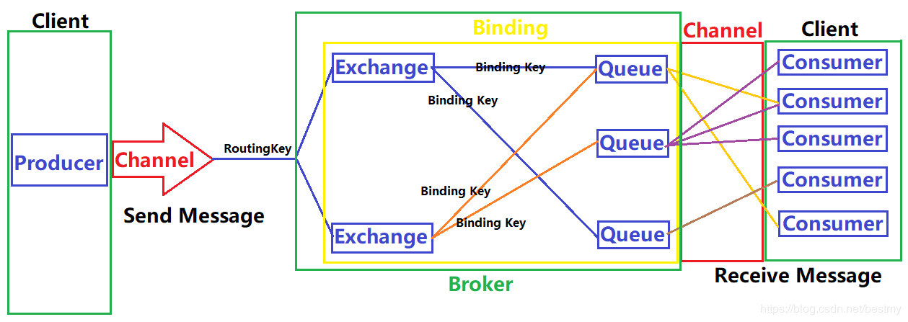
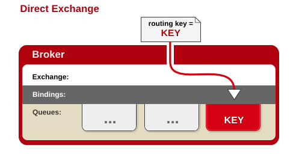
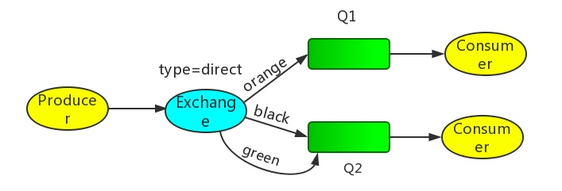
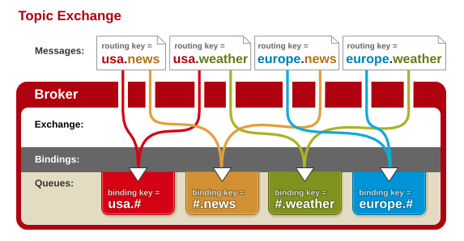
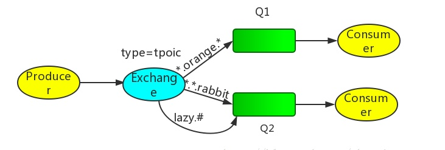
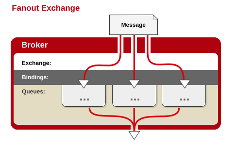
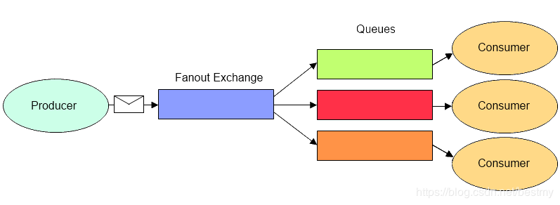
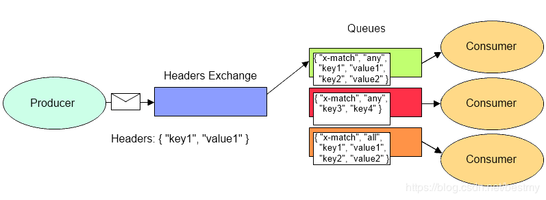

# 1、RabbitMQ是什么

RabbitMQ是一个开源的AMQP实现，服务器端用Erlang语言编写，支持多种客户端。它最初起源于金融系统，用于在分布式系统中存储转发消息。

RabbitMQ在易用性、扩展性、高可用性等方面表现不俗。具体特点包括：

- **可靠性**（Reliability）：RabbitMQ 使用一些机制来保证可靠性，如持久化、传输确认、发布确认。
- **灵活的路由**（Flexible Routing）：在消息进入队列之前，通过 Exchange 来路由消息的。对于典型的路由功能，RabbitMQ 已经提供了一些内置的 Exchange 来实现。针对更复杂的路由功能，可以将多个 Exchange 绑定在一起，也通过插件机制实现自己的 Exchange 。
- **消息集群**（Clustering）：多个 RabbitMQ 服务器可以组成一个集群，形成一个逻辑 Broker 。
- **高可用**（Highly Available Queues）：队列可以在集群中的机器上进行镜像，使得在部分节点出问题的情况下队列仍然可用。
- **多种协议**（Multi-protocol）：RabbitMQ除了原生支持AMQP协议，还支持 STOMP、MQTT 等多种消息中间件协议。
- **多语言客户端**（Many Clients）：RabbitMQ 几乎支持所有常用语言，比如 Java、.NET、Ruby 等等。
- **管理界面**（Management UI）：RabbitMQ 提供了一个易用的用户界面，使得用户可以监控和管理消息 Broker 的许多方面。
- **跟踪机制**（Tracing）：如果消息异常，RabbitMQ 提供了消息跟踪机制，使用者可以找出发生了什么。
- **插件机制**（Plugin System）：RabbitMQ 提供了许多插件，来从多方面进行扩展，也可以编写自己的插件。

# 2、基本概念

- **生产者**（producer）：创建消息，发布到代理服务器（Message Broker）。
- **消费者**（consumer）：连接到代理服务器，并订阅到队列（queue）上，代理服务器将发送消息给一个订阅的/监听的消费者。

- **消息**（Message）：包含消息头（即附属的配置信息）和消息体（即消息的实体内容）。消息体也可以称为payLoad ，消息体是不透明的，而消息头则由一系列的可选属性组成，这些属性包括routing-key（路由键）、priority（相对于其他消息的优先权）、delivery-mode（指出该消息可能需要持久性存储）等。生产者把消息交由RabbitMQ后，RabbitMQ会根据消息头把消息发送给感兴趣的Consumer(消费者)。
- **交换器**（exchange）：在RabbitMQ 中，消息并不是直接被投递到队列 中的，中间还必须经过交换器这一层，交换器会把我们的消息分配到对应的队列中。交换器用来接收生产者发送的消息并将这些消息路由给服务器中的队列中，如果路由不到，或许会返回给生产者，或许会被直接丢弃掉 。RabbitMQ 的 交换器有4种类型，不同的类型对应着不同的路由策略：direct(默认)，fanout，topic和 headers，不同类型的Exchange转发消息的策略有所区别。
- **队列**（queue）：用来保存消息直到发送给消费者。它是消息的容器，也是消息的终点。一个消息可投入一个或多个队列。消息一直在队列里面，等待消费者连接到这个队列将其取走。RabbitMQ中消息只能存储在队列 中，这一点和Kafka相反。Kafka将消息存储在topic(主题)这个逻辑层面，而相对应的队列逻辑只是topic实际存储文件中的位移标识。 RabbitMQ的生产者生产消息并最终投递到队列中，消费者可以从队列中获取消息并消费。多个消费者可以订阅同一个队列，这时队列中的消息会被平均分摊（Round-Robin，即轮询）给多个消费者进行处理，而不是每个消费者都收到所有的消息并处理，这样避免的消息被重复消费。RabbitMQ 不支持队列层面的广播消费，如果有广播消费的需求，需要在其上进行二次开发。

- **路由键**（routing key）：消息头的一个属性（默认为空），交换器根据这个路由键将消息发送到匹配的队列中。

- **绑定键**（binding key）：绑定就是基于Binding Key将Exchange和Queue连接起来的路由规则，所以可以将交换器理解成一个由Binding构成的路由表。队列需要通过绑定键（默认为空）绑定到交换器上，交换器将消息的路由键与所绑定队列的绑定键进行匹配，正确匹配的消息将发送到队列中。路由键是偏向生产的概念，而绑定键是偏向消费的概念。

- **代理服务器**（Message Broker）：对于RabbitMQ来说，一个RabbitMQ Broker 可以简单地看作一个RabbitMQ 服务节点，或者RabbitMQ服务实例。大多数情况下也可以将一个RabbitMQ Broker看作一台RabbitMQ服务器。

- **虚拟主机**（vhost）：AMQP概念的基础，其本质上就是一个mini版的代理服务器（拥有自己的队列、交换器和绑定，更重要的是，拥有自己的权限机制），RabbitMQ默认的vhost：“/”（类似于网络中的namespace），每个用户只能访问自己的vhost（通常会被指派至少一个vhost），进而用户只能访问自己的队列、交换器和绑定，所以vhost之间是绝对隔离的。
- **信道**（channel）: 应用程序（生产与/或消费）和代理服务器之间TCP连接内的虚拟连接，解决TCP连接数量限制及降低TCP连接代价。每个信道有一个ID，其概念与“频分多路复用”类似。

# 3、路由策略

路由策略是指Exchange在收到生产者发送的消息后依据什么规则把消息转发到一个或多个队列中保存。路由策略与三个因素相关：

- Exchange Type（Exchange的类型）
- Binding Key（Exchange和Queue的绑定关系）
- Routing Key & headers（消息的标记信息）

Exchange根据消息的Routing Key和Exchange绑定Queue的Binding Key分配消息。生产者在将消息发送给Exchange的时候，一般会指定一个Routing Key，来指定这个消息的路由规则，而这个Routing Key需要与Exchange Type及Binding Key联合使用才能最终生效。
在Exchange Type与Binding Key固定的情况下（一般这些内容都是固定配置好的），我们的生产者就可以在发送消息给Exchange时，通过指定Routing Key来决定消息流向哪里。

## 3.1 Direct 策略

当消息的Routing Key与 Exchange和Queue 之间的Binding Key完全匹配，才会将消息分发到该Queue。

Direct是Exchange的**默认模式**。

RabbitMQ默认提供了一个Exchange，名字是空字符串，类型是Direct，绑定到所有的Queue（每一个Queue和这个无名Exchange之间的Binding Key是Queue的名字）。所以有时候我们感觉不需要交换器也可以发送和接收消息，但是实际上是使用了RabbitMQ默认提供的Exchange。

Exchange和两个队列绑定在一起：

- Q1的bindingkey是orange
- Q2的binding key是black和green.
- 当Producer publish key是orange时, exchange会把它放到Q1上； 如果是black或green就会到Q2上；其余的Message被丢弃

## 3.2 Topic 策略

用消息的Routing Key与 Exchange和Queue 之间的Binding Key进行模糊匹配，如果匹配成功，将消息分发到该Queue。

Binding Key中可以存在两种特殊字符用于做模糊匹配：

- `*`：用于匹配一个单词
- `#`：用于匹配多个单词（可以是零个）

Producer发送消息时需要设置routing_key,

Q1 的binding key 是`*.orange.*`，Q2 是 `*.*.rabbit` 和 `lazy.#`。

产生一个 `test.orange.mm` 消息，则会路由到Q1；如果是 `test.orange`则无法路由到Q1，因为Q1的规则是三个单词，中间一个为orange，不满足这个规则的都无效。

产生一个 `test.qq.rabbit` 或者 `lazy.qq` 都可以分发到Q2；即路由key为三个单词，最后一个为rabbit或者不限制单词个数，主要第一个是lazy的消息，都可以分发过来。

如果产生的是一个 `test.orange.rabbit`消息，则Q1和Q2都可以满足。

## 3.3 Fanout 策略

与Binding Key和Routing Key无关，交换器会把所有发送到该交换器的消息路由到所有与该交换器绑定的消息队列中。订阅模式。类似于子网广播，子网内的每台主机都获得了一份复制的消息。Fanout交换机转发消息是最快的。

## 3.4 Headers 策略

不依赖于Routing Key与Binding Key，而是通过消息头的Headers属性来进行匹配转发的，类似HTTP请求的Headers。

在绑定Queue与Exchange时指定一组键值对，键值对的Hash结构中要求携带一个键“x-match”，这个键的Value可以是any或all，代表消息携带的Hash是需要全部匹配(all)，还是仅匹配一个键(any)。

当消息发送到Exchange时，交换器会取到该消息的headers，对比其中的键值对是否完全匹配Queue与Exchange绑定时指定的键值对；如果完全匹配则消息会路由到该Queue，否则不会路由到该Queue。Headers交换机的优势是匹配的规则不被限定为字符串(String)，而是Object类型。

不过，在实际应用当中，路由策略的选择范围以Direct、Topic、Fanout为主，Headers策略很少使用。
