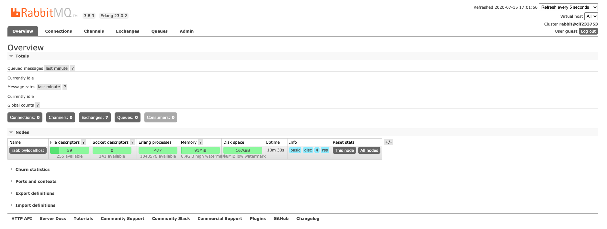

# 1、安装

RabbitMQ安装好以后，进入路径`/usr/local/Cellar/rabbitmq/3.8.3/sbin`，里面有很多命令：


```shell
> $  cd /usr/local/Cellar/rabbitmq/3.8.3/sbin
> $  ls

cuttlefish           
rabbitmq-diagnostics 
rabbitmq-plugins     
rabbitmq-server      
rabbitmqadmin
rabbitmq-defaults    
rabbitmq-env         
rabbitmq-queues      
rabbitmq-upgrade     
rabbitmqctl
```

例如，使用`rabbitmq-plugins`开启控制台插件：

```shell
> $ ./rabbitmq-plugins enable rabbitmq_management ##开启控制台插件

Enabling plugins on node rabbit@localhost:
rabbitmq_management
The following plugins have been configured:
  rabbitmq_amqp1_0
  rabbitmq_management
  rabbitmq_management_agent
  rabbitmq_mqtt
  rabbitmq_stomp
  rabbitmq_web_dispatch
Applying plugin configuration to rabbit@localhost...
Plugin configuration unchanged.

```

使用`rabbitmqctl`添加账号：

```shell
> $ ./rabbitmqctl add_user admin admin ## 添加账号
Adding user "admin" ...

> $ ./rabbitmqctl set_permissions -p "/" admin ".*" ".*" ".*" ## 添加访问权限
Setting permissions for user "admin" in vhost "/" ...

> $ ./rabbitmqctl set_user_tags admin administrator ## 设置超级权限
Setting tags for user "admin" to [administrator] ...
```

使用`rabbitmq-server`命令启动：

```shell
> $ ./rabbitmq-server ## 启动RabbitMQ

  ##  ##      RabbitMQ 3.8.3
  ##  ##
  ##########  Copyright (c) 2007-2020 Pivotal Software, Inc.
  ######  ##
  ##########  Licensed under the MPL 1.1. Website: https://rabbitmq.com

  Doc guides: https://rabbitmq.com/documentation.html
  Support:    https://rabbitmq.com/contact.html
  Tutorials:  https://rabbitmq.com/getstarted.html
  Monitoring: https://rabbitmq.com/monitoring.html

  Logs: /usr/local/var/log/rabbitmq/rabbit@localhost.log
        /usr/local/var/log/rabbitmq/rabbit@localhost_upgrade.log

  Config file(s): (none)

  Starting broker... completed with 6 plugins.
```

然后打开控制台'http://localhost:15672/'，默认的账号密码为'guest/guest'。登录后的页面如下：



# 2、代码实例

```java
   //消息队列名称
    private final static String QUEUE_NAME = "hello";

    @Test
    public void send () throws java.io.IOException, TimeoutException {

        //创建连接工厂
        ConnectionFactory factory = new ConnectionFactory();
        factory.setHost("127.0.0.1");
        factory.setPort(5672);
        factory.setUsername("admin");
        factory.setPassword("admin");
      
        //创建连接
        Connection connection = factory.newConnection();

        //创建消息通道
        Channel channel = connection.createChannel();

        //生成一个消息队列
        channel.queueDeclare(QUEUE_NAME, true, false, false, null);

        for (int i = 0; i < 10; i++) {
            String message = "Hello World RabbitMQ count: " + i;

            //发布消息，第一个参数表示路由（Exchange名称），为空则表示使用默认消息路由
            channel.basicPublish("", QUEUE_NAME, null, message.getBytes());

            System.out.println(" [x] Sent '" + message + "'");
        }

        //关闭消息通道和连接
        channel.close();
        connection.close();

    }

    @Test
    public void consumer () throws java.io.IOException, java.lang.InterruptedException, TimeoutException {

        //创建连接工厂
        ConnectionFactory factory = new ConnectionFactory();
        factory.setHost("127.0.0.1");
        factory.setPort(5672);
        factory.setUsername("admin");
        factory.setPassword("admin");

        //创建连接
        Connection connection = factory.newConnection();

        //创建消息信道
        Channel channel = connection.createChannel();

        //消息队列
        channel.queueDeclare(QUEUE_NAME, true, false, false, null);
        System.out.println("[*] Waiting for message. To exist press CTRL+C");

        AtomicInteger count = new AtomicInteger(0);

        //消费者用于获取消息信道绑定的消息队列中的信息
        Consumer consumer = new DefaultConsumer(channel) {
            @Override
            public void handleDelivery (String consumerTag, Envelope envelope, AMQP.BasicProperties properties,
                    byte[] body) throws IOException {
                String message = new String(body, "UTF-8");

                try {
                    System.out.println(" [x] Received '" + message);
                } finally {
                    System.out.println(" [x] Done");
                    channel.basicAck(envelope.getDeliveryTag(), false);
                }
            }
        };
        channel.basicConsume(QUEUE_NAME, false, consumer);

        Thread.sleep(1000 * 60);
    }
```

# 3、参数

## 3.1 队列参数

声明队列的方法有四个参数：

```
queueDeclare(String queue, 
			boolean durable, 
			boolean exclusive, 
			Map<String, Object> arguments);

```

- `queue`：队列名称。
- `durable`：是否持久化，队列的声明默认是存放到内存中的，如果rabbitmq重启会丢失，如果想重启之后还存在就要使队列持久化，保存到Erlang自带的Mnesia数据库中，当rabbitmq重启之后会读取该数据库。

- `exclusive`：是否排外的，有两个作用，一：当连接关闭时connection.close()该队列是否会自动删除；二：该队列是否是私有的private，如果不是排外的，可以使用两个消费者都访问同一个队列，没有任何问题，如果是排外的，会对当前队列加锁，其他通道channel是不能访问的，一般等于true的话用于一个队列只能有一个消费者来消费的场景。

- `autoDelete`：是否自动删除，当最后一个消费者断开连接之后队列是否自动被删除，

- `arguments`：扩展参数，可选项如下：
  - `x-message-ttl`：设置队列中的所有消息的生存周期(统一为整个队列的所有消息设置生命周期)，也可以在发布消息的时候单独为某个消息指定剩余生存时间，单位毫秒。
  - `x-expires`：当队列在指定的时间没有被访问就会被删除
  - `x-max-length`：限定队列的消息的最大值长度，超过指定长度将会把最早的几条删除掉
  - `x-max-length-bytes`：限定队列最大占用的空间大小， 超过该阈值就删除之前的消息
  - `x-dead-letter-exchange`： 当队列消息长度大于最大长度、或者过期等，将从队列中删除的消息推送到指定的交换机中去而不是丢弃掉。一般x-dead-letter-exchange和x-dead-letter-routing-key需要同时设置。
  - `x-dead-letter-routing-key`：将删除的消息推送到指定交换机的指定路由键的队列中去
  - `x-max-priority`：优先级队列，声明队列时先定义最大优先级值(定义最大值一般不要太大)，在发布消息的时候指定该消息的优先级， 优先级更高（数值更大的）的消息先被消费
  - `x-queue-mode`： 将队列设置为延迟模式(lazy)，在磁盘上保留尽可能多的消息以减少RAM使用。如果未设置，队列将保持在内存中的缓存，以尽可能快地传递消息。
  - `x-queue-master-locator`：用于镜像队列，设置存储队列主节点。min-master指将队列主节点设置在队列数量最少的RabbitMQ节点，client-local指将队列主节点设置在当前客户端所在的RabbitMQ节点，random即随机选择节点。

## 3.2 生产者参数

在生产者通过channel的basicPublish方法发布消息时，通常有几个参数需要设置，为此我们有必要了解清楚这些参数代表的具体含义及其作用，查看Channel接口，会发现存在3个重载的basicPublish方法：

```java
void basicPublish (String exchange, String routingKey, BasicProperties props, byte[] body) throws IOException;

void basicPublish (String exchange, String routingKey, boolean mandatory, BasicProperties props, byte[] body) throws IOException;

void basicPublish (String exchange, String routingKey, boolean mandatory, boolean immediate,
                   BasicProperties props, byte[] body) throws IOException;
```

参数分别是：

- `exchange`：交换机名称
- `routingKey`：路由键
- `props`：消息属性字段，比如消息头部信息等等
- `body`：消息主体部分
- `mandatory`：当mandatory标志位设置为true时，如果exchange根据自身类型和消息routingKey无法找到一个合适的queue存储消息，那么broker会调用basic.return方法将消息返还给生产者；当mandatory设置为false时，出现上述情况broker会直接将消息丢弃。通俗的讲，mandatory标志告诉broker代理服务器至少将消息route到一个队列中，否则就将消息return给发送者。
- `immediate`：RabbitMQ 3.0不再支持immediate标志，忽略

## 3.3 消费者参数

向信道的每次投递都带有一个投递标签（Delivery Tag），该投递标签是一个64位长的值，从1开始每次增加1，用于唯一标识信道的每次投递。

`channel.basicAck()`方法的第一个为参数位投递标签，用于标识对哪次消息投递进行确认，第二个参数表示是否进行消息的批量确认。若确认消息时开启批量确认，则投递标签小于当前消息投递标签的所有消息也都会进行确认。

使用批量确认，可起到减少网络流量的作用。

若投递的消息数目已经超过消费者的处理能力，继续投递消息将会导致消息的积压。此时消费者可选择拒绝：

`void basicNack(long deliveryTag, boolean multiple, boolean requeue)`

- `deliveryTag`：表示被拒绝的消息的投递标签
- `multiple`：表示是否批量拒绝，若是则所有投递标签小于当前消息且未确认的消息也都将被拒绝，若否则仅拒绝当前消息
- `requeue`：表示被拒绝的消息是否重新放回队列，若是则消息会重新回到队列并选择新的消费者进行投递，若否则该条消息会被丢弃。


当有多个消费者同时监听一个队列时，RabbitMQ默认将消息逐一顺序分配给各消费者，该消息分配机制称为轮询（Round-Robin）。

消息转发到队列后，分配是提前一次性完成的，称为**预取**，即RabbitMQ尽可能快速地将消息推送至客户端，由客户端缓存本地，而并非在消息消费时才逐一确定。

消息的轮询分配机制和尽可能快速推送消息的机制给实际使用带来困难。实际情况下，每个消费者处理消息的能力、每个消息处理所需时间可能都是不同的，若只是机械化地顺次分配，可能造成一个消费者由于处理的消息的业务复杂、处理能力低而积压消息，另一个消费者早早处理完所有的消息，处于空闲状态，造成系统的处理能力的浪费。且无法加入新的消费者以提高系统的处理能力。

希望达到的效果是每个消费者都根据自身处理能力合理分配消息处理任务，既无挤压也无空闲，新加入的消费者也能分担消息处理任务，使系统的处理能力能够平行扩展。
 

