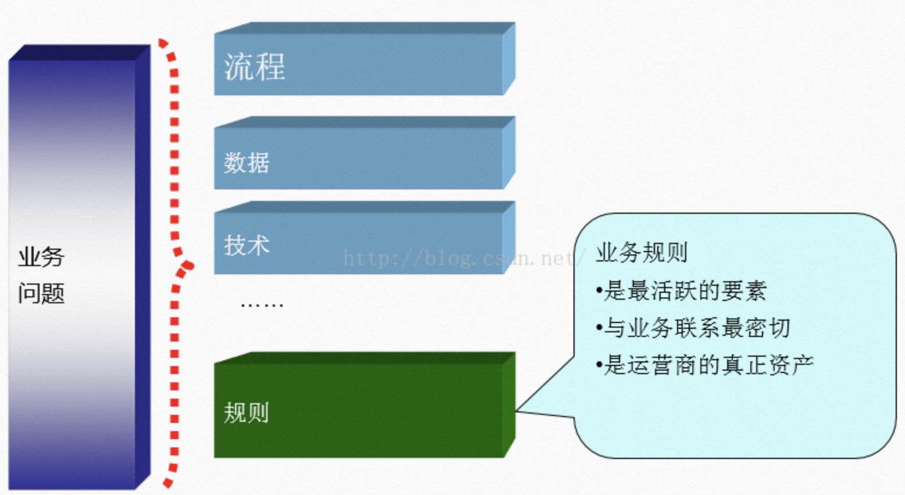
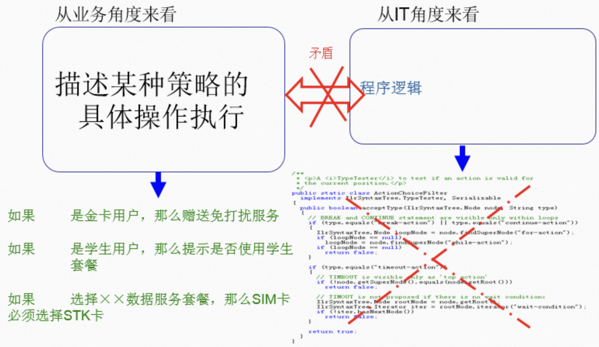
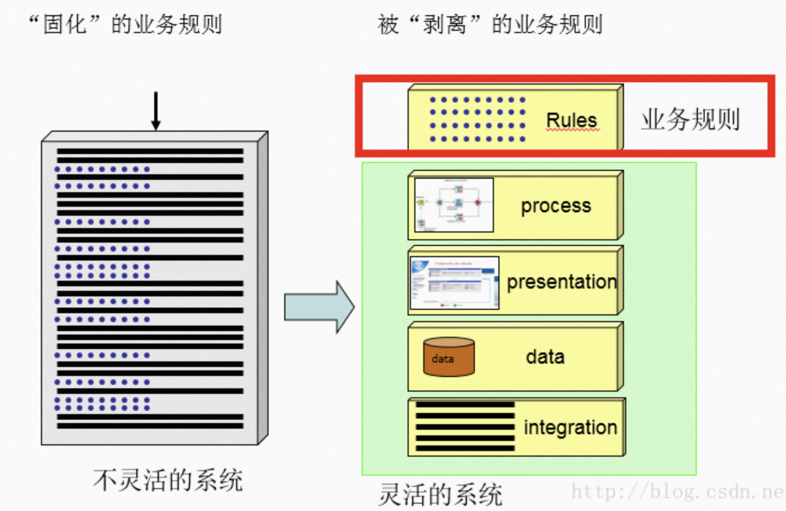
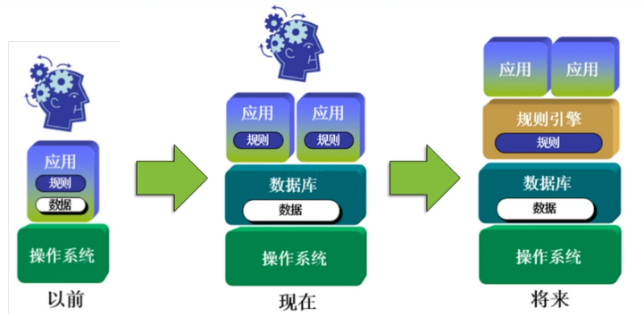
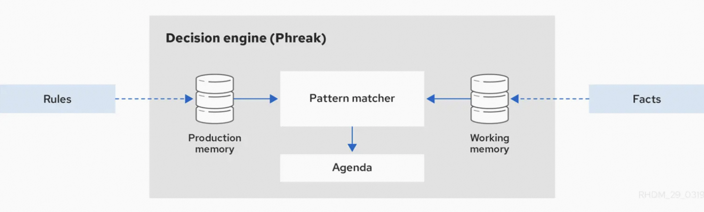
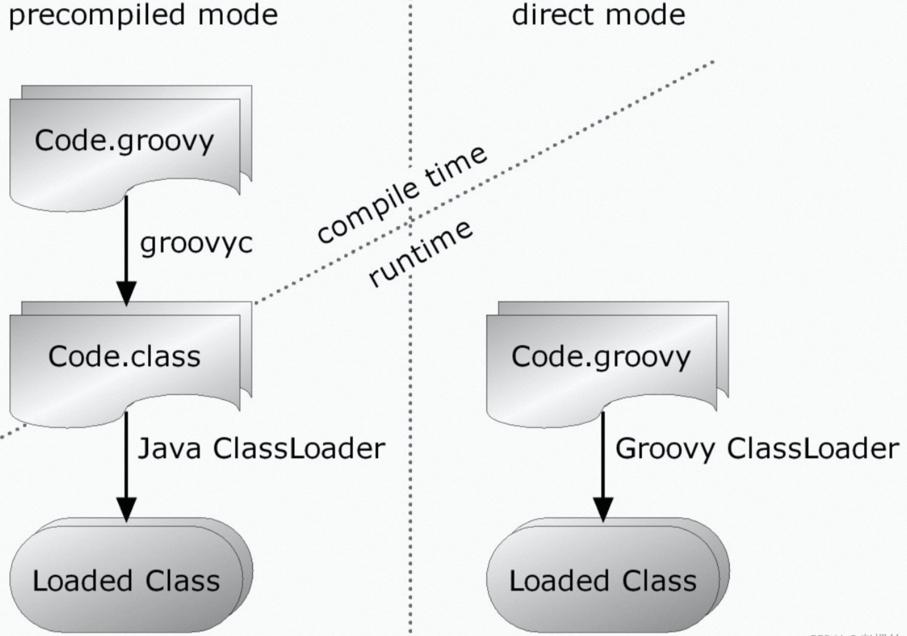
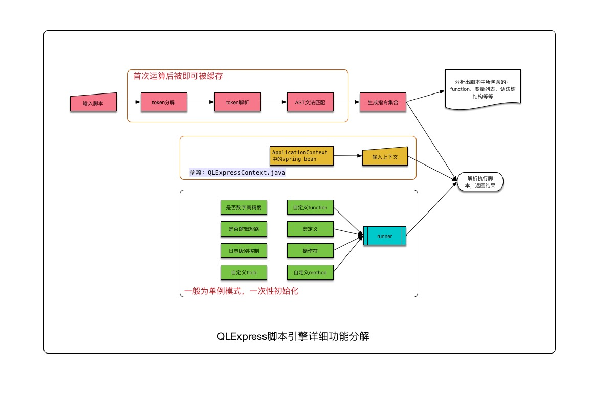

# 1、规则引擎是什么

在很多企业的 IT 业务系统中，会有大量的业务规则配置，而且随着企业管理者的决策变化，这些业务规则也会随之发生更改。

 


为了适应这样的需求，我们的 IT 业务系统应该能快速且低成本的更新。一般的作法是将业务规则的配置单独拿出来，使之与业务系统保持低耦合。





配合规则引擎提供的良好的业务规则设计器，不用编码就可以快速实现复杂的业务规则，同样，即使是完全不懂编程的业务人员，也可以轻松上手使用规则引擎来定义复杂的业务规则。

**规则引擎是让业务人士驱动整个企业过程的最佳实践**。



> **规则引擎**由**推理引擎**发展而来，是一种嵌入在应用程序中的组件，可以将业务决策从应用程序中分离出来，并使用预定义的语义规范编写业务规则。

> 规则引擎通过**接受输入的数据，进行业务规则的评估，并做出业务决策**。


使用规则引擎可以给系统带来如下优势：
* **高灵活性**：在规则保存在知识库中，可以在不重新启动系统的情况下发布规则，以减少测试和发布的成本。
* **容易掌控**：规则比过程代码更易于理解，因此可以有效地来弥补业务分析师和开发人员之间的沟通问题。
* **降低复杂度**：在程序中编写大量的判断条件，很可能是会造成一场噩梦。使用规则引擎却能够通过一致的表示形式，更好的处理日益复杂的业务逻辑。
* **可重用性**：规则集中管理，可提高业务的规则的可重用性。决策结果的积累和回溯，可以反向推动规则的迭代优化，帮助组织形成一个不断演进的商业智能分析知识库。


常见的规则引擎大体上分为两种：

* **重量级**：组件齐全，提供整套解决方案，以**Drools**为代表。
* **轻量级**：本质上是一种基于JVM的脚本语言，只负责脚本的编译、执行，规则的定义、运维等要结合具体的业务自己开发，以Groovy、AviatorScript、QLExpress、MVEL等代表

# 2、重量级规则引擎

Drools 是用 Java 语言编写的开源规则引擎，是**KIE**（Knowledge Is Everything）项目的一部分。

Drools 具有以下优点：
* 非常活跃的社区
* 生态不断的完善中
* JSR 94 兼容（JSR 94 是 Java Rule Engine API）
* 免费

## 2.1 Rete算法

Drools基于**Rete算法**实现。

Rete算法是一种前向规则快速匹配算法，是一个用于**产生式系统**的高效模式匹配算法，其**匹配速度与规则数目无关**。

> Rete是拉丁文，对应英文是net，也就是网络。

产生式规则是一种常用的知识表示方法，它以"IF-THEN"的形式表现了因果关系。例如：

```
 R1： IF 某动物是有蹄类动物 AND 有长脖子 AND 有长腿 AND 身上有暗斑点 THEN 该动物是长颈鹿（问题解决）
 R2：IF 某动物是有蹄类动物 AND 身上有黑色条纹 THEN 该动物是斑马（问题解决）
 ……
 R8：IF 动物是哺乳动物 AND 反刍动物 THEN 该动物是有蹄类动物
 ……
 R10：IF 某动物有奶 THEN该动物是哺乳动物……

```
以上一些产生式规则，给出"有奶"、“反刍”、“长脖子”、“长腿”、"身上有暗斑点"条件（也称为事实 facts），就可以求解出问题的答案是“长颈鹿”。

其核心思想是用分离的匹配项构造匹配网络，同时缓存中间结果，以空间换时间。有三个核心要素：

* **事实**（fact）：对象之间及对象属性之间的多元关系,可以简单理解为对象的属性和属性值。
* **规则**（rule）:是由条件和结论构成的推理语句，一般表示为`if...then...`。一个规则的if部分称为**LHS**（left-hand-side），then部分称为**RHS**（right hand side）。
* **模式**（patten）：就是指IF语句的条件。这里IF条件可能是有几个更小的条件组成的大条件。模式就是指的不能在继续分割下去的最小的原子条件。

## 2.2 Drools的使用



Drools规则引擎基于以下抽象组件实现：
* 规则(Rules)：业务规则或DMN决策。所有规则必须至少包含触发该规则的条件以及对应的操作。
* 事实(Facts)：输入到规则引擎的数据，用于规则的条件的匹配。
* 生产内存(Production memory)：规则引擎中规则存储的地方
* 工作内存(Working memory)：规则引擎中Fact对象存储的地方。
* 议程(Agenda)：用于存储被激活的规则的分类和排序的地方。

Drools的脚本需要以特定的语法编写成**drl文件**。例如：

```
package rules

import com.clf.Order

lock-on-active true

//规则一：订单总价在100元以下时，没有优惠
rule order_discount_1
    when
        $order:Order(originalPrice < 100)
    then
        $order.setRealPrice($order.getOriginalPrice());
        System.out.println("订单折扣规则匹配，成功匹配到规则order_discount_1：订单总价在100元以下时，没有优惠");
        System.out.println("订单原价：" + $order.getOriginalPrice() + "\t折扣价：" + $order.getRealPrice());
end

//规则二：订单总价在 [100,500) 区间时，享受满100减30
rule order_discount_2
    when
        $order:Order(originalPrice >= 100 && originalPrice < 500)
    then
        $order.setRealPrice($order.getOriginalPrice() - 30);
        System.out.println("订单折扣规则匹配，成功匹配到规则order_discount_2：订单总价在 [100,500) 区间时，享受满100减30");
        System.out.println("订单原价：" + $order.getOriginalPrice() + "\t折扣价：" + $order.getRealPrice());
end

```

规则以脚本的形式存储在一个文件中，使规则的变化不需要修改代码，重新启动机器即可在线上环境中生效。

如果只使用规则的执行，引入**Business Rules Engine** (BRE)就够了，编写Java代码和规则文件即可。如果要编排很复杂的工程，甚至整个业务都重度依赖，需要产品、运营同学一起来指定规则，则需要用到BRMS整套解决方案了，包括BRE、Drools Workbench、DMN等。


我们说Drools太重了，主要是在说：
* Drools相关组件比较多，需要逐个研究才知道是否需要
* Drools逻辑复杂，不了解原理，一旦出现问题排查难度高
* Drools需要编写规则文件，学习成本高


# 3、轻量级规则引擎

## 3.1 Groovy

### 3.1.1 简介

Groovy是Apache 旗下的一种基于JVM的面向对象编程语言，既可以用于面向对象编程，也可以用作纯粹的脚本语言。在语言的设计上它吸纳了Python、Ruby 等脚本语言的优秀特性，比如动态类型转换、闭包和元编程支持。

Groovy 为 Java 开发者提供了现代最流行的编程语言特性，而且学习成本很低（几乎为零）。Groovy和Java代码的最大区别在于Groovy更灵活，语法要求更少，因此吸引了许多Java使用者。比起Java，Groovy语法更加的灵活和简洁，可以用更少的代码来实现Java实现的同样功能。

在某种程度上，**Groovy可以被视为Java的一种脚本化改良版**。Groovy可以无缝集成所有已经存在的 Java 对象和类库，直接编译成 JVM 字节码，这样可以在任何使用 Java 的地方使用 Groovy 。

Groovy之于Java，类似狂草之于行楷。熟悉Groovy的人开发起来犹如行云流水，但不熟悉的感觉还是在写Java。


### 3.1.2 原理

Groovy 与Java 最终都是以字节码的方式在JVM 上面执行，两者的编译和加载步骤是一样的，差异是Groovy显式支持**运行时编译**和**动态加载**。

Groovy支持将`.groovy`源代码编译成`.class`字节码文件(**预编译模式**)，同时又支持在运行时加载并编译`.groovy`源文件(**直接调用模式**).




Groovy 却是一门动态语言，可以在运行时扩展程序，比如动态调用（拦截、注入、合成）方法，那么 Groovy 是如何实现这一切的呢？

其实这一切都要归功于 Groovy 编译器，Groovy 编译器在编译 Groovy 代码的时候，并不是像 Java 一样，直接编译成字节码，而是编译成 “**动态调用的字节码**”。

例如下面这一段 Groovy 代码：

```groovy

package groovy

println("Hello World!")

```

当我们用Groovy编译器编译之后，就会变成：

```java
package groovy;

......

public class HelloGroovy extends Script {
    private static /* synthetic */ ClassInfo $staticClassInfo;
    public static transient /* synthetic */ boolean __$stMC;
    private static /* synthetic */ ClassInfo $staticClassInfo$;
    private static /* synthetic */ SoftReference $callSiteArray;
    ......
    public static void main(String ... args) {
        // 调用runScript()方法
        CallSite[] arrcallSite = HelloGroovy.$getCallSiteArray();
        arrcallSite[0].call(InvokerHelper.class, HelloGroovy.class, (Object)args);
    }

    public Object run() {
        // 调用println()方法
        CallSite[] arrcallSite = HelloGroovy.$getCallSiteArray();
        return arrcallSite[1].callCurrent((GroovyObject)this, (Object)"Hello World!");
    }
    ......
    private static /* synthetic */ void $createCallSiteArray_1(String[] arrstring) {
        arrstring[0] = "runScript";
        arrstring[1] = "println";
    }
    ......
}

```java

简单的一行代码，经过 Groovy 编译器编译之后，变得如此复杂。而这就是 Groovy 编译器做的，将普通的代码编译成可以动态调用的代码。

不难发现，经过编译之后，几乎所有的方法调用都变成通过 `CallSite`进行了，这个 `CallSite` 就是实现动态调用的入口。

我们来看看这个 CallSite 都做了什么。

```java
package org.codehaus.groovy.runtime.callsite;

/**
 * Base class for all call sites
 */
public class AbstractCallSite implements CallSite {
    ......
    // call()方法是运行时方法调用的时候才触发的
    public Object call(Object receiver, Object arg1) throws Throwable {
        CallSite stored = this.array.array[this.index];
        return stored != this ? stored.call(receiver, arg1) : this.call(receiver, ArrayUtil.createArray(arg1));
    }
    ......
    public Object call(Object receiver, Object[] args) throws Throwable {
        return CallSiteArray.defaultCall(this, receiver, args);
    }
}

```

`CallSite`主要负责**分发和缓存不同类型的方法调用逻辑**，包括 `callGetPropertySafe()`,  `callGetProperty()`,  `callGroovyObjectGetProperty()`,  `callGroovyObjectGetPropertySafe()`,  `call()`,  `callCurrent()`,  `callStatic()`,  `callConstructor()`等等。

对于不同类型的方法调用需要通过不同的 CallSite 调用，因为针对不同类型的方法需要有不同的处理逻辑，否则可能会出现循环调用，抛出 StackOverflow 异常。例如对于当前对象(this)的方法调用需要通过 `callCurrent()`，对于static类型方法需要通过 `callStatic()`，而对于局部变量或者实例变量则是通过 `call()`。


不过由于**每次执行的时候，都会新生成一个class文件，这样就会导致JVM的perm区或Metaspace持续增长，进而导致FullGC问题**，解决办法就是脚本文件变化了之后才去创建文件，之前从缓存中获取即可。

## 3.2 AviatorScript

### 3.2.1 简介

AviatorScript是阿里开源的一个高性能、轻量级的Java语言实现的表达式求值引擎。

**AviatorScript 将表达式直接翻译成对应的 Java 字节码执行**，这样就保证了它的性能超越绝大部分解释性的表达式引擎，测试也证明如此；其次，除了依赖 `commons-beanutils` 这个库之外（用于做反射）不依赖任何第三方库，因此整体非常轻量级，整个 jar 包大小哪怕发展到现在 5.0 这个大版本，也才 430K。同时， Aviator 内置的函数库非常“节制”，除了必须的字符串处理、数学函数和集合处理之外，类似文件 IO、网络等等你都是没法使用的，这样能保证运行期的安全，如果你需要这些高阶能力，可以通过开放的自定义函数来接入。

因此总结它的特点是：
* 高性能
* 轻量级
* 一些比较有特色的特点：
    * 支持运算符重载
    * 原生支持大整数和 BigDecimal 类型及运算，并且通过运算符重载和一般数字类型保持一致的运算方式。
    * 原生支持正则表达式类型及匹配运算符
    * 类 clojure 的 seq 库及 lambda 支持，可以灵活地处理各种集合
* 开放能力：包括自定义函数接入以及各种定制选项

那么，既然业界已经有 Groovy/Kotlin/Jruby 等很成熟的动态语言，为什么需要 AviatorScript 呢？

优先使用社区广泛使用的语言，有一个比较好的社区支持，这都是很好、很正确的考量。那么为什么还想要发展和去使用 AviatorScript？ 我能想到的理由如下：

* 你不想使用一个全功能的、相对重量级的语言，你只是做一些布尔表达式判定、数据集合处理等等，你不想引入一堆依赖，并且期待有一定的性能保证。AviatorScript 提供了大量的定制选项，甚至各种语法特性都是可以开关的。
* 你的表达式或者 script 是用户输入的，你无法保证他们的安全性，你希望控制用户能使用的 API，提供一个相对安全的运行沙箱。

### 3.2.2 原理

AviatorScript 编译和执行的入口是 `AviatorEvaluatorInstance`  类，该类的一个实例就是一个编译和执行的单元，这个单元我们称为一个 **AviatorScript 引擎**。

AviatorEvaluatorInstance 接受一个脚本文件，经过以下步骤，动态实时地编译成 JVM 字节码：

1. Lexer 文法分析
2. Parser 语法解析
3. 一趟优化：常量折叠、常量池化等简单优化。
4. 第二趟生成 JVM 字节码，并最终动态生成一个匿名 Class
5. 实例化 Class，最终的 `Expression` 对象。

每次调用 `compileScript(path)` **都生成一个新的匿名类和对象**，因此如果频繁调用会占满 JVM 的 metaspace，**可能导致 full gc 或者 OOM**，因此还有一个方法 `compileScript(path, cached)` 可以通过第二个布尔值参数决定是否缓存该编译结果。

编译产生的  Expression 对象，最终都是调用 `execute()` 方法执行，得到结果。但是 execute 方法还可以接受一个变量列表组成的 map，来注入执行的上下文，我们来一个例子：

```java

    String expression = "a-(b-c) > 100";
    Expression compiledExp = AviatorEvaluator.compile(expression);
    // Execute with injected variables.
    Boolean result =
        (Boolean) compiledExp.execute(compiledExp.newEnv("a", 100.3, "b", 45, "c", -199.100));
    System.out.println(result);
```

我们编译了一段脚本 a-(b-c) > 100 ，这是一个简单的数字计算和比较，最终返回一个布尔值。a, b, c 是三个变量（后面我们将详解变量），它们的值都是未知，没有在脚本里明确赋值，那么可以通过外部传参的方式，将这些变量的值注入进去，同时求得结果，比如例子是通过 Expression#newEnv 方法创建了一个 Map<String, Object  的上下文 map，将 a 设置为 100.3，将 b 设置为 45，将 c 设置为 -199.100，最终代入的执行过程如下：

```
a-(b-c) > 100 
=> 100.3 - (45 - -199.100) > 100
=> 100.3 - 244.1 > 100
=> -143.8 > 100
=> false
```

因此返回的 result 就是 false。

这是一个很典型的**动态表达式求值**的例子，通过复用 Expression  对象，结合不同的上下文 map，你可以对一个表达式反复求值。

同样， compile 方法也有一个缓存模式 compile(script, cached) 用于决定是否缓存编译结果，避免重复生成类和对象。

从 5.3 版本开始， AviatorScript 还支持了**解释执行模式**，这种模式下，将生成 AviatorScript 自身设计的指令并解释执行，这样就不依赖 asm，也不会生成字节码，在 Android 等非标准 Java 平台上就可以运行。


## 3.3 QLExpress

### 3.3.1 简介

QLExpress由阿里的电商业务规则、表达式（布尔组合）、特殊数学公式计算（高精度）、语法分析、脚本二次定制等强需求而设计的一门动态脚本引擎解析工具。 在阿里集团有很强的影响力，同时为了自身不断优化、发扬开源贡献精神，于2012年开源。

QLExpress脚本引擎被广泛应用在阿里的电商业务场景，具有以下的一些特性:

* 线程安全，引擎运算过程中的产生的**临时变量都是threadlocal类型**。
* 高效执行，比较耗时的脚本编译过程可以缓存在本地机器，运行时的临时变量创建采用了缓冲池的技术，和Groovy性能相当。
* 弱类型脚本语言，和groovy，javascript语法类似，虽然比强类型脚本语言要慢一些，但是使业务的灵活度大大增强。
* 安全控制,可以通过设置相关运行参数，预防死循环、高危系统api调用等情况。
* 代码精简，依赖最小，250k的jar包适合所有java的运行环境，在android系统的低端pos机也得到广泛运用。


### 3.3.2 原理

来看一个简单的例子。

```java
ExpressRunner runner = new ExpressRunner(false, true); //打印执行编译过程
DefaultContext<String, Object> context = new DefaultContext<String, Object>();
context.put("a", 1);
context.put("b", 2);
context.put("c", 3);
String express = "a + b * c";
Object r = runner.execute(express, context, null, true, true); //打印指令执行过程
System.out.println(r);

```

打印日志如下：

```
DEBUG com.ql.util.express.parse.ExpressParse - 执行的表达式:a + b * c
DEBUG com.ql.util.express.parse.ExpressParse - 单词分解结果:{a},{+},{b},{*},{c}
DEBUG com.ql.util.express.parse.ExpressParse - 预处理后结果:{a},{+},{b},{*},{c}
DEBUG com.ql.util.express.parse.ExpressParse - 单词分析结果:a:ID,+:+,b:ID,*:*,c:ID
DEBUG com.ql.util.express.parse.ExpressParse - 最后的语法树:
1:   STAT_BLOCK:STAT_BLOCK                                                         	STAT_BLOCK
2:      STAT_SEMICOLON:STAT_SEMICOLON	STAT_SEMICOLON
3:         +:+	+
4:            a:ID	ID
4:            *:*	*
5:               b:ID	ID
5:               c:ID	ID

DEBUG com.ql.util.express.ExpressRunner - 
1:LoadAttr:a
2:LoadAttr:b
3:LoadAttr:c
4:OP : * OPNUMBER[2]
5:OP : + OPNUMBER[2]

DEBUG com.ql.util.express.instruction.detail.Instruction - LoadAttr:a:1
DEBUG com.ql.util.express.instruction.detail.Instruction - LoadAttr:b:2
DEBUG com.ql.util.express.instruction.detail.Instruction - LoadAttr:c:3
DEBUG com.ql.util.express.instruction.detail.Instruction - *(b:2,c:3)
DEBUG com.ql.util.express.instruction.detail.Instruction - +(a:1,6)
7

```

由这个简单的例子，我们看到了整个QL的执行过程：

> 单词分解-->单词类型分析-->语法分析-->生成运行期指令集合-->执行生成的指令集合。

其中前4个过程涉及语法的匹配运算等非常耗时，所以我们看到了 `execute` 方法的  `isCache` 是否使用Cache中的指令集参数，它可以缓存前四个过程。即把 `expressString` 本地缓存乘一段指令，第二次重复执行的时候直接执行指令，极大的提高了性能。

QLExpressRunner如下图所示，从语法树分析、上下文、执行过程三个方面提供二次定制的功能扩展。




## 3.4 MVEL

### 3.4.1 简介

MVEL为 `MVFLEX Expression Language`（MVFLEX表达式语言）的缩写，是一种基于Java语法，可嵌入的表达式语言。

MVEL简单说就是一种表达式解析器。我们可以自己写一些表达式，交给MVEL进行解析计算，得到这个表达式计算的值。MVEL可以用来解析复杂的JavaBean表达式，还可以方便地调用java的类，函数等
。Java Runtime（运行时）允许MVEL表达式通过**解释执行**或者**预编译执行**。

目前最新的版本是2.0，具有以下特性：
* 动态JIT优化器。当负载超过一个确保代码产生的阈值时，选择性地产生字节代码，这大大减少了内存的使用量。
* 新的静态类型检查和属性支持，允许集成类型安全表达。
* 错误报告的改善。包括行和列的错误信息。
* 新的脚本语言特征。MVEL2.0 包含函数定义，如：闭包，lambda定义，标准循环构造(for, while, do-while, do-until…)，空值安全导航操作，内联with-context运营 ，易变的（isdef）的测试运营等等。
* 改进的集成功能。迎合主流的需求，MVEL2.0支持基础类型的个性化属性处理器，集成到JIT中。
* 更快的模板引擎，支持线性模板定义，宏定义和个性化标记定义。
* 新的交互式shell（MVELSH）。

Drools当中就集成了MVEL，用于动态代码的生成。


### 3.4.2 原理

MVEL在执行语言时主要有**解释模式**（Interpreted Mode）和Java Runtime（运行时）（Compiled Mode ）两种。

解释模式（Interpreted Mode）是一个无状态的，动态解释执行，不需要负载表达式就可以执行相应的脚本。

```java
//解释模式
Foo foo = new Foo();
foo.setName("test");

Map context = new HashMap();
context.put("foo",foo);

String expression = "foo.name == 'test'";
VariableResolverFactory functionFactory = new MapVariableResolverFactory(context);

Boolean result = (Boolean) MVEL.eval(expression,functionFactory);

```


编译模式（Compiled Mode）需要在缓存中产生一个完全规范化表达式之后再执行。

```java
//编译模式
Foo foo = new Foo();
foo.setName("test");

Map context = new HashMap();
String expression = "foo.name == 'test'";

VariableResolverFactory functionFactory = new MapVariableResolverFactory(context);
context.put("foo",foo);

Serializable compileExpression = MVEL.compileExpression(expression);

Boolean result = (Boolean) MVEL.executeExpression(compileExpression, context, functionFactory);
```

默认情况下，MVEL的优化器有：
* 反射优化器
* ASM字节码优化器
* 动态优化器

优化器Optimizers通常只使用于编译模式，而不考虑在eval解释模式下。

由于MVEL是动态运行时的动态语言，所以需要**通过反射的对象让脚本访问字段和方法**。但这严重影响性能，MVEL配备优化，为了最大限度地减少或消除反射调用的开销。

反射优化器在一些api中也被称为**SAFE_REFLECTIVE优化器**，表示它是绝对安全的，不会对类加载造成影响，保证兼容所有的语言结构。

ASM优化器可能会在某些情况下，由于各种原因不能被编译成字节码,对于某些操作会依靠这个优化器。
优化器的配置可以通过 OptimizerFactory 进行配置:

```java
public static String SAFE_REFLECTIVE = "reflective";
OptimizerFactory.setDefaultOptimizer(OptimizerFactory.SAFE_REFLECTIVE);
```

ASM字节码优化器在MVEL是默认启用。它使用一个内联版本的ASM3.0字节码操作库产生编译反射访问器存根用于反射调用的地方。


优化器效率对比：
```
MVEL.eval [无预热] Costs: 668
MVEL.eval [预热后] Costs: 509
MVEL.compileExpression [无预热] Costs: 67
MVEL.compileExpression [预热后] Costs: 33
MVEL.compileExpression + dynamic [无预热] Costs: 31
MVEL.compileExpression + dynamic  [预热后] Costs: 29
MVEL.compileExpression + reflective  [无预热] Costs: 38
MVEL.compileExpression + reflective [预热后] Costs: 33
MVEL.compileExpression + ASM [无预热] Costs: 33
MVEL.compileExpression + ASM [预热后] Costs: 29

```
 
## 3.5 总结 

除了以上四个，实际上还有很多类似的脚本语言，各有优缺点，可以结合自己的业务特点选择。

基于以上脚本语言，可以实现规则的热加载，不用重新启动就可改变代码的执行逻辑。例如可以将脚本片段用前端组件进行组合，后台拼装为执行片段存储到数据库以及缓存中，执行时实时查询出来进行加载和实例化并执行。

在实现了以上功能后，再自行实现规则的组合和决策流的编排等功能，即可形成一个比较完整的规则引擎。

这样做的优点是整个规则引擎是自行实现，可扩展和灵活性比较强。不过缺点也比较明显，就是前后端基础的开发工作量非常大。

