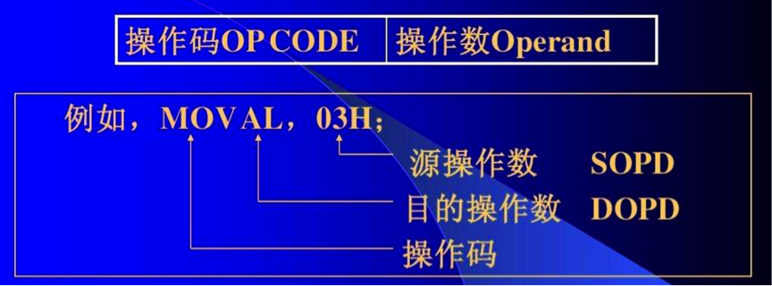
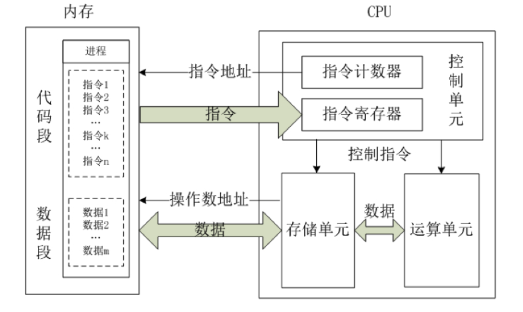
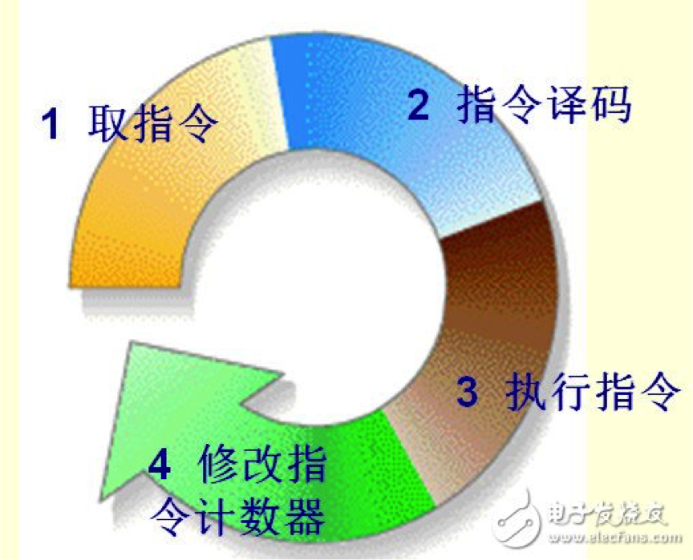
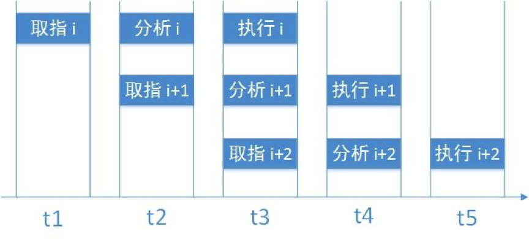
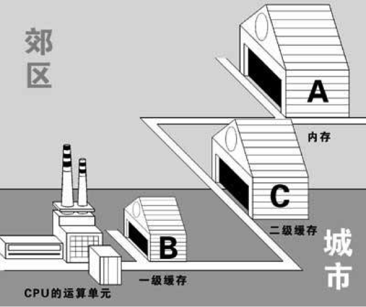
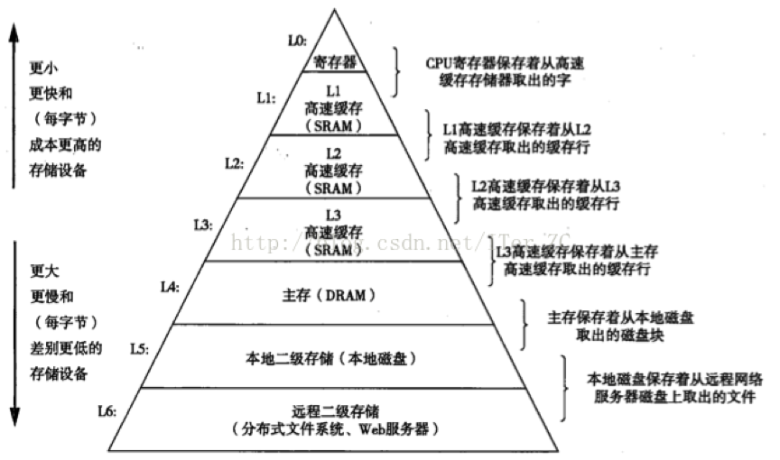

# 1、指令系统

## 1.1 x86架构

要讲CPU，就必须先讲一下指令系统。指令系统指的是一个CPU所能够处理的全部指令的集合，是一个CPU的根本属性。

我们现在所用的CPU绝大多数都采用**x86架构**，即采用了x86指令集的CPU。这是因为最早的那颗Intel发展出来的CPU代号称为8086，后来依此架构又开发出80286, 80386...， 因此这种架构的CPU就被称为x86架构了。在2003年以前由Intel所开发的x86架构CPU由8位升级到16、32位，后来AMD依此架构修改新一代的CPU为64位，为了区别两者的差异，因此64位的个人计算机CPU又被统称为**x86_64架构**。

之所以说指令系统是一个CPU的 根本属性，是因为指令系统决定了一个CPU能够运行什么样的程序。所有采用高级语言编出的程序，都需要翻译（编译或解释）成为机器语言后才能运行，这些机器语言中所包含的就是一条条的指令。

## 1.2 指令的格式

一条指令一般包括两个部分：操作码和地址码。

操作码其实就是指令序列号，用来告诉CPU需要执行的是那一条指令。类似于汇编语言里的mov，add，jmp等符号码。操作数则复杂一些，主要包括源操作数地址、目的地址和下一条指令的地址。在某些指令中，地址码可以部分或全部省略，比如一条空指令就只有操作码而没有地址码。

举个例子，某个指令系统的指令长度为32位，操作码长度为8位，地址长度也为8位，且第一条指令是加，第二条指令是减。当它收到一个 “00000010 00000100 00000001 00000110”的指令时，先取出它的前8位操作码，即00000010，分析得出这是一个减法操作，有3个地址，分别是两个源操作数地址和一个目的地址。于是，CPU就到内存地址00000100处取出被减数，到00000001处取出减数，送到 ALU中进行减法运算，然后把结果送到00000110处。

当然，这只是一个相当简单化的例子，实际情况要复杂的多。

## 1.3 指令的分类与寻址方式

一般说来，现在的指令系统有以下几种类型的指令：

- 算术逻辑运算指令
  算术逻辑运算指令包括加减乘除等算术运算指令，以及与、或、非、异或等逻辑运算指令。现在的指令系统还加入了一些十进制运算指令以及字符串运算指令等。
- 浮点运算指令
  用于对浮点数进行运算。浮点运算要大大复杂于整数运算，所以CPU中一般还会有专门负责浮点运算的浮点运算单元。现在的浮点指令中一般还加入了向量指令，用于直接对矩阵进行运算，对于现在的多媒体和3D处理很有用。

- 位操作指令
  在很多高级语言如C、Java中都有一组位操作语句，相对应地，指令系统中也有一组位操作指令，如左移一位、右移一位等。对于计算机内部以二进制补码表示的数据来说，这种操作是非常简单快捷的。

- 其他指令
  上面三种都是运算型指令，除此之外还有许多非运算的其他指令。这些指令包括：数据传送指令、堆栈操作指令、转移类指令、输入输出指令和一些比较特殊的指令，如特权指令、多处理器控制指令和等待、停机、空操作等指令。

对于指令中的地址码，也会有许多不同的寻址（编址）方式，主要有直接寻址，间接寻址，寄存器寻址，基址寻址，变址寻址等，某些复杂的指令系统会有几十种甚至更多的寻址方式。

## 1.4 CISC与RISC

**RISC**： Reduced Instruction Set Computer，精简指令系统计算机

**CISC**：Complex Instruction Set Computer，复杂指令系统计算机

一开始，计算机的指令系统只有很少一些基本指令，而其他的复杂指令全靠软件编译时通过简单指令的组合来实现。举个最简单的例子，一个a乘以b的操作就可以转换为a个b相加来做，这样就用不着乘法指令了。当然，最早的指令系统就已经有乘法指令了，这是为什么呢？因为用硬件实现乘法比加法组合来得快得多。

由于那时的计算机部件相当昂贵，而且速度很慢，为了提高速度，越来越多的复杂指令被加入了指令系统中。但是，很快又有一个问题：一个指令系统的指令数是受指令操作码的位数所限制的，如果操作码为8位，那么指令数最多为256条（2的8次方）。

那么怎么办呢？指令的宽度是很难增加的，聪明的设计师们又想出了一种方案：操作码扩展。前面说过，操作码的后面跟的是地址码，而有些指令是用不着地址码或只用少量的地址码的。那么，就可以把操作码扩展到这些位置。

举个简单的例子，如果一个指令系统的操作码为2位，那么可以有00、01、10、11四条不同的指令。现在把11作为保留，把操作码扩展到4位，那么 就可以有00、01、10、1100、1101、1110、1111七条指令。其中1100、1101、1110、1111这四条指令的地址码必须少两位。

然后，为了达到操作码扩展的先决条件：减少地址码，设计师们又动足了脑筋，发明了各种各样的寻址方式，如基址寻址、相对寻址等，用以最大限度的压缩地址码长度，为操作码留出空间。

就这样，慢慢地，CISC指令系统就形成了，大量的复杂指令、可变的指令长度、多种的寻址方式是CISC的特点，也是CISC的缺点：因为这些都大大增加了解码的难度，而在现在的高速硬件发展下，复杂指令所带来的速度提升早已不及在解码上浪费点的时间。除了个人PC市场还在用x86指令集外，服务器以及更大的系统都早已不用CISC了。x86仍然存在的唯一理由就是为了兼容大量的x86平台上的软件。

1975年，IBM的设计师John Cocke研究了当时的IBM370CISC系统，发现其中占总指令数仅20%的简单指令却在程序调用中占了80%，而占指令数80%的复杂指令却只有20%的机会用到。由此，他提出了RISC的概念。

事实证明，RISC是成功的。80年代末，各公司的RISC CPU如雨后春笋般大量出现，占据了大量的市场。

RISC的最大特点是指令长度固定，指令格式种类少，寻址方式种类少，大多数是简单指令且都能在一个时钟周期内完成，易于设计超标量与流水线，寄存器 数量多，大量操作在寄存器之间进行。

# 2、CPU内核结构

CPU（**C**entral **P**rocessing **U**nit,中央处理器）是一块超大规模的集成电路，主要由**运算单元、控制单元、存储单元**三部分组成。

## 2.1 控制单元

控制单元是整个CPU的指挥控制中心，由**指令寄存器IR**（InstrucTIon Register）、**指令译码器ID**（InstrucTIon Decoder）和**操作控制器OC**（Operation Controller）等，对协调整个电脑有序工作极为重要。它根据用户预先编好的程序，依次从存储器中取出各条指令，放在指令寄存器IR中，通过指令译码（分析）确定应该进行什么操作，然后通过操作控制器OC，按确定的时序，向相应的部件发出微操作控制信号。操作控制器OC中主要包括节拍脉冲发生器、控制矩阵、时钟脉冲发生器、复位电路和启停电路等控制逻辑。

## 2.2 运算单元

运算单元包括**算术逻辑运算单元ALU**（Arithmetic and Logic Unit）和**浮点运算单元FPU**（Floating Point Unit），

ALU主要完成对二进制数据的定点算术运算（加减乘除）、逻辑运算（与或非异或）以及移位操作。在某些CPU中还有专门用于处理移位操作的移位器。

通常ALU由两个输入端和一个输出端。整数单元有时也称为IEU（Integer Execution Unit）。**我们通常所说的“CPU是XX位的”就是指ALU所能处理的数据的位数**。

FPU主要负责浮点运算和高精度整数运算。有些FPU还具有向量运算的功能，另外一些则有专门的向量处理单元。

## 2.3 存储单元

存储单元包括CPU片内缓存和寄存器组，是CPU中暂时存放数据的地方，里面保存着那些等待处理的数据，或已经处理过的数据，CPU访问寄存器所用的时间要比访问内存的时间短。采用寄存器，可以减少CPU访问内存的次数，从而提高了CPU的工作速度。但因为受到芯片面积和集成度所限，寄存器组的容量不可能很大。寄存器组可分为**专用寄存器**和**通用寄存器**。

专用寄存器通常是一些状态寄存器，不能通过程序改变，由CPU自己控制，表明某种状态。

通用寄存器组是一组最快的存储器，用来保存参加运算的操作数和中间结果。用途广泛并可由程序员规定其用途，通用寄存器的数目因微处理器而异。

# 3、CPU工作原理

CPU的工作过程大体上可分为提取、解码、执行、写回四步。

## 3.1 提取

从存储器或缓存中检索指令（为数值或一系列数值）。由程序计数器（Program Counter）指定存储器的位置。(程序计数器保存供识别程序位置的数值。换言之，程序计数器记录了CPU在程序里的踪迹。)

## 3.2 解码

CPU根据存储器提取到的指令来决定其执行行为。在解码阶段，指令被拆解为有意义的片段。根据CPU的指令集定义将数值解译为指令。

## 3.3 执行

在提取和解码阶段之后，紧接着进入执行阶段。该阶段中，连接到各种能够进行所需运算的CPU部件。

例如，要求一个加法运算，算术逻辑单元ALU将会连接到一组输入和一组输出。输入提供了要相加的数值，而输出将含有总和的结果。ALU内含电路系统，易于输出端完成简单的普通运算和逻辑运算（比如加法和位元运算）。如果加法运算产生一个对该CPU处理而言过大的结果，在标志暂存器里可能会设置运算溢出（Arithmetic Overflow）标志。

## 3.4 写回

以一定格式将执行阶段的结果简单的写回。运算结果经常被写进CPU内部的暂存器，以供随后指令快速存取。在有些案例中，运算结果可能写进速度较慢，但容量较大且较便宜的主记忆体中。某些类型的指令会操作程序计数器，而不直接产生结果。这些一般称作“跳转”（Jumps），并在程式中带来循环行为、条件性执行（透过条件跳转）和函式。许多指令会改变标志暂存器的状态位元。这些标志可用来影响程式行为，缘由于它们时常显出各种运算结果。例如，以一个“比较”指令判断两个值大小，根据比较结果在标志暂存器上设置一个数值。这个标志可藉由随后跳转指令来决定程式动向。在执行指令并写回结果之后，程序计数器值会递增，反覆整个过程，下一个指令周期正常的提取下一个顺序指令。

总结一下，CPU的运行原理就是：控制单元在时序脉冲的作用下，将指令计数器里所指向的指令地址（这个地址是在内存里的）送到地址总线上去，然后CPU将这个地址里的指令读到指令寄存器进行译码。对于执行指令过程中所需要用到的数据，会将数据地址也送到地址总线，然后CPU把数据读到CPU的内部存储单元（就是内部寄存器）暂存起来，最后命令运算单元对数据进行处理加工。周而复始，一直这样执行下去，天荒地老，海枯石烂，直到停电。

# 4、CPU性能

## 4.1 主频、外频与倍频

CPU的**主频**，即CPU内核工作的时钟频率（CPU Clock Speed）。一个时钟周期内CPU能完成一次最基本的动作，比如某个CPU的主频为2.7 Ghz，即代表它可以每秒完成2.7*109（27亿）次最基本的动作，一条指令一般由多个基本动作组成。

CPU的主频不代表CPU的速度，但提高主频对于提高CPU运算速度却是至关重要的。

在计算机主板上，以CPU为主，内存和各种外围设备为辅，有许多设备要共同在一起工作。这些设备之间的联络，数据的交换，都必须正确无误，分秒不差。因此，它们必须要有一个固定的时钟来做时间上的校正，协调或者参考。这个时钟由主板上的时钟发生器产生，就是所谓的**外频**。

在早期的计算机中，内存与主板之间的同步运行的速度等于外频，在这种方式下，可以理解为CPU外频直接与内存相连通，实现两者间的同步运行状态。由于CPU工作频率不断提高，而PC机的一些其他设备（如插卡、硬盘等）却受到工艺的限制，不能承受更高的频率，因此限制了CPU频率的进一步提高。因此出现了倍频技术，该技术能够使CPU内部工作频率变为外部频率的倍数，从而通过提升倍频而达到提升主频的目的。

倍频系数是指CPU主频与外频之间的相对比例关系。它的作用是使系统总线工作在相对较低的频率上，而CPU速度可以通过倍频来提升。CPU主频计算方式为：

> **主频=外频 x 倍频**

## 4.2 超标量

CPU的性能是由什么决定的呢？单纯的一个ALU速度在一个CPU中并不起决定性作用，因为ALU的速度都差不多。而一个CPU的性能表现的决定性因素就在于CPU内核的设计。

既然无法大幅提高ALU的速度，有什么替代的方法呢？并行处理的方法又一次产生了强大的作用。所谓的超标量CPU，就是指集成了多个ALU、多个FPU、多个译码器和多条流水线的CPU，以并行处理的方式来提高性能。这种技术能够在相同的CPU主频下实现更高的CPU吞吐率。

## 4.3 流水线与超流水线

流水线技术是一种将每条指令分解为多步，并让各步操作重叠，从而实现几条指令并行处理的技术。程序中的指令仍是一条条顺序执行，但可以预先取若干条指令，并在当前指令尚未执行完时，提前启动后续指令的另一些操作步骤。这样显然可加速一段程序的运行过程。

对于一条具体的指令执行过程，通常可以分为五个部分：取指令，指令译码，取操作数，运算（ALU），写结果。其中前三步一般由指令控制器完成，后两步则由运算器完成。按照传统的方式，所有指令顺序执行，那么先是指令控制器工作，完成第一条指令的前三步，然后运算器工作，完成后两步；然后指令控制器工作， 完成第二条指令的前三步，再是运算器，完成第二条指令的后两部……很明显，当指令控制器工作时运算器基本上在休息，而当运算器在工作时指令控制器却在休息，造成了相当大的资源浪费。解决方法很容易想到，当指令控制器完成了第一条指令的前三步后，直接开始第二条指令的操作，运算单元也是。这样就形成了流水线系统，这是一条2级流水线。

如果是一个超标量系统，假设有三个指令控制单元和两个运算单元，那么就可以在完成了第一条指令的取址工作后直接开始第二条指令的取址，这时第一条指令在进行译码；然后第三条指令取址，第二条指令译码，第一条指令取操作数……这样就是一个5级流水线。

**超流水线**以增加流水线级数的方法来缩短机器周期，相同的时间内超级流水线执行了更多的机器指令。采用简单指令以加快执行速度是所有流水线的共同特点，但超级流水线配置了多个功能部件和指令译码电路，采用多条流水线并行处理，还有多个寄存器端口和总线，可以同时执行多个操作，因此比普通流水线执行的更快，在一个机器周期内可以流出多条指令。

超标量是指在CPU中有一条以上的流水线，并且每时钟周期内可以完成一条以上的指令，其实质是以空间换取时间。而超流水线是通过细化流水、提高主频，使得在一个机器周期内完成一个甚至多个操作，其实质是以时间换取空间。

流水线系统最大限度地利用了CPU资源，使每个部件在每个时钟周期都工作，大大提高了效率。但是，流水线有两个非常大的问题：相关和转移。

在一个流水线系统中，如果第二条指令需要用到第一条指令的结果，这种情况叫做**相关**。以上面哪个5级流水线为例，当第二条指令需要取操作数时，第一条指 令的运算还没有完成，如果这时第二条指令就去取操作数，就会得到错误的结果。所以，这时整条流水线不得不停顿下来，等待第一条指令的完成。这是很讨厌的问题，特别是对于比较长的流水线，比如20级，这种停顿通常要损失十几个时钟周期。目前解决这个问题的方法是**乱序执行**。乱序执行的原理是在两条相关指令中插入不相关的指令，使整条流水线顺畅。比如上面的例子中，开始执行第一条指令后直接开始执行第三条指令（假设第三条指令不相关），然后才开始执行第二条指令，这样当第二条指令需要取操作数时第一条指令刚好完成，而且第三条指令也快要完成了，整条流水线不会停顿。当然，流水线的阻塞现象还是不能完全避免的，尤其是当相关指令非常多的时候。

另一个大问题是**条件转移**。在上面的例子中，如果第一条指令是一个条件转移指令，那么系统就会不清楚下面应该执行那一条指令？这时就必须等第一条指令的判断结果出来才能执行第二条指令。条件转移所造成的流水线停顿甚至比相关还要严重的多。所以，现在采用**分支预测技术**来处理转移问题。虽然我们的程序中充满着分支，而且哪一条分支都是有可能的，但大多数情况下总是选择某一分支。比如一个循环的末尾是一个分支，除了最后一次我们需要跳出循环外，其他的时候我们 总是选择继续循环这条分支。根据这些原理，分支预测技术可以在没有得到结果之前预测下一条指令是什么，并执行它。现在的分支预测技术能够达到90%以上的正确率，但是，一旦预测错误，CPU仍然不得不清理整条流水线并回到分支点。这将损失大量的时钟周期。

越是长的流水线，相关和转移两大问题也越严重，所以，流水线并不是越长越好，超标量也不是越多越好，找到一个速度与效率的平衡点才是最重要的。

## 4.4 缓存

说到CPU，不得不说的就是CPU缓存，目前CPU的缓存已经成了衡量CPU性能的一个必要指标，那么CPU缓存到底对CPU性能的影响有多大呢?

我们知道，CPU执行指令时，会将执行结果放在一个叫“寄存器”的元件中，由于“寄存器”集成在CPU内部，与ALU等构成CPU的重要元件，因此寄存器中的指令很快被CPU所访问，但毕竟寄存器的容量太小，CPU所需的大量指令和数据还在内存（RAM）当中，所以CPU为了完成指令操作，需要频繁地向内存发送接收指令、数据。由于CPU运算速度要比内存读写速度快很多，这样会使CPU花费很长时间等待数据到来或把数据写入内存，所以传统的系统瓶颈在这里就产生了。

实际工作时，CPU往往需要重复读取同样的数据块，所以人们在CPU内部集成了一个比内存快许多的“Cache”，这就是最早的“高速缓存”。

按照数据读取顺序和与CPU结合的紧密程度，CPU缓存可以分为一级缓存，二级缓存，部分高端CPU还具有三级缓存。

每一级缓存中所储存的全部数据都是下一级缓存的一部分，这三种缓存的技术难度和制造成本是相对递减的，所以其容量也是相对递增的。当CPU要读取一个数据时，首先从一级缓存中查找，如果没有找到再从二级缓存中查找，如果还是没有就从三级缓存或内存中查找。一般来说，每级缓存的命中率大概都在80%左右，也就是说全部数据量的80%都可以在一级缓存中找到，只剩下20%的总数据量才需要从二级缓存、三级缓存或内存中读取，由此可见一级缓存是整个CPU缓存架构中最为重要的部分。

 

CPU从不同介质读写数据的对比如下图所示：

可以发现：1.越往上存储容量越小，存取速度越快，成本越高，反之亦然；一层存储器只和下层存储器打交道，不会跨级访问，下层作为上层的一个缓存。

**CPU要访问的数据的最终一般都经过主存，主存可以看做作下层其他设备的一个缓存，其他设备的数据最终都要进入主存才能被CPU访问到**。比如磁盘文件读取操作，CPU只发起操作请求，具体的数据操作不需要经过CPU，由DMA(Direct Memory Access)来操作IO和主存的交互，当操作完成后，IO设备发出中断，通知CPU操作完成。