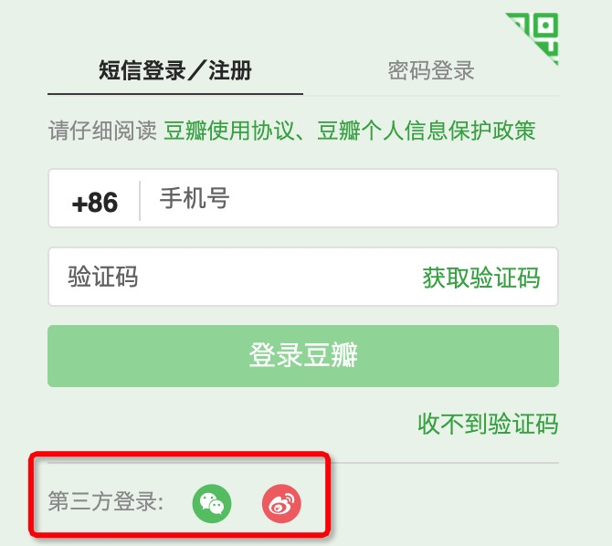
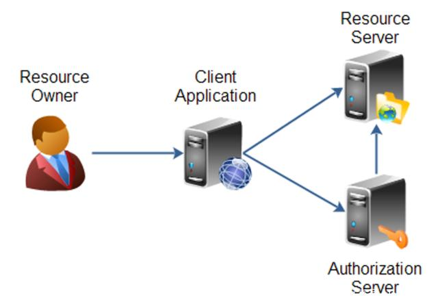
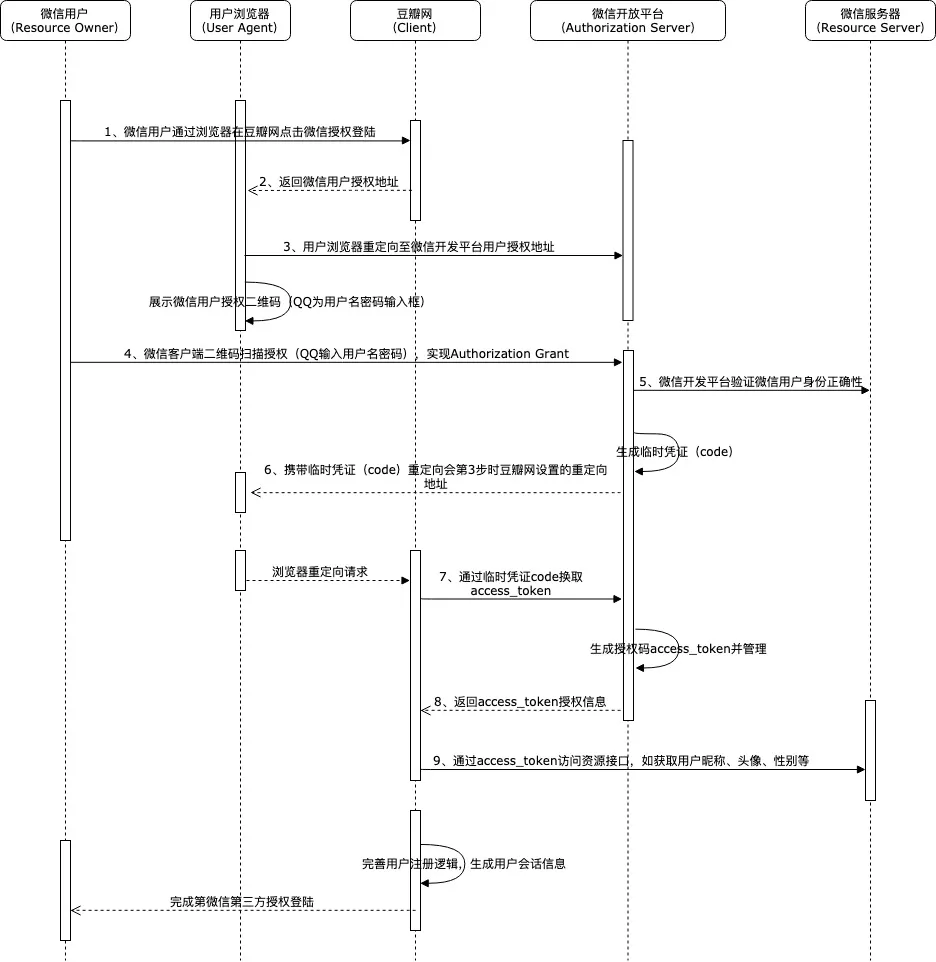
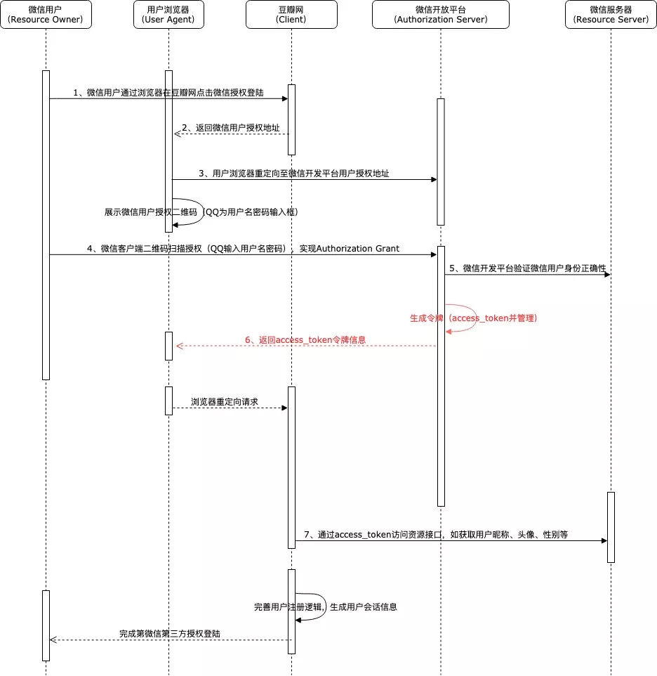
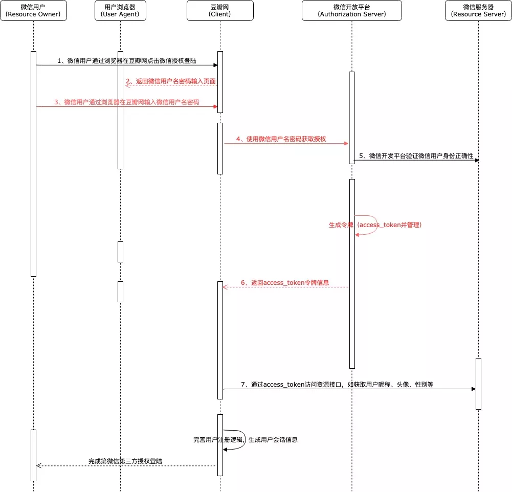

# 1、什么是OAuth

大家也许都有过这样的体验，我们登录一些软件或网站的时候可以使用QQ、微信或者微博等账号进行授权登陆。例如我们登陆豆瓣网的时候，如果不想单独注册豆瓣网账号的话，就可以选择用微博或者微信账号进行授权登录。

那么这样的第三方登陆方式到底是怎么实现的呢？难道是腾讯把我们QQ或者微信的账户信息卖给了这些网站吗？尽管腾讯为了挣钱干过不少坏事，但是坏事能干，傻事它是不会干的。实际上，这种登录方式的实现就是本文要介绍的**OAuth2.0**。类似地，在公司内部，如果公司有多套不同的软件系统，例如我们日常使用的GitLab代码管理、公司内网系统、财务报销系统以及很多业务系统的管理后台，是不是也可以实现一个员工账号就能授权访问所有以上这些系统，而不需要每个系统都开通单独的账号，设置独立的密码才行呢？实际上在很多公司都是可以实现这种效果的，这也就是我们通常所说的**SSO单点登录**系统。

> **OAuth**的英文全称是`Open Authorization`，它是一种**开放授权协议**，允许第三方应用程序使用资源所有者的凭据获得对资源有限访问权限。

OAuth 2.0 是目前的主流版本，它率先被Google, Yahoo, Microsoft, Facebook等使用。之所以标注为 2.0，是因为最初有一个1.0协议，但这个1.0协议被弄得太复杂，易用性差，而且存在严重安全漏洞，所以没有得到普及。2.0是一个新的设计，协议简单清晰，但它并不兼容1.0，与1.0没什么关系。

例如在前面的例子中，通过微信登录豆瓣网的过程，就相当于微信允许豆瓣网作为第三方应用程序在经过微信用户授权后，通过**微信颁发的授权凭证**有限地访问用户的微信头像、手机号，性别等受限制的资源，从而来构建自身的登录逻辑。

当然，微信是不会直接将用户的用户名、密码等信息作为凭证返回给豆瓣的。这种**授权访问凭证**一般来说就是一个表示特定范围、生存周期和其访问权限的一个由字符串组成的**访问令牌**(Access Token)。在这种模式下OAuth2.0协议中通过引入一个**授权层**来将第三方应用程序与资源拥有者进行分离，而这个授权层也就是我们常说的“**auth认证服务**/**sso单点登录服务器**”。

# 2、协议详解

## 2.1 角色

在OAuth2.0协议中定义了以下四个角色：

- **resource owner（资源拥有者）**：能够有权授予对保护资源访问权限的实体。例如我们使用通过微信账号登陆豆瓣网，而微信账号信息的实际拥有者就是微信用户，也被称为最终用户。
- **resource server（资源服务器）**：承载受保护资源的服务器，能够接收使用访问令牌对受保护资源的请求并响应，它与授权服务器可以是同一服务器，也可以是不同服务器。在上述例子中该角色就是微信服务器。
- **client（客户端）**：代表资源所有者及其授权发出对受保护资源请求的应用程序。在上面的例子中豆瓣网就是这样的角色。
- **authorization server（授权服务器）**：认证服务器，即服务提供商专门用来处理认证授权的服务器。例如微信开放平台提供的认证服务的服务器。

## 2.2 授权模式

OAuth2.0定义了四种授权模式，它们分别是：

- 授权码模式（authorization code）
- 简化模式（implicit）
- 密码模式（resource owner password credentials）
- 客户端模式（client credentials）

### 2.2.1 授权码模式

授权码模式是**功能最完整、流程最严密的授权模式**。它的特点是通过客户端的后台服务器，与服务提供商的认证服务进行互动（如微信开放平台）。

这种模式下授权代码并不是客户端直接从资源所有者获取，而是通过授权服务器作为中介来获取，授权认证的过程也是资源所有者直接通过授权服务器进行身份认证，避免了资源所有者身份凭证与客户端共享的可能，因此是十分安全的。例如，微信用户授权登录豆瓣网的过程中，微信授权认证是直接在微信的网站上进行的，即便是输入用户名密码也只有微信授权认证服务器可以获取，因此豆瓣网是感知不到的，从而避免了微信用户账号信息在第三方网站泄露的风险。

还是以微信授权登陆豆瓣网举例，流程如下：

1. 首先微信用户点击豆瓣网微信授权登录按钮后，豆瓣网会将请求通过URL重定向的方式跳转至微信用户授权界面；
2. 此时微信用户实际上是在微信上进行身份认证，与豆瓣网并无交互了，这一点非常类似于我们使用网银支付的场景；
3. 用户使用微信客户端扫描二维码认证或者输入用户名密码后，微信会验证用户身份信息的正确性，如正确，则认为用户确认授权微信登录豆瓣网，此时会先生成一个临时凭证，并携带此凭证通过用户浏览器将请求重定向回豆瓣网在第一次重定向时携带的callBackUrl地址；
4. 之后用户浏览器会携带临时凭证code访问豆瓣网服务，豆瓣网则通过此临时凭证再次调用微信授权接口，获取正式的访问凭据access_token；
5. 在豆瓣网获取到微信授权访问凭据access_token后，此时用户的授权基本上就完成了，后续豆瓣网要做的只是通过此token再访问微信提供的相关接口，获取微信允许授权开发的用户信息，如头像，昵称等，并据此完成自身的用户逻辑及用户登录会话逻辑。

### 2.2.3 简化模式

简化模式是对授权码模式的简化，用于在浏览器中使用脚本语言如JS实现的客户端中，它的特点是不通过客户端应用程序的服务器，而是直接在浏览器中向认证服务器申请令牌，跳过了“授权码临时凭证”这个步骤。其所有的步骤都在浏览器中完成，令牌对访问者是可见的，且客户端不需要认证。如果我们使用此种授权方式来实现微信登录豆瓣网的过程的话，流程如下：

从上面的流程中可以看到在第4步用户完成授权后，认证服务器是直接返回了access_token令牌至用户浏览器端，而并没有先返回授权码，然后由客户端的后端服务去通过授权码再去获取access_token令牌，从而省去了一个跳转步骤，提高了交互效率。

但是由于这种方式访问令牌access_token会在URL片段中进行传输，因此可能会导致访问令牌被其他未经授权的第三方截取，所以安全性上并不是那么的强壮。

### 2.2.4 密码模式

在密码模式中，用户需要向客户端提供自己的用户名和密码，客户端使用这些信息向“服务提供商”索要授权。这相当于在豆瓣网中使用微信登录，我们需要在豆瓣网输入微信的用户名和密码，然后由豆瓣网使用我们的微信用户名和密码去向微信服务器获取授权信息。

这种模式一般用在用户对客户端高度信任的情况下，因为虽然协议规定客户端不得存储用户密码，但是实际上这一点并不是特别好强制约束。就像在豆瓣网输入了微信的用户名和密码，豆瓣网存储不存储我们并不是很清楚，所以安全性是非常低的。因此一般情况下是不会考虑使用这种模式进行授权的。

假设微信登录豆瓣网的过程使用了此种客户端授权模式，其流程如下：

以上模式逻辑主要在服务器端实现，无法避免客户端应用程序对授权方身份信息的存储，所以一般情况下是不会采用这种授权模式的。

### 2.2.5 客户端模式

客户端模式是指客户端以自己的名义，而不是以用户的名义，向“服务提供方”进行认证。严格地说，客户端模式并不属于OAuth2.0协议所要解决的问题。在这种模式下，用户并不需要对客户端授权，用户直接向客户端注册，客户端以自己的名义要求“服务提供商”提供服务。

这种类似于之前共享单车比较火的情况下，出现的全能车的模式，即用户向全能车注册，全能车以自己平台设立的共享账户去开各种品牌的单车。

### 2.2.6 总结

虽然在OAuth2.0协议中定义了四种客户端授权认证模式，但是实际上**大部分实际应用场景中使用的都是授权码的模式**，如微信开放平台、微博开放平台等，除此之外的其他三种认证模式比较悲催，属于陪跑的角色。

