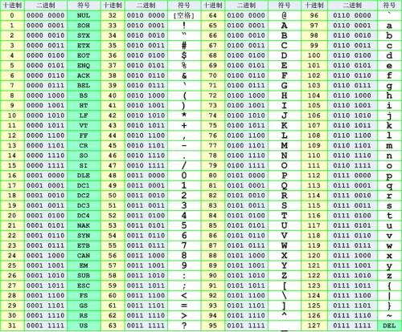

# 1、引言

在显示器上看见的文字、图片等信息在电脑里面其实并不是我们看见的样子，即使你知道所有信息都存储在硬盘里，把它拆开也看不见里面有任何东西，只有些盘片。假设，你用显微镜把盘片放大，会看见盘片表面凹凸不平，凸起的地方被磁化，凹的地方是没有被磁化；凸起的地方代表数字1，凹的地方代表数字0。硬盘只能用0和1来表示所有文字、图片等信息。那么字母“A”在硬盘上是如何存储的呢？

可能小张计算机存储字母”A”是1100001，而小王存储字母”A”是11000010，这样双方交换信息时就会误解。比如小张把1100001发送给小王，小王并不认为1100001是字母“A”，可能认为这是字母“X”，于是小王在用记事本访问存储在硬盘上的1100001时，在屏幕上显示的就是字母“X”。也就是说，小张和小王使用了不同的编码表。小张用的编码表是ASCII，ASCII编码表把26个字母都一一的对应到2进制1和0上；小王用的编码表可能是EBCDIC，只不过EBCDIC编码与ASCII编码中的字母和01的对应关系不同。

一般地说，开放的操作系统（LINUX 、WINDOWS等）采用ASCII 编码，而大型主机系统（MVS 、OS/390等）采用EBCDIC 编码。在发送数据给对方前，需要事先告知对方自己所使用的编码，或者通过转码，使不同编码方案的两个系统可沟通自如。

# 2、ASCII编码

ASCII是基于拉丁字母的一套电脑编码系统，它主要用于显示现代英语和其他西欧语言，是现今最通用的单字节编码系统，并等同于国际标准ISO/IEC 646。

请注意，ASCII是`American Standard Code for Information Interchange`缩写，而不是ASC2，有很多人在这个地方产生误解。

ASCII 码使用指定的7 位或8 位二进制数组合来表示128 或256 种可能的字符。**标准ASCII 码**也叫**基础ASCII码**，使用7 位二进制数来表示所有的大写和小写字母，数字0 到9、标点符号， 以及在美式英语中使用的特殊控制字符。其中：

- 0～31及127(共33个)是控制字符或通信专用字符（其余为可显示字符）
- 32～126(共95个)是字符(32是空格），其中48～57为0到9十个阿拉伯数字
- 65～90为26个大写英文字母，97～122号为26个小写英文字母，其余为一些标点符号、运算符号等

标准ASCII码如下：



同时还要注意，在标准ASCII中，其最高位(b7)用作**奇偶校验位**。所谓奇偶校验，是指在代码传送过程中用来检验是否出现错误的一种方法，一般分奇校验和偶校验两种：

- 奇校验：正确的代码一个字节中1的个数必须是奇数，若非奇数，则在最高位b7添1；
- 偶校验：正确的代码一个字节中1的个数必须是偶数，若非偶数，则在最高位b7添1。

**扩展ASCII 字符**是从128 到255（0x80-0xff）的字符。许多基于x86的系统都支持使用扩展（或“高”）ASCII。它将每个字符的第8 位用于确定附加的128 个特殊符号字符、外来语字母和图形符号。**针对扩展的ASCII码，不同的国家有不同的字符集，所以它并不是国际标准。**

# 3、ISO-8859-1编码

ISO-8859-1编码是单字节编码，向下兼容ASCII，其编码范围是`0x00`-`0xFF`，`0x00`-`0x7F`之间完全和ASCII一致，`0x80`-`0x9F`之间是控制字符，`0xA0`-`0xFF`之间是文字符号。

ISO-8859-1收录的字符除ASCII收录的字符外，还包括西欧语言、希腊语、泰语、阿拉伯语、希伯来语对应的文字符号。欧元符号出现的比较晚，没有被收录在ISO-8859-1当中。

ISO-8859-1 的较低部分（从 1 到 127 之间的代码）是最初的7位 ASCII。

ISO-8859-1 的较高部分（从 160 到 255 之间的代码）全都有实体名称。

因为ISO-8859-1编码范围使用了单字节内的所有空间（即8位，0-255），在支持ISO-8859-1的系统中传输和存储其他任何编码的字节流都不会被抛弃。换言之，把其他任何编码的字节流当作ISO-8859-1编码看待都没有问题。这是个很重要的特性，MySQL数据库默认编码是Latin1就是利用了这个特性。ASCII编码是一个7位的容器，ISO-8859-1编码是一个8位的容器。

Latin1是ISO-8859-1的别名，有些环境下写作Latin-1。

# 4、ANSI 标准

ASCII是美国标准，所以它不能良好满足其它国家的需要。例如英国的英镑符号（￡），拉丁语字母表重音符号，使用斯拉夫字母表的希腊语、希伯来语、阿拉伯语和俄语，还有汉字系统的中国象形汉字，日本语和朝鲜语等等。

**多字节字符集** (MBCS，Multi-Byte Chactacter Set) 是一种旧的方式以支持无法用单字节表示的字符集（如日文和中文）的方法。最常见的 MBCS 实现是双字节字符集 (DBCSI，Double-Byte Character Set)。在DBCSI系列标准里，最大的特点是两字节长的汉字字符和一字节长的英文字符并存于同一套编码方案里，因此程序为了支持中文处理，必须要注意字串里的每一个字节的值，如果这个值是大于127的，那么就认为一个双字节字符集里的字符出现了。

为了扩充ASCII编码，以用于显示本国的语言，不同的国家和地区制定了不同的标准，由此产生了 GB2312， BIG5， JIS 等各自的编码标准。这些使用 2 个字节来代表一个字符的各种延伸编码方式，称为 **ANSI 编码**（American National Standards Institute，美国国家标准学会），也称为**MBCS编码**。在简体中文系统下，ANSI 编码代表 GB2312 编码，在日文操作系统下，ANSI 编码代表 JIS 编码，所以在中文 windows下要转码成GB2312，gbk只需要把文本保存为ANSI 编码即可。 

不同 ANSI 编码之间互不兼容，当信息在国际间交流时，无法将属于两种语言的文字，存储在同一段 ANSI 编码的文本中。一个很大的缺点是，同一个编码值，在不同的编码体系里代表着不同的字。这样就容易造成混乱。导致了Unicode码的诞生。

当然对于ANSI编码而言，`0x00`~`0x7F`（即十进制下的0到127）之间的字符，依旧是1个字节代表1个字符。这一点是ASNI编码与Unicode编码之间最大也最明显的区别。

# 5、GB2312 编码

GB2312 是ANSI编码里的一种，对ANSI编码最初始的ASCII编码进行扩充，为了满足国内在计算机中使用汉字的需要，中国国家标准总局发布了一系列的汉字字符集国家标准编码，统称为**GB码**，或**国标码**。其中最有影响的是于1980年发布的*《信息交换用汉字编码字符集基本集》*，标准号为GB 2312-1980，因其使用非常普遍，也常被通称为国标码。GB2312编码通行于我国内地；新加坡等地也采用此编码。几乎所有的中文系统和国际化的软件都支持GB 2312。

一个小于127的字符的意义与原来相同，但两个大于127的字符连在一起时，就表示一个汉字，前面的一个字节（称之为高字节）从`0xA1`用到`0xF7`，后面一个字节（低字节）从`0xA1`到`0xFE`，这样我们就可以组合出大约7000多个简体汉字了。在这些编码里，我们还把数学符号、罗马希腊的 字母、日文的假名们都编进去了，连在 ASCII 里本来就有的数字、标点、字母都统统重新编了两个字节长的编码，这就是常说的"全角"字符，而原来在127号以下的那些就叫"半角"字符了。

为避免同西文的存储发生冲突，GB2312字符在进行存储时，通过将原来的每个字节第8bit设置为1同西文加以区别，如果第8bit为0，则表示西文字符，否则表示GB2312中的字符。

GB2312是一个简体中文字符集，由6763个常用汉字和682个全角的非汉字字符组成。其中汉字根据使用的频率分为两级。一级汉字3755个，二级汉字3008个。

# 6、GBK编码

GB2312的出现，基本满足了汉字的计算机处理需要，但对于人名、古汉语等方面出现的罕用字，GB2312不能处理，这导致了后来gbk及GB 18030汉字字符集的出现。gbk是对GB2312的扩展。

gbk采用双字节表示，总体编码范围为`8140`-`FEFE`，首字节在`81`-`FE` 之间，尾字节在`40`-`FE` 之间，剔除 `xx7F`一条线。总计23940 个码位，gbk编码标准兼容GB2312，共收录汉字21003个、符号883个，并提供1894个造字码位，简、繁体字融于一库。

# 7、BIG-5编码

BIG-5码，又称为**大五码**或者五**大码**，是通行于台湾、香港地区的一个繁体字编码方案。相当于港台地区的GB2312编码，也是ANSI编码的一种。

# 8、UTF编码

## 8.1 Unicode字符集

如上ANSI编码条例中所述，世界上存在着多种编码方式，在ANSI编码下，同一个编码值，在不同的编码体系里代表着不同的字。在简体中文系统下，ANSI 编码代表 GB2312 编码，在日文操作系统下，ANSI 编码代表 JIS 编码，可能最终显示的是中文，也可能显示的是日文。在ANSI编码体系下，要想打开一个文本文件，不但要知道它的编码方式，还要安装有对应编码表，否则就可能无法读取或出现乱码。为什么电子邮件和网页都经常会出现乱码，就是因为信息的提供者可能是日文的ANSI编码体系和信息的读取者可能是中文的编码体系，他们对同一个二进制编码值进行显示，采用了不同的编码，导致乱码。这个问题促使了Unicode码的诞生。

如果有一种编码，将世界上所有的符号都纳入其中，无论是英文、日文、还是中文等，大家都使用这个编码表，就不会出现编码不匹配现象。每个符号对应一个唯一的编码，乱码问题就不存在了。这就是Unicode编码。

**通用字符集**（Universal Character Set， UCS）是由ISO制定的ISO 10646（或称ISO/IEC 10646）标准所定义的标准字符集。编码层面上，UCS-2就是用两个字节编码，UCS-4就是用4个字节（实际上只用了31位，最高位必须为0）编码。UCS-2有2^16=65536个码位，UCS-4有2^31=2147483648个码位。

Unicod当然是一个很大的集合，现在的规模可以容纳100多万个符号。每个符号的编码都不一样，比如，`U+0639`表示阿拉伯字母`Ain`，`U+0041`表示英语的大写字母`A`，“汉”这个字的Unicode编码是`U+6C49`。


需要注意的是，Unicode只是一个字符集，它只规定了符号与二进制代码之间的对应关系，却没有规定这个二进制代码应该如何存储。

比如，汉字“严”的unicode是十六进制数`4E25`，转换成二进制数足足有15位（100111000100101），也就是说这个符号的表示至少需要2个字节。表示其他更大的符号，可能需要3个字节或者4个字节，甚至更多。

这里就有两个严重的问题，第一个问题是，如何才能区别Unicode和ASCII？计算机怎么知道三个字节表示一个符号，而不是分别表示三个符号呢？第二个问题是，我们已经知道，英文字母只用一个字节表示就够了，如果Unicode统一规定，每个符号用三个或四个字节表示，那么每个英文字母前都必然有二到三个字节是0，这对于存储来说是极大的浪费，文本文件的大小会因此大出二三倍，这是无法接受的。

它们造成的结果是：

- 出现了Unicode的多种存储方式，也就是说有许多种不同的二进制格式，可以用来表示Unicode。
- Unicode在很长一段时间内无法推广，直到互联网的出现。

## 8.2 UTF-8 编码

UTF-8是Unicode的实现方式之一。

UTF-8（UCS Transformation Format 8bit）就是在互联网上使用最广的一种Unicode的实现方式。其他实现方式还包括UTF-16（字符用两个字节或四个字节表示）和UTF-32（字符用四个字节表示），不过在互联网上用的很少。

UTF-8最大的一个特点，就是**它是一种变长的编码方式**。它可以使用1~4个字节表示一个符号，根据不同的符号而变化字节长度。

UTF-8的编码规则很简单，只有二条：

- 对于单字节的符号，字节的第一位设为0，后面7位为这个符号的unicode码。因此对于英语字母，UTF-8编码和ASCII码是相同的。
- 对于n字节的符号（n>1），第一个字节的前n位都设为1，第n+1位设为0，后面字节的前两位一律设为10。剩下的没有提及的二进制位，全部为这个符号的unicode码。

从Unicode到UTF-8的编码方式如下：

| Unicode编码(十六进制) | UTF-8 字节流(二进制)                |
| --------------------- | ----------------------------------- |
| 000000 - 00007F       | 0xxxxxxx                            |
| 000080 - 0007FF       | 110xxxxx 10xxxxxx                   |
| 000800 - 00FFFF       | 1110xxxx 10xxxxxx 10xxxxxx          |
| 010000 - 10FFFF       | 11110xxx 10xxxxxx 10xxxxxx 10xxxxxx |

例如，“汉”字的Unicode编码是`0x6C49`。`0x6C49`在`0x0800`-`0xFFFF`之间，使用用3字节模板了：

`1110xxxx 10xxxxxx 10xxxxxx`

将`0x6C49`写成二进制是：

`0110 1100 0100 1001` 

用这个比特流依次代替模板中的x，得到：

`11100110 10110001 10001001`

即`E6 B1 89`就是“汉”的UTF-8码。

很多细心的人会发现，新建一个空的文本文件，用记事本打开（必须是Windows自带的记事本），只输入“联通”二字保存关闭，再重新打开时将是乱码。

在保存这个操作中，windows默认保存的编码是ANSI（实际上应该是GBK）。

这样联通这两个字的二进制内码是：（一个字占两个字节）

```
c1   1100 0001
aa   1010 1010
cd   1100 1101
a8   1010 1000
```

巧合的地方在于“联通”这两个字的ANSI编码符合UTF-8编码的第二个模板。

当txt文档中一切字符都在 C0≤AA（第一个字节）≤DF 80≤BB（第二个字节）≤BF 这个范围时，notepad都无法确认文档的格式，自动依照UTF-8格式来解码。 而“联通”就是`C1 AA CD A8`，刚好在上面的范围内，所以不能正常显现。

假如保存时选择Unicode、Unicode (Big Endian)、UTF-8编码，就正常了。此外，假如以ANSI编码保存含有某些特别符号的文本文档，再次打开后符号也会变成英文问号。

# 9、Little endian和Big endian

UTF-8、UTF-16、UTF-32等显现了Unicode的编码方式，但是还有一个问题，编码后应该如何存储？

这里就要引出两个名词：

- **LE**（little endian)：小字节字节序，意思就是一个单元在计算机中的存放时按照低位在前（低地址），高位在后（高地址）的模式存放。
- **BE**（big endian)：大字节字节序，和LE相反，是高位在前，低位在后。

比如一个unicode编码为：`0x006C49`，如果是LE，那么在文件中的存放顺序应该是：`49 6c 00`；如果是BE ，那么顺序应该是：`00 6c 49`。

这两个古怪的名称来自英国作家斯威夫特的《格列佛游记》。在该书中，小人国里爆发了内战，战争起因是人们争论，吃鸡蛋时究竟是从大头(Big-Endian)敲开还是从小头(Little-Endian)敲开。为了这件事情，前后爆发了六次战争，一个皇帝送了命，另一个皇帝丢了王位。

那么很自然的，就会出现另一个一个问题：计算机怎么知道某一个文件到底采用哪一种方式编码？

Unicode规范中定义，每一个文件的最前面分别加入一个表示编码顺序的字符，这个字符的名字叫做"**零宽度非换行空格**"（ZERO WIDTH NO-BREAK SPACE），用FEFF表示。这正好是两个字节，而且FF比FE大1。这些编码在unicode 中是没有使用的，所以不用担心会冲突。

这种方式叫做**BOM**（Byte Order Mark）头，意思是字节序标志头。通过它基本能确定编码格式和字节序。

如果一个文本文件的头两个字节是FE FF，就表示该文件采用大字节字节序；如果头两个字节是FF FE，就表示该文件采用小字节字节序。

BOM检测不能保证100%准确，只能通过编码范围从概率上来检查，虽然准确度还是比较高，但是不能保证100%。所以，时常看到检测错误的软件，也不奇怪了。