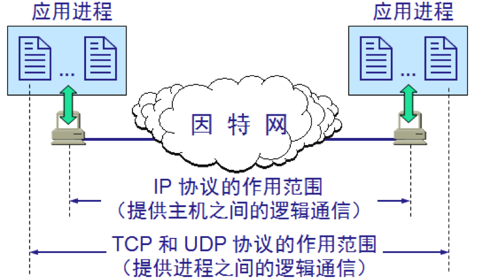
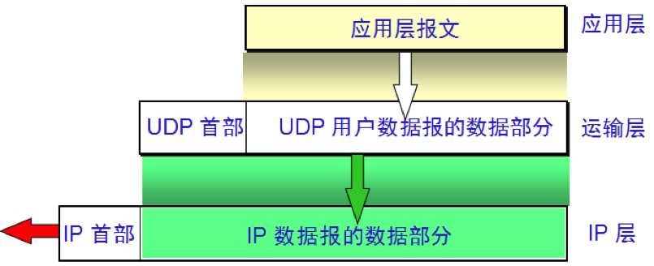
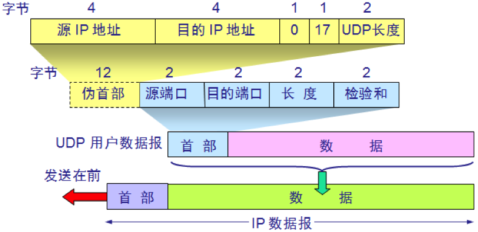
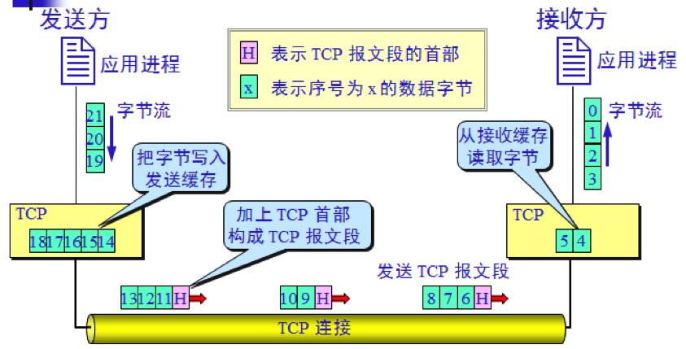
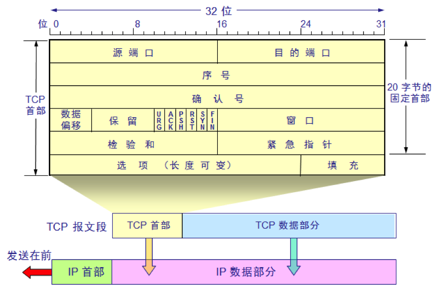
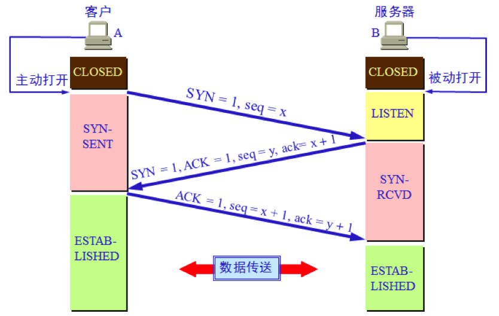
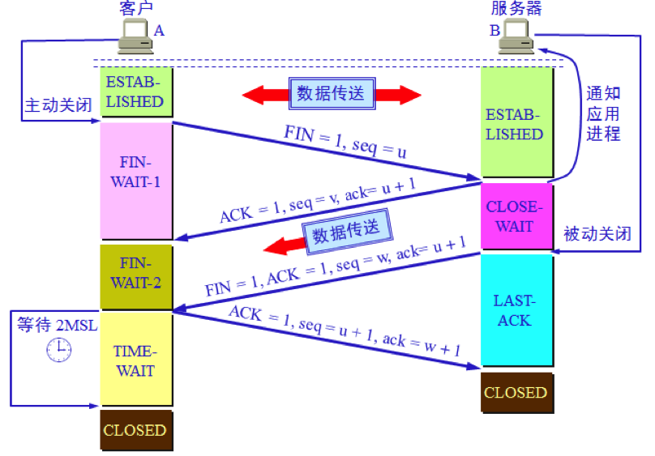
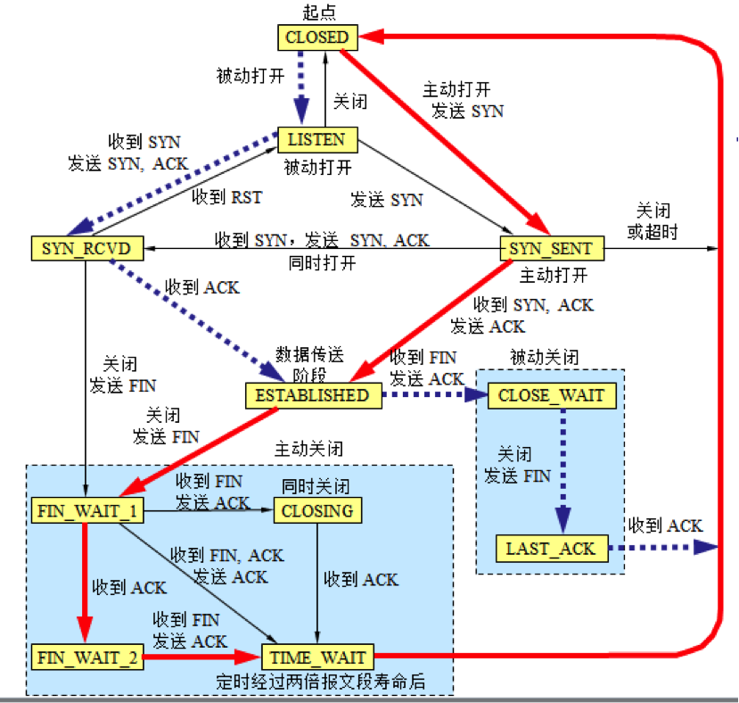

# 1、概述

运输层向它上面应用层提供通信服务，它属于面向通信部分的最高层，同时也是用户功能中的最底层。

两个主机进行通信实际上就是两个主机中的应用进程互相通信，应用进程之间的通信又称为端到端的通信。

应用层不同进程的报文通过不同的端口向下交到运输层，再往下就共用网络层提供的服务。

运输层为应用进程之间提供端到端的逻辑通信（但网络层是为主机之间提供逻辑通信）。运输层还要对收到的报文进行差错检测。

运输层需要有两种不同的运输协议：  

- **用户数据报协议 UDP** (User Datagram Protocol)
  UDP 在传送数据之前不需要先建立连接。对方的运输层在收到 UDP 报文后，不需要给出任何确认。虽然 UDP 不提供可靠交付，但在某些情况下 UDP 是一种最有效的工作方式。
- **传输控制协议 TCP** (Transmission Control Protocol)
  TCP 则提供面向连接的服务。TCP 不提供广播或多播服务。由于 TCP 要提供可靠的、面向连接的运输服务，因此不可避免地增加了许多的开销。 

# 2、端口号

为了使运行不同操作系统的计算机的应用进程能够互相通信，就必须用统一的方法对 TCP/IP 体系的应用进程进行标志。
解决这个问题的方法就是在运输层使用**协议端口号**(protocol port number)，或通常简称为**端口**(port)。

虽然通信的终点是应用进程，但我们可以把端口想象是通信的终点，因为我们只要把要传送的报文交到目的主机的某一个合适的目的端口，剩下的工作（即最后交付目的进程）就由 TCP 来完成。

端口用一个 16 位端口号进行标志。

端口号只具有本地意义，即端口号只是为了标志本计算机应用层中的各进程。在因特网中不同计算机的相同端口号是没有联系的。

## 2.1 服务端使用的端口号

这里又分为两类，最重要的一类叫做**熟知端口**（well-known port number），数值一般为 0~1023。管理机构IANA把这些端口指派给TCP/IP最重要的一些应用程序，让所有用户都知道。

| 端口号 | 描述                                                         |
| ------ | ------------------------------------------------------------ |
| 21     | FTP文件传输协议的端口号                                      |
| 23     | Telnet远程终端协议的端口号                                  |
| 25     | SMTP简单邮件传输协议的端口号 |
| 53     | DNS域服务器所开放的端口 |
| 69     | TFTP简单文件传送协议的端口号 |
| 80     | HTTP超文本传输协议的端口号 |
| 110    | POP3邮局协议版本3的端口号 |
| 161    | SNMP简单网络管理协议 的端口号 |
| 162    | SNMP简单网络管理协议的端口号 |
| 520    | RIP路由信息协议的端口号  |

另一类叫登记端口号，数值为1024~49151，为没有熟知端口号的应用程序使用的。使用这个范围的端口号必须在 IANA 登记，以防止重复。

## 2.2 客户端使用的端口号

数值为49152~65535，留给客户进程选择暂时使用，仅在客户进程运行时彩动态选择，因此又叫**短暂端口号**。当服务器进程收到客户进程的报文时，就知道了客户进程所使用的动态端口号。通信结束后，这个端口号可供其他客户进程以后使用。

# 3、用户数据报协议 UDP

UDP 只在 IP 的数据报服务之上增加了很少一点的功能，即端口的功能和差错检测的功能。

UDP 是无连接的，即发送数据之前不需要建立连接。

UDP 使用**尽最大努力交付**，即不保证可靠交付，同时也不使用拥塞控制。

UDP 是面向报文的。UDP 没有拥塞控制，很适合多媒体通信的要求。 

UDP 支持一对一、一对多、多对一和多对多的交互通信。

UDP 的首部开销小，只有 8 个字节。

发送方 UDP 对应用程序交下来的报文，在添加首部后就向下交付 IP 层。UDP 对应用层交下来的报文，既不合并，也不拆分，而是保留这些报文的边界。应用层交给 UDP 多长的报文，UDP 就照样发送，即一次发送一个报文。接收方 UDP 对 IP 层交上来的 UDP 用户数据报，在去除首部后就原封不动地交付上层的应用进程，一次交付一个完整的报文。所以应用程序必须选择合适大小的报文。

UPD首部格式如下：

# 4、传输控制协议 TCP

TCP 是面向连接的运输层协议，就是说应用程序在使用TCP协议之前，必须先建立TCP连接，传送完数据之后，必须释放连接。

每一条 TCP 连接只能有两个端点(endpoint)，每一条 TCP 连接只能是点对点的（一对一）的。 

**TCP 提供可靠交付的服务，保证数据无差错、不丢失、不重复、按序到达**。

TCP 提供全双工通信。

TCP是面向字节流，下图展示了字节流的发送、接受过程：  

TCP 连接是一条虚连接而不是一条真正的物理连接。TCP 对应用进程一次把多长的报文发送到TCP 的缓存中是不关心的。TCP 根据对方给出的窗口值和当前网络拥塞的程度来决定一个报文段应包含多少个字节（UDP 发送的报文长度是应用进程给出的）。TCP 可把太长的数据块划分短一些再传送。TCP 也可等待积累有足够多的字节后再构成报文段发送出去。

TCP 连接的端点不是主机，不是主机的IP 地址，不是应用进程，也不是运输层的协议端口。TCP 连接的端点叫做套接字(socket)或插口。

端口号拼接到IP 地址即构成了套接字。   

`套接字 socket = (IP地址: 端口号)`

每一条 TCP 连接唯一地被通信两端的两个端点（即两个套接字）所确定。即：

  `TCP 连接 ::= {socket1, socket2}  = {(IP1: port1), (IP2: port2)}`     

TCP虽然是面向字节流的，但TCP传送的数据单元却是报文段。一个TCP 报文段分为首部和数据两部分。

TCP报文段首部的前20个字节是固定的，后面的字节是根据需要增加的。首部格式如下：

# 5、TCP的连接控制

运输连接就有三个阶段：

- 连接建立
- 数据传送
- 连接释放

运输连接的管理就是使运输连接的建立和释放都能正常地进行。

连接建立过程中要解决以下三个问题：

- 要使每一方能够确知对方的存在。
- 要允许双方协商一些参数（如最大报文段长度，最大窗口大小，服务质量等）。
- 能够对运输实体资源（如缓存大小，连接表中的项目等）进行分配。  

TCP 连接的建立都是采用客户服务器方式。主动发起连接建立的应用进程叫做客户(client)。被动等待连接建立的应用进程叫做服务器(server)。

上图中，B的服务器进程先创建传输控制块TCB，准备接受客户进程的连接请求。然后服务器进程就处于`LISTEN`（监听）状态，等待客户的连接请求。

A的TCP客户进程也是首先创建传输控制块TCB，然后向B发出连接请求报文段，这时首部中的同步位`SYN=1`，同时选择一个初始序号`seq=x`。TCP规定，SYN报文段不能携带数据，但要消耗掉一个序号。这时，TCP客户进程进入`SYN-SENT`（同步已发送）状态。

B收到连接请求报文段后，如同意建立连接，则向A发送确认。在确认报文段中应把`SYN`位和`ACK`为都置1，确认好`ack=x+1`，同时也为自己选择一个初始序号`seq=y`。这个报文段也不能携带数据，但同样要消耗一个序号。这时TCP服务器进程进入`SYN-RCVD`（同步收到）状态。

TCP客户进程收到B的确认后，还要向B给出确认。确认报文段的`ACK`置1.确认号`ack=y+1`，而自己的序号`seq=x+1`。

TCP的标准规定，ACK报文段可以携带数据，但如果不携带数据则不消耗序号。这时，TCP连接已建立，A进入`ESTABLISHEN`（已建立连接）状态。

当B收到A的确认后，也进入`ESTABLISHEN`状态。

上面的过程称为**三次握手**。

数据传输结束后，A和B处于`ESTABLISHEN`状态。A的应用进程先向其TCP发出连接释放报文段，并停止再发送数据，主动关闭TCP连接。A把连接释放报文段首部的`FIN`置1，其序号`seq=u`，等于前面已经传送过的数据的最后一个字节的加1.这时A进入`FIN-WAIT-1`（终止等待1）状态，等待B的确认。

B收到连接释放报文段后即发出确认，确认号是`ack=u+1`，而这个报文段自己的序号是v。等于B前面已经传送过的数据的最后一个字节的序号加1。然后B进入`CLOSE-WAIT`（关闭等待）状态。TCP服务器进程这时应通知高层应用进程，因而从A到B这个方向的连接就释放了，这时的TCP连接处于半关闭状态。即A已经没有数据要发送了，但B若发送数据，A仍要接受。

A收到来自B的确认后，就进入`FIN-WAIT-2`（终止等待2）状态，等待B发出的连接释放报文段。

若B已经没有要向A发送的数据，其应用进程就通知TCP释放链接。这时B发出的报文段必须使`FIN=1`。现假定B的序号为w（在半关闭状态B可能由发送了一些数据）。B还必须重复上次已经发送过的确认号`ack=u+1`。这时B就进入`LAST-ACK`（最后确认）状态，等待A的确认。

A在收到B的连接释放报文段后，必须对此发出确认。在确认报文段中把`ACK`置1，确认号`ack=w+1`，而自己的序号是`seq=u+1`。然后进入到`TIME-WAIT`（时间等待）状态。请注意，现在TCP连接还没有释放掉。必须经过时间等待计时器设置的时间2`MSL`后，A才进入到`CLOSED`状态。时间`MSL`叫做**最长报文段寿命**（Maximum Segment Lifetime）。

# 6、TCP的有限状态机

TCP 有限状态机的图中每一个方框都是 TCP 可能具有的状态。每个方框中的大写英文字符串是 TCP 标准所使用的 TCP 连接状态名。状态之间的箭头表示可能发生的状态变迁。箭头旁边的字，表明引起这种变迁的原因，或表明发生状态变迁后又出现什么动作。

图中有三种不同的箭头：

- 粗实线箭头表示对客户进程的正常变迁。
- 粗虚线箭头表示对服务器进程的正常变迁。
- 另一种细线箭头表示异常变迁。