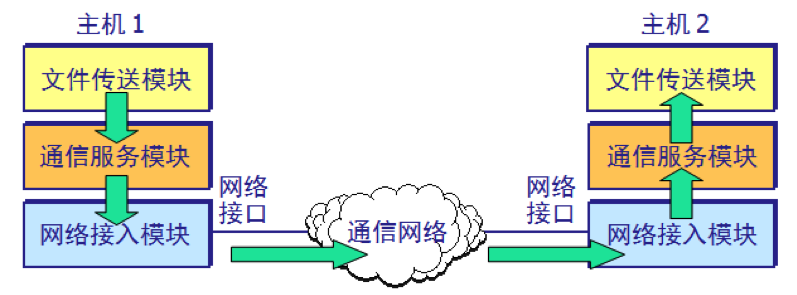
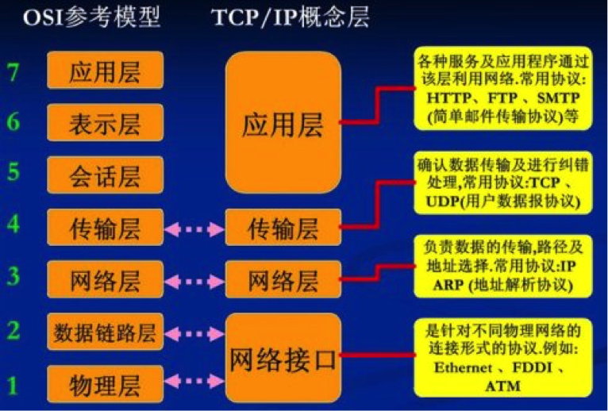
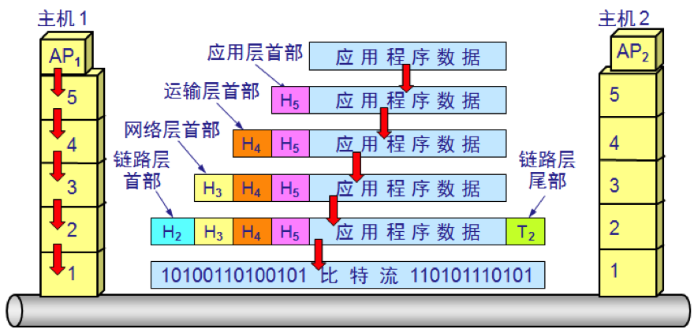

在计算机网络中要做到有条不紊地交换数据，就必须遵守一些事先约定好的规则，这些规则明确规定了所交换的数据的格式以及有关的同步问题。

这些为进行网络中的数据交换而建立的规则、标准或约定成为**网络协议**（network protocol）。

对于非常复杂的计算机网络协议，其结构应该是层次式的。例如，假定我们在主机1和主机2之间通过一个通信网络传送文件，我们可以将要做的工作划分为三类。

 

第一类工作与传送文件直接相关，如发送端的文件传送应用程序应当确信接收端的文件管理程序已做好接收和存储文件的准备，若两个主机所用的文件格式不一样，则至少其中的一个主机应完成文件格式转换。这两项工作可用一个文件传送模块来完成。这样，两个主机可将文件传送模块作为最高层。

但是，我们并不想让文件传送模块完成全部工作的细节，这样会使文件传送模块过于复杂。可以再设立一个通信服务模块，用来保证文件和文件传送命令可靠地在两个系统之间交换。也就是说，让位于上面的文件传送模块利用下面的通信服务模块所提供的服务。可以发现，如果将位于上面的文件传送模块换成电子邮件模块，那么电子邮件模块同样可以利用它下面的通信服务模块所提供的可靠通信的服务，这就是分层的一个优势。

同样的道理，我们再构造一个网络接入模块，让这个模块负责做网络接口细节有关的工作，并向上层提供服务，使上面的通信服务模块能够完成可靠通信的任务。

从上述简单例子可以更好地理解分层带来的好处：各层之间是独立的，某一层并不知道它的下一层是如何实现的，而仅仅需要知道该层所提供的服务接口。当任何一层发生变化时，只要层间的接口关系保持不变，则在这层以上或以下各层均不受影响。此外，对某一层提供的服务还可以进行修改，乃至取消。各层都可以采用最合适的技术来实现。

我们把计算机的各层及其协议的集合称为**网络的体系结构**。

国际标准组织提出过一个标准框架，就是著名的开放系统互连基本参考模型`OSI/RM`(Open Systems Interconnection Reference Model)，只要遵循OSI标准，一个系统就可以和世界上任何地方的、也遵循统一标准的其他任何系统进行通信。

但是得到最广泛应用的不是法律上的国际标准OSI，而是非国际标准TCP/IP，TCP/IP常常被认为是事实上的国际标准。

OSI模型将计算机网络划分为七层，但它既复杂又不实用。TCP/IP是一个四层的体系结构，包含**应用层**、**传输层**、**网际层**和**网际接口层**。不过从实质上讲，TCP/IP只有最上面的三层，网际接口层并没有什么具体内容。因此学习计算机网络的原理时往往采取折中的办法，即总和OSI和TCP/IP的优点，采用一种五层协议的体系结构。

- （1）**应用层**（application layer） 
  应用层是体系结构中的最高层。应用层直接为用户的应用进程提供服务。在因特网中的应用层协议很多，如支持万维网的HTTP协议，支持电子邮件的SMTP协议，支持文件传送的FTP协议等等。
- （2）**传输层**（transport layer）
  传输层的任务就是负责向两个主机中进程之间的通信提供服务。由于一个主机可同时运行多个进程，因此运输层有复用和分用的功能。复用就是多个应用层进程可同时使用下面运输层的服务，分用则是运输层把收到的信息分别交付给上面应用层中的相应进程。
  传输层主要使用以下两种协议：
  传输控制协议**TCP**(Transmission Control Protocol)——面向连接的，数据传输的单位是**报文段**（segment），能够提供**可靠的交付**。
  用户数据报协议**UDP**(User Datagram Protocol)——无连接的，数据传输的单位是用户数据报，不保证提供可靠的交付，只能提供“**尽最大努力交付**（best-effort delivery）”。
- （3）**网络层**（network layer）
  网络层负责为分组交换网上的不同主机提供通信服务。在发送数据时，网络层会把传输层产生的报文段或用户数据报封装成**包**进行传送。在TCP/IP体系中，由于网络层使用IP协议，因此分组也叫作**IP数据报**。
  网络层的另一个任务就是要选择合适的路由，使源主机运输层所传下来的分组，能够通过网络中的路由器找到目的主机。
- （4）**数据链路层**（data link layer）
  我们知道，两个主机之间的数据传输，总是一段一段在链路上传送的，也就是说，在两个相邻结点之间（主机和路由器之间或两个路由器之间）传送数据是直接传送的。这就需要使用专门的链路层协议。数据链路层将网络层交下来的IP数据报组装成**帧**（framing），在两个相邻结点间的链路上透明地传送帧中的数据，每一帧包括数据和必要的控制信息。
  所谓透明，是指无论什么样的比特组合都能通过这个数据链路层，因此，所传送的数据是“看不见”数据链路层的。
- （5）**物理层**（physical layer）
  物理层的任务就是透明地传送比特流。也就是说，发送方发送1（或0）时，接收方应当收到1（或0）而不是0（或1）。因此物理层要考虑用多大的电压代表1或0，以及接收方如何识别出发送方发出的比特。具体使用什么样的传输媒介不在物理层的包含范围。

下图模拟了两个主机的通信数据在各层之间所经历的变化：

可以用一个简单例子来比喻上述过程：有一封信从最高层向下传，每经过一层就包上一个新的信封，写上必要的地址信息，包有多个信封的信件传送到目的站后，从第一层开始，每层拆开一个信封后就把信封中的信交给它的上一层，传到最高层后，取出发信人所发的信交给收信人。

虽然应用进程数据要经过上图所示的复杂过程才能送达终点的应用进程，但这些复杂过程对用户来说，都被屏蔽掉了，以致应用进程AP1觉得好像是直接把数据交给了应用进程AP2。