# 1、对称加密与非对称加密

所谓对称加密，就是加密密钥与解密密钥是相同的密码体制，这种加密系统又称为**对称密钥系统**。

对称加密模型如下图所示：

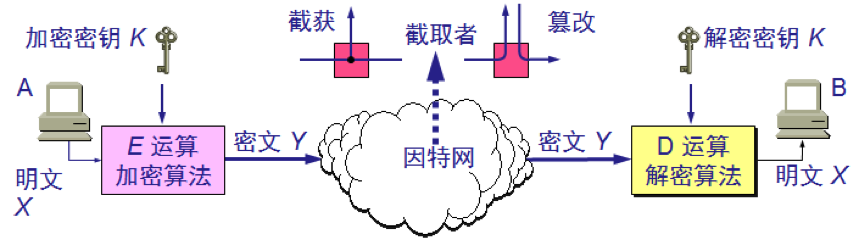 

用户A向B发送明文X，但通过加密算法E运算后，就得到密文Y。

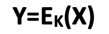

图中所示的加密和解密用的密钥K是一串秘密的字符串（或比特串）。在传送过程中可能出现密文的截获和篡改。

B利用解密算法D运算和解密密钥K，解出明文X。解密算法是加密算法的逆运算。在进行解密运算时如果不使用事先约定好的密钥就无法解出明文。

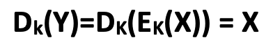

数据加密标准 **DES** 属于对称密钥密码体制，DES是一种分组密码。在加密前先对整个明文进行分组。每一个组长为 64 位。

然后对每一个 64 位 二进制数据进行加密处理，产生一组 64 位密文数据。

最后将各组密文串接起来，即得出整个的密文。使用的密钥为 64 位（实际密钥长度为 56 位，有 8 位用于奇偶校验)。  

DES 的保密性仅取决于对密钥的保密，而算法是公开的。尽管人们在破译 DES 方面取得了许多进展，但至今仍未能找到比穷举搜索密钥更有效的方法。

DES 是世界上第一个公认的实用密码算法标准，它曾对密码学的发展做出了重大贡献。

DES之后出现了**IDEA**（International Data Encryption Algorithm），使用128为密钥，因而更不容易被攻破。

非对称加密就是使用不同的加密密钥与解密密钥，又称为**公钥密码体制**。

现有最著名的公钥密码体制是**RSA** 体制，它基于数论中大数分解问题的体制，由美国三位科学家 Rivest, Shamir 和 Adleman 于 1976 年提出并在 1978 年正式发表的。

在公钥密码体制中，加密密钥(即公钥) PK 是公开信息，而解密密钥(即私钥或秘钥) SK 是需要保密的。

加密算法 E 和解密算法 D 也都是公开的。

虽然秘钥 SK 是由公钥 PK 决定的，但却不能根据 PK 计算出 SK。

公钥加密模型如下：

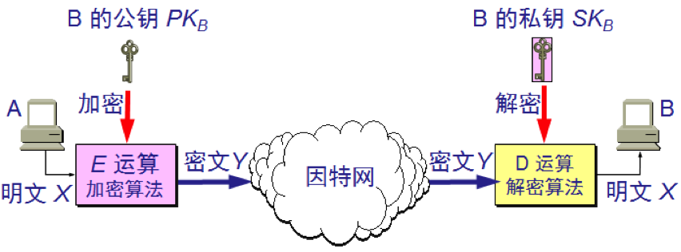

发送者 A 用 B 的公钥 PKB 对明文 X 加密（E 运算）后，在接收者 B 用自己的私钥 SKB 解密（D 运算），即可恢复出明文：

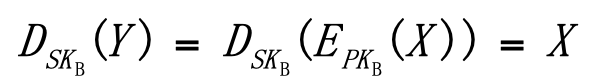

解密密钥是接收者专用的秘钥，对其他人都保密。加密密钥是公开的，但不能用它来解密，即

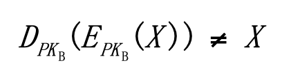

加密和解密的运算可以对调，即

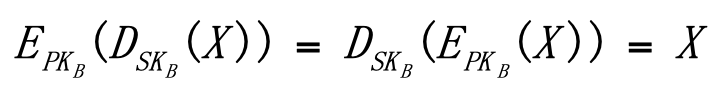

在计算机上可容易地产生成对的 PK 和 SK。从已知的 PK 实际上不可能推导出 SK，即从 PK 到 SK 是“计算上不可能的”。加密和解密算法都是公开的。

在公钥密码体制中，似乎只要每个用户都具有其他用户的公钥，就可实现安全通信，其实不然，设想用户A要欺骗用户B，A可以向B发送一份伪造的是C发送的报文，B如何知道这个公钥不是C的呢？

这就需要有一个值得信赖的机构——即认证中心**CA** (Certification Authority)，来将公钥与其对应的实体（人或机器）进行绑定。

认证中心一般由政府出资建立。每个实体都有CA 发来的**证书**(certificate)，里面有公钥及其拥有者的标识信息。此证书被 CA 进行了数字签名。任何用户都可从可信的地方获得认证中心 CA 的公钥，此公钥用来验证某个公钥是否为某个实体所拥有。有的大公司也提供认证中心服务。

# 2、数字签名

数字签名必须保证以下三点：

- 报文鉴别——接收者能够核实发送者对报文的签名；
- 报文的完整性——发送者事后不能抵赖对报文的签名；
- 不可否认——接收者不能伪造对报文的签名。

现在已有多种实现各种数字签名的方法。但采用公钥算法更容易实现。  

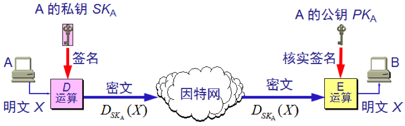

为了进行签名，A用其私钥SKA对报文X进行D运算。D运算本来叫做解密运算，虽然还没有对X进行加密，但实际上没关系，因为D运算只是为了得到某种不可读的密文。A把经过D运算得到的密文传送给B。B为了核实签名，用A的公钥进行E运算，还原出明文X。请注意，任何人用A的公钥PKA进行E运算后都可以得出A发送的明文。可见，上图中D运算和E运算不是为了解密和加密，而是为了进行签名和核实签名。

下面分析一下为什么数字签名具有上述的三点功能：

因为除 A 外没有别人能具有 A 的私钥，所以除 A 外没有别人能产生这个密文。因此 B 相信报文 X 是 A 签名发送的。
若 A 要抵赖曾发送报文给 B，B 可将明文和对应的密文出示给第三者。第三者很容易用 A 的公钥去证实 A 确实发送 X 给 B。

反之，若 B 将 X 伪造成 X’，则 B 不能在第三者前出示对应的密文。这样就证明了 B 伪造了报文。  

但是上述过程仅对报文进行了签名，却没有加密。因为截获了密文并知道发送者身份的任何人，通过查阅手册即可获得发送者的公钥，因为能知道报文的内容。采用下图所示的方法，就可同时实现秘密通信和数字签名：

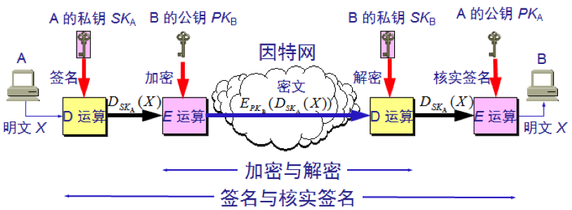

# 3、报文鉴别

许多报文并不需要加密但却需要数字签名，以便让报文的接收者能够鉴别报文的真伪。然而对很长的报文进行数字签名会使计算机增加很大的负担（需要进行很长时间的运算。当我们传送不需要加密的报文时，应当使接收者能用很简单的方法鉴别报文的真伪。

报文摘要**MD**（Message Digest）是进行报文鉴别的简单方法。

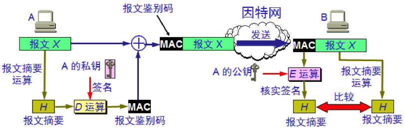

A 将报文 X 经过报文摘要算法运算后得出很短的报文摘要 H。然后然后用自己的私钥对 H 进行 D 运算，即进行数字签名。得出已签名的报文摘要 D(H)后，并将其追加在报文 X 后面发送给 B。 

B 收到报文后首先把已签名的 D(H) 和报文 X 分离。然后再做两件事：

- 用A的公钥对 D(H) 进行E运算，得出报文摘要 H 。
- 对报文 X 进行报文摘要运算，看是否能够得出同样的报文摘要 H。如一样，就能以极高的概率断定收到的报文是 A 产生的。否则就不是。

仅对短得多的定长报文摘要 H 进行数字签名要比对整个长报文进行数字签名要简单得多，所耗费的计算资源也小得多。

但对鉴别报文 X 来说，效果是一样的。也就是说，报文 X 和已签名的报文摘要 D(H) 合在一起是不可伪造的，是可检验的和不可否认的。

报文摘要算法就是一种**散列函数**。这种散列函数也叫做**密码编码的检验和**。报文摘要算法是防止报文被人恶意篡改。 

可以很容易地计算出一个长报文 X 的报文摘要 H，但要想从报文摘要 H 反过来找到原始的报文 X，则实际上是不可能的。
若想找到任意两个报文，使得它们具有相同的报文摘要，那么实际上也是不可能的。

**MD5**（Message-Digest Algorithm 5）已获得了广泛的应用。它对任意长的报文进行运算，然后得出128位的MD5报文摘要代码。

另一种标准叫做安全散列算法**SHA**（Secure Hash Algorithm），它和MD5相似，但码长为160位。SHA比MD5更安全，但计算起来也比MD5要慢些。

# 4、安全套接层SSL

**SSL**（Secure Socket Layer）为Netscape所研发，用以保障在Internet上数据传输之安全，利用数据加密技术，可确保数据在网络上之传输过程中不会被截取及窃听。

**SSL协议位于TCP/IP协议与各种应用层协议之间**，为数据通讯提供安全支持。SSL可对万维网客户与服务器之间传送的数据进行加密和鉴别，它在双方的联络阶段（也就是握手阶段）对将要使用的加密算法（如DES或RSA等）和双方共享的回话密钥进行协商，完成客户与服务器之间的鉴别。在联络阶段完成之后，所有传送的数据都使用在联络阶段商定的会话密钥。

SSL不仅被所有常用的浏览器和万维网服务器所支持，而且也是运输层安全协议**TLS**（Transport Layer Security）的基础。

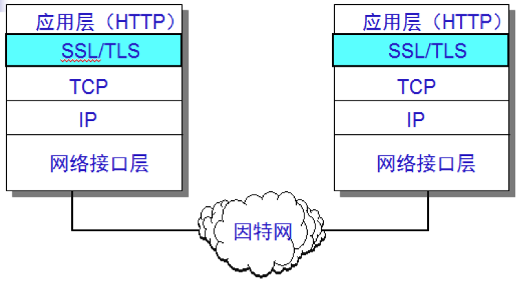

在发送方，SSL接受应用层的数据（如HTTP或IMAP报文），对数据进行加密，然后把加了密的数据送往TCP套接字。在接收方，SSL从TCP套接字读取数据，解密后把数据交给应用层。

SSL提供一下三种服务：

- 认证用户和服务器，确保数据发送到正确的客户机和服务器；
- 加密数据以防止数据中途被窃取；
- 维护数据的完整性，确保数据在传输过程中不被改变。

SSL工作原理的示意图如下：

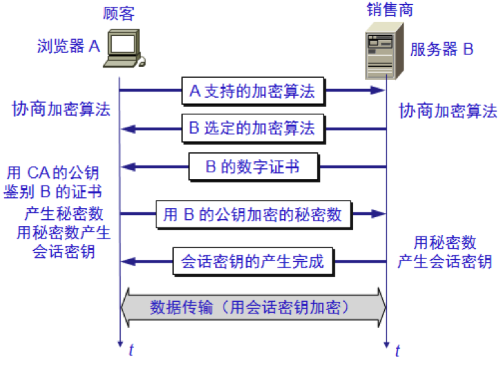

# 5、SSH

**SSH** 为 Secure Shell 的缩写，SSH为建立在应用层和传输层基础上的安全协议。SSH 是目前较可靠，专为远程登录会话和其他网络服务提供安全性的协议。利用 SSH 协议可以有效防止远程管理过程中的信息泄露问题。

传统的网络服务程序，如：ftp、pop和telnet在本质上都是不安全的，因为它们在网络上用明文传送口令和数据，别有用心的人非常容易就可以截获这些口令和数据。而且，这些服务程序的安全验证方式也是有其弱点的，就是很容易受到“**中间人**”（man-in-the-middle）这种方式的攻击。所谓“中间人”的攻击方式， 就是“中间人”冒充真正的服务器接收你传给服务器的数据，然后再冒充你把数据传给真正的服务器。服务器和你之间的数据传送被“中间人”一转手做了手脚之后，就会出现很严重的问题。通过使用SSH，可以把所有传输的数据进行加密，这样“中间人”这种攻击方式就不可能实现了，而且也能够防止DNS欺骗和IP欺骗。使用SSH，还有一个额外的好处就是传输的数据是经过压缩的，所以可以加快传输的速度。SSH有很多功能，它既可以代替Telnet，又可以为FTP、POP、甚至为PPP提供一个安全的“通道”。

从客户端来看，SSH提供两种级别的安全验证。

- 第一种级别（基于口令的安全验证）

只要你知道自己帐号和口令，就可以登录到远程主机。所有传输的数据都会被加密，但是不能保证你正在连接的服务器就是你想连接的服务器。可能会有别的服务器在冒充真正的服务器，也就是受到“中间人”这种方式的攻击。

- 第二种级别（基于密匙的安全验证）

需要依靠密匙，也就是你必须为自己创建一对密匙，并把公用密匙放在需要访问的服务器上。如果你要连接到SSH服务器上，客户端软件就会向服务器发出请求，请求用你的密匙进行安全验证。服务器收到请求之后，先在该服务器上你的主目录下寻找你的公用密匙，然后把它和你发送过来的公用密匙进行比较。如果两个密匙一致，服务器就用公用密匙加密“质询”（challenge）并把它发送给客户端软件。客户端软件收到“质询”之后就可以用你的私人密匙解密再把它发送给服务器。
用这种方式，你必须知道自己密匙的口令。但是，与第一种级别相比，第二种级别不需要在网络上传送口令。
第二种级别不仅加密所有传送的数据，而且“中间人”这种攻击方式也是不可能的（因为他没有你的私人密匙）。但是整个登录的过程可能需要10秒。

SSL与SSH虽然只有一个字母的差别，但是两者不是一个范畴，如果硬要将两者作比较，SSH和SSL的关系可以这么理解， SSH是用SSL协议构建的一个类似telnet的应用，即：SSH = TELNET + SSL。

# 6、防火墙

防火墙是由软件、硬件构成的系统，是一种特殊编程的路由器，用来在两个网络之间实施接入控制策略。接入控制策略是由使用防火墙的单位自行制订的，为的是可以最适合本单位的需要。

防火墙内的网络称为可信的网络”，而将外部的因特网称为不可信的网络。防火墙可用来解决内联网和外联网的安全问题。

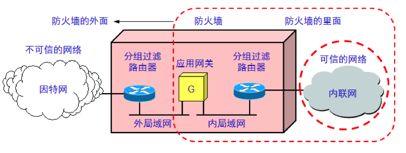

防火墙的功能有两个：阻止和允许。

“阻止”就是阻止某种类型的通信量通过防火墙（从外部网络到内部网络，或反过来）。“允许”的功能与“阻止”恰好相反。
防火墙必须能够识别通信量的各种类型。不过在大多数情况下防火墙的主要功能是“阻止”。

防火墙技术一般分为两类：

- 网络级防火墙——用来防止整个网络出现外来非法的入侵。属于这类的有分组过滤和授权服务器。前者检查所有流入本网络的信息，然后拒绝不符合事先制订好的一套准则的数据，而后者则是检查用户的登录是否合法。
- 应用级防火墙——从应用程序来进行接入控制。通常使用应用网关或代理服务器来区分各种应用。例如，可以只允许通过访问万维网的应用，而阻止 FTP 应用的通过。

分组过滤是靠查找系统管理员所设置的表格来实现的。表格列出了可接受的、或必须进行阻拦的目的站和源站，以及其他的一些通过防火墙的规则。

我们知道，TCP的端口号指出了在TCP上面的应用层服务。例如，端口号23是TELNET，端口号119是USENET，等等。如果在因特网进入防火墙的分组过滤路由器中所有目的端口号为23的分组都进行阻拦，那么所有外单位用户就不能使用TELNET登录到本单位的主机。同理，如果某公司不愿意其雇员在上班时间花费大量的时间去看因特网的USENET新闻，就可将目的端口号为119的分组阻拦住，使其无法发送到因特网。

阻拦向外发送的分组很复杂，因为有时它们不使用标准的端口号。例如FTP常常是动态地分配端口号。阻拦UDP更困难，因为事先不容易知道UDP想做什么。许多分组过滤路由器干脆将所有的UDP全部阻拦。

应用网关是从应用层的角度来检查每一个分组。例如，一个邮件网关在检查每一个邮件时，要根据邮件的首部或豹纹的大小，甚至报文内容（例如，有没有某些像“导弹”、“核弹头”等敏感词汇）来确定该邮件能否通过防火墙。