# 1、域名系统

**DNS**（Domai Name System）是因特网使用的命名系统，用于把便于人们使用的机器名字转换为IP地址。
许多应用层软件经常直接使用域名系统，但计算机的用户只是间接而不是直接使用域名系统。

## 1.1 域名结构

因特网采用了层次树状结构的命名方法。

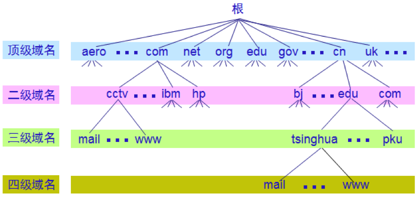

任何一个连接在因特网上的主机或路由器，都有一个唯一的层次结构的名字，即**域名**。

域名的结构由标号序列组成，各标号之间用点隔开：

`… . 三级域名 . 二级域名 . 顶级域名`

DNS规定，域名中的标号有英文字母和数字组成，不区分大小写。标号中除了连字符（-）外不能使用其它标点符号。级别最低的域名写在最左边，而级别最高的的顶级域名则写在最右边。

各级域名由其上一级的域名管理机构管理，而最高的顶级域名则由**ICANN**进行管理，每一个域名在整个因特网范围内是唯一的。

顶级域名可分为以下三类：

- （1）国家顶级域名，如：
  - “.cn”表示中国
  - “.us”表示美国
  - “.uk”表示英国

- （2）通用顶级域名，如：
  - ​    .com  	（公司和企业）
  - ​    .net  	（网络服务机构）
  - ​    .org  	（非赢利性组织）
  - ​    .edu  	（教育机构）
  - ​    .gov  	（政府部门）
  - ​    .mil    （军事部门）
  - ​    .int   	（国际组织）

- （3）基础结构域名，这种顶级域名只有一个，即 arpa，用于反向域名解析，因此又称为反向域名。如：
  - .aero （航空运输企业）
  - .biz  （公司和企业）
  - .coop  （合作团体）
  - .museum  （博物馆）
  - .pro  （有证书的专业人员）
  
    
  
  

## 1.2 域名服务器

因特网采用层次结构的命名树作为主机的名字，并使用分布式的域名系统 DNS。名字到 IP 地址的解析是由若干个域名服务器程序完成的。域名服务器程序在专设的结点上运行，运行该程序的机器称为**域名服务器**。

一个服务器所负责管辖的（或有权限的）范围叫做**区**(zone)。各单位根据具体情况来划分自己管辖范围的区。但在一个区中的所有节点必须是能够连通的。每一个区设置相应的**权限域名服务器**，用来保存该区中的所有主机的域名到IP地址的映射。

因特网上的DNS域名服务器也是按照层次安排的。每一个域名服务器都只对域名体系中的一部分进行管辖。

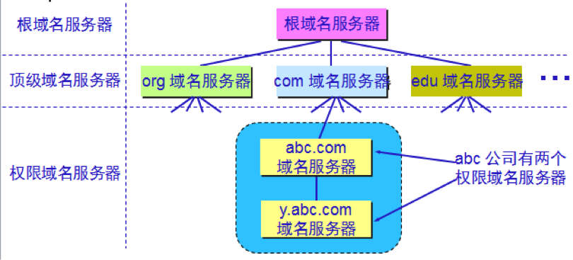

域名服务器有以下四种类型：

- **根域名服务器**是最重要的域名服务器。所有的根域名服务器都知道所有的顶级域名服务器的域名和 IP 地址。不管是哪一个本地域名服务器，若要对因特网上任何一个域名进行解析，只要自己无法解析，就首先求助于根域名服务器。
- **顶级域名服务器**（TLD服务器，Top Level Domain）负责管理在该顶级域名服务器注册的所有二级域名。
- **权限域名服务器**不能给出最后的查询回答时，就会告诉发出查询请求的 DNS 客户，下一步应当找哪一个权限域名服务器。
- **本地域名服务器**对域名系统非常重要。当一个主机发出 DNS 查询请求时，这个查询请求报文就发送给本地域名服务器。每一个因特网服务提供者 ISP，或一个大学，甚至一个大学里的系，都可以拥有一个本地域名服务器，这种域名服务器有时也称为**默认域名服务器**。

DNS 域名服务器都把数据复制到几个域名服务器来保存，其中的一个是主域名服务器，其他的是辅助域名服务器。当主域名服务器出故障时，辅助域名服务器可以保证 DNS 的查询工作不会中断。主域名服务器定期把数据复制到辅助域名服务器中，而更改数据只能在主域名服务器中进行。这样就保证了数据的一致性。

每个域名服务器都维护一个高速缓存，存放最近用过的名字以及从何处获得名字映射信息的记录，可大大减轻根域名服务器的负荷，使因特网上的 DNS 查询请求和回答报文的数量大为减少。为保持高速缓存中的内容正确，域名服务器应为每项内容设置计时器，并处理超过合理时间的项（例如，每个项目只存放两天）。

# 2、文件共享

## 2.1 FTP

文件传送协议**FTP**（File Transfer Protocol）是因特网上使用最广泛的文件传送协议。

FTP 提供交互式的访问，允许客户指明文件的类型与格式，并允许文件具有存取权限。FTP 屏蔽了各计算机系统的细节，因而适合于在异构网络中任意计算机之间传送文件。

文件传送协议 FTP 只提供文件传送的一些基本的服务，它使用 TCP 可靠的运输服务。FTP 的主要功能是减少或消除在不同操作系统下处理文件的不兼容性。

FTP 使用客户服务器方式。一个 FTP 服务器进程可同时为多个客户进程提供服务。FTP 的服务器进程由两大部分组成：

- 一个主进程，负责接受新的请求
- 另外有若干个从属进程，负责处理单个请求

主进程的工作步骤如下：

- 打开熟知端口（端口号为 21），使客户进程能够连接上。
- 等待客户进程发出连接请求。
- 启动从属进程来处理客户进程发来的请求。从属进程对客户进程的请求处理完毕后即终止，但从属进程在运行期间根据需要还可能创建其他一些子进程。
- 回到等待状态，继续接受其他客户进程发来的请求。主进程与从属进程的处理是并发地进行。

FTP的工作进程如下图所示：

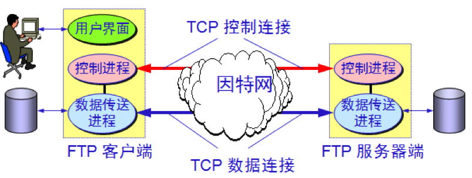

FTP的客户和服务器之间要建立两个并行的TCP连接：控制链接和数据连接。

控制连接在整个会话期间一直保持打开，FTP 客户发出的传送请求通过控制连接发送给服务器端的控制进程，但控制连接不用来传送文件。

实际用于传输文件的是“数据连接”。服务器端的控制进程在接收到 FTP 客户发送来的文件传输请求后就创建“数据传送进程”和“数据连接”，用来连接客户端和服务器端的数据传送进程。

数据传送进程实际完成文件的传送，在传送完毕后关闭“数据传送连接”并结束运行。

当客户进程向服务器进程发出建立连接请求时，要寻找连接服务器进程的熟知端口(21)，同时还要告诉服务器进程自己的另一个端口号码，用于建立数据传送连接。

接着，服务器进程用自己传送数据的熟知端口(20)与客户进程所提供的端口号码建立数据传送连接。

由于 FTP 使用了两个不同的端口号，所以数据连接与控制连接不会发生混乱。

## 2.2 NFS

除了FTP，文件共享协议中的另一大类是联机访问（on-line access）。连击访问意味着允许多个程序同时对一个文件进行存取，如网络文件系统**NFS**（Network File System）。

NFS 允许应用进程打开一个远地文件，并能在该文件的某一个特定的位置上开始读写数据。NFS 可使用户只复制一个大文件中的一个很小的片段，而不需要复制整个大文件。在网络上传送的只是少量的修改数据。

对于上述例子，计算机 A 的 NFS 客户软件，把要添加的数据和在文件后面写数据的请求一起发送到远地的计算机 B 的 NFS 服务器。NFS 服务器更新文件后返回应答信息。

## 2.3 TFTP

TCP/IP协议族中还有一个简单文件传送协议**TFTP**（Trivial File Transfer Protocol）。

TFTP 是一个很小且易于实现的文件传送协议，使用客户服务器方式和使用 UDP 数据报，因此 TFTP 需要有自己的差错改正措施。TFTP 只支持文件传输而不支持交互。

TFTP 的工作很像停止等待协议，发送完一个文件块后就等待对方的确认，确认时应指明所确认的块编号。发完数据后在规定时间内收不到确认就要重发数据。发送确认 PDU 的一方若在规定时间内收不到下一个文件块，也要重发确认。这样就可保证文件的传送不致因某一个数据报的丢失而告失败。

# 3、远程终端协议

**TELNET** 是一个简单的远程终端协议。用户用 TELNET 就可在其所在地通过 TCP 连接注册（即登录）到远地的另一个主机上（使用主机名或 IP 地址）。

TELNET 能将用户的击键传到远地主机，同时也能将远地主机的输出通过 TCP 连接返回到用户屏幕。这种服务是透明的，因为用户感觉到好像键盘和显示器是直接连在远地主机上。

TELNET 也使用客户服务器方式。在本地系统运行 TELNET 客户进程，而在远地主机则运行 TELNET 服务器进程。
和 FTP 的情况相似，服务器中的主进程等待新的请求，并产生从属进程来处理每一个连接。

TELNET定义了数据和命令应怎样通过因特网，这些定义就是所谓的网络虚拟终端**NVT**（Network Virtual Terminal）。

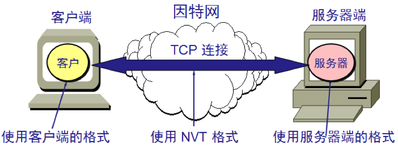

客户软件把用户的击键和命令转换成 NVT 格式，并送交服务器。

服务器软件把收到的数据和命令，从 NVT 格式转换成远地系统所需的格式。

向用户返回数据时，服务器把远地系统的格式转换为 NVT 格式，本地客户再从 NVT 格式转换到本地系统所需的格式。

# 4、万维网

万维网 WWW (World Wide Web)并非某种特殊的计算机网络，而是一个大规模的、联机式的信息储藏所。

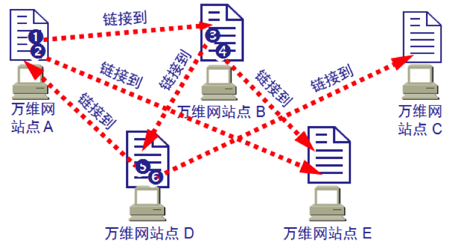

万维网用链接的方法能非常方便地从因特网上的一个站点访问另一个站点，从而主动地按需获取丰富的信息。这种访问方式称为**链接**。

万维网以客户服务器方式工作。浏览器就是在用户计算机上的万维网客户程序。万维网文档所驻留的计算机则运行服务器程序，因此这个计算机也称为万维网服务器。

客户程序向服务器程序发出请求，服务器程序向客户程序送回客户所要的万维网文档。

## 4.1 统一资源定位符URL

统一资源定位符**URL** (Uniform Resource Locator)使每一个文档在整个因特网的范围内具有唯一的标识符。

由以冒号隔开的两大部分组成，并且在 URL 中的字符对大写或小写没有要求。

URL 的一般形式是：

`<协议>://<主机>:<端口>/<路径>`

协议就是指是用什么协议来获取万维网文档。现在最常用的协议就是`http`，其次是`ftp`。

## 4.2 超文本传送协议HTTP

HTTP协议定义了浏览器怎样向万维网服务器请求万维网文档，以及服务器怎样把文档传送给浏览器。

从层次的角度看，HTTP 是**面向事务**的(transaction-oriented)应用层协议，它是万维网上能够可靠地交换文件（包括文本、声音、图像等各种多媒体文件）的重要基础。

万维网的大致工作过程如下：

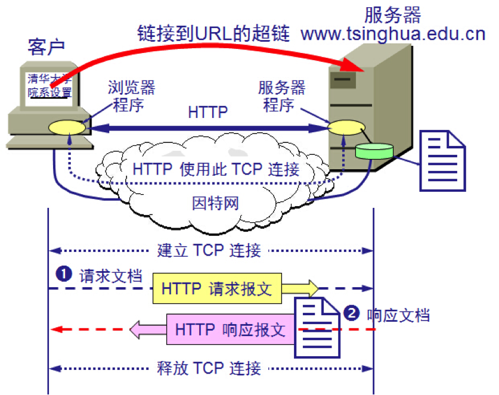

每个万维网网点都有一个服务器进程，它不断地监听TCP的端口80，以便发现是否有浏览器向它发出连接建立请求。一旦监听到连接建立的请求并建立了TCP连接之后，浏览器就向万维网服务器发出某个页面的请求，服务器接着就返回所请求的页面作为响应。最后，TCP连接被释放。

假如我们点击了一个指向`www.tsinghua.edu.cn/chn/yxsz/index.htm`的超链接，在`HTTP/1.0`标准下会发生下面几个事件：

- (1) 浏览器分析超链指向页面的 URL。
- (2) 浏览器向 DNS 请求解析 www.tsinghua.edu.cn 的 IP 地址。
- (3) 域名系统 DNS 解析出清华大学服务器的 IP 地址。
- (4) 浏览器与服务器建立 TCP 连接
- (5) 浏览器发出取文件命令：` GET /chn/yxsz/index.htm`。
- (6) 服务器给出响应，把文件 index.htm发给浏览器。
- (7) TCP 连接释放。
- (8) 浏览器显示“清华大学院系设置”文件 index.htm 中的所有文本。

`HTTP 1.0` 协议是无状态的。也就是说，同一个客户第二次访问同一个服务器上的页面时，服务器的响应与第一次被访问时的响应相同。服务器不记得曾经访问过的这个用户，更不记得访问过多少次。

HTTP 协议本身也是无连接的，虽然它使用了面向连接的 TCP 向上提供的服务。虽然HTTP使用了TCP连接，但是通信的双方在交换HTTP报文之前不需要先建立HTTP连接。

与`HTTP/1.0`不同，`HTTP/1.1`使用了**持续连接**。即万维网服务器在发送响应后仍然在一段时间内保持这条连接，使同一个客户（浏览器）和该服务器可以继续在这条连接上传送后续的 HTTP 请求报文和响应报文。

这并不局限于传送同一个页面上链接的文档，而是只要这些文档都在同一个服务器上就行。

HTTP有两类报文：

- 请求报文——从客户向服务器发送请求报文。
- 响应报文——从服务器到客户的回答。

请求报文的结构如下：

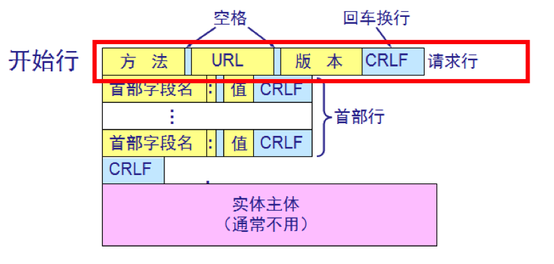

报文由三个部分组成，即开始行、首部行和实体主体。在请求报文中，开始行就是请求行。

响应报文的结构如下：

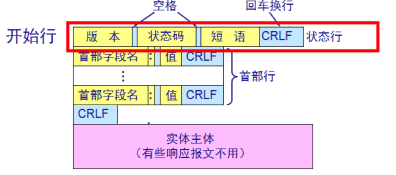

响应报文的开始行是状态行。状态行包括三项内容，即 HTTP 的版本，状态码，以及解释状态码的简单短语。

状态码都是三位数字：

- 1xx 表示通知信息的，如请求收到了或正在进行处理。
- 2xx 表示成功，如接受或知道了。
- 3xx 表示重定向，表示要完成请求还必须采取进一步的行动。
- 4xx 表示客户的差错，如请求中有错误的语法或不能完成。
- 5xx 表示服务器的差错，如服务器失效无法完成请求。

## 4.3 代理服务器

**代理服务器**(proxy server)又称为**万维网高速缓存(**Web cache)，它代表浏览器发出 HTTP 请求。

万维网高速缓存把最近的一些请求和响应暂存在本地磁盘中。当与暂时存放的请求相同的新请求到达时，万维网高速缓存就把暂存的响应发送出去，而不需要按 URL 的地址再去因特网访问该资源。  

使用高速缓存可减少访问因特网服务器的时延，没有使用高速缓存的示意图如下：

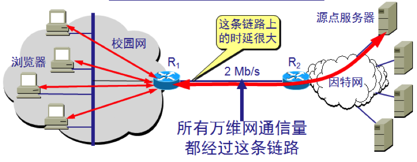

使用高速缓存的情况如下：

- （1）浏览器访问因特网的服务器时，要先与校园网的高速缓存建立 TCP 连接，并向高速缓存发出 HTTP 请求报文 

- （2）若高速缓存已经存放了所请求的对象，则将此对象放入 HTTP 响应报文中返回给浏览器。

  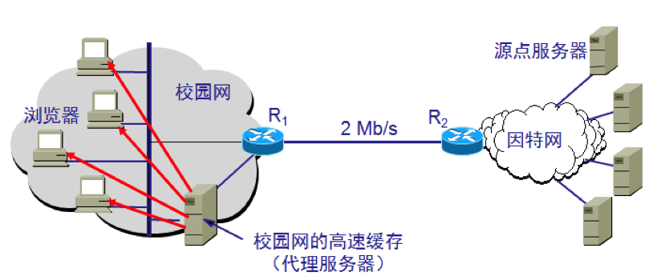

- （3）否则，高速缓存就代表发出请求的用户浏览器，与因特网上的源点服务器建立 TCP 连接，并发送 HTTP 请求报文。

  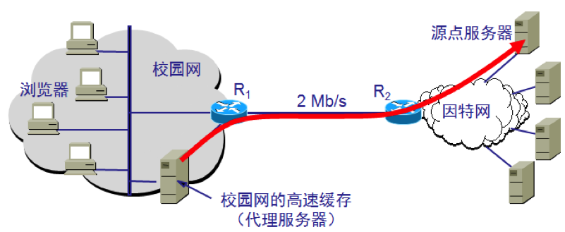

- （4）源点服务器将所请求的对象放在 HTTP 响应报文中返回给校园网的高速缓存。

- （5）高速缓存收到此对象后，先复制在其本地存储器中（为今后使用），然后再将该对象放在 HTTP 响应报文中，通过已建立的 TCP 连接，返回给请求该对象的浏览器。

# 5、电子邮件

## 5.1 电子邮件系统

一个电子邮件系统应具有三个主要组成部分：

- 用户代理
- 邮件服务器
- 邮件发送协议（如SMTP）与邮件读取协议（如POP）

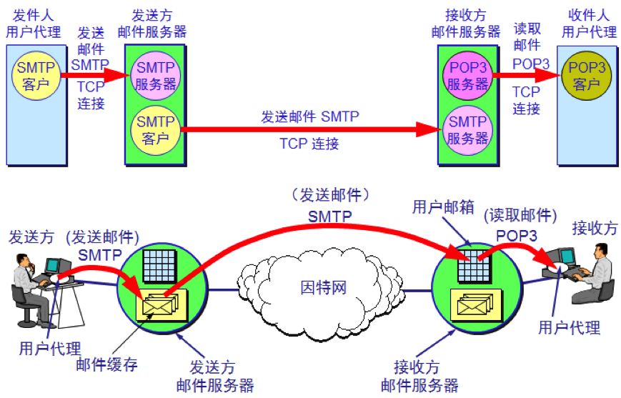

用户代理（User Agent）就是用户与电子邮件系统的接口，在大多数情况下它就是运行在用户PC机中的一个程序。一般具有撰写、显示、处理、通信等功能。

因特网上有许多邮件服务器可供用户选择，邮件服务器24小时不间断地工作，并且具有大容量的邮件信箱。邮件服务器的功能是发送和接收邮件，同时还要向发信人报告邮件传送的情况（已交付、被拒绝、丢失等）。邮件服务器按照客户服务器方式工作。邮件服务器需要使用发送和读取两个不同的协议。

应当注意的是，一个邮件服务器既可以作为客户，也可以作为服务器。

例如，当邮件服务器 A 向另一个邮件服务器 B 发送邮件时，邮件服务器 A 就作为 SMTP 客户，而 B 是 SMTP 服务器。
当邮件服务器 A 从另一个邮件服务器 B 接收邮件时，邮件服务器 A 就作为 SMTP 服务器，而 B 是 SMTP 客户。

发送和接收电子邮件的几个重要步骤：

- （1）发件人调用 PC 中的用户代理撰写和编辑要发送的邮件。
- （2）发件人的用户代理把邮件用 SMTP 协议发给发送方邮件服务器，
- （3）SMTP 服务器把邮件临时存放在邮件缓存队列中，等待发送。
- （4）发送方邮件服务器的 SMTP 客户与接收方邮件服务器的 SMTP 服务器建立 TCP 连接，然后就把邮件缓存队列中的邮件依次发送出去
- （5）运行在接收方邮件服务器中的SMTP服务器进 程收到邮件后，把邮件放入收件人的用户邮箱中，等待收件人进行读取。 
- （6）收件人在打算收信时，就运行 PC 机中的用户代理，使用 POP3（或 IMAP）协议读取发送给自己的邮件。请注意，POP3 服务器和 POP3 客户之间的通信是由 POP3 客户发起的。

## 5.2 简单邮件传送协议 SMTP

**SMTP**（Simple Mail Transfer Protocol）所规定的就是在两个相互通信的 SMTP 进程之间应如何交换信息。

由于 SMTP 使用客户服务器方式，因此负责发送邮件的 SMTP 进程就是 SMTP 客户，而负责接收邮件的 SMTP 进程就是 SMTP 服务器。

## 5.3 邮件读取协议POP和IMAP

**POP**（Post Office Protocol）邮局协议是一个非常简单、但功能有限的邮件读取协议。现在使用的是它的第三个版本 POP3。

POP 也使用客户服务器的工作方式。在接收邮件的用户 PC 机中必须运行 POP 客户程序，而在用户所连接的 ISP 的邮件服务器中则运行 POP 服务器程序。   

POP协议支持离线邮件处理，当邮件发送到服务器后，电子邮件客户端会调用邮件客户端程序，下载所有未阅读的电子邮件（这种离线访问模式是一种存储转发服务）。当邮件从邮件服务器发送到个人计算机上，同时邮件服务器会删除该邮件（但是目前很多POP3服务器都支持“下载邮件，服务器并不删除邮件”，也就是说在POP3中改进了POP协议）。

另一个读取邮件的协议是**IMAP**（Internet Message Access Protocol），它比POP协议复杂很多。

IMAP 也是按客户服务器方式工作，现在较新的是版本 4，即 IMAP4。

用户在自己的 PC 机上就可以操纵邮件服务器的邮箱，就像在本地操纵一样。IMAP最大的好处就是用户可以在不同的地方使用不同的计算机随时上网阅读和处理自己的邮件。

注意，不要将邮件读取协议 POP 或 IMAP 与邮件传送协议 SMTP 弄混。

发信人的用户代理向源邮件服务器发送邮件，以及源邮件服务器向目的邮件服务器发送邮件，都是使用 SMTP 协议。

而 POP 协议或 IMAP 协议则是用户从目的邮件服务器上读取邮件所使用的协议。

## 5.4 基于万维网的电子邮件

现在我们大多数情况下都是使用基于万维网的电子邮件，outlook之类的用户代理客户端已经渐渐退出了市场。

不管在什么地方，只要能够上网，就可以借助浏览器收发电子邮件。这时，邮件系统中的用户代理就是普通的万维网浏览器。

需要注意的是，浏览器从邮件服务器读取邮件，或者向邮件服务器发送邮件使用的是HTTP协议，而不是IMAP（POP）或SMTP。

例如，一个网易邮箱用户向新浪邮箱用户通过浏览器发送邮件，各阶段使用的协议如下：

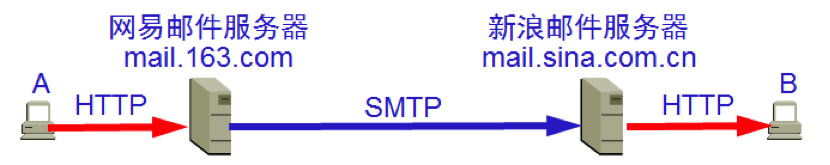

## 5.5 多用途因特网邮件扩充MIME

SMTP有以下不足：

- SMTP 不能传送可执行文件或其他的二进制对象。
- SMTP 限于传送 7 位的 ASCII 码。许多其他非英语国家的文字（如中文、俄文，甚至带重音符号的法文或德文）就无法传送。
- SMTP 服务器会拒绝超过一定长度的邮件。

于是在这种情况下就提出了**MIME**(Multipurpose Internet Mail Extensions)。MIME 并没有改动 SMTP 或取代它。MIME 的意图是继续使用目前的格式，但增加了邮件主体的结构，并定义了传送非 ASCII 码的编码规则。  

MIME 和 SMTP 的关系如下：

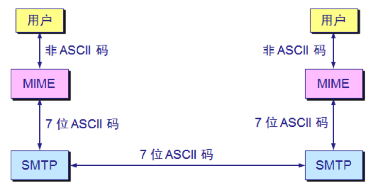

MIME类型就是设定某种扩展名的文件用一种应用程序来打开的方式类型，当该扩展名文件被访问的时候，浏览器会自动使用指定应用程序来打开。多用于指定一些客户端自定义的文件名，以及一些媒体文件打开方式。

# 6、动态主机配置协议

为了将软件协议做成通用的和便于移植，协议软件的编写者不会把所有细节都固定在源代码中，而是把协议软件参数化，这就使得在很多台计算机上使用同一个经过编译的二进制代码成为可能。

一台计算机和另一台计算机的区别，都可通过一些不同的参数来体现。在软件协议运行之前，必须给每一个参数赋值。
例如，连接到因特网的计算机的协议软件需要配置的项目包括：

- IP地址
- 子网掩码
- 默认路由器的IP地址
- 域名服务器的IP地址

这些信息通常存储在一个配置文件中，计算机可以对这个文件进行存取。

使用人工配置既不方便，又容易出错，现在广泛使用的是动态主机配置协议**DHCP**（Dynamic Host Configuration Protocol）。DHCP 提供了即插即用连网的机制。这种机制允许一台计算机加入新的网络和获取IP地址而不用手工参与。

**DHCP使用UDP协议工作**。

需要 IP 地址的主机在启动时就向 DHCP 服务器广播发送发现报文（DHCP DISCOVER），这时该主机就成为 DHCP 客户。

本地网络上所有主机都能收到此广播报文，但只有 DHCP 服务器才回答此广播报文。

DHCP 服务器先在其数据库中查找该计算机的配置信息。若找到，则返回找到的信息。若找不到，则从服务器的 IP 地址池中取一个地址分配给该计算机。DHCP 服务器的回答报文叫做提供报文（DHCP OFFER）。

并不是每个网络上都有 DHCP 服务器，这样会使 DHCP 服务器的数量太多。现在是每一个网络至少有一个 **DHCP 中继代理**，它配置了 DHCP 服务器的 IP 地址信息。

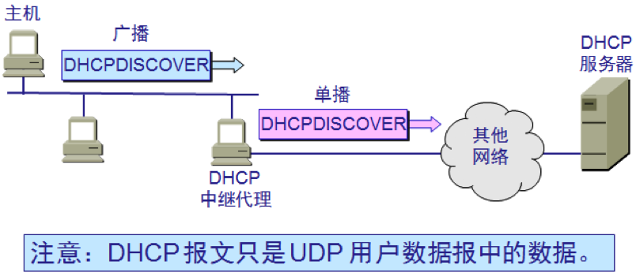

当 DHCP 中继代理收到主机发送的发现报文后，就以单播方式向 DHCP 服务器转发此报文，并等待其回答。收到 DHCP 服务器回答的提供报文后，DHCP 中继代理再将此提供报文发回给主机。

DHCP 服务器分配给 DHCP 客户的 IP 地址的临时的，因此 DHCP 客户只能在一段有限的时间内使用这个分配到的 IP 地址。DHCP 协议称这段时间为**租用期**。 

租用期的数值应由 DHCP 服务器自己决定。DHCP 客户也可在自己发送的报文中（例如，发现报文）提出对租用期的要求。  

# 7、套接字SOCKET

当某个应用进程启动系统调用时，控制权就从应用进程传递给了系统调用接口。

此接口再将控制权传递给计算机的操作系统。操作系统将此调用转给某个内部过程，并执行所请求的操作。

内部过程一旦执行完毕，控制权就又通过系统调用接口返回给应用进程。

系统调用接口实际上就是应用进程的控制权和操作系统的控制权进行转换的一个接口，即应用编程接口 API（Application Programming Interface）。

关于TCP/IP协议最著名的API就是Berkeley UNIX 操作系统定义的**套接字接口**(socket interface)。微软公司在其操作系统中采用了套接字接口 API，形成了一个稍有不同的 API，并称之为 Windows Socket。

请注意，**在套接字以上的进程是受应用程序控制的，而在套接字以下的运输层协议软件则是受计算机操作系统的控制**。因此，只要应用程序使用TCP/IP协议进行通信，它就必须通过套接字与操作系统交互并请求其服务。

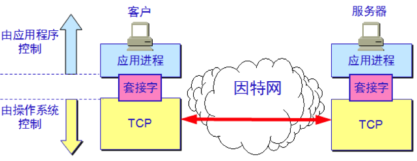

当应用进程需要使用网络进行通信时就发出系统调用，请求操作系统为其创建套接字，以便把网络通信所需要的系统资源分配给该应用进程。

操作系统为这些资源的总和用一个叫做**套接字描述符**的号码来表示，并把此号码返回给应用进程。应用进程所进行的网络操作都必须使用这个号码。

通信完毕后，应用进程通过一个关闭套接字的系统调用通知操作系统回收与该“号码”相关的所有资源。

下图描述了操作系统所创建的套接字描述符与套接字数据结构的关系：

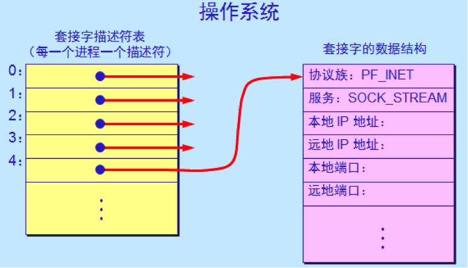

由于在一个机器中可能同时出现多个套接字，因此需要一个存放套接字描述符的表，而每一个套接字描述符有一个指针指向存放套接字的地址。

当套接字被创建后，它的端口号和 IP 地址都是空的，因此应用进程要调用 bind（绑定）来指明套接字的本地地址。在服务器端调用 bind 时就是把熟知端口号和本地IP地址填写到已创建的套接字中。这就叫做把本地地址绑定到套接字。

服务器在调用 bind 后，还必须调用 listen（收听）把套接字设置为被动方式，以便随时接受客户的服务请求。UDP服务器由于只提供无连接服务，不使用 listen 系统调用。

服务器紧接着就调用 accept（接受），以便把远地客户进程发来的连接请求提取出来。系统调用 accept 的一个变量就是要指明从哪一个套接字发起的连接。

