因特网采用的设计思路是这样的：网络层向上只提供简单灵活的、无连接的、尽最大努力交付的数据报服务。

也就是说，**网络层不保证服务的可靠性**。所传送的包可能出错、丢失、重复和失序，当然也不保证交付的时限。如果主机间需要可靠的通信，由网络层上面的传输层负责。

采用这种设计思路的好处是：网络的造价大大降低，运行方式灵活，能够适应多种应用。

# 1、IP地址

整个的因特网就是一个单一的、抽象的网络。IP地址就是给因特网上的每一个主机（或路由器）的每一个接口分配一个在全世界范围内唯一的32位的标识符。

所谓分类的IP地址，就是将IP地址划分为若干固定类，每一类地址都由两个固定长度的字段组成，其中一个字段是网络号 `net-id`，它标志主机（或路由器）所连接到的网络，一个网络号在整个因特网范围内必须是唯一的。而另一个字段则是主机号 `host-id`，它标志该主机（或路由器），一个主机号在它前面的网络号所指明的网络范围内必须是唯一的。由此可见，一个IP地址在整个因特网范围内是唯一的。

由于一个路由器至少应当连接到两个网络（这样它才能将 IP 数据报从一个网络转发到另一个网络），因此一个路由器至少应当有两个不同的 IP 地址。

用转发器或网桥连接起来的若干个局域网仍为一个网络，因此这些局域网都具有同样的网络号。

路由器只根据目的站的 IP 地址的网络号进行路由选择。

两级的 IP 地址可以记为：

`IP 地址 ::= { <网络号>, <主机号>}` 

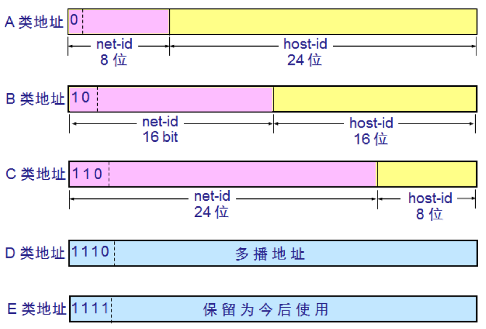

上图中的A类、B类、C类地址都是单播地址（一对一通信），是最常用的。

网络号字段的最前面有1-4位的类别位，A类、B类、C类地址的类别位分别为0、10、110。

为了提高可读性，我们常常把32位的IP地址中的每8位用其等效的十进制数字表示。

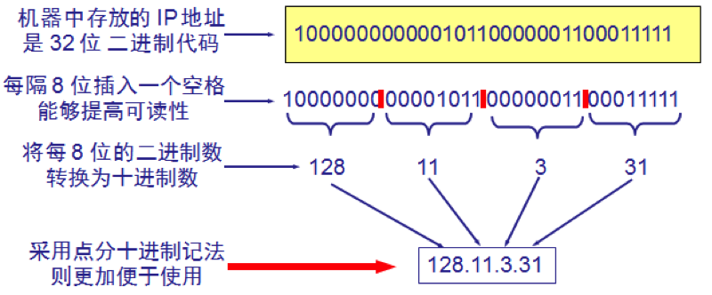

A类地址的网络号字段占一个字节，只有7位可供使用（第一位已固定为0），但是可指派的网络号是126个（2^7-2），减2的原因：

- 第一，IP地址中全为0的地址是个保留地址，表示“本网络”；
- 第二，网络号为127（01111111）保留作为本地软件环回测试本主机的进程间的通信。

A类地址的主机号占3字节，因此每一个A类网络中的最大主机数是224-2。减2的原因：

- 第一，全为0的主机号字段表示该IP地址是本主机所连接到的单个网络地址，
- 第二，全为1的主机号字段表示该网络上的所有主机。

B类地址的网络号字段有2字节，但是前两位已经固定为10，只剩下14位可以进行分配，因为前面两位是10，不会出现全为0或全为1的网络号，但实际上，B类网络地址`128.0.0.0`是不指派的。所以最大网络数为2^14-1。最大主机数为216-2。

C类地址有3字节的网络号字段，前三位固定位110，还有21位可以进行分配。但实际上`192.0.0.0`是不指派的，因此C类地址可指派的网络总数为2^21-1，最大主机数为2^8-2。

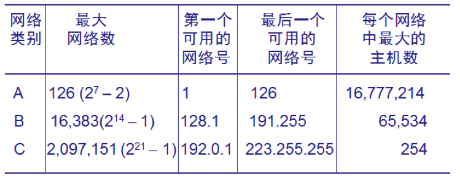

硬件地址是数据链路层和物理层使用的地址，而IP地址是网络层和以上各层使用的地址，是一种逻辑地址。

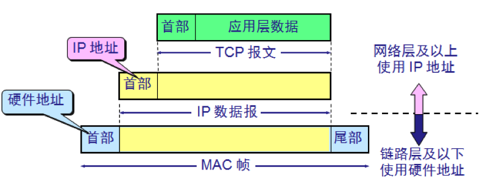

发送数据时，数据从高层下到地层，然后才到通信链路上传输。使用IP地址的IP数据报一旦交给了数据链路层，就被封装成了MAC帧。MAC帧在传送时使用的源地址和目的地址都是硬件地址，这两个硬件地址都写在MAC帧的首部。

连接在通信链路上的设备在接受MAC帧时，其根据是MAC帧首部中的硬件地址。在数据链路层看不见隐藏在MAC帧的数据中的IP地址。只有在剥去了MAC帧的首部和尾部后把MAC层的数据上交给网络层后，网络层才能在IP数据报的首部中找到源IP地址和目的IP地址。

# 2、划分子网

一个拥有许多物理网络的单位，可将所属的物理网络划分为若干个**子网**(subnet)。划分子网纯属一个单位内部的事情。单位对外仍然表现为一个网络。

划分子网的方法是从主机号借用若干个位作为子网号 `subnet-id`，而主机号 `host-id` 也就相应减少了若干个位。于是两级IP地址在本单位内部就变为三级IP地址：

`IP地址 ::= {<网络号>, <子网号>, <主机号>}`   

凡是从其他网络发送给本单位某个主机的 IP 数据报，仍然是根据 IP 数据报的目的网络号 `net-id`，先找到连接在本单位网络上的路由器。然后此路由器在收到 IP 数据报后，再按目的网络号 `net-id` 和子网号 `subnet-id` 找到目的子网。最后就将 IP 数据报直接交付目的主机。

下面通过一个例子来展示划分子网的方法与效果。

下图表示某单位拥有一个B类IP地址，网络地址是`145.13.0.0`（网络号是`145.13`）。

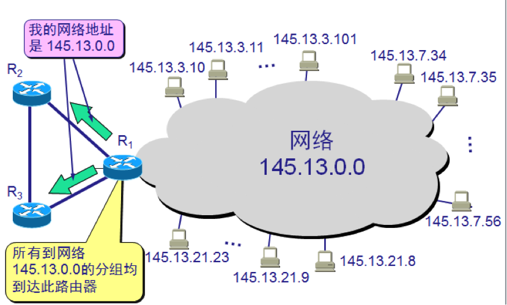

现把上图中的网络划分为三个子网，这里假定子网号占用8位，因此主机号只剩8位。所划分的子网分别是：`145.13.3.0`、`145.13.7.0`、`145.13.21.0`。

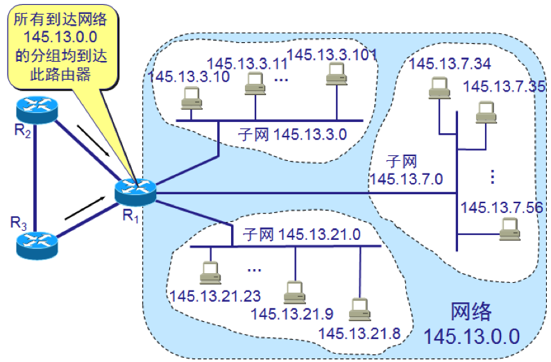

划分子网后，整个网络对外仍表现为一个网络，其网络地址仍为`145.13.0.0`，但是路由器R1在收到外来的数据报后，再根据数据报的目的地址把它转发到相应的子网。

假定有一个数据报的目的地址是`145.13.3.10`已经到达路由器R1，那么这个路由器如何把它转发到子网`145.13.3.0`呢？这就需要借助**子网掩码**（subnet mask）来实现了。

路由器会把子网掩码和收到的数据报地址的目的IP地址`145.13.3.10`进行按位“与”操作，得出所要找的子网的网络地址。

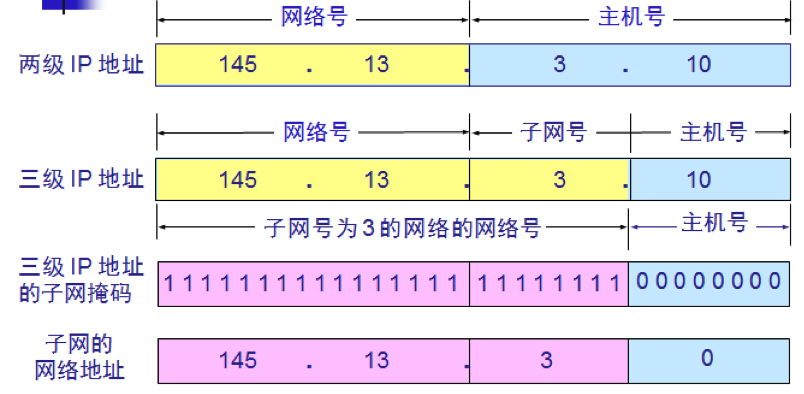

子网掩码与IP地址进行“与”操作之后，就将主机号“过滤”掉了，只剩下了网络号与子网号。

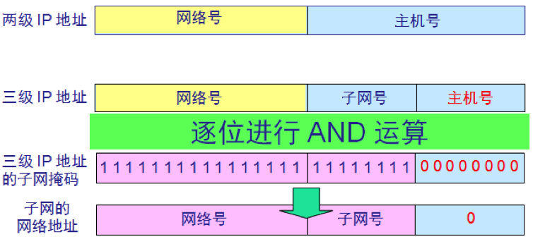

实际上，因特网的标准规定：所有网络必须使用子网掩码。即便一个网络没有划分子网，也要使用默认子网掩码。默认子网掩码中1的位置和IP地址中的网络号字段正好相对应，因此，两者进行“与”操作后，就能得出该IP地址的网络地址。A类、B类、C类地址的默认子网掩码是固定的：

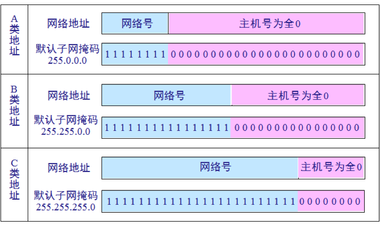

例，已知 IP 地址是 `141.14.72.24`，子网掩码是 `255.255.192.0`。试求网络地址。

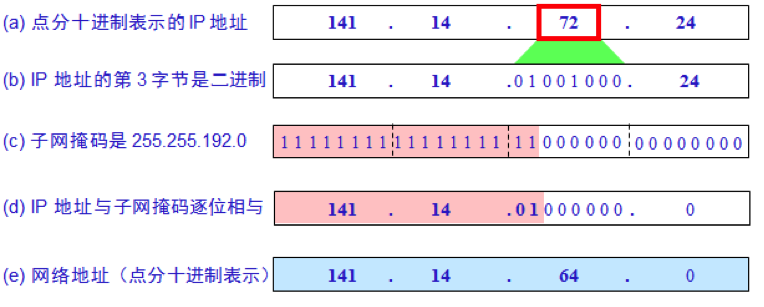

应当注意，划分子网后，路由表必须包含以下三项内容：

- 目的网络地址
- 子网掩码
- 下一跳地址

在划分子网的情况下路由器转发分组的算法：

- (1) 从收到的分组的首部提取目的 IP 地址 D。
- (2) 先用各网络的子网掩码和 D 逐位相“与”，看是否和相应的网络地址匹配。若匹配，则将分组直接交付。否则就是间接交付，执行(3)。
- (3) 若路由表中有目的地址为 D 的特定主机路由，则将分组传送给指明的下一跳路由器；否则，执行(4)。
- (4) 对路由表中的每一行的子网掩码和 D 逐位相“与”，若其结果与该行的目的网络地址匹配，则将分组传送给该行指明的下一跳路由器；否则，执行(5)。
- (5) 若路由表中有一个默认路由，则将分组传送给路由表中所指明的默认路由器；否则，执行(6)。
- (6) 报告转发分组出错。

# 3、专用地址与VPN

假如一个机构没有接入因特网，但是内部的计算机通信也是采用TCP/IP协议，那么从原则上讲，对于这些仅在机构内部使用的计算机就可以由本机构自行分配IP地址（这种地址称为本地地址）。

但是，如果任意选择一些IP地址作为本机构内部使用的本地地址，那么在某种情况下可能会引起一些麻烦。例如，有时机构内部的某个主机需要和因特网连接，那么这种仅在内部使用的本地地址就可能和因特网中某个IP地址重合。

为解决这一问题，IP地址中保留了一些专用地址，只能用于机构的内部通信，而不能用于因特网上的主机通信。因特网中的所有路由器，对目的地址是**专用地址的数据报一律不进行转发**。

这些专用地址如下：

- `10.0.0.0` 到 `10.255.255.255`
- `172.16.0.0` 到 `172.31.255.255`
- `192.168.0.0` 到 `192.168.255.255`

采用这样的专用IP地址的互联网称为**专用互联网**或**本地互联网**。

有时一个很大的机构有许多部门分布在相距很远的一些地点，而每一个地点都有自己的专用网。假如这些分布在不同地点的专用网需要经常通信，有两种解决办法，一是租用电信公司的通信线路为本机构专用，但是往往租金太高。二是利用公用的因特网作为本机构各专用网之间的通信载体，这样的专用网又称**虚拟专用网VPN**（Virtual Private Network）。

假定某机构在两个相隔较远的场所建立了专用网A和B，其网络地址分别为专用地址`10.1.0.0`和`10.2.0.0`。现在，这两个场所需要通过公用的互联网构成一个VPN。

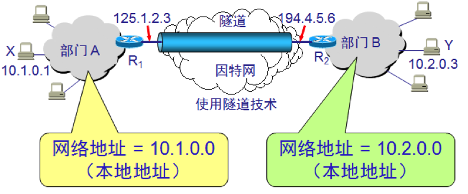

显然，每一个场所至少要有一个路由器具有合法的全球IP地址，这两个路由器和因特网的接口地址是全球IP地址，和内部网络的接口地址则是专用网的本地地址。

有的公司可能没有分布在不同场所的部门，但有很多流动员工在外地工作。公司需要和他们保持联系，远程接入 VPN 可满足这种需求。

在外地工作的员工拨号接入因特网，而驻留在员工 PC 机中的 VPN 软件可在员工的 PC 机和公司的主机之间建立 VPN 隧道，因而外地员工与公司通信的内容是保密的，员工们感到好像就是使用公司内部的本地网络。

# 4、网络地址转换NAT

**网络地址转换NAT** (Network Address Translation)可以将私网地址转换成公网地址，缓解IP地址的不足，平且可以隐藏内部网络的细节，起到一定的安全作用。

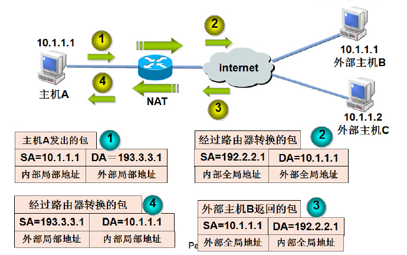

内部主机 X 用本地地址 IPx 和因特网上主机 Y 通信所发送的数据报必须经过 NAT 路由器。

NAT 路由器将数据报的源地址 IPx 转换成全球地址 IPg，但目的地址 IPy 保持不变，然后发送到因特网。

NAT 路由器收到主机 Y 发回的数据报时，知道数据报中的源地址是 IPy 而目的地址是 IPg。

根据 NAT 转换表，NAT 路由器将目的地址 IPg 转换为 IPx，转发给最终的内部主机 X。

这样就可以是专用网内较多数量的主机，轮流使用NAT路由器有限数量的全球IP地址。

显然，**通过NAT路由器通信必须由专用网内的主机发起**，设想因特网上的主机发起通信，当IP数据报到达NAT路由器时，NAT路由器就不知道应当把目的IP地址转换成哪一个本地地址，所以专用网内部的主机不能充当服务器用，因为因特网上的用户无法请求服务。

# 5、路由器与分组交换

路由器是实现**分组交换**（packet switching）的关键构件，其任务是转发收到的分组，这是网络核心部分最重要的功能。

分组交换是用**存储转发技术**实现的。通常我们把要发送的整块数据称为一个**报文**（message），发送报文之前，先把较长的报文划分为一个个更小的等长数据段，在每一个数据段前面加上一些必要的控制信息组成的首部（header）后，就构成了一个**分组**（packet），分组又称为**包**，而分组的首部也成为**包头**。**包是在因特网中传送的数据单元**。

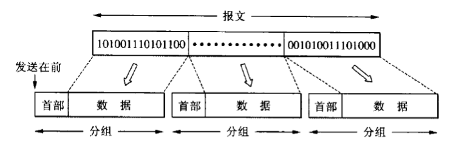

因特网的核心部分是由许多网络和把它们互连起来的路由器组成，而主机处在因特网的边缘部分。主机和路由器都是计算机，但它们的作用很不一样。主机是为用户进行信息处理的，并且可以和其它主机通过网络交换信息。路由器则是用来转发分组的，即进行分组交换的。

路由器收到一个分组，先暂时存储下来，再检查其首部，查找转发表，按照首部中的目的地址，找到合适的接口转发出去，把分组交给下一个路由器。这样一步一步地以存储转发的方式，把分组交付到最终的目的主机。

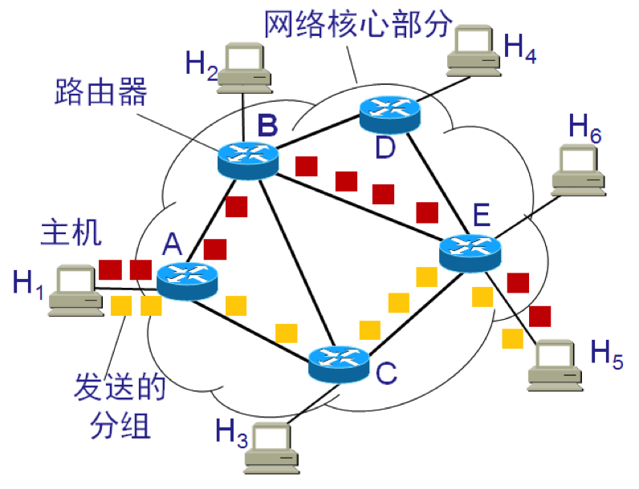

上图中，假如主机H1向主机H5发送数据，主机H1先将分组逐个地发往与它直接相连的路由器A，路由器A把主机H1发送的分组放入缓存，假定从路由器A的转发表中查出应把分组转发到链路A-C，于是分组就传送到路由器C，路由器继续按照上述方式查找转发表，假定查出应转发到路由器E，当分组到达路由器E后，路由器E就把分组直接交给主机H5。

假定在某一个分组的传送过程中，链路A-C的通信量太大，那么路由器A可以把分组沿另一个路由转发到路由器B，再转发到路由器E，最后把分组送到主机H5。

需要注意的是，路由器暂时存储的是一个个短分组，而不是整个的长报文，短分组是暂存在路由器的内存中而不是硬盘中，这就保证了较高的交换速率。

因特网采用了专门的措施，保证了数据的传送具有非常高的可靠性，当网络中的某些站点或链路突然发生故障时，在各路由器中运行的路由选择协议能够自动找到其他路径转发分组。

从上述可知，采用存储转发的分组交换，实质上是采用了在数据通信的过程中断续分配传输带宽的策略，这对于传送突发式的计算机数据非常合适，使得通信线路的利用率大大提高了。

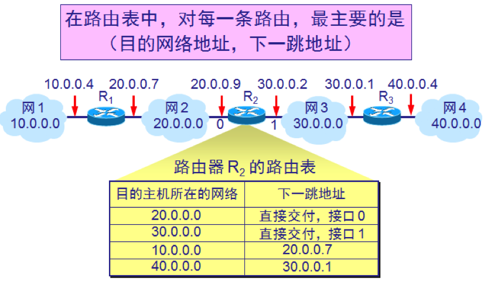

上图中有四个A类网络通过三个路由器连接在一起。每一个网络上都可能有成千上万个主机。可以想象，若按目的主机号来制作路由表，则所得出的路由表就会过于庞大（如果每个网络有一万台主机，路由表就有4万个记录）。但若按照主机所在的网络地址来制作路由表，那么每一个路由器中的路由表只包含4条记录就够了，每一条记录对应一个网络。

以路由器R2为例，由于R2同时连接在网络2和网络3上，因此只要目的站在这两个网络上，都可通过接口0或1有路由器R2直接交付。若目的主机在网络1中，则下一跳路由器应为R1，若目的主机在网络4中，则下一跳路由器应为R3。

再次重申，路由器是按照IP地址的网络号来转发分组的，就是说按照目的主机所在的网络转发分组。但是大多情况下都允许有这样的特例：对特定的目的主机指明一个路由，这种路由叫做特定主机路由。

采用特定主机路由可使网络管理人员能更方便地控制网络和测试网络，同时也可在需要考虑某种安全问题时采用这种特定主机路由。

分组转发算法如下：

- (1)  从数据报的首部提取目的主机的 IP 地址 D, 得出目的网络地址为 N。
- (2)  若网络 N 与此路由器直接相连，则把数据报直接交付目的主机 D；否则是间接交付，执行(3)。
- (3)  若路由表中有目的地址为 D 的特定主机路由，则把数据报传送给路由表中所指明的下一跳路由器；否则，执行(4)。
- (4)  若路由表中有到达网络 N 的路由，则把数据报传送给路由表指明的下一跳路由器；否则，执行(5)。
- (5) 若路由表中有一个默认路由，则把数据报传送给路由表中所指明的默认路由器；否则，执行(6)。
- (6)  报告转发分组出错。

# 6、IP协议族

与IP协议配套使用的还有三个协议：

- **地址解析协议 ARP**  (Address Resolution Protocol)
- **网际控制报文协议 ICMP**  (Internet Control Message Protocol)
- **网际组管理协议 IGMP**  (Internet Group Management Protocol)

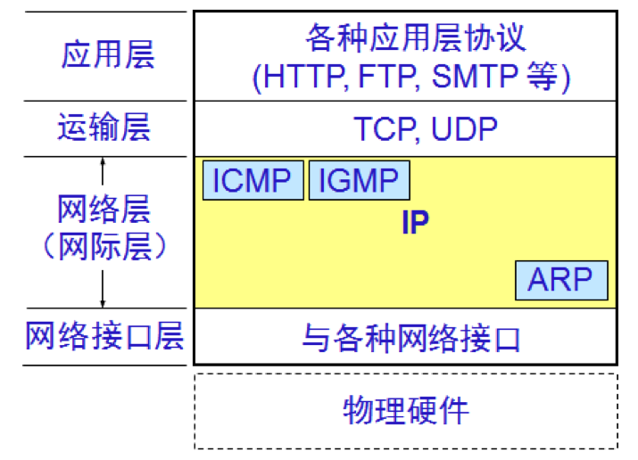             

将网络互相连接起来要使用一些中间设备，**中间设备**又称为**中间系统**或中继(relay)系统。根据中间设备所在的层次，可以有以下几种不同的中间设备：

- 物理层中继系统：**转发器**(repeater)。
- 数据链路层中继系统：**网桥**或**桥接器**(bridge)。
- 网络层中继系统：**路由器**(router)。
- 网桥和路由器的混合物：**桥路器**(brouter)。
- 网络层以上的中继系统：**网关**(gateway)

## 6.1 地址解析协议ARP

不管网络层使用的是什么协议，在实际网络的链路上传送数据帧时，最终还是必须使用硬件地址。这就需要解决一个问题，如何根据一个机器的IP地址找出其对应的物理地址；或反过来，如何根据物理地址找到其对应的IP地址。地址解析协议ARP与逆地址解析协议RARP就是用来解决这样的问题的。

每一个主机都设有一个 ARP 高速缓存(ARP cache)，里面有所在的局域网上的各主机和路由器的 IP 地址到硬件地址的映射表，这个映射表还经常动态更新。

当主机 A 欲向本局域网上的某个主机 B 发送 IP 数据报时，就先在其 ARP 高速缓存中查看有无主机 B 的 IP 地址。如有，就可查出其对应的硬件地址，再将此硬件地址写入 MAC 帧，然后通过局域网将该 MAC 帧发往此硬件地址。 

如果查不到主机B的IP地址，主机A就会在本局域网上广播发送一个ARP请求分组，本局域网上的所有主机都会收到此ARP请求分组，但是只有主机B会返回一个ARP响应分组，主机A收到后会写入到映射表中。

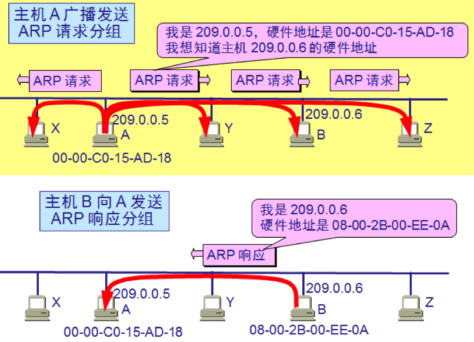

## 6.2 网际控制报文协议 ICMP

为了提高 IP 数据报交付成功的机会，在网际层使用了网际控制报文协议 **ICMP** (Internet Control Message Protocol)。ICMP 允许主机或路由器报告差错情况和提供有关异常情况的报告。

ICMP 不是高层协议，而是 IP 层的协议。ICMP 报文作为 IP 层数据报的数据，加上数据报的首部，组成 IP 数据报发送出去。   

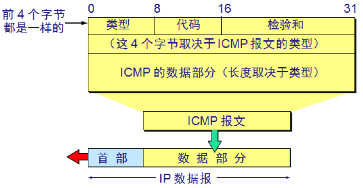

ICMP 报文的种类有两种:

- ICMP 差错报告报文
- ICMP 询问报文

ICMP 差错报告报文共有 5 种：

- 终点不可达 
- 源点抑制(Source quench)  
- 时间超过 
- 参数问题 
- 改变路由（重定向）(Redirect)  

ICMP 询问报文有两种：

- 回送请求和回答报文
- 时间戳请求和回答报文

ICMP的一个重要应用就是分组网间探测**PING**（Packet Intenet Groper），**用来测试两个主机之间的连通性**。PING是应用层直接使用网络层ICMP的一个例子。它没有通过运输层的TCP或UDP。

## 6.3 网际组管理协议 IGMP

IGMP用于支持主机和路由器进行**多播的网际组管理协议**。

网络层的组播用于向某些特定的主机群发消息，而不必给每一个主机都单独发送消息。与单播路由相比，相同点是路由算法在网络层仍发挥着重要作用，但是不同点是处理组播包的路由器必须建立和维护组播连接的状态信息。

组播通常采用间接的方式进行组播：每一组接收者有一个统一的“标识符”，将包传送到与该“标识符”相连的所有接收者，而不是把所有接受者的目的地址都放在IP组播包里面的直接法。这是显而易见的，因为当某个组播的主机很多的时候地址太多会严重影响消息传递的效率。发送方应该知道组里面有多少成员（并且成员应该随意加入和退出），并且路由器应该知道怎么把组播数据包传递给所有有连接某一个组播的主机的路由器。如下图所示：

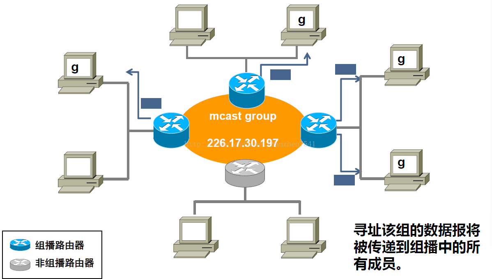

图中蓝色的是组播路由器，带g符号的是参加某一个组播的主机。那么假设某个源是组播源，它想发送消息给所有的加入某个组播的主机，那么首先他应该把消息发送给所有组播路由器；之后组播路由器再把消息发送给自己的加入组播的主机。

从上面的步骤来看，主要就两个部分，所以网络层的组播协议主要也由两个部分组成：IGMP协议以及组播路由协议。**IGMP协议用于用户进程通过该协议提出加入/退出某个组的请求**，也就是说路由器通过这个协议了解自己局域网下面哪些主机加入了哪些组；组播路由协议用于保证所有组播路由器都能收到组播包。    

IGMP协议工作在主机与其直接相连的路由器之间，主机用它来通告它想加入某个组播组，路由器用它来发现所连网络上是否有主机属于某个组播组。