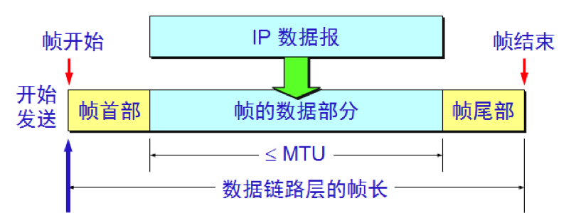
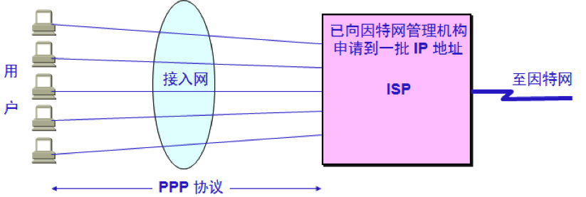
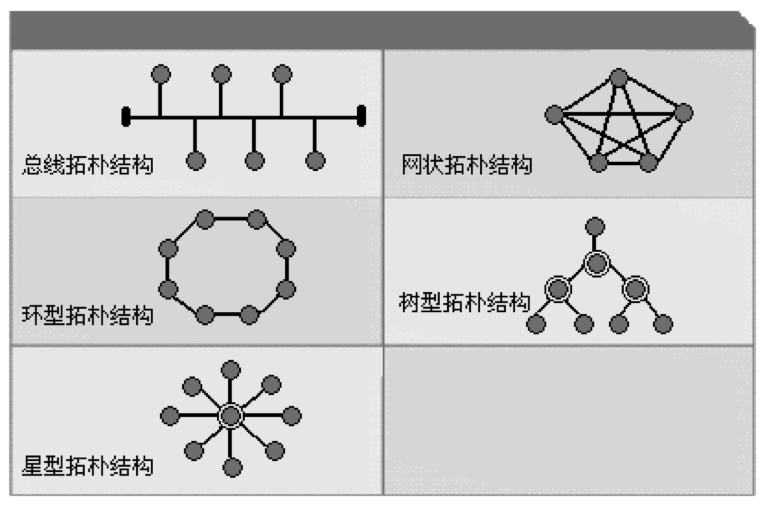
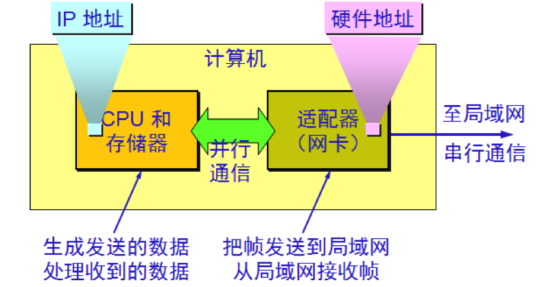
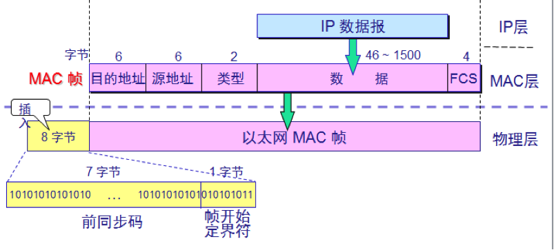
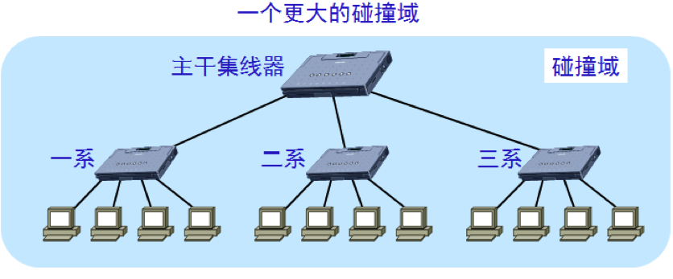
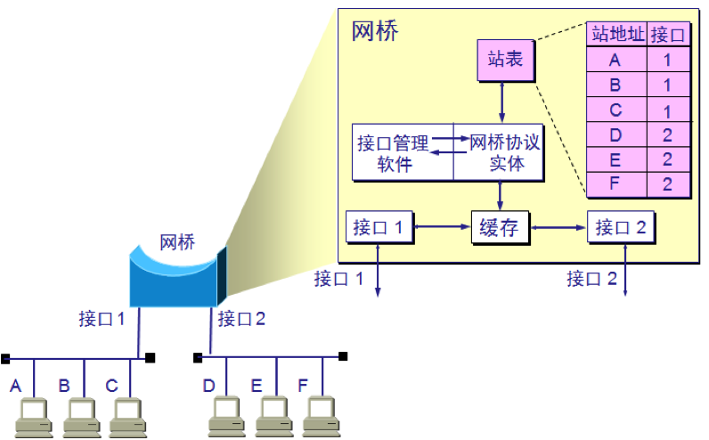
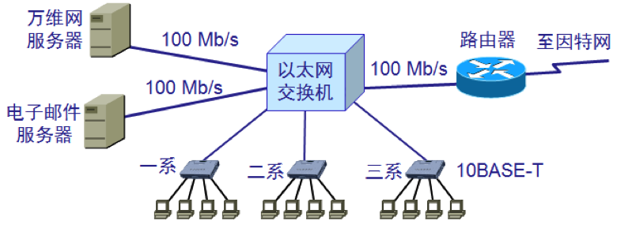
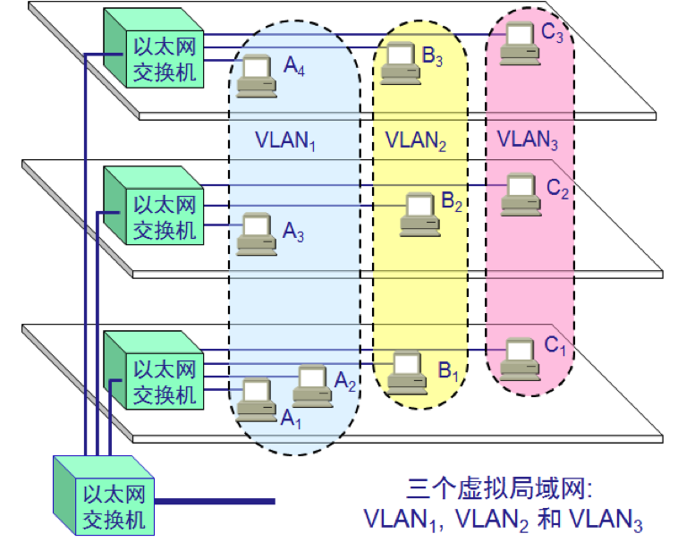
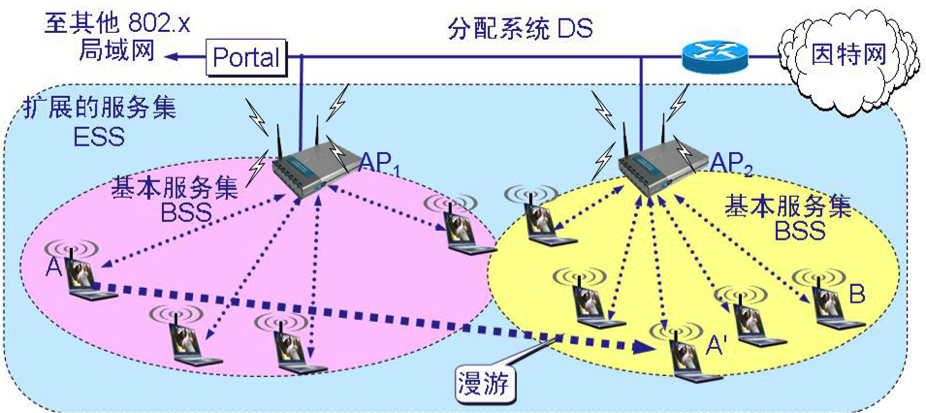

# 1、协议

数据链路层协议有许多种，但是有三个基本问题则是共同的：**封装成帧**、**透明传输**和**差错检测**。

## 1.1 封装成帧

所有在因特网上传送的数据都是以**IP数据报**为传送单位的，网络层的IP数据报传送到数据链路层就成为帧的数据部分，在帧的数据部分的前面和后面添加上首部和尾部，构成一个完整的**帧**。

每一种链路层协议都规定了帧的数据部分的长度上线——**最大传送单元MTU**（Maximum Transfer Unit）。

## 1.2 透明传输

透明传输，即无论什么样的比特流都能够通过数据链路层传输。

帧的开始和结束标记是专门指明的控制字符，因此，所传输的数据中的任何8比特组合一定不允许和这些控制字符的编码相同，否则就会出现帧的定界错误。

解决这种矛盾的方法是，将数据中可能出现的控制字符的前面插入转义字符“ESC”，而在接收端再删除该转义字符，这种方法被称为**字节填充**。

## 1.3 差错检测

现实的通信线路都不会是理想的，比特在传输过程中可能会产生差错：1可能会变成0，0也可能会变成1。为了保证数据传输的可靠性，必须采用各种差错检测措施。目前在数据链路层广泛使用的是**循环冗余检验CRC**（Cyclic Redundancy Check）。

# 2、点对点协议PPP

对于点对点的链路，**PPP**（Point-to-Point Protocol）是目前使用最广泛的数据链路层协议。

我们知道，因特网用户通常都要连接到某个ISP才能接入到因特网。PPP协议就是用户计算机和ISP进行通信时所使用的数据链路层协议。

PPP协议由三个部分组成：

- 一个将IP数据报封装到串行链路的方法。
- 一个用来建立、配置和测试数据链路连接的**链路控制协议LCP**（Link Control Protocol）。
- 一套**网络控制协议NCP**（Network Control Protocol）。

当用户拨号接入ISP后，就建立了一条从用户PC机到ISP的物理连接。这时，用户PC机向ISP发送一系列的LCP分组（封装成多个PPP帧），以便建立LCP连接。这些分组及其响应选择了将要使用的一些PPP参数。接着还要进行网络层配置，NCP给新接入的用户PC机分配一个临时的IP地址。这样，用户PC机就成为一个拥有IP地址的主机了。

当用户通信完毕时，NCP释放网络层连接，收回原来分配出去的IP地址。接着，LCP释放数据链路层连接。最后释放的是物理层的连接。

# 3、局域网的数据链路层

局域网最主要的特点是：网络为一个单位所拥有，且地理范围和站点数目均有限。

局域网具有广播功能，从一个站点可很方便地访问全网，局域网上的主机可共享连接在局域网上的各种硬件和软件资源。
局域网按照拓扑结构可分为**总线结构**、**环型结构**、**星型结构**、**网状结构**、**树型结构**以及**混合型结构**。

# 4、以太网

以太网最初是美国施乐公司研制的基于基带总线的局域网，以曾经在历史上表示传播电磁波的以太（Ether）来命名。

DIX Ethernet V2 是世界上第一个局域网产品（以太网）的规约，在此基础上，IEEE制定了了802.3 标准，DIX Ethernet V2 标准与 IEEE 的 802.3 标准只有很小的差别，因此可以将 **802.3 局域网简称为“以太网”**。

为了使数据链路层能更好地适应多种局域网标准，802 委员会就将局域网的数据链路层拆成两个子层：

- **逻辑链路控制 LLC** (Logical Link Control)子层
- **媒体接入控制 MAC** (Medium Access Control)子层

与接入到传输媒体有关的内容都放在 MAC子层，而 LLC 子层则与传输媒体无关，不管采用何种协议的局域网对LLC 子层来说都是透明的。

以太网在局域网市场中已取得了垄断地位，并且几乎成了局域网的代名词，由于因特网发展很快而TCP/IP体系中经常使用的局域网只剩下DIX Ethernet V2而不是IEEE 802.3 标准中的局域网，因此现在802委员会制定的逻辑链路控制子层LLC的作用已经消失了，很多厂商生产的适配器上仅装有MAC协议而没有LLC协议。

计算机与外界局域网的连接是通过适配器。适配器上装有处理器和存储器，适配器和局域网之间的通信是通过电缆或双绞线以串行传输方式进行的，而适配器和计算机之间的通信则是通过计算机主板上的I/O总线以并行传输方式进行的。因此，适配器的一个重要功能就是要进行数据串行传输和并行传输的转换。

适配器接受和发送各种帧时不使用计算机的CPU。当适配器收到正确的帧时，它就使用中断来通知该计算机并交付给协议栈中的网络层；当计算机要发送IP数据报时，就由协议栈把IP数据报向下交给适配器，组装成帧后发送到局域网。

需要注意，计算机的硬件地址就在适配器的ROM中，而计算机的IP地址则在计算机的存储器中。

# 5、CSMA/CD协议

为了通信的简便，以太网采取了以下两种措施：

- 第一，采用无连接的工作方式，即不必先建立连接就可以直接发送数据。因此，以太网提供的服务是不可靠的交付，而是尽最大努力的交付。
- 第二，以太网发送的数据都是用**曼彻斯特编码**的信号。

我们知道，总线上只要有一台计算机在发送数据，总线的传输资源就被占用，因此，在同一时间只能允许一台计算机发送信息，否则各计算机之间就会相互干扰，结果大家都无法正常发送数据。

以太网采用的协调方法是使用一种特殊的协议**CSMA/CD**，即**载波监听多点接入/碰撞检测**（Carrier Sense Multiple Access with Collision Detection）。

- “**多点接入**”就是说明这是总线型网络，许多计算机以多点接入的方式连接在一根总线上，协议的实质是“载波监听”和“碰撞检测”。
- “**载波监听**”就是“发送前先监听”，即每一个站在发送数据前先要检测一下总线上是否有其他站在发送数据，如果有，则要等到信道空闲时再发送。
- “**碰撞检测**”就是“边发送边监听”，即适配器边发送数据边检测信道上的信号电压的变化情况，以便判断自己在发送数据时其他站是否也在发送数据。一旦发生了碰撞，适配器就要立即停止发送。

显然，在使用CSMA/CD协议时，一个站不可能同时进行发送与接收，因此使用CSMA/CD协议的以太网不可能进行全双工通信而**只能进行半双工通信**。

# 6、MAC地址

在局域网中，**硬件地址**又称为**物理地址**，或 **MAC 地址**。

IEEE 802标准为局域网规定了一种48位的全球地址，是指**局域网上的每一台计算机中固化在适配器的ROM中的地址**。

IEEE 的注册管理机构 RA 负责向厂家分配地址字段的前三个字节(即高位 24 位)。地址字段中的后三个字节(即低位 24 位)由厂家自行指派，称为扩展标识符，必须保证生产出的适配器没有重复地址。

适配器有过滤功能，适配器从网络上每收到一个MAC帧就先用硬件检查MAC帧中的目的地址，如果是发往本站的帧则收下，否则丢弃。发往本站的帧包括以下三种帧：

- **单播帧**，即收到的帧的MAC地址与本站的硬件地址相同。
- **广播帧**，即发送给本局域网上所有站点的帧。
- **多播帧**，即发送给本局域网上一部分站点的帧。

以太网最常用的是以太网 V2 格式的MAC帧，格式如下：

由五个字段组成。前两个字段为目的地址和源地址。第三个字段是类型字段，用来标识上一层使用的是什么协议，以便把收到的MAC帧的数据上交给上一层的这个协议。第四个字段是数据字段，最后一个是帧检验序列FCS（使用CRC检验）。

# 7、局域网的扩展

## 7.1 集线器

使用集线器（hub）可以在**物理层扩展局域网**：

- **优点**
  - 使原来属于不同碰撞域的局域网上的计算机能够进行跨碰撞域的通信。
  - 扩大了局域网覆盖的地理范围。
- **缺点**
  - 碰撞域增大了，但总的吞吐量并未提高。
  - 如果不同的碰撞域使用不同的数据率，那么就不能用集线器将它们互连起来。   

## 7.2 网桥

**在数据链路层扩展局域网是使用网桥**(network bridge)。

网桥工作在数据链路层，它根据 MAC 帧的目的地址对收到的帧进行转发。

网桥具有过滤帧的功能。当网桥收到一个帧时，并不是向所有的接口转发此帧，而是先检查此帧的目的 MAC 地址，然后再确定将该帧转发到哪一个接口。

- **优点**
  - 过滤通信量。 
  - 扩大了物理范围。
  - 提高了可靠性。
  - 可互连不同物理层、不同 MAC 子层和不同速率（如10 Mb/s 和 100 Mb/s 以太网）的局域网
- **缺点**
  - 存储转发增加了时延。 
  - 在MAC 子层并没有流量控制功能。 
  - 具有不同 MAC 子层的网段桥接在一起时时延更大。
  - 网桥只适合于用户数不太多(不超过几百个)和通信量不太大的局域网，否则有时还会因传播过多的广播信息而产生网络拥塞。这就是所谓的**广播风暴**。  

## 7.3 交换机

以太网交换机通常都有十几个接口。因此，以太网交换机实质上就是一个多接口的网桥，可见**交换机工作在数据链路层**。

对于普通 10 Mb/s 的共享式以太网，若共有 N 个用户，则每个用户占有的平均带宽只有总带宽(10 Mb/s)的 N 分之一。
使用以太网交换机时，虽然在每个接口到主机的带宽还是 10 Mb/s，但由于一个用户在通信时是独占而不是和其他网络用户共享传输媒体的带宽，因此对于拥有 N 对接口的交换机的总容量为 N * 10 Mb/s。这正是交换机的最大优点。  

利用以太网交换机可以很方便地实现**虚拟局域网**，虚拟局域网 VLAN 是由一些局域网网段构成的与物理位置无关的逻辑组。每一个 VLAN 的帧都有一个明确的标识符，指明发送这个帧的工作站是属于哪一个 VLAN。

虚拟局域网其实只是局域网给用户提供的一种服务，而并不是一种新型局域网。

## 7.4 无线局域网

无线局域网常简写为**WLAN**（Wireless Local Area Network）。

1997年IEEE制定出无线局域网的协议标准`802.11`。`802.11`是个相当复杂的标准，简单来说，是以无线以太网的标准，使用星型拓扑，其中心叫做接入点**AP**（Access Point），在MAC层使用CSMA/CA协议。

凡使用`802.11`系列协议的局域网又称为**Wi-Fi**（Wireless-Fidelity，意思是“无线保真度”）。

`802.11`标准规定无线局域网的最小构件是基本服务集**BSS**（Basic Service Set）。一个基本服务及BSS包括一个基站和若干移动站，所有的站在本BSS以内都可以直接通信，但在和本BSS以外的站通信时都必须通过本BSS的基站。

BSS中的基站就是接入点AP，当网络管理员安装AP时，必须为该AP分配一个不超过32字节的服务集标识符**SSID**（Service Set IDentifier）和一个信道。

一个BSS所覆盖的地理范围叫作一个基本服务区**BSA**（Basic Service Area），直径一般不超过100米。

一个BSS可以是孤立的，也可以通过接入点AP连接到一个分配系统**DS**（Distribution System），然后再连接到另一个BSS，这样就构成了一个扩展的服务集**ESS**（Extended Service Set）。ESS还可以为无线用户提供到非802.x（非802.11无线局域网）的接入。这种接入是通过**Portal**来实现的。Portal的作用就相当于一个网桥。

 