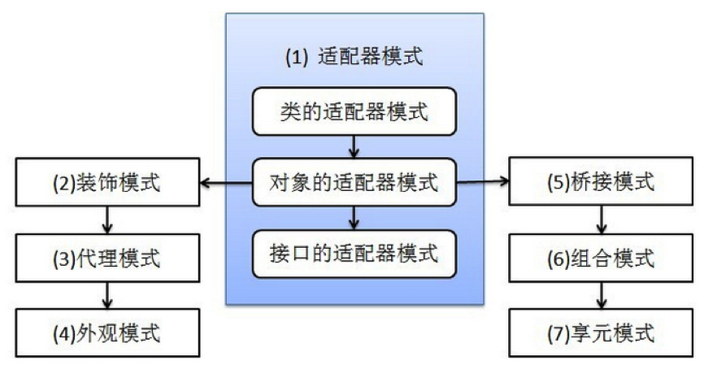

# 1、适配器模式

## 1.1 类的适配器模式

比如有这样一个变压器，可以转换220V电压和380V电压：

```java
    public class Transformer {

        public void change220V() {
            //输出10V电压 
        }

        public void change380V() {
        //输出10V电压
        }

    }
```

现在需要增加一种功能，转换500V的电压，下面用类的适配器模式改造。

先定义一个接口，列出了所有需要的转换功能：

```java
public interface ITransformer{
	public abstract void change220V();
	public abstract void change380V();
	public abstract void change500V();
}
```

适配器继承了Transformer类并实现了ITransformer接口：

```java
public class Adapter extends Transformer implements ITransformer{
	public void change500V(){
		//输出10V电压
	}
}
```

Adapter继承了Transformer类，所以change220V方法与change380V方法都已经存在，只需要实现ITransformer接口中的change500V方法即可。

现在Adapter类就可以转换220V、380V、500V三种类型的电压了。

因为Adapter继承了Transformer，java是单继承的语言，这个适配器只能为Transformer这一个类服务，所以称之为类的适配器模式。

## 1.2 对象的适配器模式

与类的适配器模式不同的是，对象的适配器模式把要改造的目标聚合到适配器类中，同样的变压器问题，对象的适配器模式写法如下。

Transformer类和ITransformer接口与上面完全一样：

```java
    public class Adapter implements ITransformer {
        Transformer transformer;

        //由构造方法传入Transformer对象
        public Adapter(Transformer transformer) {
            this.transformer = transformer;
        }

        // Transformer类中存在的方法则直接调用
        public void change220V() {
            transformer.change220V();
        }

        public void change380V() {
            transformer.change220V();
        }

        // Transformer类中没有的方法则新建
        public void change500V() {
            //输出10V电压
        }
    }
```

这种适配器模式可用于多个源的改造，比如，还有一个变压器只有change220V方法，则把这个类传入适配器中，然后新建change380V和change500V两个方法。当然，这需要增加判断语句，先要判断这个类缺失哪种方法，然后跳到分支语句块进行相应的处理，这样不论传入哪种源，都可以得到符合要求的适配器。

# 2、桥梁模式

桥梁模式的用意是：将抽象化与实现脱耦，使得二者可以独立的变化。

在java中桥梁模式最典型的应用是实现JDBC驱动器DriverManager就是连接JDBC应用程序和数据库驱动的＂桥＂。

考虑这样一个问题，某公司内部的OA系统需要增加这样的一项功能，如果尚未处理完毕的文件，需要发送一条信息进行提示，从业务上看，发送的消息可以分为普通消息、加急消息和特级消息多种；从发送消息的手段上看，又有系统内短消息、电子邮件和手机发送等。

先来看一下不使用设计模式的解决方案：

```java
    //发送消息的统一接口（普通消息类）
    public interface Message {
        public void send(String message, String toUser);
    }

    //系统内短消息的实现类（普通消息类）
    public class CommonMessageSMS implements Message {
        public void send(String message, String toUser) {
            //以系统内短消息的方式发送
        }
    }

    //邮件发送消息的实现类（普通消息类）
    public class CommonMessageEmail implements Message {
        public void send(String message, String toUser) {
            //以系统内短消息的方式发送
        }
    }

    //发送消息的统一接口（加急消息类）
    public interface UrgencyMessage extends Message {
        public void urge(String toUser);   //加急消息类的特有方法，催促用户
    }

    //系统内短消息的实现类（加急消息类）
    public class UrgencyMessageSMS implements UrgencyMessage {
        public void send(String message, String toUser) {
            //以系统内短消息的方式发送
        }

        public void urge(String toUser) {
            //催促用户
        }
    }

    //邮件发送消息的实现类（加急消息类）
    public class UrgencyMessageEmail implements UrgencyMessage {
        public void send(String message, String toUser) {
            //以系统内短消息的方式发送
        }

        public void urge(String toUser) {
            //催促用户
        }
    }
```

软件在设计阶段必须考虑到以后的功能扩展和修改，上面的代码实现了发送普通消息和加急消息的功能，发送方式分为系统内短消息和电子邮件两种方式。	实际上有两个维度是可变的，即消息的类型和消息的发送方式。

假如现在接到甲方的通知，需要增加手机短信的发送方式，需要在每一类消息发送的实现类增加手机短信的发送方式；另外，如果需要增加一种＂特急消息＂的消息类型，必须实现所有发送方式。

可见，一个维度的变化会引起另一个维度相应的变化，从而使程序扩展起来非常的困难，根本原因是因为消息的抽象和实现是混杂在一起的，要想解决这个问题，必须把这两个维度分开，也就是将抽象部分和实现部分分开，让它们相互的独立，这样就可以独立的变化，使扩展变得简单。

按照桥梁模式的结构，给抽象部分和实现部分分别定义接口，然后分别实现它们就可以了。

```java
    //实现部分定义的接口，发送信息的统一接口
    public interface MessageImplementor {
        public void send(String message, String toUser);
    }

    //抽象部分定义的接口
    public abstract class AbstractMessage {
        protected MessageImplementor impl;  //持有一个实现部分的对象

        public AbstractMessage(MessageImplementor impl) {  //构造方法
            this.impl = impl;
        }

        public sendMessage(String message, String toUser) {
            this.impl.send(message, toUser); //调用impl的方法
        }

    }

    //以站内短消息的形式发送信息
    public class MessageSMS implements MessageImplementor {
        public void send(String message, String toUser) {
            //执行发送消息的代码
        }
    }

    //以Email的形式发送信息
    public class MessageEmail implements MessageImplementor {
        public void send(String message, String toUser) {
            //执行发送消息的代码
        }
    }
```

下面来扩展抽象的消息接口：

```java
    //普通消息的实现
    public class CommonMessage extends AbstractMessage {
        //构造方法，传入MessageImplementor的一个实现类
        public CommonMessage(MessageImplementor impl) {
            super(impl);
        }

        //直接调用父类的方法，其他什么都不做
        public void sendMessage(String message, String toUser) {
            super.sendMessage(message, toUser);
        }
    }

    //加急消息
    public class UrgencyMessage extends AbstractMessage {
        //构造方法，传入MessageImplementor的一个实现类
        public CommonMessage(MessageImplementor impl) {
            super(impl);
        }

        public void sendMessage(String message, String toUser) {
            urge(toUser) {
                //加急消息特有的处理方法
            }
            //然后在调用父类的方法发送消息
            super.sendMessage(message, toUser);
        }

    }
```

到此，原始代码已经写完，现在系统可以发送普通消息、加急消息，发送方式可以是站内短消息、Email。现在重新考虑扩展的问题，同样的问题，增加一种特急消息和一种手机短信的发送方式。

```java
    //特急消息
    public class SpecialUrgencyMessage extends AbstractMessage {
        //构造方法，传入MessageImplementor的一个实现类
        public CommonMessage(MessageImplementor impl) {
            super(impl);
        }

        public void sendMessage(String message, String toUser) {
            urge(toUser) {
                //特急消息特有的处理方法
            }
            //然后在调用父类的方法发送消息
            super.sendMessage(message, toUser);
        }

    }

    //以手机短信的形式发送信息
    public class MessageMobile implements MessageImplementor {
        public void send(String message, String toUser) {
            //执行发送消息的代码
        }
    }
```

可见正增加了两个类，就实现了要扩展的功能，如果按照上面没有使用模式的代码来扩展，需要增加6个类。

```java
    //创建一个站内短消息的发送方式
    MessageImplementor impl = new MessageSMS();

    //创建一个普通消息对象，并传入发送方式
    AbstractMessage m = new CommonMessage(impl);
    m.sendMessage("请你喝茶","小陈");

    //创建一个加急消息对象，并传入发送方式
    AbstractMessage m = new UrgencyMessage(impl);
    m.sendMessage("请你喝茶","小陈");

    //把实现方式切换成手机短信
    MessageImplementor impl2 = new MessageMobile();

    //创建一个特急消息对象，并传入发送方式
    AbstractMessage m = new SpecialUrgencyMessage(impl2);
    m.sendMessage("请你喝茶","小陈");
```


# 3、组合模式

组合模式所代表的数据构造是一群具有统一接口界面的对象集合。

组合模式在处理树形结构的问题时比较方便，文件/目录结构是一个典型的应用。

```java
    //File与Folder的共同接口
    public interface Root {
        public boolean addFile(File file);

        public boolean removeFile(File file);

        public List<Root> getFile();

        public void display();
    }

    //文件实现类
    public class File implements Root {
        String name;


        public File(String name) {
            this.name = name;
        }

        public List<Root> getFile() {
            return null;
        }


        public boolean addFile(File file) {
            return false;
        }


        public boolean removeFile(File file) {
            return false;
        }

    }

    public void display() {
        System.out.println("文件名字：" + name);
    }

    //目录实现类
    public class Folder implements Root {
        String name;
        List<Root> folder;

        public Folder(String name) {
            this.name = name;
            this.folder = new ArrayList<Root>;
        }

        public List<Root> getFile() {
            return folder;
        }

        public boolean addFile(File file) {
            return folder.add(file);
        }

        public boolean removeFile(File file) {
            return folder.remove(file);
        }

        public void display() {
            for (Root f : folder) {
                if (f instanceof Folder) {
                    System.out.println("目录");
                }
                f.display();
            }

        }
    }

    //测试类
    Root root1 = new Folder("c://");
    Root root2 = new Folder("d://");
    Root win = new Folder("windows");
    Root sys = new Folder("system");
    Root hw = new File("HellowWorld.java");

    root1.addFile(win);
    root1.addFile(sys);
    win.addFile(hw);
    
    root1.display();
    root2.display();
```

# 4、装饰模式

装饰模式能够在不必改变原类文件和使用继承的情况下，动态扩展一个对象的功能，装饰模式是通过创建一个包装对象来实现的，也就是用装饰来包裹真实的对象。

java中的I/O流就是典型的装饰模式的应用。

```java
    //定义咖啡的接口
    public interface ICoffee {
        void showCoffee();

        double showPrice();
    }

    //咖啡对象的实现类，这是一个待装饰的对象，可以对咖啡进行加糖、加牛奶等相关的操作
    public class Coffee implements ICoffee {
        private String name;
        private double price;

        public Coffee(String name, double price) {
            this.setName(name);
            this.setPrice(price);
        }

        public void showCoffee() {
            System.out.println(this.getName() + "咖啡");
        }

        public double showPrice() {
            return this.getPrice();
        }

        //省略相应的setter、getter方法
    }

    //咖啡的装饰器，同样实现ICoffee接口，需要保证装饰器和被装饰的对象拥有一致的接口 
    public class SugarDecorator implements ICoffee {
        private ICoffee coffee;  //持有一个接口的实现对象

        public void setCoffee(ICoffee cf) {
            coffee = cf;
        }

        public void showCoffee() {
            System.out.println("加糖的");  //加上装饰
            coffee.showCoffee();  //调用传入对象的相应方法
        }

        public double showPrice() {
            return 10.0 + coffee.showPrice();
        }
    }

    //咖啡的另一种装饰器 
    public class MilkDecorator implements ICoffee {
        private ICoffee coffee;  //持有一个接口的实现对象

        public void setCoffee(ICoffee cf) {
            coffee = cf;
        }

        public void showCoffee() {
            System.out.println("加牛奶的");  //加上装饰
            coffee.showCoffee();  //调用传入对象的相应方法
        }

        public double showPrice() {
            return 15.0 + coffee.showPrice();
        }
    }

    //测试类
    Coffee coffee = new Coffee("拿铁"，55.0);
    SugarDecorator sugar = new SugarDecorator();
    MilkDecorator milk = new MilkDecorator();

    sugar.setCoffee(coffee);  //给咖啡加糖
    milk.setCoffee(sugar);     //再给咖啡加牛奶
    milk.showCoffee();
    System.out.println(milk.showPrice());
```

打印出来的是：（注意＂加牛奶的＂应该在＂加糖的＂前面）。

> ​	加牛奶的加糖的拿铁咖啡
> ​	80.0

# 5、外观模式

外观模式是一个能为子系统和客户提供简单接口的类，当正确使用外观时，客户不再与子系统中的类交互，而是与外观交互，外观承担了与子系统中类交互的责任。实际上，外观是子系统与客户的接口，这样外观模式降低了子系统与客户的耦合度。

外观模式是有代理模式发展而来的，与代理模式类似，代理模式是一对一的代理，而外观模式是一对多的代理。与装饰模式不同的是，装饰模式为对象增加功能，而外观模式则是提供一个简化的调用方式。

```java
    public class CPU {
        public void startup() {
            System.out.println("启动CPU");
        }

        public void shutdown() {
            System.out.println("关闭CPU");
        }
    }

    public class Memory {
        public void startup() {
            System.out.println("加载内存");
        }

        public void shutdown() {
            System.out.println("清空内存");
        }
    }

    public class Disk {
        public void startup() {
            System.out.println("加载硬盘");
        }

        public void shutdown() {
            System.out.println("卸载硬盘");
        }
    }

    public class Computer {

        private CPU cpu;
        private Memory memory;
        private Disk disk;

        public Computer() {
            this.cpu = new CPU();
            this.memory = new Memory();
            this.disk = new Disk();
        }

        public void stratup() {
            System.out.println("启动计算机");
            cpu.startup();
            memory.startup();
            disk.startup();
            System.out.println("启动计算机完成");
        }

        public void shutdown() {
            System.out.println("关闭计算机");
            cpu.shutdown();
            memory.shutdown();
            disk.shutdown();
            System.out.println("关闭计算机完成");
        }

    }
```

用户类只需要调用Computer类来操纵计算机CPU、内存、硬盘的关闭与开启，而不需要与各个子系统类直接交互。

# 6、享元模式

享元模式采用一个共享来避免大量拥有相同内容对象的开销，数据库的连接池就是享元模式的一个典型应用。
享元对象能做到共享的关键是区分**内蕴状态**（Internal State）和**外蕴状态**（External State）。

内蕴状态是存储享元对象内部的，并且不会随环境的改变而有所不同，所以一个享元具有内蕴状态并可以共享
外蕴状态是随环境的改变而改变的、不可共享的。外蕴状态不可以影响内蕴状态，它们是相互独立的。

很显然，这里需要产生不同的新对象所以享元模式常常结合工厂模式一块使用，享元工厂通常用来维护享元池的。

假设某个咖啡店有几种口味的咖啡，例如拿铁、摩卡、卡布奇诺等，如果这家店要一次性生产几十杯咖啡，那么显然咖啡的口味就可以放进一个共享池中，而不必为每一杯咖啡单独生成。

```java
    //订单抽象类
    public abstract class Order {
        public abstract void sell();
    }

    //订单实现类
    public class FlavorOrder extends Order {
        public String flavor;

        public FlavorOrder(String flavor) {
            this.flavor = flavor;
        }

        public void sell() {
            System.out.println("生产出一份" + flavor + "口味的咖啡");
        }
    }

    public class FlavorFactory {
        //咖啡口味的共享池
        private Map<String, Order> flavorPool = new HashMap<String, Order>;

        //静态工厂，负责生成订单对象
        private static FlavorFactory flavorFactory = new FlavorFactory();

        public static FlavorFactory getInstance() {
            return flavorFactory;
        }

        public Order getOrder(String flavor) {
            Order order = null;
            //如果共享池存在该对象，则取出；如不存在，则产生并放入共享池
            if (flavorPool.containsKey(flavor)) {
                order = falvorPool.get(flavor);
            } else {
                order = new FlavorOrder(flavor);
                flavorPool.put(flavor, order);
            }
        }

        public int getTotalFlavorMade() {
            return flavorPool.size();
        }
    }
```

# 7、代理模式

代理模式又称作委托模式，许多其他模式（例如访问者模式、策略模式、状态模式）本质上实在更特殊的场合采用了代理模式。

代理模式分为**静态代理**和**动态代理**。

所谓静态，就是在程序运行前就已经存在代理类的字节码文件，代理类和委托类的关系在运行前就确定了
静态代理类的优点是，业务类只需要关注业务逻辑本身，保证了业务类的重用性。

```java
    //委托类和代理类共同的接口
    public interface Moveable {
        void move();
    }

    //记录坦克运行时间的代理类
    public class TanktimeProxy impelments Moveable {

        private Moveable t;  //代理类持有委托类的对象

        public TanktimeProxy(Moveable t) {
            super();
            this.t = t;
        }

        public void move() {
            long time1 = System.currentTimeMillis();
            t.move();
            long time2 = System.currentTimeMillis();
            System.out.println("坦克运行时间：" + (time2 - time1));
        }
    }

    //记录坦克运行日志的代理类
    public class TanklogProxy impelments Moveable {

        private Moveable t;  //代理类持有委托类的对象

        public TanklogProxy(Moveable t) {
            super();
            this.t = t;
        }

        public void move() {
            System.out.println("坦克开始移动");
            t.move();
            long time2 = System.currentTimeMillis();
            System.out.println("坦克停止移动");
        }
    }

    //委托类
    public class Tank implements Moveable {

        public void move() {
            System.out.println("坦克移动……");
        }
    }

    //测试类
    Tank t = new Tank();
    Moveable move1 = new TanktimeProxy(t);
    Moveable move2 = new TanklogProxy(move1);
    move2.move();
```

这样就通过代理在Tank的move方法前后加入了日志和时间统计功能。

与动态代理相关的Java API：

`java.lang.reflect.Proxy`:这是java动态代理机制生成的所有动态代理类的父类，它提供了一组静态方法来作为一组接口动态的生成代理类及其对象

```java
    //该方法用于获取指定代理对象所关联的调用处理器
    static InvocationHandler getInvocationHandler(Object proxy);

    //该方法用于获取关联于指定类装载器和一组接口的动态代理类的类对象
    static Class getProxyClass(ClassLoader loader, Class[] interfaces);

    //该方法用于判断指定类对象是否是一个动态代理类
    static boolean isProxyClass(Class cl);

    //该方法用于为指定类装载器、一组接口和调用处理器生成动态代理类实例
    static Object newProxyInstance(ClassLoader loader, Class[] interfaces, InvocationHandler h);
```

`java.lang.reflect.InvocationHandler`:这是调用处理器接口，它定义了一个invoke方法，用于集中处理在动态代理类对象上的方法调用，通常在该方法中实现对委托类的代理访问。

```java
//第一个参数是代理实例，第二个参数是被调用的方法，第三个参数是调用方法时用到的参数
//调用处理器根据这三个参数进行预处理或分派到委托实例上反射执行
Object invoke(Object proxy, Method method, Object [] args);
```

`java.lang.reflect.ClassLoader`:类装载器，负责将类的字节码装载到java虚拟机中并为其定义类对象，然后该类才能被调用。

动态代理其实就是`java.lang.reflect.Proxy`类动态的根据指定的所有接口生成一个class byte，该class会继承Proxy类，并实现所有你指定的接口（在参数中传入的接口数组）；然后再利用指定的classloader将 class byte加载进系统，最后生成这样一个类的对象，并初始化该对象的一些值，如invocationHandler,以即所有的接口对应的Method成员。 初始化之后将对象返回给调用的客户端。这样客户端拿到的就是一个实现你所有的接口的Proxy对象。请看实例分析：

```java
    //业务接口类
    public interface BusinessProcessor {
        public void processBusiness();
    }

    //业务实现类
    public class BusinessProcessorImpl implements BusinessProcessor {
        public void processBusiness() {
            System.out.println("processing business.....");
        }
    }

    //业务代理类
    public class BusinessProcessorHandler implements InvocationHandler {

        private Object target = null;

        BusinessProcessorHandler(Object target) {
            this.target = target;
        }

        public Object invoke(Object proxy, Method method, Object[] args)
                throws Throwable {
            System.out.println("You can do something here before process your business");
            Object result = method.invoke(target, args);
            System.out.println("You can do something here after process your business");
            return result;
        }

    }

    //客户端应用类
    public class Test {

        public static void main(String[] args) {
            BusinessProcessorImpl bpimpl = new BusinessProcessorImpl();
            BusinessProcessorHandler handler = new BusinessProcessorHandler(bpimpl);
            BusinessProcessor bp = (BusinessProcessor) Proxy.newProxyInstance(bpimpl.getClass().getClassLoader(), bpimpl.getClass().getInterfaces(), handler);
            bp.processBusiness();
        }
    }
```

打印结果：

> You can do something here before process your business
> processing business.....
> You can do something here after process your business

通过结果我们就能够很简单的看出Proxy的作用了，它能够在你的核心业务方法前后做一些你所想做的辅助工作，如log日志，安全机制等等。

`Proxy.newProxyInstance`方法会做如下几件事：

- 根据传入的第二个参数interfaces动态生成一个类，实现interfaces中的接口，该例中即BusinessProcessor接口的processBusiness方法。并且继承了Proxy类，重写了hashcode,toString,equals等三个方法。

- 通过传入的第一个参数classloder将刚生成的类加载到jvm中。即将`$Proxy0`类load

- 利用第三个参数，调用`$Proxy0`的`$Proxy0(InvocationHandler)`构造函数 创建`$Proxy0`的对象，并且用interfaces参数遍历其所有接口的方法，并生成Method对象初始化对象的几个Method成员变量

- 将`$Proxy0`的实例返回给客户端。


再看客户端怎么调：

客户端拿到的是`$Proxy0`的实例对象，由于`$Proxy0`继承了`BusinessProcessor`，因此转化为`BusinessProcessor`没任何问题。

`BusinessProcessor bp = (BusinessProcessor)Proxy.newProxyInstance(....);`

`bp.processBusiness()；`实际上调用的是`$Proxy0.processBusiness();`那么`$Proxy0.processBusiness()`的实现就是通过`InvocationHandler`去调用invoke方法