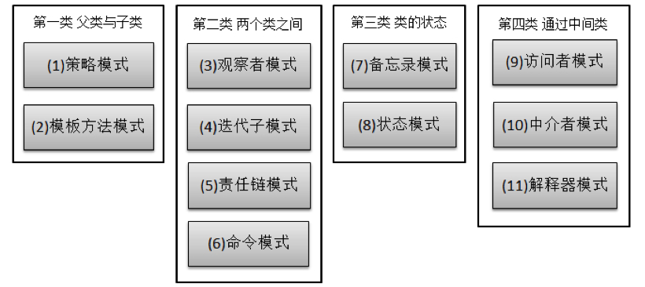

- 第一类：通过父类与子类的关系进行实现
- 第二类：两个类之间
- 第三类：类的状态
- 第四类：通过中间类

# 1、责任链模式

责任链模式说的通俗一点就是，当客户提交一个请求时，从第一个对象开始，链中收到请求的对象要么亲自处理它，要么转发给链中的下一个候选者。

链上的请求可以是一条链，可以是一个树，还可以是一个环，模式本身不约束这个，需要我们自己去实现，同时，在一个时刻，命令只允许由一个对象传给另一个对象，而不允许传给多个对象。

```java
   public interface Handler {
        public void operator();
    }

    public abstract class AbstractHandler {

        private Handler handler;

        public Handler getHandler() {
            return handler;
        }

        public void setHandler(Handler handler) {
            this.handler = handler;
        }

    }

    public class MyHandler extends AbstractHandler implements Handler {

        private String name;

        public MyHandler(String name) {
            this.name = name;
        }

        @Override
        public void operator() {
            System.out.println(name + "deal!");
            if (getHandler() != null) {
                getHandler().operator();
            }
        }
    }

    //测试类
    public class Test {

        public static void main(String[] args) {
            MyHandler h1 = new MyHandler("h1");
            MyHandler h2 = new MyHandler("h2");
            MyHandler h3 = new MyHandler("h3");

            //设定链中处理者的前后关系
            h1.setHandler(h2);
            h2.setHandler(h3);

            h1.operator();
        }
    }
```


# 2、模板方法模式

模板方法模式定义一个操作中算法的骨架，而将一些步骤延迟到子类中，使得子类可以不改变一个算法的结构即可重定义该算法的某些特定步骤。

模板模式的使用非常简单，仅仅使用了Java的继承机制，但是它是一个应用非常广的模式。

```java
    //模板抽象类
    public abstract class AbstractDisplay {
        //由子类实现的抽象方法
        public abstract open();

        public abstract print();

        public abstract close();

        //抽象类实现的方法，final可以保证在子类不会被修改
        public final void display() {
            open();
            print();
            close();
        }
    }

    //实现字符类，用于输出单个字符
    public class CharDisplay extends AbstractDisplay {
        private char ch;

        public CharDisplay(Char ch) {
            this.ch = ch;
        }

        public void open() {
            System.out.println("<<");
        }

        public void close() {
            System.out.println("<<");
        }

        public void print() {
            System.out.println(ch);
        }
    }

    //实现字符串类，用于输出字符串
    public class StringDisplay extends AbstractDisplay {
        private String str;
        private int width;

        public StringDisplay(String str) {
            this.str = str;
            width = str.getBytes().length();
        }

        public void open() {
            printline();
        }

        public void close() {
            printline();
        }

        public void print() {
            System.out.println("|" + str + "|");
        }

        public void printLine() {
            System.out.println("**************");
        }
    }
```

# 3、解释器模式

解释器模式是一种按照规定的语法进行解析的方案。给定一个语言，定义它的文法的一种表示，并定一个解释器，该解释器使用该表示来解释语言中的句子。

下面利用解释器模式来模拟布尔表达式的操作和求值。

在Java语言中，终结符是布尔变量true和false，非终结符表达式包含运算符and、or、和not，这个简单的文法如下：

Expression：Constant | Variable | Or | And | Not

- And：Expression ‘And’ Expression
- Or：Expression ‘Or’ Expression
- Not：‘Not’ Expression
- Variable：任何标识符
- Constant：’True’ | ’False’

```java
    //表达式的抽象父类
    public abstract class Expression {
        //以环境为准，本方法解释给定的任何一个表达式
        public abstract boolean interpret(Context ctx);

        //将表达式转换成字符串
        public abstract String toString();
    }

    //以下为五中表达式（Constant | Variable | Or | And | Not）的具体实现类

    //常量表达式
    public class Constant extends Expression {

        private boolean value;

        public Constant(boolean value) {
            this.value = value;
        }

        public boolean interpret(Context ctx) {
            return value;
        }

        public String toString() {
            return Boolean(value).toString();
        }
    }

    //变量表达式
    public class Variable extends Expression {

        private String name;

        public Variable(String name) {
            this.name = name;
        }

        public boolean interpret(Context ctx) {
            return ctx.lookup(this);
        }

        public String toString() {
            return name;
        }
    }

    //and表达式
    public class And extends Expression {

        private Expression left, right;

        public And(Expression left, Expression right) {
            this.left = left;
            this.right = right;
        }

        public boolean interpret(Context ctx) {
            return left.interpret(ctx) && right.interpret(ctx);
        }

        public String toString() {
            return "(" + left.toString() + " AND " + right.toString + ")";
        }
    }

    //or表达式
    public class Or extends Expression {

        private Expression left, right;

        public Or(Expression left, Expression right) {
            this.left = left;
            this.right = right;
        }

        public boolean interpret(Context ctx) {
            return left.interpret(ctx) || right.interpret(ctx);
        }

        public String toString() {
            return "(" + left.toString() + " OR " + right.toString + ")";
        }
    }

    //not表达式
    public class Not extends Expression {

        private Expression exp;

        public Not(Expression exp) {
            this.exp = exp;
        }

        public boolean interpret(Context ctx) {
            return !exp.interpret(ctx);
        }

        public String toString() {
            return "(Not " + exp.toString + ")";
        }
    }

    //环境类
    public class Context {
        private Map<Variable, Boolean> =new HashMap<Variable, Boolean>;

        public void assign(Variable var, boolean value) {
            map.put(var, new Boolean(value));
        }

        public boolean lookup(Variable var) throws IllegalArgumentException {
            Boolean value = map.get(var);
            if (value == null) {
                throw new IllegalArgumentException();
            }
            return value.booleanValue();
        }
    }

    //测试类
    Context ctx = new Context();
    Variable x = new Variable("x");
    Variable y = new Variable("y");
    Constant c = new Constant(true);
    ctx.assign(x,false);
    ctx.assign(y,true);

    Expression exp = new Or(new And(c, x), new And(y, new Not(x)));
    System.out.println("x="+x.interpret(ctx));
    System.out.println("y="+y.interpret(ctx));
    System.out.println(exp.toString()+"="+exp.interpret);
```

输出：

> x = false
> y = true
> ((true AND x) OR (y AND (Not x))) = true

# 4、命令模式

命令模式通过一个Command的类封装了对目标对象的调用行为以及调用参数。将一个请求封装成一个对象，从而使我们可以用不同的请求对用户进行参数化；对请求排队或记录请求日志，以及支持可撤销的操作。

命令模式的目的就是达到命令的发出者和执行者之间解耦，实现请求和执行分开，Struts框架其实就是一种将请求和呈现分离的技术，其中必然涉及命令模式的思想。

命令模式的本质就是封装请求。

开机问题，操作者通过按下机箱上的一个按钮（启动、重启、关闭等），然后机箱通知主板执行相关的操作，这一列些行为就是一个典型的命令模式的实现。

```java
    //主板的接口，接收者
    public interface MainBoardApi {
        public void open();

        public void reset();
    }

    //主板的实现类（华硕主板）
    public class GigaMainBoard implements MainBoard {
        public void open() {
            System.out.println("华硕主板启动");
        }


        public void reset() {
            System.out.println("华硕主板重启");

        }

    }

    //主板的实现类（微星主板）
    public class MsiMainBoard implements MainBoard {
        public void open() {
            System.out.println("微星主板启动");
        }


        public void reset() {
            System.out.println("微星主板重启");
        }

    }

    //命令接口，相当于机箱上的按钮
    public interface Command {
        public void execute();
    }

    //开机命令
    public class OpenCommand implements Command {
        //持有一个真正实现命令的接收者
        private MainBoardApi mainBoard = null;

        public OpenCommand(MainBoardApi mainBoard) {
            this.mainBoard = mainBoard;
        }

        public void execute() {
            //命令对象并不知道如何开机，会转调主板对象
            this.mainBoard.open();
        }

    }

    //重启命令
    public class ResetCommand implements Command {
        //持有一个真正实现命令的接收者
        private MainBoardApi mainBoard = null;

        public ResetCommand(MainBoardApi mainBoard) {
            this.mainBoard = mainBoard;
        }

        public void execute() {
            //命令对象并不知道如何开机，会转调主板对象
            this.mainBoard.reset();
        }

    }
```

用户不想与主板直接打交道，而用户根本不知道具体的主板是什么，用户只希望按下按钮，电脑就会执行正常的启动、关闭等操作，换了主板用户还是一样按下按钮就可以了，用户和主板应该完全解耦。

这就需要在用户和主板之间建立一个中间对象了，用户发出的命令传递给这个中间对象，然后由这个中间对象去找真正的执行者。很显然，这个中间对象就是上面的命令对象。

```java
    //提供机箱，相当于调用者的角色
    public class box {


        private Command openCommand;

        public void setOpenCommand(Command command) {
            this.openCommand = command;
        }

        private Command resetCommand;

        public void setResetCommand(Command command) {
            this.resetCommand = command;
        }

        //提供给用户使用，相当于按钮的触发方法
        public void resetButtonPressed() {
            resetCommand.execute();
        }

        public void openButtonPressed() {
            openCommand.execute();
        }

    }

    //测试类
    //调用者持有命令对象，命令对象持有接收者对象
    MainBoardApi mainBoard = new GigaMainBoard();
    // MainBoardApi mainBoard = new MsiMainBoard();
    OpenCommand openCommand = new OpenCommand(mainBoard);
    ResetCommand resetCommand = new ResetCommand(mainBoard);
    Box box = new Box();
    box.setOpenCommand(openCommand);
    box.setResetCommand(resetCommand);
    
    box.openButtonPressed();
    box.resetButtonPressed();
```

# 5、迭代器模式

迭代器模式提供一种方法 访问一个容器对象中的各个元素，而又不暴漏该对象的内部细节。

```java
    //书籍类
    public class Book {
        private String name;
        //sette、rgetter略
    }

    //书架接口和实现类
    public interface Aggregate {
        public abstract Iterator iterator();
    }

    public BookShelf implements Aggregate {
        private Book[] bookes;
        private int last;

        public BookShelf( int maxSize){
            this.book = new Book[maxSize];
        }
        
        public getBookAt( int index){
            return books[index];
        }
    
        public void appendBook (Book book){
            this.books[last] = book;
            last++;
        }
    
        public int getLength () {
            return books.length;
        }
    
        public Iterator iterator () {
            return new BookShelfIterator(this);
        }

    }

    //迭代器接口和实现类
    public interface Iterator {
        public abstract boolean hasNext();

        public abstract Object next();
    }

    public class BookShelfIterator implements Iterator {
        private BookShelf bookShelf;
        private int index;

        public BookShelfIterator(BookShelf bookShelf) {
            this.bookShelf = bookShelf;
            this.index = 0;
        }


        public boolean hasNext() {
            if (index < bookShelf.getLength()) {
                return true;
            } else {
                return false;
            }
        }

        public Object next() {
            Book book = bookShelf.getBookAt(index);
            index++;
            return book;
        }

    }

    //测试类
    BookShelf bookShelf = newBookShelf();
    bookShelf.appendBook(new

    Book("book1"));
    bookShelf.appendBook(new

    Book("book2"));
    bookShelf.appendBook(new

    Book("book3"));
    bookShelf.appendBook(new

    Book("book4"));
    bookShelf.appendBook(new

    Book("book5"));

    Iterator it = bookShelf.iterator();
    while(it.hasNext())

    {
        Book book = (Book) it.next();
        System.out.println(book.getName());
    }
```

# 6、中介者模式

中介者模式用一个中介来封装一系列的对象交互，使各对象不需要显式地相互引用，从而使其耦合松散，而且可以独立的改变他们之间的交互。

简单来说，就是将原来直接引用或者依赖的对象拆开，在中间加入一个中介对象，使得两头的对象分别与中介对象引用或者依赖。

MVC模式也算是中介者模式在框架设计中的一个应用，控制层便是位于表现层和模型层之间的中介。

```java
    abstract class AbstractColleague {
        protected AbstractMediator mediator;

        //每个具体同事必然要与中介者有联系，此函数相当于向该系统注册一个中介者，以便取得联系
        public void setMediator(AbstractMediator mediator) {
            this.mediator = mediator;
        }
    }

    //具体同事A
    class ColleagueA extends AbstractColleague {
        //每个同事必然有自己份内的事，没必要与外界相关联
        public void self() {
            System.out.println("同事B——>做好自己份内的事……");
        }

        //每个同事总需要与外界交互的操作，通过中介者来处理
        public void out() {
            System.out.println("同事A——>请求同事B帮助……");
            super.mediator.execute("colleagueB", "self");
        }
    }

    //具体同事B
    class ColleagueB extends AbstractColleague {
        //每个同事必然有自己份内的事，没必要与外界相关联
        public void self() {
            System.out.println("同事B——>做好自己份内的事……");
        }

        //每个同事总需要与外界交互的操作，通过中介者来处理
        public void out() {
            System.out.println("同事B——>请求同事A帮助……");
            super.mediator.execute("colleagueA", "self");
        }
    }

    //抽象中介者
    abstract class AbstractMediator {
        //中介者需要保存若干同事的联系方式
        protected Hashtable<String, AbstractColleague> colleagues = new Hashtable<String, AbstractColleague>();


        //中介者可以动态地与某个同事建立联系
        public void addColleague(String name, AbstractColleague c) {
            c.setMediator(this);
            this.colleagues.put(name, c);
        }

        //中介者可以动态地撤销与某个同事的联系
        public void deleteColleague(String name, AbstractColleague c) {
            this.colleagues.remove(name);
        }

        //中介者必须具备在同事之间处理逻辑、分配任务、促进交流的操作
        public abstract void execute(String name, String method);

    }

    //具体中介者
    public class Mediator extends AbstractMediator {
        public void execute(String name, String method) {
            if ("self".equals(method)) {
                if ("collegueA".equals(name)) {
                    ColleagueA colleague = (ColleagueA) super.colleagues.get("ColleagueA");
                    colleague.self();
                } else {
                    ColleagueB colleague = (ColleagueB) super.colleagues.get("ColleagueB");
                    colleague.self();
                }
            } else {  //与其他同事合作
                if ("collegueA".equals(name)) {
                    ColleagueA colleague = (ColleagueA) super.colleagues.get("ColleagueA");
                    colleague.self();
                } else {
                    ColleagueB colleague = (ColleagueB) super.colleagues.get("ColleagueB");
                    colleague.self();
                }
            }
        }

    }

    //测试类
    AbstractMediator mediator = new Mediator();

    //中介者加入同事角色的同时，会将自己作为中介者注入同事类
    mediator.addColleague("ColleagueA",colleagueA);
    mediator.addColleague("ColleagueB",colleagueB);
    
    colleagueA.self();
    colleagueA.out();
    
    colleagueB.self();
    colleagueB.out();
```


# 7、备忘录模式

备忘录模式是在不破坏封装的前提下，捕获一个对象的内部状态，并在该对象之外保存这个状态。

## 7.1 白箱备忘录模式

备忘录角色对任何对象都提供一个接口，即宽接口，通过该接口，备忘录角色内部所有存储的状态就对所有对象公开，因此这个实现又称为白箱实现。

白箱实现将发起人角色的状态存储在一个大家都能看到的地方，因此是破坏封装性的，但是仍然是有实用意义的。

```java
    //发起人利用一个新创建的备忘录对象将自己的内部状态存储起来
    public class Originator {
        private String state;

        //工厂方法，返回一个新的备忘录对象
        public Memento createMemento() {
            return new Memento(state);
        }

        //将发起人恢复到备忘录对象所记载的状态
        public void restoreMemento(Memento memento) {
            this.state = memento.getState();
        }

        //setter、getter略

    }

    //备忘录对象，将发起人对象传入的状态存储起来
    public class Memento {
        private String state;

        public Memento(String state) {
            this.state = state;
        }
        // setter、getter略
    }

    //负责人类，负责人角色负责保存备忘录对象，但是从不修改或从不查看备忘录对象的内容
    public class CareTaker {
        private Memento memento;

        //备忘录的取值方法
        public Memento retrieveMemento() {
            return this.memento;
        }

        //备忘录的保存方法
        public void saveMemento(Memento memento) {
            this.memento = memento;
        }

    }

    //测试类
    Originator originator = new Originator();
    CareTaker careTaker = new CareTaker();

    //改变发起人的状态
    originator.setState("on");

    //创建备忘录存储发起人的状态
    Memento m1 = originator.createMemento();

    //负责人存储备忘录
    careTaker.saveMemento(m1);
    
    //再次改变发起人的状态
    originator.setState("off");
    
    //恢复发起人的状态
    originator.restoreMemento(careTaker.retrieveMemento());
```


## 7.1 黑箱备忘录模式

备忘录角色对发起人角色提供一个宽接口，而对其他对象提供一个窄接口。

在Java语言中，实现双重接口的办法就是将备忘录角色类设计成发起人角色类的内部类。将Memento设计成Originator的内部类，从而将Memento对象封装在Originator里面；在外部提供一个标识接口MementoIF给CareTaker类以及其他对象，这样，Originator看到的是Memento的所有接口，而其他类看到的仅仅是标识接口MementoIF所暴露出的接口。

```java
    public class Originator {
        private String state;

        //工厂方法，返回一个新的备忘录对象
        public MementoIF createMemento() {
            return new Memento(state);
        }

        //将发起人恢复到备忘录对象所记载的状态
        public void restoreMemento(MementoIF memento) {
            this.state = memento.getState();
        }

        //将Memento设置成Originator的内部类
        class Memento implements MementoIF {
            private String state;

            public Memento(String state) {
                this.state = state;
            }
            // setter、getter略
        }

        //setter、getter略

    }

    //定义窄接口MementoIF，这是一个标识接口，因此它没有定义任何方法
    public interface MementoIF {
    }

    public class CareTaker {
        private MementoIF memento;

        //备忘录的取值方法
        public MementoIF retrieveMemento() {
            return this.memento;
        }

        //备忘录的保存方法
        public void saveMemento(MementoIF memento) {
            this.memento = memento;
        }

    }
```

还有一种更简便、更流行的方式，即＂自述历史＂模式备忘录，就是将Originator和CareTaker类合并到一起，发起人兼任备忘录的存取与取值操作。

# 8、观察者模式

观察者模式定义了一个一对多的依赖关系，让一个或多个观察者对象检查一个主题对象。这样一个主题对象在状态上的变化能够通知所有的依赖于此对象的那些观察者对象，使这些观察者能够自动更新。

Java提供对观察者模式的支持。

`Observer`接口：该接口定义了一个update()方法，当被观察者对象的状态发生变化时，这个方法就会被调用。

`Observable`接口：被观察者都是`java.util.Observable`的子类，该类提供公开的方法支持观察者对象，有两个方法很重要：`setChanged()`，该方法被调用后会设置一个内部标识变量，代表被观察者对象的状态发生了变化；另一个是`notifyObservers()`，这个方法被调用时，会调用所有登记过的观察者对象的`update()`方法，使这些观察者对象可以更新自己；还有`addObserver()`、`deleteObserver()`等方法用于登记观察者、清除观察者。

```java
    //地球，被观察者对象
    public class Earth extends Observable {
        private String weather = "晴朗";

        public Sring getWeather() {
            return weather;
        }

        //天气改变
        public void setWeather(String weather) {
            this.weather = weather;
            setChanged();        //设置内部标识变量
            notifyObservers();    //通知观察者状态已改变
        }

    }

    //气象卫星，观察者对象
    public class Satellite extends Observer {
        private String weather;


        public void update(Observable obj, Object arg) {
            weather = (String) arg;
            System.out.println("天气变化为：" + weather);
        }

    }

    //气象局，客户端调用类
    public class WeatherService {
        public static void main(String[] args) {
            Earth earth = new Earth();
            Satellite satellite = new Satellite();


            earth.addObserver(satellite);

            System.out.println("天气预报：");
            System.out.println("---------------------");
            earth.setWeather("台风‘珍珠’逼近");
            earth.setWeather("大到暴雨");
            earth.setWeather("天气炎热");
        }

    }
```

# 9、状态模式

状态模式允许一个对象在其状态改变时，改变它的行为，典型应用就是替代if-else语句：将不同条件下的行为封装在一个类里面，再给这些类一个统一的父类来约束它们。

状态和行为是关联的，它们的关系可以描述为：状态决定行为。

```java
    //打篮球时的状态接口
    public interface State {
        public void shot();
    }

    //状态的实现类
    public class NonormalState implements State {
        public void shot() {
            System.out.println("发挥失常");
        }

    }

    public class NormalState implements State {
        public void shot() {
            System.out.println("发挥正常");
        }

    }

    public class SuperState implements State {
        public void shot() {
            System.out.println("发挥超常");
        }

    }

    //Context类，持有状态对象
    public class Player {
        private State state = new NormalState();

        public void setState(State state) {
            this.state = state;
        }

        public void shot() {
            state.shot();
        }
    }

    //测试类
    Player player = new Player();
    player.shot();

    player.setState(new

    NonormalState());
    player.shot();

    player.setState(new

    SuperState());
    player.shot();
```

# 10、策略模式

策略模式定义了一些列的算法，把它们一个个地封装起来，并且使它们可以相互替换。策略模式使得算法可以独立于使用它的客户而变化。

策略模式的本质：分离算法，选择实现。

```java
    //报价算法的统一接口
    public interface Strategy {
        public double calcPrice(double goodsPrice);
    }

    //给普通客户的报价
    public class NormalCustomersStrategy extends Strategy {
        public double calcPrice(double goodsPrice) {
            System.out.println("普通用户没有折扣");
            return goodsPrice;
        }
    }

    //给老客户的报价
    public class NormalCustomersStrategy extends Strategy {
        public double calcPrice(double goodsPrice) {
            System.out.println("老用户统一折扣5%");
            return goodsPrice * (1 - 0.05);
        }
    }

    //Context对象，持有策略对象
    public class Price {
        private Strategy strategy;

        public Price(Strategy strategy) {
            this.strategy = strategy;
        }

        public double quote(double goodsPrice) {
            return this.strategy.calcPrice(goodsPrice);
        }
    }

    //测试类
    Strategy strategy = new NormalCustomersStrategy();
    Price price = new Price(strategy);
    double quote = price.quote(1000);
    System.out.println("向客户报价："+quote);
```

如果现在需求发生了变化，比如要增加一种客户类型，大客户，折扣率为10%，只需要增加一个Strategy的具体实现类就可以对功能进行扩展。

```java
    //给老客户的报价
    public class LargeCustomersStrategy extends Strategy {
        public double calcPrice(double goodsPrice) {
            System.out.println("老用户统一折扣10%");
            return goodsPrice * (1 - 0.1);
        }
    }
```

与状态模式的对比，两个模式从模式结构上看是一样的，但是实现的功能不一样。状态模式是根据状态的变化来选择相应的行为，不同的状态对应不同的类，每个状态对应的类实现了该状态对应的功能，在实现功能的同时，还会维护状态数据的变化。这些实现状态对应的功能的类之间是不能相互替换的。

策略模式是根据需要来选择相应的实现类，各个实现类是平等的，是可以替换的。

# 11、访问者模式

访问者模式可以在不修改已有程序结构的前提下，通过添加额外的访问者来对已有代码的功能实现提升。

结构对象是访问者模式的必备条件。

访问者模式适用于数据结构相对稳定的系统，它把数据结构和作用于数据结构上的操作之间的耦合解脱开，使得操作集合可以相对自由的演化。

数据结构的每一个节点都可以接受一个访问者的调用，此节点向访问者对象传入节点对象，而访问者对象则反过来执行节点对象的操作。这样的过程叫双重分派。节点调用访问者，将自己传入，访问者则将某算法针对此节点执行。

```java

    //抽象访问者角色，为每一个具体节点都准备了一个访问操作
    public interface Visitor {
        public void visit(NodeA node);

        public void visit(NodeB node);
    }

    //具体访问者A，访问者接受节点对象，然后调用节点对象的方法
    public class VisitorA implements Visitor {
        public void visit(NodeA node) {
            System.out.println(node.operationA());  //访问A节点
        }

        public void visit(NodeB node) {
            System.out.println(node.operationB());  //访问B节点
        }
    }

    //具体访问者B
    public class VisitorB implements Visitor {
        public void visit(NodeA node) {
            System.out.println(node.operationA());  //访问A节点
        }

        public void visit(NodeB node) {
            System.out.println(node.operationB());  //访问B节点
        }
    }

    //抽象节点类，节点接受访问者对象，然后将节点本身作为参数传入，调用访问者的方法
    public abstract class Node {
        public abstract void accept(Visitor visitor);
    }

    public NodeA extends Node

    {
        public void accept (Visitor visitor){
        visitor.visit(this);
    }

        public String operationA () {
        return "NodeA";
    }

    }

    public NodeB extends Node

    {
        public void accept (Visitor visitor){
        visitor.visit(this);
    }

        public String operationB () {
        return "NodeB";
    }

    }

    //结构对象，持有一个聚集，并向外界提供add()方法等作为聚集对象的管理操作。
    //结构对象要具备以下特征：能枚举它的元素；可以提供一个高层的接口以允许该访问者访问它的元素；有一个集合属性来作为元素的容器
    public class ObjectStructure {
        private List<Node> nodes = new ArrayList<Node>();

        public void action(Visitor vsitor) {
            for (Node node : nodes) {
                node.accept(visitor);
            }
        }

        public void add(Node node) {
            nodes.add(node);
        }

    }

    //测试类
    ObjectStructure os = new ObjectStructure();
    os.add(new NodeA());
    os.add(new NodeB());

    Visitor visitor = new VisitorA();
    os.action(visitor);
```


此设计模式适用于增加访问者来拓展功能的情况，而不适用于增加节点。